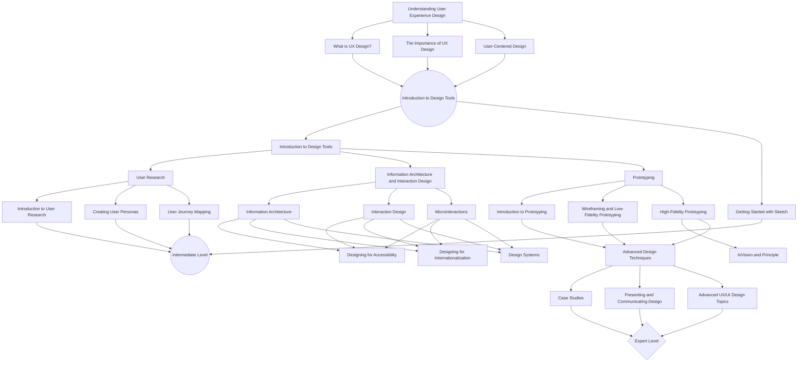

### Note: A rewrite is ongoing on this repo. A design resource repo is also in the works. Stay tuned! 🎉

# UI/UX Design Learning Guide

> Roadmap to becoming a UI/UX Designer

This repository contains a curated list of resources to help you learn about User Interface and User Experience design. The learning guide is divided into three levels: Basics, Intermediate, and Advanced, and includes a wide range of resources such as articles, tutorials, videos, and courses. Whether you're just starting out or looking to expand your knowledge, this guide has something for everyone. So, come explore and enhance your skills in UI/UX design!

---
<!-- Rewrite in progress -->
&nbsp;&nbsp;&nbsp;

## Beginners
### Table of Contents
* [Softwares](#softwares)
* [Fundamentals of UX](#fundamentals-of-ux)
* [Design Thinking](#design-thinking)
* [Information Architecture](#information-architecture)
* [User Testing and Heuristics Evaluation](#user-testing-and-heuristics-evaluation)

##### Designers to Follow
* Ademola Adekanbi: [Twitter](https://twitter.com/adekanbi_rex)
* Josiah Endurance: [Twitter](https://twitter.com/hendurhance)
* Jaden Tega: [Twitter](https://twitter.com/dontegio)
* UX Collective: [Twitter](https://twitter.com/uxdesigncc)
* George Moller: [Twitter](https://twitter.com/_georgemoller)
* Druids: [Twitter](https://twitter.com/druids01)
* Kigsley Iheonye: [Twitter](https://twitter.com/kingsleyiheonye)
* Timothy Achumba: [Twitter](https://twitter.com/timothyachumba)
* Olamide Towobola: [Twitter](https://twitter.com/OlamideTowobola)
* Sunil Kumar: [Twitter](https://twitter.com/sunilc_)
* Victor Onazi: [Twitter](https://twitter.com/VictorOnazi_)
* Akin Boluwatife: [Twitter](https://twitter.com/akinboulex)
* Ravin: [Twitter](https://twitter.com/ravinashere)
* Tunbosun Tobilola: [Twitter](https://twitter.com/Futureio)
* Daniel Abayomi: [Twitter](https://twitter.com/pixelDahn)
* Hammed Taiwo: [Twitter](https://twitter.com/rapzzyofficial)
* Femi : [Twitter](https://twitter.com/TheFemiDigital)
* Akin: [Twitter](https://twitter.com/akintheodox)
* Ari Alasah: [Twitter](https://twitter.com/Yours_Areeh)
* Fiyin : [Twitter](https://twitter.com/fiyindesign)
* Fele Omolola: [Twitter](https://twitter.com/fele_omolola)
* Namso Ukpanah: [Twitter](https://twitter.com/namsoukpanah)
* Joey Banks: [Twitter](https://twitter.com/joeyabanks)
* Seyi Martins: [Twitter](https://twitter.com/seyimartinz)
* Sam Adekunle: [Twitter](https://twitter.com/samoflagos)
* Seyi Oniyitan: [Twitter](https://twitter.com/seyioniyitan)

&nbsp;&nbsp;&nbsp;

### Softwares
* Figma: [Website](https://figma.com/)
* Sketch(MacOS): [Website](https://www.sketch.com/)
* InVision: [Website](https://www.invisionapp.com/)
* Adobe XD: [Website](https://www.adobe.com/products/xd.html)
* ProtoPie: [Website](https://www.protopie.io/)
* Principle(MacOS): [Website](http://principleformac.com/)
* Framer: [Website](https://framer.com/)
* Visily: [Website](https://www.visily.ai/)

&nbsp;&nbsp;&nbsp;

### Fundamentals of UX
#### Goals
Beginners should be able to:
1. Distinguish between User Interface Design and User Experience Design
1. Understand problem solving using User Experience Design
1. Diffrentiate between "Good UX" and "Bad UX"
1. Know the diffrent areas of UX (career-wise)
1. Have a good understanding of some laws of UX

#### Books
* UX Fundamentals for Non-UX Professionals: User Experience Principles for Managers, Writers. [Download](https://www.pdfdrive.com/ux-fundamentals-for-non-ux-professionals-user-experience-principles-for-managers-writers-designers-and-developers-e195284370.html)
* UX Design Principle Fundamentals for Non-Designers. [Download](https://www.pdfdrive.com/ux-design-principle-fundamentals-for-non-designers-e17862156.html)

#### Articles
* An Introduction to User Experience Design by Ben Ralph. [View](https://medium.com/beakerandflint/an-introduction-user-experience-design-2a7f8167bf03)
* Laws of UX. [View](https://lawsofux.com/)
* UI, UX: Who Does What? A Designer’s Guide To The Tech Industry. [View](https://www.fastcompany.com/3032719/ui-ux-who-does-what-a-designers-guide-to-the-tech-industry)
* What Is User Experience (UX) Design? Everything You Need To Know To Get Started. [View](https://careerfoundry.com/en/blog/ux-design/what-is-user-experience-ux-design-everything-you-need-to-know-to-get-started/)
* An Introduction to User Experience Design. (One) [View](https://hackdesign.org/lessons/1)
* An Introduction to User Experience Design. (Two) [View](https://hackdesign.org/lessons/2)
* An Introduction to User Experience Design. [View](https://hackdesign.org/lessons/3)
* An Introduction to User Experience Design. [View](https://hackdesign.org/lessons/4)

#### Videos
* UX Crash Course | Getting Started in User Experience Design [Watch](https://www.youtube.com/watch?v=_lyzy-vChh4)
* The Laws of UX - 19 Psychological Design Principles [Watch](https://www.youtube.com/watch?v=fYs2Mdyasuc)
* What is UI vs. UX Design? A Practical Example in Under 6 Minutes [Watch](https://www.youtube.com/watch?v=TgqeRTwZvIo)
* What Is UX Design? - An Introduction (2021) [Watch](https://www.youtube.com/watch?v=ziQEqGZB8GE)
* 9 Tips for Becoming a GREAT UI Designer [Watch](https://www.youtube.com/watch?v=_J1Le-4aXhE)

&nbsp;&nbsp;&nbsp;

### Design Thinking
#### Goals
Beginners should be able to:
1. Understand the UX Design process end to end
1. Know the basics of the design thinking
1. Empathize with users
1. Figure out user pain points
1. Understand and build personas

#### Books
* Basics Design: Design Thinking. [Download](https://www.pdfdrive.com/basics-design-design-thinking-e12052373.html)
* Design Thinking: New Product Development Essentials from the PDMA. [Download](https://www.pdfdrive.com/design-thinking-new-product-development-essentials-from-the-pdma-e176078498.html)

#### Articles
* What is Design Thinking? [View](https://www.interaction-design.org/literature/topics/design-thinking)
* What is Design Thinking? – IDEO U [View](https://www.ideou.com/blogs/inspiration/what-is-design-thinking)
* What Exactly Is Design Thinking? (Updated Guide for 2021) [View](https://careerfoundry.com/en/blog/ux-design/what-is-design-thinking-everything-you-need-to-know-to-get-started/)
* Putting Personas to Work in UX Design: What They Are and Why They’re Important. [View](https://xd.adobe.com/ideas/process/user-research/putting-personas-to-work-in-ux-design/)
* Personas – A Simple Introduction [View](https://www.interaction-design.org/literature/article/personas-why-and-how-you-should-use-them)
* How to Define a User Persona [View](https://careerfoundry.com/en/blog/ux-design/how-to-define-a-user-persona/)
* The design thinking process for better UX - Justinmind [View](https://www.justinmind.com/blog/design-thinking-process-ux-design/#:~:text=Design%20thinking%20is%20a%20framework,from%201969%2C%20by%20Herbert%20A.)
* 5 Stages in the Design Thinking Process [View](https://www.interaction-design.org/literature/article/5-stages-in-the-design-thinking-process)

#### Videos
* What Is Design Thinking? An Overview (2020) [Watch](https://www.youtube.com/watch?v=gHGN6hs2gZY)
* Design Thinking Full Course | Design Thinking Process | Design Thinking For Beginners | Simplilearn [Watch](https://www.youtube.com/watch?v=4nTh3AP6knMc)
* Stanford Webinar - Design Thinking = Method, Not Magic [Watch](https://www.youtube.com/watch?v=vSuK2C89yjA)
* Design Thinking 101 [Watch](https://www.youtube.com/watch?v=6lmvCqvmjfE)
* 9 Tips for Becoming a GREAT UI Designer [Watch](https://www.youtube.com/watch?v=_J1Le-4aXhE)

&nbsp;&nbsp;&nbsp;

### Information Architecture
#### Goals
Beginners should be able to:
1. Digest and understand what information architecture 
1. Understand concept like site mapping, user flow, user journey etc.
1. Understand and write user stories and epics

#### Books
* Information Architecture: The Design and Integration of Information Spaces. [Download](https://www.pdfdrive.com/information-architecture-the-design-and-integration-of-information-spaces-synthesis-lectures-on-information-concepts-retrieval-and-services-e160952086.html)
* Information Architecture for the World Wide Web [Download](https://repo.zenk-security.com/Others/Information%20Architecture%20For%20The%20World%20Wide%20Web.pdf)

#### Articles
* A Beginner's Guide To Information Architecture in UX (2021) [View](https://careerfoundry.com/en/blog/ux-design/a-beginners-guide-to-information-architecture/)
* Information Architecture (IA) | Learn & Explore | Adobe XD Ideas [View](https://xd.adobe.com/ideas/process/information-architecture/)
* Information Architecture. Basics for Designers. | by tubik [View](https://uxplanet.org/information-architecture-basics-for-designers-b5d43df62e20)
* What Are User Flows In UX Design? (A full beginner's guide) [View](https://careerfoundry.com/en/blog/ux-design/what-are-user-flows/)
* A Beginner's Guide To User Journey Mapping | by Nick [View](https://uxplanet.org/a-beginners-guide-to-user-journey-mapping-bd914f4c517c)
* User Stories and User Story Examples by Mike Cohn [View](https://www.mountaingoatsoftware.com/agile/user-stories#:~:text=User%20stories%20are%20short%2C%20simple,so%20that%20.)
* How to create a UX Sitemap: a simple guideline | by Jennifer [View](https://uxdesign.cc/how-to-create-a-ux-sitemap-a-simple-guideline-8786c16f85c1#:~:text=A%20UX%20sitemap%20is%20a,like%20the%20bird's%20eye%20view.)

#### Videos
* A Beginner’s Guide To Information Architecture [Watch](https://www.youtube.com/watch?v=Ij4WquJaRTc)
* Introduction and Tutorial to UX Sitemap: UI UX Design | Miro | 2021 [Watch](https://www.youtube.com/watch?v=dyU2gRqXuEM)
* How to do User Story Mapping [Watch](https://www.youtube.com/watch?v=k_4SchJgAI4)
* Customer Journey Map Workshop[Watch](https://www.youtube.com/watch?v=X7iXcP-wIkk)
* UX Design - Why you NEED to know User Flows! [Watch](https://www.youtube.com/watch?v=4uHxJMCzeGg)

&nbsp;&nbsp;&nbsp;

### User Testing and Heuristics Evaluation
#### Goals
Beginners should be able to:
1. Importance of usability testing
1. Carry out usability testing
1. Have understanding of usability methods and how to carry them out
1. Use heuristics evaluation to test products
1. Carry out competitive analysis

#### Books
* The UX Book: Process and Guidelines for Ensuring a Quality User Experience [Download](https://www.pdfdrive.com/the-ux-book-process-and-guidelines-for-ensuring-a-quality-user-experience-e165941504.html)
* Advances in Usability and User Experience  [Download](https://www.pdfdrive.com/advances-in-usability-and-user-experience-proceedings-of-the-ahfe-2017-international-conference-on-usability-and-user-experience-july-17-21-2017-the-westin-bonaventure-hotel-los-angeles-california-usa-e158232628.html)

#### Articles
* What is User Testing? - Learn UX - Keep It Usable [View](https://www.keepitusable.com/blog/what-is-user-testing/#:~:text=User%20testing%20is%20an%20essential,users%20(who%20we%20recruit).&text=Testing%20early%20during%20the%20design,launch%20a%20user%2Dfriendly%20product.)
* 6 Simple Steps to Conduct User Testing | Adam Fard Studio [View](https://adamfard.com/blog/conduct-user-testing)
* 10 Usability Heuristics for User Interface Design [View](https://careerfoundry.com/en/blog/ux-design/what-are-user-flows/)
* Usability Testing 101 - Nielsen Norman Group [View](https://www.nngroup.com/articles/usability-testing-101/)
* User & Usability Testing | Methods & Tips | Adobe XD Ideas [View](https://xd.adobe.com/ideas/process/user-testing/)
* 8 Usability Testing Methods That Work  [View](https://www.hotjar.com/usability-testing/methods/)
* A Guide to Competitive Analysis for UX Design | Adobe XD  [View](https://xd.adobe.com/ideas/process/user-research/guide-to-competitive-analysis-ux-design/)

#### Videos
* User Testing Tutorial [Watch](https://www.youtube.com/watch?v=CU_tfEGwit8)
* You need to know Usability Testing (with Maze) [Watch](https://www.youtube.com/watch?v=ID0fwi2q028)
* Heuristic Evaluation of User Interfaces [Watch](https://www.youtube.com/watch?v=6Bw0n6Jvwxk)
* Intro to Usability Testing and Heuristic Evaluations [Watch](https://www.youtube.com/watch?v=PIkiB19_sp0)
* Usability Testing Tips & Tools: Powerful UX Research Method [Watch](https://www.youtube.com/watch?v=RyGFEmimwoM)

&nbsp;&nbsp;&nbsp;
&nbsp;&nbsp;&nbsp;

## Intermediate
### Table of Contents
* [User Interview](#user-interview)
* [Introduction to UI Design 1](#introduction-to-ui-design-1)
* [Introduction to UI Design 2](#introduction-to-ui-design-2)
* [Design Systems](#design-systems)

&nbsp;&nbsp;&nbsp;

### User Interview
#### Goals
Interns should be able to:
1. Digest and understand what user interview is
1. Understand the methodology of preparing users interview.
1. Should to carry out user interview (minimum of 10 questions in regards to what you're building) 

#### Books
* Starter questions for User research interviews | Havard University [Download](https://projects.iq.harvard.edu/files/harvarduxgroup/files/ux-research-guide-sample-questions-for-user-interviews.pdf)
* The User Interview - OakenDoor  [Download](http://www.oakendoor.com/documents/TheUserInterview.pdf)
* Interview Techniques for Ux Practitioners. A User-Centered Design Method [Download](https://www.pdfdrive.com/interview-techniques-for-ux-practitioners-a-user-centered-design-method-d185828588.html)

#### Articles
* What are User Interviews? | Interaction Design Foundation [View](https://www.interaction-design.org/literature/topics/user-interviews)
* User Interviews: How, When, and Why to Conduct Them  [View](https://www.nngroup.com/articles/user-interviews/)
* User Interview Example Questions | Usability & Web Design[View](https://usability.yale.edu/understanding-your-user/user-interviews/user-interview-example-questions)
* Usability Testing 101 - Nielsen Norman Group [View](https://www.nngroup.com/articles/usability-testing-101/)
* A Cheatsheet for User Interview and Follow Ups Questions by Stephanie Walter [View](https://stephaniewalter.design/blog/a-cheatsheet-for-user-interview-and-follow-ups-questions/)
* User Interviews: Guide To An Insightful UX Interview  [View](https://uxstudioteam.com/ux-blog/user-interviews/)
* How to Conduct a User Interview That Actually Gets Insights | Shopify [View](https://www.shopify.com.ng/partners/blog/user-interview)

#### Videos
* How To Conduct User Interviews Like A Pro (UX Design) [Watch](https://www.youtube.com/watch?v=5tVbFfGDQCk&t=39s)
* How to Conduct a User Interview for UX Designers (in 10 Minutes) - FREE Template Provided [Watch](https://www.youtube.com/watch?v=KZ6jj_EZUgM)
* The 3 Types of User Interviews: Structured, Semi-Structured, and Unstructured [Watch](https://www.youtube.com/watch?v=jy-QGuWE7PQ)
* Eric Migicovsky - How to Talk to Users at YCombinator [Watch](https://www.youtube.com/watch?v=qAws7eXItMk)
* Lecture 16 - How to Run a User Interview (Emmett Shear) [Watch](https://www.youtube.com/watch?v=RyGFEmimwoM)
* Performing a Research Interview: An Interview Example [Watch](https://www.youtube.com/watch?v=W4hBOxS0Pb0)

&nbsp;&nbsp;&nbsp;

### Introduction to UI Design 1
#### Goals
Interns should be able to:
1. Understand the principle of good design
1. Understand Visual Hierarchy & UI Patterns
1. Understand the concept of wireframing (low, and mid)
1. Interact with Figma, Adobe XD or Sketch interface
1. Put mood boards together
1. Understand each and every elements on your design software

#### Books
* Fundamentals of Good UI Design - Uday Gajendar [Download](http://udanium.com/misc/svcc11_UIfundamentals_v3.pdf)
* User Interface Design  [Download](https://www.cs.umd.edu/~atif/Teaching/Spring2011/Slides/8.pdf)
* The New Web Typography: Create a Visual Hierarchy with Responsive Web Design [Download](https://www.pdfdrive.com/the-new-web-typography-create-a-visual-hierarchy-with-responsive-web-design-e187576474.html)
* Web UI Design Patterns [Download](http://docshare02.docshare.tips/files/27918/279189609.pdf)
* Mobile UI Design Patterns [Download](https://s3.amazonaws.com/uxpin/uxpin_mobile_ui_design_patterns_2014.pdf)
* WEB UI DESIGN BEST PRACTICES [Download](https://www.immagic.com/eLibrary/ARCHIVES/GENERAL/UXPIN_PL/U141030B.pdf)
* Mobile Design Pattern Gallery: UI Patterns for Smartphone Apps [Download](https://www.pdfdrive.com/mobile-design-pattern-gallery-ui-patterns-for-smartphone-apps-d174900923.html)

#### Articles
* What is User Interface Design? | Interaction Design [View](https://www.interaction-design.org/literature/topics/ui-design)
* What are User Interface (UI) Design Patterns? | Interaction Design [View](https://www.interaction-design.org/literature/topics/ui-design-patterns#:~:text=User%20interface%20(UI)%20design%20patterns%20are%20reusable%2Frecurring%20components,the%20specific%20context%20of%20use.)
* The Principles of Design and Their Importance | Toptal [View](https://www.toptal.com/designers/ui/principles-of-design#:~:text=The%20elements%2C%20or%20principles%2C%20of,and%20optimizes%20the%20user%20experience.)
* Visual Hierarchy in Design: Key Principles & Examples | Adobe XD [View](https://xd.adobe.com/ideas/process/information-architecture/visual-hierarchy-principles-examples/)
* UI Moodboard Template & Example - Milanote [View](https://milanote.com/templates/moodboards/UI-moodboard#:~:text=A%20UI%20moodboard%20is%20a,quickly%20to%20the%20wider%20team.)
* 13 basic mobile UI patterns to know about | by Kate  [View](https://uxdesign.cc/mobile-ui-13-basic-patterns-of-app-ui-design-to-know-about-d3f7c6176f13)
* Web Design Pattern  [View](http://ui-patterns.com/patterns)

#### Videos
* The 2019 UI Design Crash Course for Beginners | DesignCourse [Watch](https://www.youtube.com/watch?v=_Hp_dI0DzY4)
* Free Figma Tutorial: Designing Wireframes with Figma [Watch](https://www.youtube.com/watch?v=6t_dYhXyYjI)
* Understanding Visual Hierarchy in UI Design - Live Project Follow-Along [Watch](https://www.youtube.com/watch?v=ZYs0_t_Gdhk)
* UI Design Live: UI Patterns, Visual Hierarchy and Iterations [Watch](https://www.youtube.com/watch?v=D1pO4AQTfes&t=68s)
* How to Create a Better Mood Board for UI | Mobile and Web Design [Watch](https://www.youtube.com/watch?v=jaXDWCB_0GM)
* Performing a Research Interview: An Interview Example [Watch](https://www.youtube.com/watch?v=W4hBOxS0Pb0)
* Learn Adobe XD in 2021 by Example (Crash Course) [Watch](https://www.youtube.com/watch?v=3rQ-eTmWah0)
* Intro to Sketch for Beginners | Sketch Tutorial (2020) [Watch](https://www.youtube.com/watch?v=ilcwjXTqyNM)

#### Tasks
1. Design three mobile screens of Intagram & Facebook UI (mid-fidelity wireframe only)
1. Design low fidelity wireframe for Apple Website (Landing Page) & Whatsapp Web (Landing screen and chat interface)

#### Resources
Wireframe Kits gotten from Figma Community

* [Simple Wireframe Kit (Figma Official) - Figma](https://www.figma.com/templates/wireframe-kits/)
* [Lo-fi Wireframe Kit (Community) - Figma](https://www.figma.com/community/file/887892609124245416)

&nbsp;&nbsp;&nbsp;

### Introduction to UI Design 2
#### Goals
Interns should be able to:
1. Understand the concept of responsive design
1. Build components and naming convention
1. Design interfaces using layouts and grids
1. Create local style guides
1. Use auto layout

#### Books
* Practical Responsive Web Design - CORE [Download](https://core.ac.uk/download/pdf/80995916.pdf)
* Web Design Style Guide - Carleton College  [Download](https://apps.carleton.edu/campus/web-group/assets/Web_Design_Style_Guide_1.0.pdf)

#### Articles
* Layout Grid - Figma Handbook - Design+Code [View](https://designcode.io/figma-handbook-layout-grid/)
* Create scalable web page layouts in Figma | UX Collective [View](https://uxdesign.cc/create-scalable-web-page-layouts-in-figma-e7e6e580dd67)
* Consistency Is Key – How to Build a Figma Design System | Toptal [View](https://www.toptal.com/designers/figma/figma-design-system)
* Auto Layout in Figma - Figma Handbook - Design+Code [View](https://designcode.io/figma-handbook-auto-layout/)
* Working with Layout Tools in Adobe XD [View](https://www.adobe.com/products/xd/learn/design/productivity/working-with-layout-tools.html)

#### Videos
* Figma Tutorial: Layout Grids [Watch](https://www.youtube.com/watch?v=zd8wrAdURN0)
* Figma Tutorial: Setup a Responsive Grid Layout for UI & Web Design (IN 11 MINUTES) [Watch](https://www.youtube.com/watch?v=_w-iYiEXrl0)
* Figma Tutorial: Variants in 11 minutes (With Demo File & Real Examples) [Watch](https://www.youtube.com/watch?v=cE2fCeWqjnY)
* Figma Tutorial: Creating Styles [Watch](https://www.youtube.com/watch?v=gtQ_A3imzsg)
* Figma in 5: Auto Layout [Watch](https://www.youtube.com/watch?v=TyaGpGDFczw)
* Performing a Research Interview: An Interview Example [Watch](https://www.youtube.com/watch?v=JM7P7mWgJbo)
* Learn Adobe XD in 2021 by Example (Crash Course) [Watch](https://www.youtube.com/watch?v=3rQ-eTmWah0)
* Figma Shoe Ordering Mobile App Design (Figma Mobile Design 2020) [Watch](https://www.youtube.com/watch?v=ilcwjXTqyNM)

#### Tasks
Redesign two dribble projects
1. [#Exploration - Fashion Website by Dwinawan for Paperpillar on Dribble](https://dribbble.com/shots/14836845--Exploration-Fashion-Website)
1. [#Exploration - More Screens - Fashion Mobile App by Dwinawan for Paperpillar on Dribble](https://dribbble.com/shots/14865120--Exploration-More-Screens-Fashion-Mobile-App)
1. Create a local style guide using components, auto layout etc. for the dribble projects

&nbsp;&nbsp;&nbsp;

### Design Systems
#### Goals
Interns should be able to:
1. Design using existing design systems
1. Create projects from deconstructing user stories
1. Draw out user flow for a product

#### Books
* Practical UI Patterns for Design Systems [Download](https://link.springer.com/content/pdf/bfm%3A978-1-4842-4938-3%2F1.pdf)

#### Articles
* A comprehensive guide to design systems | Inside Design Blog [View](https://www.invisionapp.com/inside-design/guide-to-design-systems/)
* Everything you need to know about Design Systems by Audrey Hacq [View](https://uxdesign.cc/everything-you-need-to-know-about-design-systems-54b109851969)

#### Videos
* What is a Design System? Design Systems 101 for Designers [Watch](https://www.youtube.com/watch?v=wc5krC28ynQ)
* Build it in Figma: Create a Design System — Foundations[Watch](https://www.youtube.com/watch?v=EK-pHkc5EL4)
* Design Systems, Pattern Libraries & Style Guides... Oh My! [Watch](https://www.youtube.com/watch?v=rO5dBA-avfw)

#### Resources
Here are websites for design inspiration
1. [Dribble - Discover the World's Top Designers & Creative Professionals](https://dribbble.com)
1. [Behance :: For You](https://behance.net)
1. [Design Resource](https://designresourc.es)
1. [The Best Design Example and Inspiration | LandingFolio](https://landingfolio.com/inspiration)
1. [3649 Landing Page Design Inspiration - Lapa Ninja](https://www.lapa.ninja)

#### Tasks
1. Put together a moodboard for concept recipe app
Design a recipe concept app using "Pegasus" design systems [Pegasus Design Systems (Community) - Figma](https://www.figma.com/community/file/889142897767055377)
> - Users should be able to login/signup via Google or Facebook
> - Users should be able to sign up by inputting their email and creating a password
> - Users should be able to read step by step procedure for their chose recipe
> - Users should be able to watch videos tutorials of recipes
> - Users should be able to rate recipes and also comment them

&nbsp;&nbsp;&nbsp;
&nbsp;&nbsp;&nbsp;

## Advanced

### Table of Contents
* [Prototyping](#prototyping)
* [Case Studies](#case-studies)
* [Project - UX Phase](#project-ux-phase)
* [Project - UI Phase](#project-ui-phase)
* [Project - Testing and Publishing](#project-testing-and-publishing)

### Prototyping
#### Goals
Interns should be able to:
1. Create clickable prototypes of their existing projects
1. Manoeuver animations in prototype - use Fade, Slide, Push, Overlay
1. Handover Prototype to developers for Dev Testing
1. Manoeuver animations in prototype

#### Books
* How to Prototype [Download](https://www.pdfdrive.com/how-to-prototype-d34906914.html)
* How to Prototype: The Rapid Prototyping Process [Download](https://www.pdfdrive.com/how-to-prototype-the-rapid-prototyping-process-d53255798.html)

#### Articles
* 14 best prototyping tools for UI/UX designers | Webflow Blog [View](https://webflow.com/blog/prototyping-tools#:~:text=A%20prototyping%20tool%20enables%20a,any%20UI%2FUX%20designer's%20arsenal.&text=Prototypes%20are%20an%20opportunity%20to,and%20fine%2Dtune%20the%20details.)
* 4 Steps to Build Your Product's First Prototype | Athgo [View](https://athgo.org/4-steps-build-products-first-prototype/)
* A Complete Introduction to Prototyping (Stage 4 of the Design Thinking Process) [View](https://careerfoundry.com/en/blog/ux-design/design-thinking-stage-four-prototyping/)
* Prototyping: Learn Eight Common Methods and Best Practices [View](https://www.interaction-design.org/literature/article/prototyping-learn-eight-common-methods-and-best-practices)
* Perfect Your UX Design Process – A Guide to Prototype Design [View](https://www.toptal.com/designers/prototyping/guide-to-prototype-design)
* Guide to prototyping in Figma [View](https://help.figma.com/hc/en-us/articles/360040314193-Guide-to-prototyping-in-Figma)

#### Videos
* Figma Tutorial - Prototyping in Figma [Watch](https://www.youtube.com/watch?v=iBkXf6u8htI)
* Horizontal & Vertical Scrolling | Figma Tutorial [Watch](https://www.youtube.com/watch?v=wIPo7vxxchY)
* Figma Tutorial: Smart Animate and Drag Triggers [Watch](https://www.youtube.com/watch?v=6Id4INKEwb8&t=134s)
* Figma Tutorial: Prototyping [Watch](https://www.youtube.com/watch?v=-sAAa-CCOcg)
* Figma Tutorial: Prototyping & Transitions [Watch](https://www.youtube.com/watch?v=-d6zNGeF59M)
* Food App Design | UX/UI ( Wireframe, Prototype, Export) [Watch](https://www.youtube.com/watch?v=195RY7jCuZg)
* Figma tutorial: Handoff seamlessly to developers [8 of 8] [Watch](https://www.youtube.com/watch?v=B242nuM3y2s)
* Figma For Beginners: Prepare for Handoff (4/4) [Watch](https://www.youtube.com/watch?v=EQ_FL6u8EyM)

#### Resources
Here are websites for prototyping softwares
1. [Figma](https://figma.com)
1. [Proto.io - Prototyping for all](https://proto.io/)
1. [Online Mockup, Wireframe & UI Prototyping Tool · Moqups](https://moqups.com/)
2. [MockFlow - Online Wireframe Tools, Prototyping Tools, Online](https://www.mockflow.com/)

#### Tasks
Design and prototype two dribbble posts
> - [Events Exploring App by Fireart Studio on Dribbble](https://dribbble.com/shots/14926647-Events-Exploring-App)
> - [Animated Tab Bar by Cuberto on Dribbble](https://dribbble.com/shots/14723171-Animated-Tabbar)

Prototype your recipe concept app
&nbsp;&nbsp;&nbsp;

### Case Studies
#### Goals
Interns should be able to:
1. Understand the process of writing a case study
1. Write case studies for their own projects
1. Understand and create their own design briefs
1. Approach new or existing projects with ease

#### Books
* Writing Case Studies [Download](hhttp://www2.econ.iastate.edu/classes/econ362/hallam/CaseStudies/WritingCaseStudy.pdf)
* PREPARING A CASE STUDY:A Guide for Designing and Conducting a Case Study for Evaluation Input [Download](https://donate.pathfinder.org/site/DocServer/m_e_tool_series_case_study.pdf;jsessionid=00000000.app20015b?NONCE_TOKEN=7822B71619FAAAC2B553018D3506C88D)
* WRITING CASE STUDIES: A MANUAL [Download](http://www.ntu.edu.vn/Portals/96/Tu%20lieu%20tham%20khao/Phuong%20phap%20giang%20day/case%20writing%20manual.pdf)
* DESIGNING CASE STUDIES | David E. Gray[Download](https://www.sfu.ca/~palys/Gray-2014-DoingResearchInTheRealWorld-CaseStudyDesign.pdf)
* A UI Design Case Study and a Prototype of a Travel Search Engine Project Report [Download](https://www.pdfdrive.com/a-ui-design-case-study-and-a-prototype-of-a-travel-search-engine-project-report-concordia-d35194567.html)

#### Articles
* How to write a UX case study | Inside Design Blog - InVision [View](https://www.invisionapp.com/inside-design/how-to-write-a-ux-case-study/)
* Use This Guide To Write An Awesome UX Case Study [View](https://careerfoundry.com/en/blog/ux-design/ux-case-study/)
* How to create the perfect structure for a UX case study [View](https://www.interaction-design.org/literature/article/how-to-create-the-perfect-structure-for-a-ux-case-study)
* How to write a UX case study to showcase your process & skills [View](https://www.uxportfolioformula.com/how-to-write-a-ux-case-study/)

#### Videos
* How To Write A UX Case Study [Watch](https://www.youtube.com/watch?v=7l0ij8qJnA0)
* How to Outline & Write your UX Case Study | real example! [Watch](https://www.youtube.com/watch?v=M5HC58tTC2U)
* UX Portfolio | How to Create a UX Case Study [Watch](https://www.youtube.com/watch?v=mWnfc0Lm_F4)
* Writing the Perfect UI/UX Case Study [Watch](https://www.youtube.com/watch?v=d8FtsgQyGXw)
* Creating a Design Brief [Watch](https://www.youtube.com/watch?v=2oh-7CGSJ1g) 
* How to Write an Awesome Design Brief | Building Better Brands | Episode 11 - YouTube [Watch](https://www.youtube.com/watch?v=b6DndtGz9kc)

#### Resources
Here are websites for resources on case studies
1. [How to Write a UX Case Study: Template and Examples - AdobeXD](https://xd.adobe.com/ideas/perspectives/leadership-insights/ux-case-study-template/)
2. [Create A Killer UX Design Portfolio With These Pro Tips - YouTube](https://www.youtube.com/watch?v=cYjVJZ6iPIw)

#### Tasks
Read and digest two case studies on food
> - [For the Love of Food, People, and UX | by Katie Chen | UX Collective (uxdesign.cc)](https://uxdesign.cc/for-the-love-of-food-people-and-ux-11251d6a0303)
> - [Product Design Review - JumiaFood App - Google Docs](https://docs.google.com/document/d/1uggiwEKX4OdZMJ3L_ZDFws5iyJ5mMMZ907L_WHR_Nx0/edit)

Note any new thing you learnt or any thing that got you confused

&nbsp;&nbsp;&nbsp;

### Project - UX Phase
#### Tasks
Design a tenant finder and communication app that will allow landlords to find and communicate with potential tenants directly without any dealer. It will also allow tenants to communicate with their existing landlords regarding property issues, maintenance requirements, pay rents, etc.

> - Use the UX techniques you’ve been taught since week one (i.e user research, user stories, user flow, wireframing etc.) to carry out this exercise. Once you’ve gotten all you need, begin writing a case study on what you were able to discover.
> - Your case study should have the problem statement, personas, information architecture, wireframes, and your UX design process in general.

&nbsp;&nbsp;&nbsp;

### Project - UI Phase
#### Tasks
> - Convert your wireframes into high fidelity screens
> - Prototype your high fidelity screens
> - Complete your case study

&nbsp;&nbsp;&nbsp;
### Project - Testing and Publishing
#### Tasks
> - Test your prototype with users to look out for usability issues
> - Test your work against the heuristics evaluations
> - Document your findings in your case study
> - Publish your work on your portfolio

Apply for that dream job as a Product Designer!😁

# Contributing
I'll be more than pleased if you contribute to this resource.
[Read Contribution Doc](CONTRIBUTING.md)

