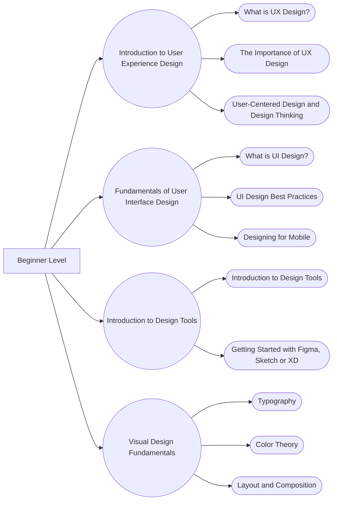

# UI/UX Design Learning Guide

> Roadmap to becoming a UI/UX Designer

This repository contains a curated list of resources to help you learn about User Interface and User Experience design. The learning guide is divided into three levels: Basics, Intermediate, and Advanced, and includes a wide range of resources such as articles, tutorials, videos, and courses. Whether you're just starting out or looking to expand your knowledge, this guide has something for everyone. So, come explore and enhance your skills in UI/UX design! 🎨

`&nbsp;&nbsp;&nbsp;

# Table of Contents
- **[Beginner Level](#beginner-level)**
    * [Introduction to User Experience Design](#introduction-to-user-experience-design)
      * [What is UX Design?](#what-is-ux-design)
      * [The Importance of UX Design](#the-importance-of-ux-design)
      * [User-Centered Design and Design Thinking](#user-centered-design-and-design-thinking)
    * [Fundamentals of User Interface Design](#fundamentals-of-user-interface-design)
      * [What is UI Design?](#what-is-ui-design)
      * [UI Design Best Practices](#ui-design-best-practices)
      * [Designing for Mobile](#designing-for-mobile)
    * [Introduction to Design Tools](#introduction-to-design-tools)
      * [Introduction to Design Tools](#introduction-to-design-tools-1)
      * [Getting Started with Figma, Sketch or XD](#getting-started-with-figma-sketch-or-xd)
    * [Visual Design Fundamentals](#visual-design-fundamentals)
      * [Typography](#typography)
      * [Color Theory](#color-theory)
      * [Layout and Composition](#layout-and-composition)
- **[Intermediate Level](#intermediate-level)**
    * [User Research](#user-research)
      * [Introduction to User Research](#introduction-to-user-research)
      * [Creating User Personas](#creating-user-personas)
      * [User Journey Mapping](#user-journey-mapping)
      * [User Testing and Heuristics Evaluation](#user-testing-and-heuristics-evaluation)
    * [Information Architecture and Interaction Design](#information-architecture-and-interaction-design)
      * [Information Architecture](#information-architecture)
      * [Interaction Design](#interaction-design)
      * [Microinteractions](#microinteractions)
    * [Prototyping](#prototyping)
      * [Introduction to Prototyping](#introduction-to-prototyping)
      * [Wireframing and Low-Fidelity Prototyping](#wireframing-and-low-fidelity-prototyping)
      * [High-Fidelity Prototyping](#high-fidelity-prototyping)
    * [Design Thinking](#design-thinking)
      * [Design Thinking Process](#design-thinking-process)
      * [Ideation and Brainstorming](#ideation-and-brainstorming)
      * [Design Critique](#design-critique)
- **[Expert Level](#expert-level)**
    * [Advanced Design Techniques](#advanced-design-techniques)
      * [Designing for Accessibility](#designing-for-accessibility)
      * [Designing for Internationalization](#designing-for-internationalization)
      * [Design Systems](#design-systems)
    * [Emerging Technologies](#emerging-technologies)
      * [Voice User Interface Design](#voice-user-interface-design)
      * [Virtual and Augmented Reality Design](#virtual-and-augmented-reality-design)
      * [Designing for AI and Machine Learning](#designing-for-ai-and-machine-learning)
    * [UX Strategy](#ux-strategy)
      * [User Research and Analysis](#user-research-and-analysis)
      * [Information Architecture and Content Strategy](#information-architecture-and-content-strategy)
      * [Design Thinking and Innovation](#design-thinking-and-innovation)
    * [Portfolio Development](#portfolio-development)
      * [Building Projects for your UX/UI Design Portfolio](#building-a-uxui-design-portfolio)
      * [Case Studies and Presentations](#case-studies-and-presentations)
    * [Career Development](#career-development)
      * [Job Search and Interviewing](#job-search-and-interviewing)
      * [Freelancing and Entrepreneurship](#freelancing-and-entrepreneurship)
      * [Professional Development and Networking](#professional-development-and-networking)

&nbsp;&nbsp;&nbsp;

## Beginner Level
> The Beginner Level is designed for those who are just starting out in the field of User Experience and User Interface design. The resources in this section will help you get a basic understanding of the field and provide you with the necessary skills to get started.

<div align="center"> <h4> Beginner Level - Curriculum</h4> </div>



**<div align="right"><a href="#table-of-contents"> ⬆️ Back to Top</a></div>**

&nbsp;&nbsp;&nbsp;

### Introduction to User Experience Design
> User Experience Design is the process of creating products that provide meaningful and relevant experiences to users. This section will help you learn about the fundamentals of UX design and the importance of user-centered design.

#### What is UX Design?
> “A person's perceptions and responses that result from the use or anticipated use of a product, system or service.” — ISO 9241-210, Ergonomics of human-system interaction—Part 210: Human-centered design for interactive systems
##### Goals
| Goal | Description |
| --- | --- |
| **Understand** | Learn about the field of UX design and the role of a UX designer. |
| **Learn** | Learn about the importance of user experience design in the digital world. |
| **Differentiate** | Learn to differentiate between "Good" and "Bad" UX design. |

**<div align="right"><a href="#table-of-contents"> ⬆️ Back to Top</a></div>**

##### Books
| Title | Author | Description | Download Link |
| --- | --- | --- | --- |
| **UX For Dummies** | Chesnut, Donald, Nichols, Kevin P | Get up to speed quickly on the latest in user experience strategy and design UX For Dummies is a hands-on guide to developing and implementing user experience strategy. | [Download](https://drive.google.com/file/d/13QPs9-UD3zmVJ5elsp45k2yOAT6uu2_T/view?usp=share_link) |
| **UX Fundamentals for Non-UX Professionals: User Experience Principles for Managers, Writers.** | Edward Stull | This book enables you to participate fully in discussions about UX, as you discover the fundamentals of user experience design and research. | [Download](https://www.pdfdrive.com/ux-fundamentals-for-non-ux-professionals-user-experience-principles-for-managers-writers-designers-and-developers-e195284370.html) |
| **Smashing UX Design: Foundations for Designing Online User Experiences** | Jesmond Allen &  James Chudley | Smashing UX Design is a practical guide to the fundamentals of UX design. | [Download](https://www.pdfdrive.com/smashing-ux-design-foundations-for-designing-online-user-experiences-e178098950.html) |
| **UX Design Principle Fundamentals for Non-Designers.** | Billy Edwards | UX Fundamentals for Non-UX Professionals serves the needs of project managers, graphic designers, copyeditors, marketers, and others who wish to understand UX Design. | [Download](https://www.pdfdrive.com/ux-design-principle-fundamentals-for-non-designers-e17862156.html) |

**<div align="right"><a href="#table-of-contents"> ⬆️ Back to Top</a></div>**

##### Articles
| Title | Author | Description | Link |
| --- | --- | --- | --- |
| **What is UX Design?** | UX Planet | UX Design primarily focuses on understanding and improving the interaction users have with a tool or product. | [Read](https://uxplanet.org/what-is-ux-design-bb02fc45aba5) |
| **What is user experience (UX) design?** | UsabilityHub | Learn all about UX design, and the skills you need to become a UX designer, in this comprehensive guide. | [Read](https://usabilityhub.com/blog/what-is-user-experience-design) |
| **What is User Experience (UX) Design?** | Interaction Design Foundation| User experience (UX) design is the process design teams use to create products that provide meaningful and relevant experiences to users. | [Read](https://www.interaction-design.org/literature/topics/ux-design) |
| **An Introduction to User Experience Design** | Ben Ralph | The deceptively tricky challenge of designing for user behaviour | [Read](https://medium.com/beakerandflint/an-introduction-user-experience-design-2a7f8167bf03)
| **Laws of UX** | Laws of UX | Laws of UX is a collection of 100+ UX laws, principles, and patterns for designing better digital products. | [Read](https://lawsofux.com/) |
| **UI, UX: Who Does What? A Designer’s Guide To The Tech Industry.** | Lo Min Ming | This article will help you understand the difference between UI and UX design, and how they work together to create a great user experience. | [Read](https://www.fastcompany.com/3032719/ui-ux-who-does-what-a-designers-guide-to-the-tech-industry) |
| **An Introduction to User Experience Design.**  | HackDesign Authors |You'll get an idea of how designers think, and how diverse the design disciplines are.  | [Reading List](https://hackdesign.org/lessons#user-experience) |

**<div align="right"><a href="#table-of-contents"> ⬆️ Back to Top</a></div>**

##### Videos
| Title | Author | Description | Link |
| --- | --- | --- | --- |
| **UX Crash Course - Getting Started in User Experience Design** | Jesse Showalter | User experience design (UX, UXD) is the process of enhancing user satisfaction with a product by improving the usability, accessibility, and pleasure provided in the interaction with the product. | [Watch](https://www.youtube.com/watch?v=_lyzy-vChh4) |
| **What Is UX Design? - An Introduction (Full Guide For 2023)** | CareerFoundry | In this video, we give you a quick overview of the term UX Design, share some of the key concepts and ideas involved. | [Watch](https://www.youtube.com/watch?v=ziQEqGZB8GE) |
| **The Laws of UX - 19 Psychological Design Principles** | Joseph | The Laws of UX is a collection of 100+ UX laws, principles, and patterns for designing better digital products. | [Watch](https://www.youtube.com/watch?v=fYs2Mdyasuc) |
| **UX Design vs UI Design - What's The Difference? (2023)** | CareerFoundry | What’s the difference between UX and UI design? What will you be doing as a user experience designer, or a user interface designer? In this video, we delve into these two in-demand design roles, sharing key definitions, responsibilities, similarities and differences. | [Watch](https://www.youtube.com/watch?v=5CxXhyhT6Fc) |

**<div align="right"><a href="#table-of-contents"> ⬆️ Back to Top</a></div>**

#### The Importance of UX Design
> To put it simply, UX is important because it tries to fulfill the user's needs. It aims to provide positive experiences that keep users loyal to the product or brand. Additionally, a meaningful user experience allows you to define customer journeys on your website that are most conducive to business success.

##### Goals
| Goal | Description |
| --- | --- |
| **Understand** | Understand how to provide a positive experience for the user. |
| **Learn** | Learn to understand the user's needs and goals. |
| **Write** | Write a plan on how to improve the user experience of a product. |
| **Discuss** | Discuss the importance of UX design. |

**<div align="right"><a href="#table-of-contents"> ⬆️ Back to Top</a></div>**


##### Books 
| Title | Author | Description | Link |
| --- | --- | --- | --- |
| **The UX Book: Process and Guidelines for Ensuring a Quality User Experience** | Rex Hartson & Pardha Pyla | The UX Book: Process and Guidelines for Ensuring a Quality User Experience aims to help readers learn how to create and refine interaction designs that ensure a quality user experience (UX).  | [Download](https://www.pdfdrive.com/the-ux-book-process-and-guidelines-for-ensuring-a-quality-user-experience-e165941504.html) |
| **The Basics of User Experience Design** | Interaction Design Foundation | The Basics of User Experience Design is a practical guide to the fundamentals of UX design. | [Download](https://drive.google.com/file/d/1B04GYli7P03i9M0lPTk_FOxbwe6VLk9S/view?usp=share_link) |

**<div align="right"><a href="#table-of-contents"> ⬆️ Back to Top</a></div>**


##### Articles
| Title | Author | Description | Link |
| --- | --- | --- | --- |
| **What is UX Design? 15 user experience design to weigh in** | UserTesting | User Experience Design (UXD or UED) is a design process whose sole objective is to design a system that offers a great experience to its users. | [Read](https://www.usertesting.com/blog/what-is-ux-design-15-user-experience-experts-weigh-in) |
| **The Importance of UX Design** | Rocket55 | In today’s industry of rapidly growing interfaces, UX design has become increasingly important. The UX team at Rocket55 are here to explain what “User Experience” is all about. | [Read](https://www.rocket55.com/lab-note/the-importance-of-user-experience) |
| **The Importance of User Experience Design** | UX Planet | User experience design is a process that aims to improve the quality of interaction between the user and the product. | [Read](https://uxplanet.org/the-importance-of-user-experience-design-988faf6ddca2) |
| **What is UX (User Experience) and why is it important?** | Workshopper | UX Design focuses heavily on having a deep understanding of users, what they need, what they value, their abilities, and their limitations. | [Read](https://www.workshopper.com/post/what-is-ux-and-why-is-it-important) |
| **Why Is UX Design Important - 5 Important Arguments** | Resolute Software | Learn why UX design is important and how it can help you build a better product. | [Read](https://www.resolutesoftware.com/news/why-is-ux-design-important/) |
| **Why UX is IMPORTANT!** | Anisha Swain | For a designer, User experience(UX) design is the process to create products which provide meaningful, relevant and flexible experiences to users. | [Read](https://medium.com/the-ui-girl/why-ux-is-important-a6d9b9abb378) |

**<div align="right"><a href="#table-of-contents"> ⬆️ Back to Top</a></div>**

##### Videos
| Title | Author | Description | Link |
| --- | --- | --- | --- |
| **Why UX Design is Important** | Interaction Design Foundation | User experience design is a process that aims to improve the quality of interaction between the user and the product. | [Watch](https://www.youtube.com/watch?v=-XvfcBpwVGY)|
| **Humans, not Users: Why UX is a Problem** | Johannes Ippen | UX is a problem. It is time for UX design to step up and evolve. | [Watch](https://www.youtube.com/watch?v=dpXBV3COwJM) |
| **The Importance of UX Design** | SheStarts | Watch this interview with UX design guru Jonathan Steingiesser, Lead UX Researcher at MYOB | [Watch](https://www.youtube.com/watch?v=mhYkfcEhHVA) |

**<div align="right"><a href="#table-of-contents"> ⬆️ Back to Top</a></div>**


#### User-Centered Design and Design Thinking
> User-centered design (UCD) is a design approach that focuses on the needs, wants, and limitations of the people who use a product. It is a process that involves the user at every step of the design process. Design thinking is a human-centered approach to problem solving that helps people understand their users and develop innovative solutions to their problems.

##### Goals
| Goal | Description |
| --- | --- |
| **Understand** | Understand how to provide a positive experience for the user. |
| **Learn** | Learn how to design products that are centered around the user by empathizing with them. |
| **Plan** | Plan a user-centered design process. |

**<div align="right"><a href="#table-of-contents"> ⬆️ Back to Top</a></div>**

##### Books
| Title | Author | Description | Link |
| --- | --- | --- | --- |
| **Fundamentals of User-Centered Design** | Brian Still, Kate Crane | This book explains in-depth on what that UCD to usability and User Experience (UX) principles and best practices | [Download](https://drive.google.com/file/d/1kBPTr7-Zh-84GQUm0Efymh7wLoj-V57x/view?usp=share_link) |
| **User-centered design: A developer's guide to building user-friendly applications** | Travis Lowdermilk | You’ll learn valuable strategies for conducting each stage of the design process, from interviewing likely users and discovering your application’s purpose to creating a rich user experience with sound design principles. | [Download](https://www.pdfdrive.com/user-centered-design-a-developers-guide-to-building-user-friendly-applications-e157676576.html) |
| **User-Centered Design Stories: Real-World UCD Case Studies** | Carol Righi, Janice James | In this book, the reader is asked to perform analysis of dozens of UCD work situations and propose solutions for the problem set.. | [Download](https://drive.google.com/file/d/1HxQLcUgiwrv2sLfUp44c-Rx1e_pQfr8Z/view?usp=share_link) |
| **Basics Design: Design Thinking** | Gavin Ambrose, Paul Harris | Design Thinking is a human-centered approach to innovation that draws from the designer’s toolkit to integrate the needs of people, the possibilities of technology, and the requirements for business success. | [Download](https://www.pdfdrive.com/basics-design-design-thinking-e12052373.html) |
| **Design Thinking: New Product Development Essentials from the PDMA** | Michael G. Luchs & Scott Swan & Abbie Griffin | Design Thinking is the Product Development and Management Association's (PDMA) guide to better problem solving and decision-making in product development and beyond. | [Download](https://www.pdfdrive.com/design-thinking-new-product-development-essentials-from-the-pdma-e176078498.html) |


**<div align="right"><a href="#table-of-contents"> ⬆️ Back to Top</a></div>**

##### Articles
| Title | Author | Description | Link |
| --- | --- | --- | --- |
| **User Centered Design** | Wikipedia| (User) Human-centered design is an approach to interactive system development that focuses specifically on making systems usable. | [Read](https://en.wikipedia.org/wiki/User-centered_design) |
| **What is User Centered Design?n** | Interaction Design Foundation | User-centered design (UCD) is an iterative design process in which designers focus on the users and their needs in each phase of the design process. | [Read](https://www.interaction-design.org/literature/topics/user-centered-design) |
| **User-Centered Design Basics?** | Usability | The User-centered design (UCD) process outlines the phases throughout a design and development life-cycle all while focusing on gaining a deep understanding of the user. | [Read](https://uxplanet.org/what-is-user-centered-design-1b0e1e5e2e2) |
| **User Centered Design Principles & Methods** | Adobe | User-centered design (UCD) is a collection of processes that focus on putting users at the center of product design and development. | [Read](https://xd.adobe.com/ideas/principles/human-computer-interaction/user-centered-design/) |
| **What Is User-Centered Design? [Beginner's Guide]?** | CareerFoundry | User-centered design is an approach to design that puts users' needs front and center and follows an iterative design process that focuses on user feedback. | [Read](https://careerfoundry.com/en/blog/ux-design/user-centered-design/) |
| **How to Conduct User-Centered Design [Step-by-Step Guide]** | CareerFoundry | User-centered design is an approach to design that puts users' needs front and center and follows an iterative design process that focuses on user feedback. | [Read](https://careerfoundry.com/en/blog/ux-design/user-centered-design-how-to-guide/) |

**<div align="right"><a href="#table-of-contents"> ⬆️ Back to Top</a></div>**

##### Videos
| Title | Author | Description | Link |
| --- | --- | --- | --- |
| **What is User Centred Design** | Robert Elding | What is UCD, and what is the difference between UX, CX and UI design. How do they influence the design and development of your digital product or service and ultimately impact your sales funnel.  | [Watch](https://www.youtube.com/watch?v=BTVLmf0Z6EY) |
| **What is Human-Centered Design?** | Interaction Design Foundation | What is human-centered design, and why is the "human" aspect so crucial to the design process? Learn how to run and promote a truly human-centered design process. | [Watch Playlist](https://www.youtube.com/playlist?list=PLlgPXNRcnX3EwTKcoml8ybuu3RqQIXoiN) |

**<div align="right"><a href="#table-of-contents"> ⬆️ Back to Top</a></div>**

### Fundamentals of User Interface Design
> User interface design (UI) is the process of designing interfaces in software or computerized devices with the focus on looks or style. The goal of this design is to maximize the ease of use for the people using the product.

#### What is UI Design?
> User interface (UI) design is the process designers use to build interfaces in software or computerized devices, focusing on looks or style.

##### Goals
| Goal | Description |
| --- | --- |
| **Understand** | Understand the fundamentals of UI design. |
| **Learn** | Learn how to design a user interface. |
| **Plan** | Plan a UI design process. |

**<div align="right"><a href="#table-of-contents"> ⬆️ Back to Top</a></div>**

##### Books
| Title | Author | Description | Link |
| --- | --- | --- | --- |
| **Designing Interfaces** | Jenifer Tidwell | Learn how to design interfaces that are usable, useful, and desirable. | [Download](https://www.pdfdrive.com/designing-interfaces-e34330053.html) |
| **Don't Make Me Think: A Common Sense Approach to Web Usability** | Steve Krug | Understand the principles of approaching web design from a user's perspective. |[Download](https://www.pdfdrive.com/dont-make-me-think-revisited-e33494890.html) |
| **Designing with the Mind in Mind: Simple Guide to Understanding User Interface Design Rules** | Jeff Johnson | Designing with the Mind in Mind is a book about user interface design. |  [Download](https://www.pdfdrive.com/designing-with-the-mind-in-mind-a-simple-guide-to-understanding-user-interface-design-rules-e158581207.html) |
| **Fundamentals of Good UI Design** | Uday Gajendar | Understand the fundamentals of UI design. | [Download](http://udanium.com/misc/svcc11_UIfundamentals_v3.pdf) |

**<div align="right"><a href="#table-of-contents"> ⬆️ Back to Top</a></div>**

##### Articles
| Title | Author | Description | Link |
| --- | --- | --- | --- |
| **What is UI Design?** | Wikipedia | User interface design (UI) is the process of designing interfaces in software or computerized devices with the focus on looks or style. The goal of this design is to maximize the ease of use for the people using the product. | [Read](https://en.wikipedia.org/wiki/User_interface_design) |
| **User Interface (UI) Design** | Interaction Design Foundation | User interface (UI) design is the process designers use to build interfaces in software or computerized devices, focusing on looks or style. Designers aim to create interfaces which users find easy to use and pleasurable.| [Read](https://www.interaction-design.org/literature/topics/ui-design) |
| **What is UI Design?** | UX Design Institute | What is user interface (UI) design, and how is it different from UX? What is the UI design process? Learn everything you need to know about UI design here. | [Read](https://www.uxdesigninstitute.com/blog/what-is-ui-design/) |
| **What Is UI Design? Definition, Tips, Best Practices** | Coursera | UI stands for user interface. It is the point of contact between humans and computers. Any technology you interact with as a user is part of the user interface. | [Read](https://www.coursera.org/articles/ui-design) |
| **What is UI Design?** | CareerFoundry | User interface (UI) design is an incredibly broad, multidisciplinary, and creative field. Good UI design is increasingly recognized as an essential tool to increase user engagement and create products that are both useful and visually pleasing.| [Read](https://careerfoundry.com/en/blog/ux-design/what-is-ui-design/) |
| **What is Design Thinking?** | Interaction Design Foundation | Design thinking is a non-linear, iterative process that teams use to understand users, challenge assumptions, redefine problems and create innovative solutions to prototype and test. | [Read](https://www.interaction-design.org/literature/topics/design-thinking) |
| **What is Design Thinking?** | Ideou | How design thinking can help you transform the way you develop products, services, processes, and organizations. | [Read](https://www.ideou.com/blogs/inspiration/what-is-design-thinking) |
| **What Is Design Thinking? A Comprehensive Beginner's Guide** | CareerFoundry | Design thinking is both an ideology and a process, concerned with solving complex problems in a highly user-centric way. | [Read](https://careerfoundry.com/en/blog/ux-design/what-is-design-thinking-everything-you-need-to-know-to-get-started/) |


**<div align="right"><a href="#table-of-contents"> ⬆️ Back to Top</a></div>**

##### Videos
| Title | Author | Description | Link |
| --- | --- | --- | --- |
| **What Is User Interface (UI)?** | Codecademy | User interfaces (UIs) are what allow us to interact with and navigate through our favorite programs and devices. Every time you click a button on a website or swipe to a different screen, you're engaging with UI. | [Watch](https://www.youtube.com/watch?v=Z-BO6IYTgJg) |
| **User Interface (UI) Design Principles Series Introduction** | Brendan Colarusso | In this video, I explain how I came to my list of 12 UI Principles that we will be going over in depth in this series over the next few weeks. Check out the resources below to start learning about these principles.  | [Watch](https://www.youtube.com/watch?v=FmSjtWTIx1o) |
| **The 2019 UI Design Crash Course for Beginners** | DesignCourse | What is user interface (UI) design, and how is it different from UX? What is the UI design process? Learn everything you need to know about UI design here. | [Watch](https://www.youtube.com/watch?v=_Hp_dI0DzY4) |
| **UI Design Tutorial For Beginners** | Antony Conboy | Take your first steps in the world of User Interface (UI) design with this beginner-friendly tutorial. From understanding the basics of UI design to creating wireframes, prototypes, and high-fidelity mockups, we'll guide you through the process.| [Watch](https://www.youtube.com/watch?v=_K06Dni-RE4) |
| **Design Thinking Full Course, Design Thinking Process, Design Thinking For Beginners** | Simplilearn | Design thinking is a human-centered approach to problem solving that helps you understand the needs of people and develop innovative solutions. | [Watch](https://www.youtube.com/watch?v=Q5YjZzqLc-4) |In this design thinking tutorial, we will be looking at what is design thinking, why design thing is important,  steps of design thinking, empathy mapping, five phases and four pillars of design thinking and agile methodology with design thinking. | [Watch](https://www.youtube.com/watch?v=4nTh3AP6knM) |

**<div align="right"><a href="#table-of-contents"> ⬆️ Back to Top</a></div>**

#### UI Design Best Practices
> UI Design Best Practices are the guidelines that help you create a user interface that is easy to use, intuitive, and visually appealing. These best practices are based on the principles of user-centered design and usability. Use design thinking to understand the user's needs and goals, and then use these best practices to create a user interface that meets those needs.

##### Goals
| Goal | Description |
| --- | --- |
| **Learn** | Learn the best practices of UI design. |
| **Understand** | Understand how they impact the user experience. |
| **Practice** | Practice the best practices of UI design in your projects. |

**<div align="right"><a href="#table-of-contents"> ⬆️ Back to Top</a></div>**

##### Books
| Title | Author | Description | Link |
| --- | --- | --- | --- |
| **The Essential Guide to User Interface Design** | Wilbert O. Galitz | This book explains in-depth on what that UI design is and how to design a user interface. | [Download](https://www.pdfdrive.com/the-essential-guide-to-user-interface-design-e25513495.html) |
| **Web UI Design Best Practices** | Chris Bank & Jerry Cao| This book is a collection of the best practices of web UI design. | [Download](https://www.pdfdrive.com/web-ui-design-best-practices-e20455471.html) |

**<div align="right"><a href="#table-of-contents"> ⬆️ Back to Top</a></div>**

##### Articles
| Title | Author | Description | Link |
| --- | --- | --- | --- |
| **User Interface Design Basics** | Usability| User Interface (UI) Design focuses on anticipating what users might need to do and ensuring that the interface has elements that are easy to access, understand, and use to facilitate those actions. | [Read](https://www.usability.gov/what-and-why/user-interface-design.html) |
| **The 4 Golden Rules of UI Design** | Adobe | The user interface (UI) is a critical part of any software product. When it’s done well, users don’t even notice it. | [Read](https://uxplanet.org/ui-design-best-practices-1d10d73d2d9b) |
| **10 Fundamental UI Design Principles You Need to Know** | Renee Fleck | Most users only notice the UI design of an app or software when something goes wrong. For this reason, we can say that good UI design is almost invisible, leaving the user free to get down to work without interruption. | [Read](https://dribbble.com/resources/ui-design-principles) |
| **27 UI/UX Design Principles and Best Practices 2021** | 729solutions | Great design goes a long way. The experience visitors have with your website sets the stage for their relationship with your product, your company, and your brand.| [Read](https://729solutions.com/ux-ui-best-practices/) |
| **UI Design Best Practices and Common Mistakes** | UX Planet | The most progressive and interesting designers steer clear of visually stale design solutions and ditch restrictive rules by learning UI design best practices and avoiding common design mistakes. 🔊 | [Read](https://www.toptal.com/designers/ui/most-common-ui-design-mistakes) |

**<div align="right"><a href="#table-of-contents"> ⬆️ Back to Top</a></div>**

##### Videos
| Title | Author | Description | Link |
| --- | --- | --- | --- |
| **4 Foundational UI Design Principles - C.R.A.P.** | Jesse Showalter | In this video, I'll be going over the 4 foundational UI design principles that I use to help me design better interfaces. | [Watch](https://www.youtube.com/watch?v=uwNClNmekGU) |
| **9 Tips for Becoming a GREAT UI Designer** | DesignCourse | In this video, I'll be sharing 9 tips that I've learned over the years that have helped me become a better UI designer. | [Watch](https://www.youtube.com/watch?v=_J1Le-4aXhE) |
| **UI Design Principles - Everything You Need To Know** | DesignWithArash | In this video, I'll be going over the 12 UI design principles that I use to help me design better interfaces. | [Watch](https://www.youtube.com/watch?v=NTmh8l-Xl4c)|
| **UX/UI BEST PRACTICES FOR WEB DESIGN: Free Web Design Course** | Flux Academy | This is what you need to know about UX UI design to quickly improve as a beginner. The best tip I can give you is to not make people think. Don't be original, be obvious. Don't be witty, be crystal clear.  | [Watch](https://www.youtube.com/watch?v=Cn2KgB_01mE) |

**<div align="right"><a href="#table-of-contents"> ⬆️ Back to Top</a></div>**

#### Designing for Mobile
> Design for Mobile is the process of designing a user interface for mobile devices. Mobile devices are handheld devices that are small and portable. They include smartphones, tablets, and smartwatches. Mobile devices are used for communication, entertainment, and productivity.

##### Goals
| Goal | Description |
| --- | --- |
| **Learn** | Learn how to design for mobile devices. |
| **Understand** | Understand how design for mobile devices impacts the user experience. |

**<div align="right"><a href="#table-of-contents"> ⬆️ Back to Top</a></div>**

##### Books
| Title | Author | Description | Link |
| --- | --- | --- | --- |
| **Mobile Design Pattern Gallery: UI Patterns for Smartphone App** | Theresa Neil | When you’re under pressure to produce a well-designed, easy-to-navigate mobile app, there’s no time to reinvent the wheel—and no need to. | [Download](https://www.pdfdrive.com/mobile-design-pattern-gallery-ui-patterns-for-smartphone-apps-e168465172.html) |
| **Usability Matters: Mobile-first UX for developers and other accidental designers** | Matt Lacey | Usability Matters: Mobile-first UX for developers and other accidental designers gives you practical advice and guidance on how to create attractive, elegant, and useful user interfaces for native and web-based mobile apps.. | [Download](https://www.pdfdrive.com/usability-matters-mobile-first-ux-for-developers-and-other-accidental-designers-e187434346.html) |

**<div align="right"><a href="#table-of-contents"> ⬆️ Back to Top</a></div>**

##### Articles
| Title | Author | Description | Link |
| --- | --- | --- | --- |
| **How to Design a Mobile App User Interface Like a Pro** | CareerFoundry |If you want to design a great, functional mobile app interface, you’re in the right place. In this guide, I’ll walk you through the key principles of mobile app design. | [Read](https://careerfoundry.com/en/blog/ui-design/how-to-design-a-mobile-app-using-user-interface-design-principles/) |
| **A Comprehensive Guide To Mobile App Design** | Nick Babich | Here are many things to consider when designing for mobile. We’re sure that this detailed guide will help you get rid of that headache when building apps. | [Read](https://www.smashingmagazine.com/2018/02/comprehensive-guide-to-mobile-app-design/) |
| **8 rules of mobile design** | UX Collective | Mobile user experience (UX) design refers to the design of positive experiences during the use of mobile devices and wearables, and applications or services running on such devices. — Interaction Design Foundation | [Read](https://uxdesign.cc/8-rules-of-mobile-design-1b8d9936c241) |
| **10 Do’s and Dont’s of Mobile App Design** | Nick Babic | Mobile design can be a tricky subject, with many things to consider when creating a mobile app. To simplify the task, I’ve prepared some highly practical tips on what you should and what you shouldn’t do when designing mobile apps.  | [Read](https://xd.adobe.com/ideas/principles/app-design/10-dos-donts-mobile-app-design/) |

**<div align="right"><a href="#table-of-contents"> ⬆️ Back to Top</a></div>**

##### Videos
| Title | Author | Description | Link |
| --- | --- | --- | --- |
| **How to design a mobile app tutorial - a step by step guide** | Malewicz | Here's another part of our design super-basics free course. Today I'll show you a step by step guide on how to start your first mobile app project. This is perfect for beginners and junior designers who want to have a good template to begin their projects with.  | [Watch](https://www.youtube.com/watch?v=0ul5UATkUiA) |
| **Revamping 3 Mobile Designs - Rapid ReDesigns** | DesignCourse | We're here with another edition of the UI/UX Workshop where I revamp 3 user-submitted designs. For this edition, I've chosen 3 mobile UI's just to show that the process is all the same regardless of design dimensions | [Watch](https://www.youtube.com/watch?v=k44OFRWvul8) |

**<div align="right"><a href="#table-of-contents"> ⬆️ Back to Top</a></div>**

### Introduction to Design Tools
> Design Tools are software applications that help you create a design. These tools help you create wireframes, mockups, prototypes, and other design deliverables. They also help you collaborate with your team and clients.

#### Introduction to Design Tools
> Design Tools are software applications that help you create a user interface. These tools help you create wireframes, mockups, prototypes, and other UI design deliverables. They also help you collaborate with your team and clients.

##### Goals
| Goal | Description |
| --- | --- |
| **Learn** | Learn the best UI design tools. |
| **Understand** | Understand how to use them. |
| **Practice** | Practice using the UI design tools to build your projects. |

**<div align="right"><a href="#table-of-contents"> ⬆️ Back to Top</a></div>**

##### Softwares
| Title | Description | Link | Free |
| --- | --- | --- | --- |
| **Figma** | Figma is a vector graphics editor and prototyping tool which is primarily web-based. | [Visit](https://www.figma.com/) | ✅ |
| **Adobe XD** | Adobe XD is a vector-based user experience design tool for web apps and mobile apps, developed and published by Adobe Inc. | [Visit](https://helpx.adobe.com/xd/get-started.html) | ✅ |
| **Sketch** | Sketch is a vector graphics editor and prototyping tool which is primarily web-based. | [Visit](https://www.sketch.com/) | ❌ |
| **InVision** | InVision is a digital product design platform used for creating prototypes, managing user feedback, and designing and building user interfaces. | [Visit](https://www.invisionapp.com/) | ✅ |
| **ProtoPie** | ProtoPie is a prototyping tool for mobile apps. | [Visit](https://www.protopie.io/) | ✅ |
| **Marvel** | Marvel is a prototyping tool for mobile apps. | [Visit](https://marvelapp.com/) | ✅ |
| **Principle** | Principle is a prototyping tool for mobile apps. | [Visit](https://principleformac.com/) | ✅ |
| **Framer** | Framer is a prototyping tool for mobile apps. | [Visit](https://framer.com/) | ✅ |
| **Adobe Photoshop** | Adobe Photoshop is a raster graphics editor developed and published by Adobe Inc. for macOS and Windows. | [Visit](https://www.adobe.com/products/photoshop.html) | ❌ |

**<div align="right"><a href="#table-of-contents"> ⬆️ Back to Top</a></div>**

#### Getting Started with Figma, Sketch or XD

##### Articles
| Title | Author | Description | Link |
| --- | --- | --- | --- |
| **The Figma Design Tool Handbook** | DesignCode | A comprehensive guide to the best tips and tricks in Figma | [Reading List](https://designcode.io/figma-handbook) |
| **The Figma Learning Guide** | Figma | Kick start your design education with these 12 lessons | [Reading List](https://www.figma.com/resources/learn-design/lessons/) |
| **Get Started with Adobe XD: Design.** | Adobe XD | Get started using Adobe XD, the powerful platform for creating user experiences — all at the speed of thought.| [Reading List](https://www.adobe.com/products/xd/learn/get-started-xd-design.html) |

**<div align="right"><a href="#table-of-contents"> ⬆️ Back to Top</a></div>**

##### Videos
| Title | Author | Description | Link |
| --- | --- | --- | --- |
| **New to Figma? Get started with "Figma for beginners" tutorials** | Figma | f you’re brand new to Figma or design tools, check out this playlist for a quick tour of key features as we take you through a rough approximation of the design process, and design a mobile app together. | [Watch Playlist](https://www.youtube.com/playlist?list=PLXDU_eVOJTx7QHLShNqIXL1Cgbxj7HlN4) |
| **Figma UI Design Tutorial: Get Started in Just 24 Minutes!** | AJ&Smart | Do you want to learn Figma but don’t know where to start? Well, if you follow this step-by-step tutorial, it will only take you 24 minutes to learn all the basics you need to know to start designing apps and websites in Figma. | [Watch](https://www.youtube.com/watch?v=8gmdqejK0HI) |
| **Figma Tutorial for Beginners** | DesignCourse | In this video, I'll be going over the basics of Figma and how to use it to create a simple website design. | [Watch](https://www.youtube.com/watch?v=3q3FV65ZrUs) |
| **Figma tutorial for Beginners: Complete Website from Start to Finish** | Flux Academy | Learn how to use Figma to design a website from start to finish. | [Watch](https://www.youtube.com/watch?v=HZuk6Wkx_Eg) |
| **Free Figma Tutorial: Designing Wireframes with Figma** | Butter Academy | In this video, I'll be going over how to use Figma to design wireframes. | [Watch](https://www.youtube.com/watch?v=6t_dYhXyYjI) |
| **UI Design Live: UI Patterns, Visual Hierarchy and Iterations** | DesignCourse | How we can take one UI and make multiple iterations of it by looking at different UI patterns and visual hierarchy. | [Watch](https://www.youtube.com/watch?v=D1pO4AQTfes&t=68s) |
| **Intro to Sketch for Beginners - Sketch Tutorial (2020)** | Joseph | In this video, I'll be going over the basics of Sketch and how to use it to create a simple website design. | [Watch](https://www.youtube.com/watch?v=3q3FV65ZrUs) |
| **Learn Adobe XD in 2021 by Example (Crash Course)** | DesignCourse | Today, we're going to step back into the world of UI/UX design and cover one of the most popular UI/UX design and prototyping tools: Adobe Experience Design (Adobe XD). You're going to learn all major features of this powerful app in crash course format, all while doing so by creating a UI for a fictional business. | [Watch](https://www.youtube.com/watch?v=3rQ-eTmWah0) |
| **Adobe XD Tutorials** | Dansky | Learn how to use Adobe XD to design and prototype websites and mobile apps. | [Watch Playlist](https://www.youtube.com/playlist?list=PLkiM1tZke4mivrZRPcqp_8oHFxlD8-IP5) |
| **Free Adobe XD Tutorial: User Experience Design Course with Adobe XD Course** | Free Adobe XD Tutorial Course from the full course: User Experience Design Essentials - Adobe XD UI UX Design. | [Watch](https://www.youtube.com/watch?v=68w2VwalD5w) |

**<div align="right"><a href="#table-of-contents"> ⬆️ Back to Top</a></div>**

##### Courses
| Title | Author | Description | Link |
| --- | --- | --- | --- |
| **Figma Course** | DesignCourse | Learn how to use Figma to design websites and mobile apps. | [Enroll](https://learnux.io/course/figma) |
| **Figma for Beginners** | Coursera | Learn to build pages and frames, add text and images, and use the Figma interface. | [Enroll](https://www.coursera.org/projects/get-started-figma) |
| **XD for Beginners** | Udemy | Learn how to use Adobe XD to design and prototype websites and mobile apps. | [Download](https://drive.google.com/uc?export=download&id=1a8cdPXu95U6cONltDqcTM8oVztaqFuPZ) | 
| **Figma Mastery** | Udemy | Master Figma and learn how to design websites and mobile apps. | [Download](https://drive.google.com/uc?export=download&id=1B-sZhBPvgaxlOInLFSUZM9M4rvYG88n0) |
| **Learn Figma for UI UX Design (with a Design Project)** | Udemy | Learn the Figma's Essentials for UI/UX Design from a Sr. Designer with 8+ Years of Experience | [Download](https://www.udemy.com/course/learn-figma-ui-ux-design-project/) |
| **9 Best FREE Figma Courses (2023)** | UntitledUI | Getting started in Figma and design? We've scoured the internet for the best free Figma courses to kickstart your 2023 design career. | [Resource List](https://www.untitledui.com/blog/best-free-figma-courses) |
| **Free Adobe XD Courses** | ClassCentral | Learn Adobe XD, earn certificates with paid and free online courses from Coursera, Treehouse, YouTube and other top learning platforms around the world. Read reviews to decide if a class is right for you. | [Resource List](https://www.udemy.com/course/figma-for-beginners/) |
| **Sketch App Course** | LearnUX | Sketch is an application which has already won the hearts of UI and UX designers around the world, even though just about anybody can learn how to use it. | [Enroll](https://learnux.io/course/sketch) |
| **9 Best Sketch Courses to Take in 2023** | ClassCentral | The best courses (including free ones) to create digital products and collaborate with Sketch, the design tool for designers and developers. | [Resource List](https://www.classcentral.com/report/best-sketch-courses/) |

**<div align="right"><a href="#table-of-contents"> ⬆️ Back to Top</a></div>**

### Visual Design Fundamentals
> The elements, or principles, of visual design include Contrast, Balance, Emphasis, Movement, White Space, Proportion, Hierarchy, Repetition, Rhythm, Pattern, Unity, and Variety. These principles of design work together to create something that is aesthetically pleasing and optimizes the user experience.

#### Typography
> Typography is the art and technique of arranging type to make written language legible, readable, and appealing when displayed. The arrangement of type involves selecting typefaces, point sizes, line lengths, line-spacing (leading), and letter-spacing (tracking), and adjusting the space between pairs of letters (kerning).

##### Goals
| Goal | Description |
| --- | --- |
| **Learn** | Learn the fundamentals of typography. |
| **Understand** | Understand the importance of typography and how it improves legibility, readability, and aesthetics. |
| **Practice** | Practice typography by creating a sense of hierarchy, emphasis, and consistency. |

**<div align="right"><a href="#table-of-contents"> ⬆️ Back to Top</a></div>**

##### Books
| Title | Author | Description | Link |
| --- | --- | --- | --- |
| **The New Web Typography: Create a Visual Hierarchy with Responsive Web Design** | Stephen Boss & Jason Cranford Teague| The New Web Typography: Create a Visual Hierarchy with Responsive Web Design shows you how to implement web-safe fonts to create visually appealing and multi-browser-friendly websites while encouraging you to develop designs that express your own unique typographic voice.| [Download](https://www.pdfdrive.com/the-new-web-typography-create-a-visual-hierarchy-with-responsive-web-design-e187576474.html) |
| **Thinking with Type: A Critical Guide for Designers, Writers, Editors, & Students** | Ellen Lupton | A classic introduction to type design and typography, Thinking with Type is a must-have for anyone who works with words. | [Download](https://www.pdfdrive.com/thinking-with-type-a-critical-guide-for-designers-writers-editors-students-e188496995.html) |
| **The Anatomy of Type: A Graphic Guide to 100 Typefaces** | Stephen Cole | The Anatomy of Type explores one hundred traditional and modern typefaces in loving detail, with a full spread devoted to each entry. | [Download](https://www.pdfdrive.com/the-anatomy-of-type-a-graphic-guide-to-100-typefaces-e194173120.html) |
| **Why Fonts Matter** | Sarah Hyndman | Discover the incredible power of fonts - how they influence your decisions, alter your perceptions, stir your emotions and change how you understand the world around you. | [Download](https://www.pdfdrive.com/why-fonts-matter-e158152177.html) |
| **Designing with Type: The Essential Guide to Typography** | James Craig | The classic Designing with Type has been completely redesigned, with an updated format and full color throughout. New information and new images make this perennial best-seller an even more valuable tool for anyone interested in learning about typography.  | [Download](https://www.pdfdrive.com/designing-with-type-the-essential-guide-to-typography-e196263733.html) |

**<div align="right"><a href="#table-of-contents"> ⬆️ Back to Top</a></div>**

##### Articles
| Title | Author | Description | Link |
| --- | --- | --- | --- |
| **What Is Typography, and Why Is It Important? [2023 Guide]** | CareerFoundry | Typography is the art and technique of arranging type to make written language legible, readable, and appealing when displayed. | [Read](https://careerfoundry.com/en/blog/ui-design/beginners-guide-to-typography/) |
| **The Principles of Design and Their Importance** | Toptal | The principles of design work together to create something that is aesthetically pleasing and optimizes the user experience. | [Read](https://www.toptal.com/designers/ui/principles-of-design) |
| **Breaking Down the Principles of Design (with Infographic)** | Toptal | Understanding the principles of design and how they interact is vital for both new and expert designers. Implementing them purposefully is key to creating visually appealing, functional designs. | Read |
| **Typography for Developers** | CSS-Tricks | Typography is a huge topic, and it's easy to get lost in the weeds. This article is meant to be a high-level overview of the basics of typography. | [Read](https://css-tricks.com/typography-for-developers/) |
| **Understanding typography** | Material Design | Typography is critical in establishing hierarchy and expressing brand presence that supports an effective digital experience.. | [Read](https://m2.material.io/design/typography/understanding-typography.html) |
| **Typography design 101: a guide to rules and terms** | 99designs | What is typography design? In short, typography design is the art of arranging a message in a readable and aesthetically pleasing composition. | [Read](https://99designs.com/blog/tips/typography-design/) |

**<div align="right"><a href="#table-of-contents"> ⬆️ Back to Top</a></div>**

##### Videos
| Title | Author | Description | Link |
| --- | --- | --- | --- |
| **The Ultimate Guide to Typography - FREE COURSE** | Envato Tuts+ | Good typography is one of the cornerstones of good design. In The Ultimate Guide to Typography, you'll learn everything from the most basic elements of typography and common mistakes through to more complex topics like combining and choosing fonts for your projects. | [Watch](https://www.skillshare.com/classes/Typography-for-Beginners/1031507771) |
| **Typography for Developers Tutorial - Full Course** | freeCodeCamp | In this course, you'll learn all you need to know about creating good typography as a UX Designer: how to choose a typeface; what to look for when laying out type, how to create typographic hierarchy, laying out type, and creating responsive typography. | [Watch](https://www.youtube.com/watch?v=agbh1wbfJt8) |
| **Understanding Visual Hierarchy in UI Design - Live Project Follow-Along** | DesignCourse | Learn to understand visual hierarchy in UI design. | [Watch](https://www.youtube.com/watch?v=ZYs0_t_Gdhk) |

**<div align="right"><a href="#table-of-contents"> ⬆️ Back to Top</a></div>**

#### Color Theory
> Color theory is the practice of mixing colors to create new colors. It is also the study of how colors interact with each other and with light. Color theory is a useful tool for designers, as it helps them to create a color scheme that is visually appealing and effective.

##### Goals
| Goal | Description |
| --- | --- |
| **Learn** | Learn how to create a harmonious color scheme. |
| **Understand** | Learn how to understand the importance of color theory. |
| **Apply** | Learn how to apply color theory to your designs. |
| **Create** | Learn how to create a color scheme that is visually appealing. |
| **Experiment** | Learn how to experiment with different color schemes. |
| **Inspire** | Learn how to inspire your audience with your color scheme. |

**<div align="right"><a href="#table-of-contents"> ⬆️ Back to Top</a></div>**

##### Books
| Title | Author | Description | Link |
| --- | --- | --- | --- |
| **The Elements of Color** | Johannes Itten | The Elements of Color is a classic book on color theory. It is a must-have for anyone interested in learning about color theory. | [Download](https://drive.google.com/file/d/1m6Japec8g5P3ivruE4nPOPGfT8Yd5Jxf/view?usp=share_link) |
| **Color: A Natural History of the Palette** | Victoria, Finlay | In this vivid and captivating journey through the colors of an artist’s palette, Victoria Finlay explores the history of color, from the first cave paintings to the latest scientific research. | [Download](https://www.pdfdrive.com/color-a-natural-history-of-the-palette-e199636011.html) |
| **The Secret Lives of Color** | Kassia St. Clair | You’ll find this book to be an interesting read. A fascinating book for UI and UX designers who are interested in the history of colors from an unusual perspective. | [Download](https://www.pdfdrive.com/the-secret-lives-of-color-e60436378.html) |
| **Color: A Course in Mastering the Art of Mixing Colors** | Betty Edwards | Mastering the art of mixing colors is a skill that every artist should have. This book will help you to learn how to mix colors and create beautiful color schemes. | [Download](https://drive.google.com/file/d/1hR1gV0euH3l9YrAQGblfadDElncuhUbv/view?usp=share_link) |
| **Interaction of Color** | Josef Albers| Conceived as a handbook and teaching aid for artists, instructors, and students, this influential book presents Albers’s singular explanation of complex color theory principles. | [Download](https://drive.google.com/file/d/1wt1iEd6ITzgkJ9qwLjZj42aHl6W98iGx/view?usp=share_link) |
| **Best Practices for Graphic Designers, Color Works: Right Ways of Applying Color in Branding** | Eddie Opara & John Cantwell | This is the go-to guide for designers as it outlines and details the essential color design skills needed to create successful, meaningful and memorable brand | [Download](https://www.pdfdrive.com/best-practices-for-graphic-designers-color-works-right-ways-of-applying-color-in-branding-wayfinding-information-design-digital-environments-and-pretty-much-everywhere-else-e185222150.html)|

**<div align="right"><a href="#table-of-contents"> ⬆️ Back to Top</a></div>**

##### Articles
| Title | Author | Description | Link |
| --- | --- | --- | --- |
| **What is Color Theory?** | Interaction Design Foundation | Color theory is the collection of rules and guidelines which designers use to communicate with users through appealing color schemes in visual interfaces.| [Read](https://www.interaction-design.org/literature/topics/color-theory) |
| **The Science Behind Design Color Theory** | Design Shack | Color Theory has been a subject of interest for years in the art community. The rules and guidelines hold true when working on digital projects just as much as physical items. | [Read](https://designshack.net/articles/graphics/the-science-behind-design-color-theory/) |
| **An Introduction to Color Theory and Color Palettes** | CareerFoundry | Have you ever seen a color that has immediately reminded you of a particular brand? Maybe you’ve struggled to feel relaxed in a room that has a clashing color scheme, or returned an item of clothing you got as a gift because the color wasn’t quite right.| [Read](https://careerfoundry.com/en/blog/ui-design/introduction-to-color-theory-and-color-palettes/) |
| **Color Theory for Designers – A Crash Course (with Infographic)** | Toptal | Color: It’s stunningly beautiful and maddeningly deceptive. Use this color theory field guide (with an infographic) to make lightning-quick color choices with unwavering confidence. | [Read](https://www.toptal.com/designers/visual/color-theory-for-designers) |
| **Color Theory for Designers, Part 1: The Meaning of Color** | Cameron Chapman | Let’s dive into color theory. We’ll discuss the meanings behind the different color families, and give some examples of how these colors are used. | [Read](https://www.smashingmagazine.com/2010/01/color-theory-for-designers-part-1-the-meaning-of-color/) |
| **The Ultimate UX Guide to Color Design** | Justin Baker | The Ultimate UX Guide to Color Design. How to use color in your designs to create a better user experience. [Read](https://medium.muz.li/the-ultimate-ux-guide-to-color-design-4d0a18a706ed) |
| **Color Theory: Brief Guide For Designers** | TubikStudio | The article focused on the basics of color theory and color combinations in design: learn more about color wheel, RGB, CMYK and models of color harmony. | [Read](https://blog.tubikstudio.com/color-theory-brief-guide-for-designers/) |

**<div align="right"><a href="#table-of-contents"> ⬆️ Back to Top</a></div>**

##### Videos
| Title | Author | Description | Link |
| --- | --- | --- | --- |
| **Color Theory for UI Design** | GCFLearnFree | In this video, you’ll learn the basics of using color in graphic design | [Watch](https://www.youtube.com/watch?v=_2LLXnUdUIc) |
| **How To Use Color — Color Basics** | The Futur Academy | What is color theory? Why do your colors look awful? How do you use color? And why is it so difficult? In this episode, Greg Gunn will teach you the basics of how color works and provide some easy tips and tricks for using it. | [Watch](https://www.youtube.com/watch?v=QkCVrNoqcBU) |
| **How to Choose Colors (Easy 3-Step Process)** | FluxAcademy | In this video, I will go over the basics of color theory and how to choose colors for your designs. | [Watch](https://www.youtube.com/watch?v=KMS3VwGh3HY) |
| **ADVANCED Colour Theory Makes Designs SUPERIOR! (With Real Examples)** | Satori Graphics | In this video, I will be going over the basics of colour theory and how to use it to make your designs look better. | [Watch](https://www.youtube.com/watch?v=XNkV6m4fosw) |
| **Super Practical Guide to Color Theory, Color Models and Perfect Color Palettes - UI Design** | DesignerUp | Maybe you’ve followed all the color harmony and color theory tutorials to a tee and generated a complementary color palette, but you notice that the colors don’t seem to match very well, perhaps they look harsh or a bit muddy and unprofessional and you don’t really know why. | [Watch](https://www.youtube.com/watch?v=GyVMoejbGFg) |
| **How to Apply a Color Palette to Your Design – Tutorial** | The Futur Academy | In this video, you’ll learn the basics of using color in graphic design. | [Watch](https://www.youtube.com/watch?v=eXcKOqviLE0) |
| **Bad at Picking COLORS? Let's fix that - RAPID Color Scheming** | DesignCourse | In this video, I will be going over the basics of color theory and how to use it to make your designs look better. | [Watch](https://www.youtube.com/watch?v=s9p3nF4rFaU) |
| **60-30-10 Color Rule** | Jesse Showalter | How do you apply color in mobile UI design projects? Here's a little tip, the 60-30-10 color rule(it's more like a guideline) will help you to get a good start to applying color in a mature and seamless way.| [Watch](https://www.youtube.com/watch?v=UWwNIMHFdW4) |

**<div align="right"><a href="#table-of-contents"> ⬆️ Back to Top</a></div>**

#### Layout and Composition
> Layout and composition in UI design is the arrangement of visual elements on a page. It is the art of organizing the elements of a design to create a pleasing and effective visual. The arrangement of theses elements is called composition and is the most important part of any design.

##### Goals
| Goal | Description |
| --- | --- |
| **Learn** | Learn about layout and composition in UI design. |
| **Understand** | Understand the importance of layout and composition in UI design. |
| **Apply** | Apply layout and composition in UI design. |
| **Practice** | Practice layout and composition in UI design, work with auto-layout and constraints. |

**<div align="right"><a href="#table-of-contents"> ⬆️ Back to Top</a></div>**

##### Books
| Title | Author | Description | Link |
| --- | --- | --- | --- |
| **Design School: Layout: A Practical Guide for Students and Designers** | Richard Poulin | It provides a comprehensive introduction to creating and changing layouts: a crucially important skill that underpins practically every aspect of graphic design. | [Download](https://www.pdfdrive.com/design-school-layout-a-practical-guide-for-students-and-designers-e195284860.html) |
| **Web Design Style Guide** | Carleton University | This guide is intended to help you create a consistent layout and feel for your web site. It is based on the principles of good design and usability. | [Download](https://apps.carleton.edu/campus/web-group/assets/Web_Design_Style_Guide_1.0.pdf) |
| **Best Practices for Graphic Designers, Grids and Page Layouts: An Essential Guide for Understanding and Applying Page Design Principles** | Amy Graver & Ben Jura | This unique, go-to guide for designers fully details the essential layout and design skills needed to succeed in this competitive industry. | [Download](https://www.pdfdrive.com/best-practices-for-graphic-designers-grids-and-page-layouts-an-essential-guide-for-understanding-and-applying-page-design-principles-e175264020.html) |
| **Modular Design Frameworks : A Projects-based Guide for UI/UX Designers** | Cabrera & James | Learn the basic principles of modular design, and then put them into action to create sites that are easy to use, look great, and can be adapted within the context of your business needs. |[Download](https://www.pdfdrive.com/modular-design-frameworks-a-projects-based-guide-for-uiux-designers-e158241077.html)|
**<div align="right"><a href="#table-of-contents"> ⬆️ Back to Top</a></div>**

##### Articles
| Title | Author | Description | Link |
| --- | --- | --- | --- |
| **Fundamentals of layout in user interface design (UI)** | Leonardo Moreno | Composition, balance, and how to manage a good structure. | [Read](https://uxdesign.cc/fundamentals-of-layout-in-interface-design-ui-3a9dba31f1) |
| **9 Rules of Composition For UX/UI Designers** | Inkbot Design | The rules of composition allow you to place the content in the most logical and appealing form. If you think that composition is something from the art world that has nothing to do with UX/UI, you’re terribly wrong. | [Read](https://inkbotdesign.com/rules-of-composition/) |
| **Beginning Graphic Design: Layout and Composition** | GCFGlobal | In many ways, layout and composition are the building blocks of design. They give your work structure and make it easier to navigate, from the margins on the sides to the content in between. | [Read](https://designmodo.com/layout-design/) |
| **The 5 rules of design composition and layout** | 99Designs | Design composition is how you place elements on a page. Learn how to layout a design to creating meaning and be more aesthetically pleasing. | [Read](https://99designs.com/blog/tips/design-composition-and-layout/) |
| **Composition and its rules in the design of interfaces** | UX Planet | Composition — is interaction of interface elements with a goal to convey the meaning of this very interface. To give user an opportunity to easily understand the interface, it is necessary to use the rules of composition. | [Read](https://uxplanet.org/composition-and-its-rules-in-the-design-of-interfaces-65a86e4d09a7) |
| **Key Principles for Better Design Composition** | Caleb Kingston | Designs often have many combined elements from type and imagery to graphics and colors.  | [Read](https://xd.adobe.com/ideas/process/ui-design/design-composition-key-principles/) |
| **Create scalable web page layouts in Figma** | UX Design | Learn how to create a responsive web page layout in Figma. | [Read](https://uxdesign.cc/create-scalable-web-page-layouts-in-figma-e7e6e580dd67) |
| **Layout Grid & Auto Layout in Figma** | DesignCode | Learn how to use layout grids and auto layout in Figma. | [Read One](https://designcode.io/figma-handbook-auto-layout) [Read Two](https://designcode.io/figma-handbook-layout-grid) |

**<div align="right"><a href="#table-of-contents"> ⬆️ Back to Top</a></div>**

##### Videos
| Title | Author | Description | Link |
| --- | --- | --- | --- |
| **Beginning Graphic Design: Layout & Composition** | GCFLearnFree | In this video, you’ll learn the basics of layout and composition in graphic design | [Watch](https://www.youtube.com/watch?v=a5KYlHNKQB8) |
| **5 laws of design layout & composition *golden rules*** | Positive Space | Learn about the 5 laws of design layout & composition. | [Watch](https://www.youtube.com/watch?v=eEWRbpDu6CU) |
| **Master LAYOUT & COMPOSITION Design - Why Layout Is SO IMPORTANT** | Satori Graphics | Do you want to learn how to master layout and composition design, improving your graphic design workflow and designs? In todays composition and layout design tutorial, learn why layout is so important, and why you need to focus on it regarding your graphic designs. | [Watch](https://www.youtube.com/watch?v=N8TQfE1qKeE)
| **Figma Tutorial: Setup a Responsive Grid Layout for UI & Web Design (IN 11 MINUTES)** | Mizko  | Learn how to setup a responsive grid layout in Figma. | [Watch](https://www.youtube.com/watch?v=_w-iYiEXrl0) |
| **Figma in 5: Auto Layout** | Figma | Learn how to use auto layout in Figma. | [Watch](https://www.youtube.com/watch?v=TyaGpGDFczw) |
| **Figma Tutorial: Layout Grids** | Figma | Learn how to use layout grid in Figma. | [Watch](https://www.youtube.com/watch?v=zd8wrAdURN0) |

**<div align="right"><a href="#table-of-contents"> ⬆️ Back to Top</a></div>**

##### Tasks
- Project: Redesign the following dribbble shots using the concepts you learnt in this section `Beginner Level`
    * [#Exploration - Fashion Website](https://dribbble.com/shots/14836845--Exploration-Fashion-Website)
    * [#Exploration - E-commerce Website](https://dribbble.com/shots/14865120--Exploration-More-Screens-Fashion-Mobile-App)
- Create an auto layout, style guide, typography, and color palette for a the design you created above. 


**<div align="right"><a href="#table-of-contents"> ⬆️ Back to Top</a></div>**

&nbsp;&nbsp;&nbsp;


## Intermediate Level
> Intermediate level is for those who have a basic understanding of the concepts in this section and want to take their skills to the next level. We will look into user research, information architecture, and prototyping. 

<div align="center"> <h4> Intermediate Level - Curriculum</h4> </div>

``` mermaid
A[Intermediate Level] --> B((User Research))
A --> C((Information Architecture and Interaction Design))
A --> D((Prototyping))
A --> E((Design Thinking))

B --> F[User Research]
B --> G[User Personas]
B --> H[User Journey Mapping]
B --> I[User Testing and Heuristics Evaluation]

C --> J[Information Architecture]
C --> K[Interaction Design]
C --> L[Microinteractions]

D --> M[Prototyping]
D --> N[Wireframing and Low-Fidelity Prototyping]
D --> O[High-Fidelity Prototyping]

E --> P[Design Thinking]
E --> Q[Ideation and Brainstorming]
E --> R[Design Critique]
```


**<div align="right"><a href="#table-of-contents"> ⬆️ Back to Top</a></div>**

&nbsp;&nbsp;&nbsp;

<!--  -->