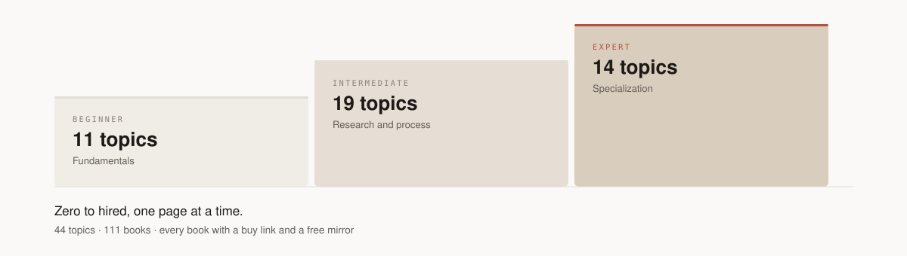
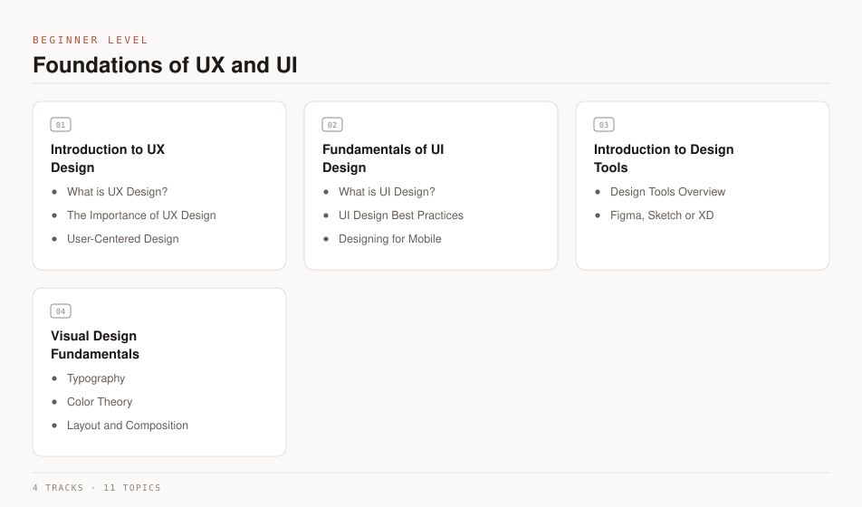
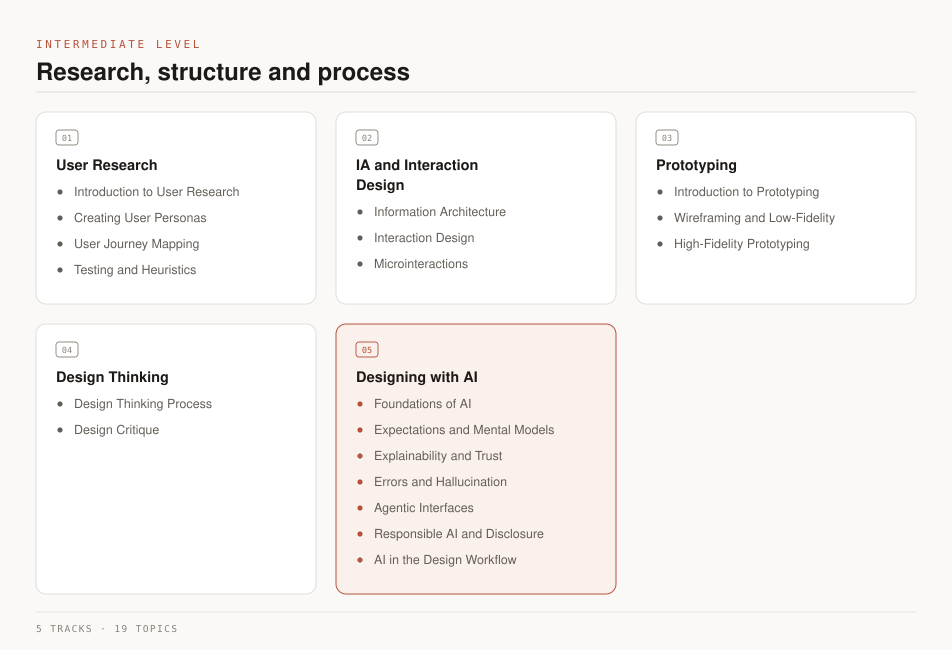
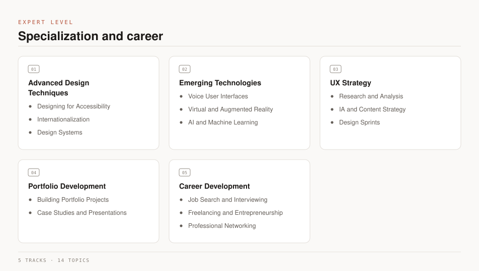

# UI/UX Design Learning Guide

<picture>
  <source media="(prefers-color-scheme: dark)" srcset="images/hero-dark.svg">
  
</picture>

**Everything you need to go from zero to hired as a UI/UX designer, in one page.**

Forty-four topics across three levels. Each one gives you the goals to hit, the books to read, the articles and talks worth your time, and the tools you will actually use. Start where you are — [Beginner](#beginner-level), [Intermediate](#intermediate-level), or [Expert](#expert-level).

Found a dead link, a better resource, or a typo? Read the **[contributing guide](CONTRIBUTING.md)** — reporting one broken link is a real contribution. Everyone here is expected to follow the **[code of conduct](CODE_OF_CONDUCT.md)**.

**Author or publisher?** If your book is mirrored here and you want it removed, [open a takedown request](https://github.com/hendurhance/ui-ux/issues/new?template=03-takedown.yml) — no lawyer or formal notice needed, and it is handled first. Prefer to keep it private? See [about the mirrors](DISCLAIMER.md) for a direct contact.

> **Earlier editions:** [2021](https://github.com/hendurhance/ui-ux/tree/%40deprecated-2021-resource) · [2024](https://github.com/hendurhance/ui-ux/tree/%40deprecated-2024-resource)

## How This Guide Works

The guide is one long document, organized as a path. Each **level** holds several **tracks**, and each track holds **topics**. Every topic gives you the same four things, so you always know what you are looking at.

| Level | For you if… | Tracks | Topics |
| --- | --- | --- | --- |
| **[Beginner](#beginner-level)** | You are new to design and want the fundamentals | 4 | 11 |
| **[Intermediate](#intermediate-level)** | You know the basics and want to work with real users | 5 | 19 |
| **[Expert](#expert-level)** | You want to specialize and get hired | 5 | 14 |

Inside every topic you get:

| Block | What it is |
| --- | --- |
| **Goals** | What you should be able to do once you finish the topic |
| **Books** | Long-form reading, with a buy link and a download mirror |
| **Articles** | Free reading you can finish in a sitting |
| **Videos** | Talks and walkthroughs |
| **Tools** | Software you will actually use |

**
<a href="#table-of-contents"> ⬆️ Back to Top</a>
**

### Reading the book tables

Every book row looks like this:

| Title | Author | Description | Buy | Mirror |
| --- | --- | --- | --- | --- |
|  **Don't Make Me Think** | Steve Krug | A common-sense approach to web usability. | [Buy](https://sensible.com/dont-make-me-think/) | [⬇ Mirror](https://mega.nz/) |

-  — free to read or download from the publisher or author. Nothing to pay.
-  — a commercial book. The **Buy** link goes to the publisher so the author gets paid.
- **Buy** — the official page. Use this one if you can afford it.
- **⬇ Mirror** — a copy hosted on MEGA for people who cannot. Click and it downloads.

If a book has no Buy link, it was never sold — it is a free paper, deck, or report.

> **Please buy the books you can afford.** These authors are the reason this guide exists. The mirrors are for people who genuinely cannot — see [about the mirrors](DISCLAIMER.md).

## The Path

The guide is a library, but it is meant to be walked in order. Here is that order, with what you should be able to do by the end of each step.

Times are rough, and assume a few focused hours a week. Move faster if you can, slower if life happens. The deliverable matters more than the schedule.

<h3>Expand the 14-step path</h3>

&nbsp;

### Foundations

| # | Step | You are done when | Rough time |
| --- | --- | --- | --- |
| 1 | [Understand what UX is](#introduction-to-user-experience-design) | You can explain to a non-designer why UX is a business argument, not decoration | 1 week |
| 2 | [Learn UI fundamentals](#fundamentals-of-user-interface-design) | You can look at any screen and name what makes it obvious or confusing | 1–2 weeks |
| 3 | [Pick one tool and get fluent](#introduction-to-design-tools) | You have rebuilt an existing app screen from scratch in Figma | 2 weeks |
| 4 | [Type, color, layout](#visual-design-fundamentals) | Your screens have a type scale, an accessible palette, and a grid you chose on purpose | 3–4 weeks |

**Checkpoint:** you can produce a screen that looks deliberate. It may not solve the right problem yet — that is the next half.

### Working with real users

| # | Step | You are done when | Rough time |
| --- | --- | --- | --- |
| 5 | [Talk to users](#user-research) | You have run a study with five people and written up what broke | 3 weeks |
| 6 | [Structure and interaction](#information-architecture-and-interaction-design) | You have restructured an app's navigation and validated it with a card sort | 2–3 weeks |
| 7 | [Prototype](#prototyping) | One flow exists as both a wireframe and a clickable high-fidelity build | 2–3 weeks |
| 8 | [Design thinking and critique](#design-thinking) | You have run one full cycle on a real problem and survived a critique | 2 weeks |
| 9 | [Design with AI](#designing-with-ai) | You can design an AI feature that admits when it is unsure | 2–3 weeks |

**Checkpoint:** you can take an ill-defined problem and come back with something tested. This is the bar most junior roles hire against.

### Specializing and getting hired

| # | Step | You are done when | Rough time |
| --- | --- | --- | --- |
| 10 | [Accessibility, i18n, design systems](#advanced-design-techniques) | Your work passes contrast checks and reuses components rather than repeating them | 3–4 weeks |
| 11 | [Pick an emerging area](#emerging-technologies) | You have shipped one small thing in voice, XR, or AI | 2–4 weeks |
| 12 | [UX strategy](#ux-strategy) | You can argue for a design decision in terms of business outcomes | 2–3 weeks |
| 13 | [Build the portfolio](#portfolio-development) | Three case studies that show your thinking, not just final screens | 4–6 weeks |
| 14 | [Apply](#career-development) | You have applied to ten roles and practiced the interview out loud | ongoing |

**Checkpoint:** you have a portfolio that argues for you when you are not in the room.

> **Do not read this front to back.** Do step 1, then build something. Every step has a deliverable because reading about design does not make you a designer — the reading only makes sense once you have hit the problem yourself.

<h2 id="table-of-contents">📑 Table of Contents</h2>

<h3>Expand to jump to any of the 44 topics</h3>

&nbsp;

- **[Beginner Level](#beginner-level)**
    * [Introduction to User Experience Design](#introduction-to-user-experience-design)
      * [What is UX Design?](#what-is-ux-design)
      * [The Importance of UX Design](#the-importance-of-ux-design)
      * [User-Centered Design](#user-centered-design)
    * [Fundamentals of User Interface Design](#fundamentals-of-user-interface-design)
      * [What is UI Design?](#what-is-ui-design)
      * [UI Design Best Practices](#ui-design-best-practices)
      * [Designing for Mobile](#designing-for-mobile)
    * [Introduction to Design Tools](#introduction-to-design-tools)
      * [Design Tools Overview](#design-tools-overview)
      * [Getting Started with Figma, Sketch or XD](#getting-started-with-figma-sketch-or-xd)
    * [Visual Design Fundamentals](#visual-design-fundamentals)
      * [Typography](#typography)
      * [Color Theory](#color-theory)
      * [Layout and Composition](#layout-and-composition)
- **[Intermediate Level](#intermediate-level)**
    * [User Research](#user-research)
      * [Introduction to User Research](#introduction-to-user-research)
      * [Creating User Personas](#creating-user-personas)
      * [User Journey Mapping](#user-journey-mapping)
      * [User Testing and Heuristics Evaluation](#user-testing-and-heuristics-evaluation)
    * [Information Architecture and Interaction Design](#information-architecture-and-interaction-design)
      * [Information Architecture](#information-architecture)
      * [Interaction Design](#interaction-design)
      * [Microinteractions](#microinteractions)
    * [Prototyping](#prototyping)
      * [Introduction to Prototyping](#introduction-to-prototyping)
      * [Wireframing and Low-Fidelity Prototyping](#wireframing-and-low-fidelity-prototyping)
      * [High-Fidelity Prototyping](#high-fidelity-prototyping)
    * [Design Thinking](#design-thinking)
      * [Design Thinking Process](#design-thinking-process)
      * [Design Critique](#design-critique)
    * [Designing with AI](#designing-with-ai)
      * [Foundations of AI for Designers](#foundations-of-ai-for-designers)
      * [Setting Expectations and Mental Models](#setting-expectations-and-mental-models)
      * [Explainability, Grounding and Trust](#explainability-grounding-and-trust)
      * [Designing for Errors, Uncertainty and Hallucination](#designing-for-errors-uncertainty-and-hallucination)
      * [Designing Agentic Interfaces](#designing-agentic-interfaces)
      * [Responsible AI, Disclosure and Compliance](#responsible-ai-disclosure-and-compliance)
      * [AI in the Design Workflow](#ai-in-the-design-workflow)
- **[Expert Level](#expert-level)**
    * [Advanced Design Techniques](#advanced-design-techniques)
      * [Designing for Accessibility](#designing-for-accessibility)
      * [Designing for Internationalization](#designing-for-internationalization)
      * [Design Systems](#design-systems)
    * [Emerging Technologies](#emerging-technologies)
      * [Voice User Interface Design](#voice-user-interface-design)
      * [Virtual and Augmented Reality Design](#virtual-and-augmented-reality-design)
      * [Designing for AI and Machine Learning](#designing-for-ai-and-machine-learning)
    * [UX Strategy](#ux-strategy)
      * [User Research and Analysis](#user-research-and-analysis)
      * [Information Architecture and Content Strategy](#information-architecture-and-content-strategy)
      * [Design Sprints](#design-sprints)
    * [Portfolio Development](#portfolio-development)
      * [Building Projects for your UX/UI Design Portfolio](#building-projects-for-your-uxui-design-portfolio)
      * [Case Studies and Presentations](#case-studies-and-presentations)
    * [Career Development](#career-development)
      * [Job Search and Interviewing](#job-search-and-interviewing)
      * [Freelancing and Entrepreneurship](#freelancing-and-entrepreneurship)
      * [Professional Development and Networking](#professional-development-and-networking)

&nbsp;&nbsp;&nbsp;

&nbsp;&nbsp;&nbsp;

## Beginner Level
> This level is for anyone starting out in User Experience and User Interface design. It covers what UX and UI actually are, how to work in a design tool, and the visual fundamentals — typography, color, and layout — that everything after this builds on.

 <h4> Beginner Level - Curriculum</h4> 

<picture>
  <source media="(prefers-color-scheme: dark)" srcset="images/curriculum/beginner-dark.svg">
  
</picture>

&nbsp;&nbsp;&nbsp;

### Introduction to User Experience Design
> User experience design is the process of creating products that give people meaningful and relevant experiences. This section covers what a UX designer actually does day to day, and why designing around real users beats designing around assumptions.

#### What is UX Design?
> “A person's perceptions and responses that result from the use or anticipated use of a product, system or service.” — ISO 9241-210, Ergonomics of human-system interaction—Part 210: Human-centered design for interactive systems
##### Goals
| Goal | Description |
| --- | --- |
| **Understand** | Learn about the field of UX design and the role of a UX designer. |
| **Learn** | Learn about the importance of user experience design in the digital world. |
| **Differentiate** | Learn to differentiate between "Good" and "Bad" UX design. |

##### Books
| Title | Author | Description | Buy | Mirror |
| --- | --- | --- | --- | --- |
|  **UX For Dummies** | Chesnut, Donald, Nichols, Kevin P | Get up to speed quickly on the latest in user experience strategy and design UX For Dummies is a hands-on guide to developing and implementing user experience strategy. | [Buy](https://www.goodreads.com/book/show/18763906-ux-for-dummies) | [⬇ Mirror](https://mega.nz/file/CPgXSDgJ#_tKsldw8mU7lRJnZfOXGryC1s641dTdvvE3TIrkVo48) |
|  **UX Fundamentals for Non-UX Professionals: User Experience Principles for Managers, Writers.** | Edward Stull | This book enables you to participate fully in discussions about UX, as you discover the fundamentals of user experience design and research. | [Buy](https://www.goodreads.com/book/show/40645097-ux-fundamentals-for-non-ux-professionals) | [⬇ Mirror](https://mega.nz/file/ObYEDAhJ#bzt8ynlcd05J0lCfqZa5zTXGQtLf2BObdgXeMEFIw5g) |
|  **Smashing UX Design: Foundations for Designing Online User Experiences** | Jesmond Allen &  James Chudley | Smashing UX Design is a practical guide to the fundamentals of UX design. | [Buy](https://www.goodreads.com/book/show/8675550-smashing-ux-design) | [⬇ Mirror](https://mega.nz/file/mHBSzIiD#w_3Fv1cpoNlCBmTPClOrPWGAYkmcnCJQoDynbpP0cKg) |
|  **The Design of Everyday Things: Revised and Expanded Edition** | Don Norman | The foundational text on human-centered design, explaining why some products delight and others frustrate through the principles of affordances, signifiers, and feedback. | [Buy](https://www.goodreads.com/book/show/840.The_Design_of_Everyday_Things) | [⬇ Mirror](https://mega.nz/file/2e4BzKjZ#H0-e9-lvVNPWwcYdWwdoB-UltdFHQxcTqr0JEhcv0hU) |

##### Articles
| Title | Author | Description | Link |
| --- | --- | --- | --- |
| **What is UX Design?** | UX Planet | UX Design primarily focuses on understanding and improving the interaction users have with a tool or product. | [Read](https://uxplanet.org/what-is-ux-design-bb02fc45aba5) |
| **What is user experience (UX) design?** | UsabilityHub | Learn all about UX design, and the skills you need to become a UX designer, in this comprehensive guide. | [Read](https://www.lyssna.com/blog/what-is-user-experience-design/) |
| **What is User Experience (UX) Design?** | Interaction Design Foundation| User experience (UX) design is the process design teams use to create products that provide meaningful and relevant experiences to users. | [Read](https://ixdf.org/literature/topics/ux-design) |
| **An Introduction to User Experience Design** | Ben Ralph | The deceptively tricky challenge of designing for user behavior | [Read](https://medium.com/beakerandflint/an-introduction-user-experience-design-2a7f8167bf03) |
| **Laws of UX** | Laws of UX | Laws of UX is a collection of 100+ UX laws, principles, and patterns for designing better digital products. | [Read](https://lawsofux.com/) |
| **UI, UX: Who Does What? A Designer’s Guide To The Tech Industry.** | Lo Min Ming | This article will help you understand the difference between UI and UX design, and how they work together to create a great user experience. | [Read](https://www.fastcompany.com/3032719/ui-ux-who-does-what-a-designers-guide-to-the-tech-industry) |
| **An Introduction to User Experience Design.**  | HackDesign Authors |You'll get an idea of how designers think, and how diverse the design disciplines are.  | [Reading List](https://hackdesign.org/lessons#user-experience) |

##### Videos
| Title | Author | Description | Link |
| --- | --- | --- | --- |
| **UX Crash Course - Getting Started in User Experience Design** | Jesse Showalter | User experience design (UX, UXD) is the process of enhancing user satisfaction with a product by improving the usability, accessibility, and pleasure provided in the interaction with the product. | [Watch](https://www.youtube.com/watch?v=_lyzy-vChh4) |
| **What Is UX Design? - An Introduction (Full Guide For 2023)** | CareerFoundry | In this video, we give you a quick overview of the term UX Design, share some of the key concepts and ideas involved. | [Watch](https://www.youtube.com/watch?v=ziQEqGZB8GE) |
| **The Laws of UX - 19 Psychological Design Principles** | Joseph | The Laws of UX is a collection of 100+ UX laws, principles, and patterns for designing better digital products. | [Watch](https://www.youtube.com/watch?v=fYs2Mdyasuc) |
| **UX Design vs UI Design - What's The Difference? (2023)** | CareerFoundry | What’s the difference between UX and UI design? What will you be doing as a user experience designer, or a user interface designer? In this video, we delve into these two in-demand design roles, sharing key definitions, responsibilities, similarities and differences. | [Watch](https://www.youtube.com/watch?v=5CxXhyhT6Fc) |

**
<a href="#table-of-contents"> ⬆️ Back to Top</a>
**

#### The Importance of UX Design
> UX matters because it meets real user needs, and people stay with products that work for them. That loyalty is what makes UX a business argument and not just a design preference.

##### Goals
| Goal | Description |
| --- | --- |
| **Understand** | Understand what makes an experience feel good rather than merely functional. |
| **Learn** | Learn what your users need and what they are trying to achieve. |
| **Write** | Write a plan for improving the user experience of a product. |
| **Discuss** | Make the case for UX design to someone who is not a designer. |

##### Books
| Title | Author | Description | Buy | Mirror |
| --- | --- | --- | --- | --- |
|  **The UX Book: Process and Guidelines for Ensuring a Quality User Experience** | Rex Hartson & Pardha Pyla | The UX Book: Process and Guidelines for Ensuring a Quality User Experience aims to help readers learn how to create and refine interaction designs that ensure a quality user experience (UX).  | [Buy](https://shop.elsevier.com/books/the-ux-book/hartson/978-0-12-385241-0) | [⬇ Mirror](https://mega.nz/file/CP41nBrQ#esFONhoX2qSFWuEL7IgNcPRw10CMQ5z-UCwla7EkfBQ) |
|  **The Basics of User Experience Design** | Interaction Design Foundation | The Basics of User Experience Design is a practical guide to the fundamentals of UX design. | [Buy](https://www.goodreads.com/book/show/40408061-the-basics-of-user-experience-design) | [⬇ Mirror](https://mega.nz/file/3DBlXL4I#lKiMEnpmPWMJbng3r1xQ_S1ShCkAACHFjUaNpofk4J0) |

##### Articles
| Title | Author | Description | Link |
| --- | --- | --- | --- |
| **What is UX Design? 15 user experience design to weigh in** | UserTesting | User Experience Design (UXD or UED) is a design process whose sole objective is to design a system that offers a great experience to its users. | [Read](https://www.usertesting.com/blog/what-is-ux-design-15-user-experience-experts-weigh-in) |
| **The Importance of UX Design** | Rocket55 | In today’s industry of rapidly growing interfaces, UX design has become increasingly important. The UX team at Rocket55 are here to explain what “User Experience” is all about. | [Read](https://www.rocket55.com/lab-note/the-importance-of-user-experience) |
| **The Importance of User Experience Design** | UX Planet | User experience design is a process that aims to improve the quality of interaction between the user and the product. | [Read](https://uxplanet.org/the-importance-of-user-experience-design-988faf6ddca2) |
| **What is UX (User Experience) and why is it important?** | Workshopper | UX Design focuses heavily on having a deep understanding of users, what they need, what they value, their abilities, and their limitations. | [Read](https://www.workshopper.com/post/what-is-ux-and-why-is-it-important) |
| **Why Is UX Design Important - 5 Important Arguments** | Resolute Software | Learn why UX design is important and how it can help you build a better product. | [Read](https://www.resolutesoftware.com/news/why-is-ux-design-important/) |
| **Why UX is IMPORTANT!** | Anisha Swain | For a designer, User experience(UX) design is the process to create products which provide meaningful, relevant and flexible experiences to users. | [Read](https://medium.com/the-ui-girl/why-ux-is-important-a6d9b9abb378) |

##### Videos
| Title | Author | Description | Link |
| --- | --- | --- | --- |
| **Why UX Design is Important** | Interaction Design Foundation | User experience design is a process that aims to improve the quality of interaction between the user and the product. | [Watch](https://www.youtube.com/watch?v=-XvfcBpwVGY)|
| **Humans, not Users: Why UX is a Problem** | Johannes Ippen | UX is a problem. It is time for UX design to step up and evolve. | [Watch](https://www.youtube.com/watch?v=dpXBV3COwJM) |
| **The Importance of UX Design** | SheStarts | Watch this interview with UX design guru Jonathan Steingiesser, Lead UX Researcher at MYOB | [Watch](https://www.youtube.com/watch?v=mhYkfcEhHVA) |

**
<a href="#table-of-contents"> ⬆️ Back to Top</a>
**

#### User-Centered Design
> User-centered design (UCD) puts the needs, wants, and limitations of real users at the center of every decision. In practice that means involving users at each stage rather than checking with them at the end.

##### Goals
| Goal | Description |
| --- | --- |
| **Understand** | Understand how involving users early changes what you build. |
| **Learn** | Learn to design around users by studying them, not guessing. |
| **Plan** | Map out a user-centered process for a project of your own. |

##### Books
| Title | Author | Description | Buy | Mirror |
| --- | --- | --- | --- | --- |
|  **Fundamentals of User-Centered Design** | Brian Still, Kate Crane | This book explains in-depth on what that UCD to usability and User Experience (UX) principles and best practices | [Buy](https://www.goodreads.com/book/show/41427300-fundamentals-of-user-centered-design) | [⬇ Mirror](https://mega.nz/file/jOIWiKRY#YmyW6DYhcwHlloq4TwaU1dklU32kU7chokgKowhY-Hg) |
|  **User-centered design: A developer's guide to building user-friendly applications** | Travis Lowdermilk | You’ll learn valuable strategies for conducting each stage of the design process, from interviewing likely users and discovering your application’s purpose to creating a rich user experience with sound design principles. | [Buy](https://www.goodreads.com/book/show/16173753-user-centered-design) | [⬇ Mirror](https://mega.nz/file/fCgQXTpY#28DCT2YqatRh0PBi9H8qQsIxvSUfp5lsgbooGFcwOqY) |
|  **User-Centered Design Stories: Real-World UCD Case Studies** | Carol Righi, Janice James | In this book, the reader is asked to perform analysis of dozens of UCD work situations and propose solutions for the problem set.. | [Buy](https://shop.elsevier.com/books/user-centered-design-stories/righi/978-0-12-370608-9) | [⬇ Mirror](https://mega.nz/file/6fgD0JaC#9B8G_5943J1wvvUjCtZaZBvzjPGfEp-W5x9YspCjVD8) |

##### Articles
| Title | Author | Description | Link |
| --- | --- | --- | --- |
| **User Centered Design** | Wikipedia| (User) Human-centered design is an approach to interactive system development that focuses specifically on making systems usable. | [Read](https://en.wikipedia.org/wiki/User-centered_design) |
| **What is User Centered Design?n** | Interaction Design Foundation | User-centered design (UCD) is an iterative design process in which designers focus on the users and their needs in each phase of the design process. | [Read](https://ixdf.org/literature/topics/user-centered-design) |
| **User-Centered Design Basics?** | Usability | The User-centered design (UCD) process outlines the phases throughout a design and development life-cycle all while focusing on gaining a deep understanding of the user. | [Read](https://uxplanet.org/what-is-user-centered-design-1b0e1e5e2e2) |
| **User Centered Design Principles & Methods** | Adobe | User-centered design (UCD) is a collection of processes that focus on putting users at the center of product design and development. | [Read](https://xd.adobe.com/ideas/principles/human-computer-interaction/user-centered-design/) |
| **What Is User-Centered Design? [Beginner's Guide]?** | CareerFoundry | User-centered design is an approach to design that puts users' needs front and center and follows an iterative design process that focuses on user feedback. | [Read](https://careerfoundry.com/en/blog/ux-design/user-centered-design/) |
| **How to Conduct User-Centered Design [Step-by-Step Guide]** | CareerFoundry | User-centered design is an approach to design that puts users' needs front and center and follows an iterative design process that focuses on user feedback. | [Read](https://careerfoundry.com/en/blog/ux-design/user-centered-design-how-to-guide/) |

##### Videos
| Title | Author | Description | Link |
| --- | --- | --- | --- |
| **What is User Centred Design** | Robert Elding | What is UCD, and what is the difference between UX, CX and UI design. How do they influence the design and development of your digital product or service and ultimately impact your sales funnel.  | [Watch](https://www.youtube.com/watch?v=BTVLmf0Z6EY) |
| **What is Human-Centered Design?** | Interaction Design Foundation | What is human-centered design, and why is the "human" aspect so crucial to the design process? Learn how to run and promote a truly human-centered design process. | [Watch Playlist](https://www.youtube.com/playlist?list=PLlgPXNRcnX3EwTKcoml8ybuu3RqQIXoiN) |

**
<a href="#table-of-contents"> ⬆️ Back to Top</a>
**

### Fundamentals of User Interface Design
> User interface (UI) design is the craft of building the screens people actually touch: layout, controls, type, and color. Looks matter here, but the real goal is making the product obvious to use.

#### What is UI Design?
> UI design covers everything a user sees and acts on: buttons, forms, icons, spacing, and states. Good UI makes the next action obvious without the user having to think about it.

##### Goals
| Goal | Description |
| --- | --- |
| **Understand** | Understand the building blocks of an interface: layout, controls, type, and color. |
| **Learn** | Learn how to turn a requirement into a screen that works. |
| **Plan** | Plan the steps from first sketch to finished interface. |

##### Books
| Title | Author | Description | Buy | Mirror |
| --- | --- | --- | --- | --- |
|  **Designing Interfaces** | Jenifer Tidwell | Learn how to design interfaces that are usable, useful, and desirable. | [Buy](https://www.goodreads.com/book/show/16673909-designing-interfaces) | [⬇ Mirror](https://mega.nz/file/XKJxFK6B#5ZdSHwUkaaV7nexY-LKHAhdbRKzZG37fOTQi77ahuMc) |
|  **Don't Make Me Think, Revisited: A Common Sense Approach to Web Usability** | Steve Krug | Understand the principles of approaching web design from a user's perspective. | [Buy](https://sensible.com/dont-make-me-think/) | [⬇ Mirror](https://mega.nz/file/eXJV3CYR#7zHA_R2AeuIigElRAbFU0HbmElNC6xTji3A8ry3DC3Q) |
|  **Designing with the Mind in Mind: Simple Guide to Understanding User Interface Design Rules** | Jeff Johnson | Designing with the Mind in Mind is a book about user interface design. | [Buy](https://shop.elsevier.com/books/designing-with-the-mind-in-mind/johnson/978-0-12-818202-4) | [⬇ Mirror](https://mega.nz/file/zKZ3nYBT#vGU7cc9DRrocX4bUrpCNOQsUWNDagG8geVB4gP2sdhM) |
|  **UI Design Fundamentals** | Uday Gajendar | Understand the fundamentals of UI design: affordances, feedback, color, type, grids, layouts, patterns, and widgets. | — | [⬇ Mirror](https://www.slideshare.net/slideshow/svcc12-designfundamentals/14656530) |

##### Articles
| Title | Author | Description | Link |
| --- | --- | --- | --- |
| **What is UI Design?** | Wikipedia | User interface design (UI) is the process of designing interfaces in software or computerized devices with the focus on looks or style. The goal of this design is to maximize the ease of use for the people using the product. | [Read](https://en.wikipedia.org/wiki/User_interface_design) |
| **User Interface (UI) Design** | Interaction Design Foundation | User interface (UI) design is the process designers use to build interfaces in software or computerized devices, focusing on looks or style. Designers aim to create interfaces which users find easy to use and pleasurable.| [Read](https://ixdf.org/literature/topics/ui-design) |
| **What is UI Design?** | UX Design Institute | What is user interface (UI) design, and how is it different from UX? What is the UI design process? Learn everything you need to know about UI design here. | [Read](https://www.uxdesigninstitute.com/blog/what-is-ui-design/) |
| **What Is UI Design? Definition, Tips, Best Practices** | Coursera | UI stands for user interface. It is the point of contact between humans and computers. Any technology you interact with as a user is part of the user interface. | [Read](https://www.coursera.org/articles/ui-design) |
| **What is UI Design?** | CareerFoundry | User interface (UI) design is an incredibly broad, multidisciplinary, and creative field. Good UI design is increasingly recognized as an essential tool to increase user engagement and create products that are both useful and visually pleasing.| [Read](https://careerfoundry.com/en/blog/ui-design/what-is-ui-design-guide/) |
| **What is Design Thinking?** | Ideou | How design thinking can help you transform the way you develop products, services, processes, and organizations. | [Read](https://www.ideou.com/blogs/inspiration/what-is-design-thinking) |
| **What Is Design Thinking? A Comprehensive Beginner's Guide** | CareerFoundry | Design thinking is both an ideology and a process, concerned with solving complex problems in a highly user-centric way. | [Read](https://careerfoundry.com/en/blog/ux-design/what-is-design-thinking-everything-you-need-to-know-to-get-started/) |

##### Videos
| Title | Author | Description | Link |
| --- | --- | --- | --- |
| **What Is User Interface (UI)?** | Codecademy | User interfaces (UIs) are what allow us to interact with and navigate through our favorite programs and devices. Every time you click a button on a website or swipe to a different screen, you're engaging with UI. | [Watch](https://www.youtube.com/watch?v=Z-BO6IYTgJg) |
| **User Interface (UI) Design Principles Series Introduction** | Brendan Colarusso | In this video, I explain how I came to my list of 12 UI Principles that we will be going over in depth in this series over the next few weeks. Check out the resources below to start learning about these principles.  | [Watch](https://www.youtube.com/watch?v=FmSjtWTIx1o) |
| **The 2019 UI Design Crash Course for Beginners** | DesignCourse | What is user interface (UI) design, and how is it different from UX? What is the UI design process? Learn everything you need to know about UI design here. | [Watch](https://www.youtube.com/watch?v=_Hp_dI0DzY4) |
| **UI Design Tutorial For Beginners** | Antony Conboy | Take your first steps in the world of User Interface (UI) design with this beginner-friendly tutorial. From understanding the basics of UI design to creating wireframes, prototypes, and high-fidelity mockups, we'll guide you through the process.| [Watch](https://www.youtube.com/watch?v=_K06Dni-RE4) |
| **Design Thinking Full Course, Design Thinking Process, Design Thinking For Beginners** | Simplilearn | Design thinking is a human-centered approach to problem solving that helps you understand the needs of people and develop innovative solutions. | [Watch](https://www.youtube.com/watch?v=_r0VX-aU_T8) |
| **Design Thinking Tutorial** | Simplilearn | In this design thinking tutorial, we will be looking at what is design thinking, why design thing is important,  steps of design thinking, empathy mapping, five phases and four pillars of design thinking and agile methodology with design thinking. | [Watch](https://www.youtube.com/watch?v=4nTh3AP6knM) |

**
<a href="#table-of-contents"> ⬆️ Back to Top</a>
**

#### UI Design Best Practices
> Best practices are the shortcuts other designers already paid for: consistency, clear hierarchy, forgiving defaults, and visible feedback. Learn the rule and the reason behind it, so you know when breaking it is the right call.

##### Goals
| Goal | Description |
| --- | --- |
| **Learn** | Learn the common UI conventions and the reasoning behind them. |
| **Understand** | Understand how each convention changes the user's experience. |
| **Practice** | Apply them in your own projects, and notice where they conflict. |

##### Books
| Title | Author | Description | Buy | Mirror |
| --- | --- | --- | --- | --- |
|  **The Essential Guide to User Interface Design** | Wilbert O. Galitz | This book explains in-depth on what that UI design is and how to design a user interface. | [Buy](https://www.goodreads.com/book/show/2390999) | [⬇ Mirror](https://mega.nz/file/ifBXxRjB#z-p2cMho9Vakau7uX4uFxLtioPGXWIhOhnFCuWya1i0) |
|  **Web UI Design Best Practices** | Chris Bank & Jerry Cao| This book is a collection of the best practices of web UI design. | [Buy](https://www.uxpin.com/studio/ebooks/web-ui-design-best-practices/) | [⬇ Mirror](https://mega.nz/file/2XgX3YRI#TdfSukAvU8b-YqsSEwEiglyk-Vb8vP1-jsE2RC6nmOc) |

##### Articles
| Title | Author | Description | Link |
| --- | --- | --- | --- |
| **User Interface Design Basics** | Usability| User Interface (UI) Design focuses on anticipating what users might need to do and ensuring that the interface has elements that are easy to access, understand, and use to facilitate those actions. | [Read](https://digital.gov/topics/usability/) |
| **The 4 Golden Rules of UI Design** | Adobe | The user interface (UI) is a critical part of any software product. When it’s done well, users don’t even notice it. | [Read](https://uxplanet.org/ui-design-best-practices-1d10d73d2d9b) |
| **10 Fundamental UI Design Principles You Need to Know** | Renee Fleck | Most users only notice the UI design of an app or software when something goes wrong. For this reason, we can say that good UI design is almost invisible, leaving the user free to get down to work without interruption. | [Read](https://dribbble.com/resources/education/ui-design-principles) |
| **27 UI/UX Design Principles and Best Practices 2021** | 729solutions | Great design goes a long way. The experience visitors have with your website sets the stage for their relationship with your product, your company, and your brand.| [Read](https://729solutions.com/ux-ui-best-practices/) |
| **UI Design Best Practices and Common Mistakes** | UX Planet | The most progressive and interesting designers steer clear of visually stale design solutions and ditch restrictive rules by learning UI design best practices and avoiding common design mistakes. 🔊 | [Read](https://www.toptal.com/designers/ui/most-common-ui-design-mistakes) |

##### Videos
| Title | Author | Description | Link |
| --- | --- | --- | --- |
| **4 Foundational UI Design Principles - C.R.A.P.** | Jesse Showalter | In this video, I'll be going over the 4 foundational UI design principles that I use to help me design better interfaces. | [Watch](https://www.youtube.com/watch?v=uwNClNmekGU) |
| **9 Tips for Becoming a GREAT UI Designer** | DesignCourse | In this video, I'll be sharing 9 tips that I've learned over the years that have helped me become a better UI designer. | [Watch](https://www.youtube.com/watch?v=_J1Le-4aXhE) |
| **UI Design Principles - Everything You Need To Know** | DesignWithArash | In this video, I'll be going over the 12 UI design principles that I use to help me design better interfaces. | [Watch](https://www.youtube.com/watch?v=NTmh8l-Xl4c)|
| **UX/UI BEST PRACTICES FOR WEB DESIGN: Free Web Design Course** | Flux Academy | This is what you need to know about UX UI design to quickly improve as a beginner. The best tip I can give you is to not make people think. Don't be original, be obvious. Don't be witty, be crystal clear.  | [Watch](https://www.youtube.com/watch?v=Cn2KgB_01mE) |

**
<a href="#table-of-contents"> ⬆️ Back to Top</a>
**

#### Designing for Mobile
> Designing for mobile means designing for small screens, thumbs, and constant interruption. Touch targets, one-handed reach, and slow connections all constrain what works, so a mobile layout is rarely a shrunken desktop one.

##### Goals
| Goal | Description |
| --- | --- |
| **Learn** | Learn the constraints of small screens and touch input. |
| **Understand** | Understand how those constraints change your layout decisions. |

##### Books
| Title | Author | Description | Buy | Mirror |
| --- | --- | --- | --- | --- |
|  **Mobile Design Pattern Gallery: UI Patterns for Smartphone App** | Theresa Neil | When you’re under pressure to produce a well-designed, easy-to-navigate mobile app, there’s no time to reinvent the wheel—and no need to. | [Buy](https://www.goodreads.com/book/show/13073411-mobile-design-pattern-gallery) | [⬇ Mirror](https://mega.nz/file/rLgySD4L#tS3LGfCYTjl5niB0UdEE33E_Zgv2tjZxgKXKzmlb1mg) |
|  **Usability Matters: Mobile-first UX for developers and other accidental designers** | Matt Lacey | Usability Matters: Mobile-first UX for developers and other accidental designers gives you practical advice and guidance on how to create attractive, elegant, and useful user interfaces for native and web-based mobile apps.. | [Buy](https://www.manning.com/books/usability-matters) | [⬇ Mirror](https://mega.nz/file/eLYE0CJZ#fkC_zrFANONnppOYNeBZxcG6Engu3068DFS6IBMqyvI) |

##### Articles
| Title | Author | Description | Link |
| --- | --- | --- | --- |
| **How to Design a Mobile App User Interface Like a Pro** | CareerFoundry |If you want to design a great, functional mobile app interface, you’re in the right place. In this guide, I’ll walk you through the key principles of mobile app design. | [Read](https://careerfoundry.com/en/blog/ui-design/how-to-design-a-mobile-app-using-user-interface-design-principles/) |
| **A Comprehensive Guide To Mobile App Design** | Nick Babich | Here are many things to consider when designing for mobile. We’re sure that this detailed guide will help you get rid of that headache when building apps. | [Read](https://www.smashingmagazine.com/2018/02/comprehensive-guide-to-mobile-app-design/) |
| **8 rules of mobile design** | UX Collective | Mobile user experience (UX) design refers to the design of positive experiences during the use of mobile devices and wearables, and applications or services running on such devices. — Interaction Design Foundation | [Read](https://uxdesign.cc/8-rules-of-mobile-design-1b8d9936c241) |
| **10 Do’s and Dont’s of Mobile App Design** | Nick Babic | Mobile design can be a tricky subject, with many things to consider when creating a mobile app. To simplify the task, I’ve prepared some highly practical tips on what you should and what you shouldn’t do when designing mobile apps.  | [Read](https://xd.adobe.com/ideas/principles/app-design/10-dos-donts-mobile-app-design/) |

##### Videos
| Title | Author | Description | Link |
| --- | --- | --- | --- |
| **How to design a mobile app tutorial - a step by step guide** | Malewicz | Here's another part of our design super-basics free course. Today I'll show you a step by step guide on how to start your first mobile app project. This is perfect for beginners and junior designers who want to have a good template to begin their projects with.  | [Watch](https://www.youtube.com/watch?v=0ul5UATkUiA) |
| **Revamping 3 Mobile Designs - Rapid ReDesigns** | DesignCourse | We're here with another edition of the UI/UX Workshop where I revamp 3 user-submitted designs. For this edition, I've chosen 3 mobile UI's just to show that the process is all the same regardless of design dimensions | [Watch](https://www.youtube.com/watch?v=k44OFRWvul8) |

**
<a href="#table-of-contents"> ⬆️ Back to Top</a>
**

### Introduction to Design Tools
> Design tools are where the work actually happens: wireframes, mockups, prototypes, and developer handoff. This section helps you pick one and get productive in it.

> The tool matters less than fluency in one of them. Compare the options below, pick the one used by the teams you want to join, and go deep rather than wide.

#### Design Tools Overview
> Design tools are where the work happens: wireframes, mockups, prototypes, and developer handoff. Compare the options and pick one to go deep on.

##### Goals
| Goal | Description |
| --- | --- |
| **Learn** | Learn which tools designers actually use, and what each is for. |
| **Understand** | Understand the core concepts: frames, components, and styles. |
| **Practice** | Rebuild an existing screen in the tool you chose. |

##### Tools
| Title | Description | Link | Free |
| --- | --- | --- | --- |
| **Figma** | Figma is a vector graphics editor and prototyping tool which is primarily web-based. | [Visit](https://www.figma.com/) | ✅ |
| **Adobe XD** | Adobe XD is a vector-based user experience design tool for web apps and mobile apps, developed and published by Adobe Inc. | [Visit](https://helpx.adobe.com/xd/get-started.html) | ✅ |
| **Sketch** | Sketch is a vector graphics editor and prototyping tool which is primarily web-based. | [Visit](https://www.sketch.com/) | ❌ |
| **InVision** | InVision is a digital product design platform used for creating prototypes, managing user feedback, and designing and building user interfaces. | [Visit](https://www.invisionapp.com/) | ✅ |
| **ProtoPie** | ProtoPie is a prototyping tool for mobile apps. | [Visit](https://www.protopie.io/) | ✅ |
| **Marvel** | Marvel is a prototyping tool for mobile apps. | [Visit](https://marvelapp.com/) | ✅ |
| **Principle** | Principle is a prototyping tool for mobile apps. | [Visit](https://principleformac.com/) | ✅ |
| **Framer** | Framer is a prototyping tool for mobile apps. | [Visit](https://www.framer.com/) | ✅ |
| **Adobe Photoshop** | Adobe Photoshop is a raster graphics editor developed and published by Adobe Inc. for macOS and Windows. | [Visit](https://www.adobe.com/products/photoshop.html) | ❌ |

**
<a href="#table-of-contents"> ⬆️ Back to Top</a>
**

#### Getting Started with Figma, Sketch or XD

##### Articles
| Title | Author | Description | Link |
| --- | --- | --- | --- |
| **The Figma Design Tool Handbook** | DesignCode | A comprehensive guide to the best tips and tricks in Figma | [Reading List](https://designcode.io/figma-handbook) |
| **The Figma Learning Guide** | Figma | Kick start your design education with these 12 lessons | [Reading List](https://www.figma.com/resource-library/design-basics/) |
| **Get Started with Adobe XD: Design.** | Adobe XD | Get started using Adobe XD, the powerful platform for creating user experiences — all at the speed of thought.| [Reading List](https://www.adobe.com/products/xd/learn/get-started-xd-design.html) |

##### Videos
| Title | Author | Description | Link |
| --- | --- | --- | --- |
| **New to Figma? Get started with "Figma for beginners" tutorials** | Figma | f you’re brand new to Figma or design tools, check out this playlist for a quick tour of key features as we take you through a rough approximation of the design process, and design a mobile app together. | [Watch Playlist](https://www.youtube.com/playlist?list=PLXDU_eVOJTx7QHLShNqIXL1Cgbxj7HlN4) |
| **Figma UI Design Tutorial: Get Started in Just 24 Minutes!** | AJ&Smart | Do you want to learn Figma but don’t know where to start? Well, if you follow this step-by-step tutorial, it will only take you 24 minutes to learn all the basics you need to know to start designing apps and websites in Figma. | [Watch](https://www.youtube.com/watch?v=tdy1bo5eAgA) |
| **Figma Tutorial for Beginners** | DesignCourse | In this video, I'll be going over the basics of Figma and how to use it to create a simple website design. | [Watch](https://www.youtube.com/watch?v=3q3FV65ZrUs) |
| **Figma tutorial for Beginners: Complete Website from Start to Finish** | Flux Academy | Learn how to use Figma to design a website from start to finish. | [Watch](https://www.youtube.com/watch?v=HZuk6Wkx_Eg) |
| **UI Design Live: UI Patterns, Visual Hierarchy and Iterations** | DesignCourse | How we can take one UI and make multiple iterations of it by looking at different UI patterns and visual hierarchy. | [Watch](https://www.youtube.com/watch?v=D1pO4AQTfes&t=68s) |
| **Learn Adobe XD in 2021 by Example (Crash Course)** | DesignCourse | Today, we're going to step back into the world of UI/UX design and cover one of the most popular UI/UX design and prototyping tools: Adobe Experience Design (Adobe XD). You're going to learn all major features of this powerful app in crash course format, all while doing so by creating a UI for a fictional business. | [Watch](https://www.youtube.com/watch?v=3rQ-eTmWah0) |
| **Adobe XD Tutorials** | Dansky | Learn how to use Adobe XD to design and prototype websites and mobile apps. | [Watch Playlist](https://www.youtube.com/playlist?list=PLkiM1tZke4mivrZRPcqp_8oHFxlD8-IP5) |
| **Free Adobe XD Tutorial: User Experience Design Course with Adobe XD Course** | Bring Your Own Laptop | Free Adobe XD Tutorial Course from the full course: User Experience Design Essentials - Adobe XD UI UX Design. | [Watch](https://www.youtube.com/watch?v=68w2VwalD5w) |

##### Courses
| Title | Author | Description | Link |
| --- | --- | --- | --- |
| **Figma Course** | DesignCourse | Learn how to use Figma to design websites and mobile apps. | [Enroll](https://learnux.io/course/figma) |
| **Figma for Beginners** | Coursera | Learn to build pages and frames, add text and images, and use the Figma interface. | [Enroll](https://www.coursera.org/specializations/beginnerfigmauiuxdesignessentials) |
| **XD for Beginners** | Udemy | Learn how to use Adobe XD to design and prototype websites and mobile apps. | [Download](https://drive.google.com/uc?export=download&id=1a8cdPXu95U6cONltDqcTM8oVztaqFuPZ) | 
| **Figma Mastery** | Udemy | Master Figma and learn how to design websites and mobile apps. | [Download](https://drive.google.com/uc?export=download&id=1B-sZhBPvgaxlOInLFSUZM9M4rvYG88n0) |
| **Learn Figma for UI UX Design (with a Design Project)** | Udemy | Learn the Figma's Essentials for UI/UX Design from a Sr. Designer with 8+ Years of Experience | [Download](https://www.udemy.com/course/learn-figma-ui-ux-design-project/) |
| **9 Best FREE Figma Courses (2023)** | UntitledUI | Getting started in Figma and design? We've scoured the internet for the best free Figma courses to kickstart your 2023 design career. | [Resource List](https://www.untitledui.com/blog/best-free-figma-courses) |
| **Free Adobe XD Courses** | ClassCentral | Learn Adobe XD, earn certificates with paid and free online courses from Coursera, Treehouse, YouTube and other top learning platforms around the world. Read reviews to decide if a class is right for you. | [Resource List](https://www.udemy.com/course/figma-for-beginners/) |
| **Sketch App Course** | LearnUX | Sketch is an application which has already won the hearts of UI and UX designers around the world, even though just about anybody can learn how to use it. | [Enroll](https://learnux.io/course/sketch) |
| **9 Best Sketch Courses to Take in 2023** | ClassCentral | The best courses (including free ones) to create digital products and collaborate with Sketch, the design tool for designers and developers. | [Resource List](https://www.classcentral.com/report/best-sketch-courses/) |

**
<a href="#table-of-contents"> ⬆️ Back to Top</a>
**

### Visual Design Fundamentals
> The principles of visual design include contrast, balance, emphasis, movement, white space, proportion, hierarchy, repetition, rhythm, pattern, unity, and variety. Used together, they make a screen readable at a glance instead of merely decorated.

#### Typography
> Typography is the craft of arranging type so written language is legible, readable, and pleasant to read. In practice that means choosing typefaces and sizes, then tuning line length, leading, tracking, and kerning until the text stops fighting the reader.

##### Goals
| Goal | Description |
| --- | --- |
| **Learn** | Learn typeface anatomy, scale, leading, and measure. |
| **Understand** | Understand how type choices change legibility and readability. |
| **Practice** | Build a type scale that gives a page clear hierarchy. |

##### Books
| Title | Author | Description | Buy | Mirror |
| --- | --- | --- | --- | --- |
|  **The New Web Typography: Create a Visual Hierarchy with Responsive Web Design** | Stephen Boss & Jason Cranford Teague| The New Web Typography: Create a Visual Hierarchy with Responsive Web Design shows you how to implement web-safe fonts to create visually appealing and multi-browser-friendly websites while encouraging you to develop designs that express your own unique typographic voice.| [Buy](https://books.google.com/books/about/The_New_Web_Typography.html?id=hIOKDQAAQBAJ) | [⬇ Mirror](https://mega.nz/file/2H43WJzZ#kbvaTF5TqE0yufjw7w4ByJlKLM_nhtbnaFhr2040s9Q) |
|  **Thinking with Type: A Critical Guide for Designers, Writers, Editors, & Students** | Ellen Lupton | A classic introduction to type design and typography, Thinking with Type is a must-have for anyone who works with words. | [Buy](https://www.chroniclebooks.com/products/thinking-with-type-1) | [⬇ Mirror](https://mega.nz/file/CPBH1JjB#JPGeDRGh1mgMrxvIxCa7g-toFja3iiRDpqYKZ_MuwfQ) |
|  **The Anatomy of Type: A Graphic Guide to 100 Typefaces** | Stephen Coles | The Anatomy of Type explores one hundred traditional and modern typefaces in loving detail, with a full spread devoted to each entry. | [Buy](https://typeanatomy.com/) | [⬇ Mirror](https://mega.nz/file/2HIhETYB#kyG-ourTLEtp8PvzuX_I0uVOMkNsmIqLakdhVpMB-8E) |
|  **Why Fonts Matter** | Sarah Hyndman | Discover the incredible power of fonts - how they influence your decisions, alter your perceptions, stir your emotions and change how you understand the world around you. | [Buy](https://gingkopress.com/shop/why-fonts-matter/) | [⬇ Mirror](https://mega.nz/file/LfYHFK5R#mRoYrwRBx9CSrQQ_0t18W1KZGvgu3FoVrWyiZzFJypg) |
|  **Designing with Type: The Essential Guide to Typography** | James Craig | The classic Designing with Type has been completely redesigned, with an updated format and full color throughout. New information and new images make this perennial best-seller an even more valuable tool for anyone interested in learning about typography.  | [Buy](https://www.penguinrandomhouse.com/books/33163/designing-with-type-5th-edition-by-james-craig-and-irene-korol-scala/9780823014132/) | [⬇ Mirror](https://mega.nz/file/GDQGkajC#Dh0-_rURBC7bX2ciqDar6uv3IZLu9nNwfDgMmNHJlNU) |

##### Articles
| Title | Author | Description | Link |
| --- | --- | --- | --- |
| **What Is Typography, and Why Is It Important? [2023 Guide]** | CareerFoundry | Typography is the art and technique of arranging type to make written language legible, readable, and appealing when displayed. | [Read](https://careerfoundry.com/en/blog/ui-design/beginners-guide-to-typography/) |
| **The Principles of Design and Their Importance** | Toptal | The principles of design work together to create something that is aesthetically pleasing and optimizes the user experience. | [Read](https://www.toptal.com/designers/ui/principles-of-design) |
| **Breaking Down the Principles of Design (with Infographic)** | Toptal | Understanding the principles of design and how they interact is vital for both new and expert designers. Implementing them purposefully is key to creating visually appealing, functional designs. | [Read](https://www.toptal.com/designers/ui/principles-of-design) |
| **Typography for Developers** | CSS-Tricks | Typography is a huge topic, and it's easy to get lost in the weeds. This article is meant to be a high-level overview of the basics of typography. | [Read](https://css-tricks.com/typography-for-developers/) |
| **Understanding typography** | Material Design | Typography is critical in establishing hierarchy and expressing brand presence that supports an effective digital experience.. | [Read](https://m2.material.io/design/typography/understanding-typography.html) |
| **Typography design 101: a guide to rules and terms** | 99designs | What is typography design? In short, typography design is the art of arranging a message in a readable and aesthetically pleasing composition. | [Read](https://99designs.com/blog/tips/typography-design/) |

##### Videos
| Title | Author | Description | Link |
| --- | --- | --- | --- |
| **The Ultimate Guide to Typography - FREE COURSE** | Envato Tuts+ | Good typography is one of the cornerstones of good design. In The Ultimate Guide to Typography, you'll learn everything from the most basic elements of typography and common mistakes through to more complex topics like combining and choosing fonts for your projects. | [Watch](https://www.skillshare.com/classes/Typography-for-Beginners/1031507771) |
| **Typography for Developers Tutorial - Full Course** | freeCodeCamp | In this course, you'll learn all you need to know about creating good typography as a UX Designer: how to choose a typeface; what to look for when laying out type, how to create typographic hierarchy, laying out type, and creating responsive typography. | [Watch](https://www.youtube.com/watch?v=agbh1wbfJt8) |
| **Understanding Visual Hierarchy in UI Design - Live Project Follow-Along** | DesignCourse | Learn to understand visual hierarchy in UI design. | [Watch](https://www.youtube.com/watch?v=ZYs0_t_Gdhk) |

**
<a href="#table-of-contents"> ⬆️ Back to Top</a>
**

#### Color Theory
> Color theory explains how colors relate to one another and how those relationships read on screen. For interface work it is what lets you build a palette that carries meaning — state, hierarchy, brand — rather than one that just looks nice.

##### Goals
| Goal | Description |
| --- | --- |
| **Learn** | Learn how to create a harmonious color scheme. |
| **Understand** | Understand how hue, saturation, and value work together. |
| **Apply** | Apply a palette to a real interface, including text and states. |
| **Create** | Create a color scheme that stays readable at accessible contrast. |
| **Experiment** | Try the same design in several palettes and compare. |
| **Inspire** | Use color to set the mood you want a product to have. |

##### Books
| Title | Author | Description | Buy | Mirror |
| --- | --- | --- | --- | --- |
|  **The Elements of Color** | Johannes Itten | The Elements of Color is a classic book on color theory. It is a must-have for anyone interested in learning about color theory. | [Buy](https://www.goodreads.com/book/show/967309.The_Elements_of_Color) | [⬇ Mirror](https://mega.nz/file/LOJ1DJDb#5Vkv8rv9n3og2o5ikQy9AAvPoPqttabMEiTxujCrYbg) |
|  **Color: A Natural History of the Palette** | Victoria, Finlay | In this vivid and captivating journey through the colors of an artist’s palette, Victoria Finlay explores the history of color, from the first cave paintings to the latest scientific research. | [Buy](https://www.penguinrandomhouse.com/books/49699/color-by-victoria-finlay/) | [⬇ Mirror](https://mega.nz/file/KSwigJDR#Fy2qBKE3j3BPmHWVctADFhkOxGGiwGrYTmnZydsiU78) |
|  **The Secret Lives of Color** | Kassia St. Clair | You’ll find this book to be an interesting read. A fascinating book for UI and UX designers who are interested in the history of colors from an unusual perspective. | [Buy](https://www.penguinrandomhouse.com/books/552503/the-secret-lives-of-color-by-kassia-st-clair/) | [⬇ Mirror](https://mega.nz/file/yKo1gY5L#Uwv9XswQupv9IQrtOnzDCohbrXIxyWE2W1TGvu2TdUI) |
|  **Color: A Course in Mastering the Art of Mixing Colors** | Betty Edwards | Mastering the art of mixing colors is a skill that every artist should have. This book will help you to learn how to mix colors and create beautiful color schemes. | [Buy](https://www.penguinrandomhouse.com/books/288688/color-by-betty-edwards/) | [⬇ Mirror](https://mega.nz/file/3bQSmTRY#hcmsjjr99BfdwAudP_ljgpWCjQPXgghkePkMyOr8Qqs) |
|  **Interaction of Color** | Josef Albers| Conceived as a handbook and teaching aid for artists, instructors, and students, this influential book presents Albers’s singular explanation of complex color theory principles. | [Buy](https://yalebooks.yale.edu/book/9780300179354/interaction-of-color/) | [⬇ Mirror](https://mega.nz/file/KX5E0CCR#LY6Egn8MkzUons8BvESEn4ym-jL8-2d55KaoXJGEDsc) |
|  **Best Practices for Graphic Designers, Color Works: Right Ways of Applying Color in Branding** | Eddie Opara & John Cantwell | This is the go-to guide for designers as it outlines and details the essential color design skills needed to create successful, meaningful and memorable brand | [Buy](https://www.goodreads.com/book/show/21419175-best-practices-for-graphic-designers-color-works) | [⬇ Mirror](https://mega.nz/file/GfIVSQJa#4sPGNRu7zySJI0sLAJpbtyXnwbQnwgqLEFakST4YIa4) |

##### Articles
| Title | Author | Description | Link |
| --- | --- | --- | --- |
| **What is Color Theory?** | Interaction Design Foundation | Color theory is the collection of rules and guidelines which designers use to communicate with users through appealing color schemes in visual interfaces.| [Read](https://ixdf.org/literature/topics/color-theory) |
| **The Science Behind Color and Emotion** | Design Shack | The science behind our emotional connections to color, from Goethe’s color wheel to modern neuroscience, and what it means for design work. | [Read](https://designshack.net/articles/graphics/the-science-behind-color-and-emotion/) |
| **An Introduction to Color Theory and Color Palettes** | CareerFoundry | Have you ever seen a color that has immediately reminded you of a particular brand? Maybe you’ve struggled to feel relaxed in a room that has a clashing color scheme, or returned an item of clothing you got as a gift because the color wasn’t quite right.| [Read](https://careerfoundry.com/en/blog/ui-design/introduction-to-color-theory-and-color-palettes/) |
| **Color Theory for Designers – A Crash Course (with Infographic)** | Toptal | Color: It’s stunningly beautiful and maddeningly deceptive. Use this color theory field guide (with an infographic) to make lightning-quick color choices with unwavering confidence. | [Read](https://www.toptal.com/designers/graphic/color-theory-for-designers) |
| **Color Theory for Designers, Part 1: The Meaning of Color** | Cameron Chapman | Let’s dive into color theory. We’ll discuss the meanings behind the different color families, and give some examples of how these colors are used. | [Read](https://www.smashingmagazine.com/2010/01/color-theory-for-designers-part-1-the-meaning-of-color/) |
| **The Ultimate UX Guide to Color Design** | Justin Baker | The Ultimate UX Guide to Color Design. How to use color in your designs to create a better user experience. | [Read](https://medium.muz.li/the-ultimate-ux-guide-to-color-design-4d0a18a706ed) |
| **Color Theory: Brief Guide For Designers** | TubikStudio | The article focused on the basics of color theory and color combinations in design: learn more about color wheel, RGB, CMYK and models of color harmony. | [Read](https://blog.tubikstudio.com/color-theory-brief-guide-for-designers/) |

##### Videos
| Title | Author | Description | Link |
| --- | --- | --- | --- |
| **Color Theory for UI Design** | GCFLearnFree | In this video, you’ll learn the basics of using color in graphic design | [Watch](https://www.youtube.com/watch?v=_2LLXnUdUIc) |
| **How To Use Color — Color Basics** | The Futur Academy | What is color theory? Why do your colors look awful? How do you use color? And why is it so difficult? In this episode, Greg Gunn will teach you the basics of how color works and provide some easy tips and tricks for using it. | [Watch](https://www.youtube.com/watch?v=QkCVrNoqcBU) |
| **How to Choose Colors (Easy 3-Step Process)** | FluxAcademy | In this video, I will go over the basics of color theory and how to choose colors for your designs. | [Watch](https://www.youtube.com/watch?v=KMS3VwGh3HY) |
| **ADVANCED Colour Theory Makes Designs SUPERIOR! (With Real Examples)** | Satori Graphics | In this video, I will be going over the basics of colour theory and how to use it to make your designs look better. | [Watch](https://www.youtube.com/watch?v=XNkV6m4fosw) |
| **Super Practical Guide to Color Theory, Color Models and Perfect Color Palettes - UI Design** | DesignerUp | Maybe you’ve followed all the color harmony and color theory tutorials to a tee and generated a complementary color palette, but you notice that the colors don’t seem to match very well, perhaps they look harsh or a bit muddy and unprofessional and you don’t really know why. | [Watch](https://www.youtube.com/watch?v=GyVMoejbGFg) |
| **How to Apply a Color Palette to Your Design – Tutorial** | The Futur Academy | In this video, you’ll learn the basics of using color in graphic design. | [Watch](https://www.youtube.com/watch?v=eXcKOqviLE0) |
| **Bad at Picking COLORS? Let's fix that - RAPID Color Scheming** | DesignCourse | In this video, I will be going over the basics of color theory and how to use it to make your designs look better. | [Watch](https://www.youtube.com/watch?v=s9p3nF4rFaU) |
| **60-30-10 Color Rule** | Jesse Showalter | How do you apply color in mobile UI design projects? Here's a little tip, the 60-30-10 color rule(it's more like a guideline) will help you to get a good start to applying color in a mature and seamless way.| [Watch](https://www.youtube.com/watch?v=UWwNIMHFdW4) |

**
<a href="#table-of-contents"> ⬆️ Back to Top</a>
**

#### Layout and Composition
> Layout and composition are how you arrange elements on a screen: what goes where, how much space it gets, and what the eye reaches first. Grids, alignment, and spacing do most of that work, which is why they are worth learning properly.

##### Goals
| Goal | Description |
| --- | --- |
| **Learn** | Learn how grids, alignment, and spacing structure a screen. |
| **Understand** | Understand how layout directs where the eye goes first. |
| **Apply** | Apply a grid to a design you have already made. |
| **Practice** | Practice with auto-layout and constraints until layouts survive resizing. |

##### Books
| Title | Author | Description | Buy | Mirror |
| --- | --- | --- | --- | --- |
|  **Design School: Layout: A Practical Guide for Students and Designers** | Richard Poulin | It provides a comprehensive introduction to creating and changing layouts: a crucially important skill that underpins practically every aspect of graphic design. | [Buy](https://www.richardpoulin.net/books/design-school-layout) | [⬇ Mirror](https://mega.nz/file/7H40yRJK#V9L0FN2UZAgu0LHzFvroLemqRmScVw8IpSV_cu6AnKI) |
|  **Web Design Style Guide** | Carleton University | This guide is intended to help you create a consistent layout and feel for your web site. It is based on the principles of good design and usability. | — | [⬇ Mirror](https://apps.carleton.edu/campus/web-group/assets/Web_Design_Style_Guide_1.0.pdf) |
|  **Best Practices for Graphic Designers, Grids and Page Layouts: An Essential Guide for Understanding and Applying Page Design Principles** | Amy Graver & Ben Jura | This unique, go-to guide for designers fully details the essential layout and design skills needed to succeed in this competitive industry. | [Buy](https://www.goodreads.com/book/show/13195713-best-practices-for-graphic-designers-grids-and-page-layouts) | [⬇ Mirror](https://mega.nz/file/rGoSCTjA#Y96QZ5ZrQL7pjXX46wtv1DqAZd-YDU9HLbPle50rpaA) |
|  **Modular Design Frameworks : A Projects-based Guide for UI/UX Designers** | James Cabrera | Learn the basic principles of modular design, and then put them into action to create sites that are easy to use, look great, and can be adapted within the context of your business needs. | [Buy](https://www.goodreads.com/en/book/show/33607155-modular-design-frameworks) | [⬇ Mirror](https://mega.nz/file/qGAxAI7K#9WUmN8aPQF7O_rNQcpDAtt0tkeO3bgKwsdS3TYOlxmU) |

##### Articles
| Title | Author | Description | Link |
| --- | --- | --- | --- |
| **Fundamentals of layout in user interface design (UI)** | Leonardo Moreno | Composition, balance, and how to manage a good structure. | [Read](https://uxdesign.cc/fundamentals-of-layout-in-interface-design-ui-3a9dba31f1) |
| **9 Rules of Composition For UX/UI Designers** | Inkbot Design | The rules of composition allow you to place the content in the most logical and appealing form. If you think that composition is something from the art world that has nothing to do with UX/UI, you’re terribly wrong. | [Read](https://inkbotdesign.com/rules-of-composition/) |
| **Understanding Layout** | Material Design | In many ways, layout and composition are the building blocks of design. They give your work structure and make it easier to navigate, from the margins on the sides to the content in between. | [Read](https://m2.material.io/design/layout/understanding-layout.html) |
| **The 5 rules of design composition and layout** | 99Designs | Design composition is how you place elements on a page. Learn how to layout a design to creating meaning and be more aesthetically pleasing. | [Read](https://99designs.com/blog/tips/design-composition-and-layout/) |
| **Composition and its rules in the design of interfaces** | UX Planet | Composition — is interaction of interface elements with a goal to convey the meaning of this very interface. To give user an opportunity to easily understand the interface, it is necessary to use the rules of composition. | [Read](https://uxplanet.org/composition-and-its-rules-in-the-design-of-interfaces-65a86e4d09a7) |
| **Key Principles for Better Design Composition** | Caleb Kingston | Designs often have many combined elements from type and imagery to graphics and colors.  | [Read](https://xd.adobe.com/ideas/process/ui-design/design-composition-key-principles/) |
| **Create scalable web page layouts in Figma** | UX Design | Learn how to create a responsive web page layout in Figma. | [Read](https://uxdesign.cc/create-scalable-web-page-layouts-in-figma-e7e6e580dd67) |
| **Layout Grid & Auto Layout in Figma** | DesignCode | Learn how to use layout grids and auto layout in Figma. | [Read One](https://designcode.io/figma-handbook-auto-layout) [Read Two](https://designcode.io/figma-handbook-layout-grid) |

##### Videos
| Title | Author | Description | Link |
| --- | --- | --- | --- |
| **Beginning Graphic Design: Layout & Composition** | GCFLearnFree | In this video, you’ll learn the basics of layout and composition in graphic design | [Watch](https://www.youtube.com/watch?v=a5KYlHNKQB8) |
| **5 laws of design layout & composition *golden rules*** | Positive Space | Learn about the 5 laws of design layout & composition. | [Watch](https://www.youtube.com/watch?v=eEWRbpDu6CU) |
| **Master LAYOUT & COMPOSITION Design - Why Layout Is SO IMPORTANT** | Satori Graphics | Do you want to learn how to master layout and composition design, improving your graphic design workflow and designs? In todays composition and layout design tutorial, learn why layout is so important, and why you need to focus on it regarding your graphic designs. | [Watch](https://www.youtube.com/watch?v=N8TQfE1qKeE) |
| **Figma Tutorial: Setup a Responsive Grid Layout for UI & Web Design (IN 11 MINUTES)** | Mizko  | Learn how to setup a responsive grid layout in Figma. | [Watch](https://www.youtube.com/watch?v=_w-iYiEXrl0) |
| **Figma in 5: Auto Layout** | Figma | Learn how to use auto layout in Figma. | [Watch](https://www.youtube.com/watch?v=TyaGpGDFczw) |
| **Figma Tutorial: Layout Grids** | Figma | Learn how to use layout grid in Figma. | [Watch](https://www.youtube.com/watch?v=zd8wrAdURN0) |

##### Project Tasks #1
- Project: Redesign the following dribbble shots using the concepts you learned in this section `Beginner Level`
    * [#Exploration - Fashion Website](https://dribbble.com/shots/14836845--Exploration-Fashion-Website)
    * [#Exploration - E-commerce Website](https://dribbble.com/shots/14865120--Exploration-More-Screens-Fashion-Mobile-App)
- Create an auto layout, style guide, typography, and color palette for a design you created above. 

&nbsp;&nbsp;&nbsp;

## Intermediate Level
> This level assumes you are comfortable with the beginner material and ready to work with real users. It covers user research, information architecture, prototyping, design thinking, and designing with AI.

 <h4> Intermediate Level - Curriculum</h4> 

<picture>
  <source media="(prefers-color-scheme: dark)" srcset="images/curriculum/intermediate-dark.svg">
  
</picture>

&nbsp;&nbsp;&nbsp;

### User Research
> User research is how you replace assumptions about your users with evidence. Done early, it tells you which problem is worth solving before you spend weeks solving the wrong one.

#### Introduction to User Research
> This section covers why research matters, the difference between qualitative and quantitative methods, and how to run a study without a budget.

##### Goals
| Goal | Description |
| --- | --- |
| **Learn** | Learn the main research methods and when each one fits. |
| **Understand** | Understand what research can answer and what it cannot. |
| **Apply** | Apply what you learned here to a design you are working on. |
| **Practice** | Run a short study on a product you already use. |
| **Reflect** | Turn what you found into concrete changes to the product. |

##### Books
| Title | Author | Description | Buy | Mirror |
| --- | --- | --- | --- | --- |
|  **Think Like a UX Researcher: How to Observe Users, Influence Design, and Shape Business Strategy** | David Travis & Philip Hodgson | Think Like a UX Researcher will challenge your preconceptions about user experience (UX) research and encourage you to think beyond the obvious. You’ll discover how to plan and conduct UX research, analyze data, persuade teams to take action on the results and build a career in UX. | [Buy](https://www.goodreads.com/book/show/123871628-think-like-a-ux-researcher) | [⬇ Mirror](https://mega.nz/file/mX5GhQZT#wQBddISy2xaD3MoZdR5VpFc-UDQqin2oSOS80LMgAUY) |
|  **Researching UX: User Research** |James Lang & Emma Howell | How well do you really know your users? With properly conducted user research, you can discover what really makes your audience tick. | [Buy](https://www.goodreads.com/book/show/34497740-researching-ux) | [⬇ Mirror](https://mega.nz/file/6Dpy1ShT#pDGypu7YRIInTTVPwtkp-fNbU--4-xLkU3GoETRnYHA) |
|  **Quantifying the User Experience. Practical Statistics for User Research** | Jeff Sauro & James R Lewis | The book presents a practical guide on how to use statistics to solve common quantitative problems that arise in user research. It addresses questions such as: How do I know if my results are statistically significant? How do I know if my results are reliable? How do I know if my results are valid? | [Buy](https://shop.elsevier.com/books/quantifying-the-user-experience/sauro/978-0-12-802308-2) | [⬇ Mirror](https://mega.nz/file/3aAGRb5a#Cn3ZOmjbXWUPpjAWOpofvSRGmT75ezdl4k7F9LHYwLo) |
|  **Observing the User Experience, Second Edition: A Practitioner's Guide to User Research** | Elizabeth Goodman & Mike Kuniavsky & Andrea Moed | Observing the User Experience is a practical guide to conducting user research in the field. It provides a step-by-step approach to planning and conducting user research, and includes a wealth of examples and case studies. | [Buy](https://shop.elsevier.com/books/observing-the-user-experience/goodman/978-0-12-384869-7) | [⬇ Mirror](https://mega.nz/file/XGonDCoY#dNcUaR7xYHK97jYq3UdqxvRvvE95k0dI8u7NrnyDRF4) |
|  **Starter questions for User research interviews** | Sarah Doody | This book is a collection of starter questions for user research interviews. | — | [⬇ Mirror](https://projects.iq.harvard.edu/files/harvarduxgroup/files/ux-research-guide-sample-questions-for-user-interviews.pdf) |

##### Articles
| Title | Author | Description | Link |
| --- | --- | --- | --- |
| **Introduction To UX Research ( User Research)** | UX Planet | User Research focuses on understanding user behaviors, needs, and motivations through interviews, surveys, usability evaluations and other feedback methods. | [Read](https://uxplanet.org/introduction-to-ux-research-user-research-a2f27a6413ff) |
| **The UX Research Methods You Need To Know** | CareerFoundry | As we know, UX research is all about gathering insights that can be used to inform the design process. Different research methods will uncover different insights. | [Read](https://careerfoundry.com/en/tutorials/ux-research-for-beginners/an-introduction-to-ux-research-methods/) |
| **Intro to UX research** | Optimal Workshop | User research is a critical part of the design process. It helps you understand your users, their needs, and how to solve their problems. | [Read](https://blog.optimalworkshop.com/intro-to-ux-research/) |
| **What is User Research?** | Interaction Design Foundation | User research is the methodic study of target users—including their needs and pain points—so designers have the sharpest possible insights to work with to create a product or service that meets those needs. | [Read](https://ixdf.org/literature/topics/user-research) |
| **User Research Introduction** | Brad Dalrymple | Research can be intimidating, especially if you’re new to it. Here are a few things to help you understand the basics! | [Reading List](https://medium.com/user-research/user-research-introduction-126ce1e4e546) |

##### Videos
| Title | Author | Description | Link |
| --- | --- | --- | --- |
| **What is UX Research?** | Google | The goal of UX research is to prioritize the user and help bridge the gap between what a business thinks the user needs and what the user actually needs, before an expensive and time-consuming product is made.| [Watch](https://www.youtube.com/watch?v=kQ_6faxhyIw) |
| **UX Research - Get Started With Qualitative User Research (2023)** | CareerFoundry | User research is a vital part of the UX design process. It influences design solutions and the entire product development process! In this video we’ll give you an intro to user research and show you how to conduct amazing user interviews! | [Watch](https://www.youtube.com/watch?v=bAARmsv1tms) |
| **Great Design With User Research - Design a Mobile App Using Figma** | freeCodeCamp | In this video, we will be designing a mobile app using Figma. We will be using user research to inform our design decisions. | [Watch](https://www.youtube.com/watch?v=YD0egXpd-Y0) |

##### Tools
| Title | Description | Link |
| --- | --- | --- |
|  **UXtweaks** | The only UX research platform you need. Conduct UX research where users complete specific tasks directly on your web.  | [Visit](https://www.uxtweak.com/) |
|  **Hotjar** | "Hotjar is a critical tool for us to understand our users and identify any pain points where they might be getting stuck. | [Visit](https://contentsquare.com/hotjar/) |
|  **UserTesting** | UserTesting is a platform for conducting user research. It helps you find the right users, conduct interviews, and analyze the results. | [Visit](https://www.usertesting.com/) |
|  **Userbrain** | Userbrain shows you what's working for your product — and what's not. A simple tool that lets you create a user test in minutes and get results in just a few hours. | [Visit](https://www.userbrain.com/en/) |
|  **UserZoom** | UserZoom is a platform for conducting user research. It helps you find the right users, conduct interviews, and analyze the results. | [Visit](https://www.usertesting.com/platform/userzoom) |
|  **UsabilityHub** | UsabilityHub is a remote user research platform that takes the guesswork out of design decisions by validating them with real users. | [Visit](https://www.lyssna.com/) |

**
<a href="#table-of-contents"> ⬆️ Back to Top</a>
**

#### Creating User Personas
> A persona is a composite character built from real research data, not from imagination. Its job is to keep a team designing for one specific person instead of a vague everyone.

##### Goals
| Goal | Description |
| --- | --- |
| **Learn** | Learn what belongs in a persona and what to leave out. |
| **Understand** | Understand the goals and frustrations behind each persona. |
| **Design** | Design a feature aimed at one persona rather than at everyone. |

##### Books
| Title | Author | Description | Buy | Mirror |
| --- | --- | --- | --- | --- |
|  **Personas - User Focused Design** | Lene Nielsen |Personas, a user centered design methodology covers topics from interaction design within IT, through to issues surrounding product design, communication, and marketing. | [Buy](https://books.google.com/books/about/Personas_User_Focused_Design.html?id=NoBgC0NEInEC) | [⬇ Mirror](https://mega.nz/file/qCoRRR5D#41v6eZ4CceF51OHIlTSqXJE8todNhdqZPV-iXbrii6U) |
|  **Modeling Users: Personas and Goals** | Alan Cooper | Cooper's book is a must-read for anyone who wants to understand the importance of personas and how to create them. | — | [⬇ Mirror](http://www.cs.cmu.edu/~jhm/Readings/cooper_personas.pdf) |

##### Articles
| Title | Author | Description | Link |
| --- | --- | --- | --- |
| **Personas – A Simple Introduction** | Interaction Design Foundation | Personas are fictional characters that represent your target users. They are based on real data and are used to help you design better products and services. | [Read](https://ixdf.org/literature/article/personas-why-and-how-you-should-use-them) |
| **What Are User Personas and Why Are They Important?** | Adobe | User personas are archetypical users whose goals and characteristics represent the needs of a larger group of users. Usually, a persona is a composite of several real users. | [Read](https://xd.adobe.com/ideas/process/user-research/putting-personas-to-work-in-ux-design/) |
| **How to Define a User Persona** | CareerFoundry | As you break into a career in UX, user personas are one tool you’ll certainly want to have available as you gather user research and find design solutions to solve problems and create more human-friendly products and experiences. | [Read](https://careerfoundry.com/en/blog/ux-design/how-to-define-a-user-persona/) |
| **Introduction to Developing User Personas** |  Judit Kertesz | You can create the best service with the most modern technology, but if you do not understand the user’s preferences and desires, our efforts towards creating the best service are easily lost. | [Read](https://miro.com/blog/introduction-user-personas/) |
| **What Are User Personas? How to Create Personas in 4 Steps** | Louis Grenier | Developing an accurate picture of your customers doesn’t need to cost you large amounts of money and effort. | [Read](https://uxplanet.org/how-to-create-user-personas-2f9d5e3a0e2b) |
| **An Overview of User Personas** | UX Planet |  Personas help product teams with exactly that: to understand, empathize with, and design for their target users, thereby putting faces to people they are designing for. | [Read](https://uxplanet.org/an-overview-of-user-personas-b26e9c543be5) |

##### Videos
| Title | Author | Description | Link |
| --- | --- | --- | --- |
| **Intro to Personas in UX Design** | Jamal Nichols | In this video, we’ll cover what personas are, why they’re important, and how to create them. | [Watch](https://www.youtube.com/watch?v=An2qbKbyY6g) |
| **What are Personas?** | CareerFoundry | What are personas and why are they so crucial to the design process? Explore the different types of personas, as well as how to create and make use of them, in this topic definition video from UX expert William Hudson. | [Watch](https://www.youtube.com/watch?v=XnG4c4gXaQY) |
| **How To Create A User Persona (Video Guide)** | CareerFoundry | In this video, we’ll walk you through the process of creating a user persona. | [Watch](https://www.youtube.com/watch?v=DvV7ZcRVQ4g) |
| **Creating Personas for User Experience Research** | PlaybookUX | We’ll cover the basics of personas, how to create them, and how to use them in your research. | [Watch](https://www.youtube.com/watch?v=u44pBnAn7cM) |

##### Tools
| Title | Description | Link |
| --- | --- | --- |
|  **User Forge** |  User Forge provides a lot of freedom to add your own criteria than other persona generators in the market. It is a collaborative tool with an excellent UI which makes the process of generating personas much easier. | [Visit](https://userforge.com/) |
|  **Xtensio** | User Personas represent real, living and breathing people who will engage with your product. While individuals featured on a persona are technically hypothetical, the information on the document should not be hypothetical. | [Visit](https://xtensio.com/how-to-create-a-persona/) |

**
<a href="#table-of-contents"> ⬆️ Back to Top</a>
**

#### User Journey Mapping
> A journey map lays out the steps someone takes to reach a goal, along with what they feel at each one. Mapping it end to end is how the gaps between screens become visible.

##### Goals
| Goal | Description |
| --- | --- |
| **Learn** | Learn to map a journey from first contact through to the goal. |
| **Understand** | Understand how sitemaps, user flows, and journey maps differ. |
| **Implement** | Map the journey for a product you are designing. |

##### Books
| Title | Author | Description | Buy | Mirror |
| --- | --- | --- | --- | --- |
|  **Mapping Experiences: A Complete Guide to Creating Value through Journeys, Blueprints, and Diagrams** | James Kalbach | Customers who have inconsistent, broken experiences with products and services are understandably frustrated. | [Buy](https://www.goodreads.com/work/editions/46787723-mapping-experiences-a-complete-guide-to-creating-value-through-journeys) | [⬇ Mirror](https://mega.nz/file/zaJUWCBI#dinGEMlt00FfNkg1EY-f-hVcomclXchZIlgVP2kyGpI) |
|  **User Journey Mapping** | Stephanie Walter | User journey map is a powerful asset that's used to understand how people use our products. It is an essential tool for building websites, applications, and services. | [Buy](https://www.goodreads.com/book/show/61051829-user-journey-mapping) | [⬇ Mirror](https://mega.nz/file/TW5T2ISS#ztPo-kUXlmNUDMolW8sq4ROnONGWN4HOx1rpsscg8a8) |

##### Articles
| Title | Author | Description | Link |
| --- | --- | --- | --- |
| **User journey map** | Optimizely | A user journey map (also known as a customer journey map) is a diagram that visually illustrates the user flow through your site, starting with initial contact or discovery, and continuing through the process of engagement into long-term loyalty and advocacy. | [Read](https://www.optimizely.com/optimization-glossary/user-journey-map) |
| **Journey Mapping 101** | Nielsen Norman Group | Journey mapping is a process that provides a holistic view of the customer experience by uncovering moments of both frustration and delight along the way. | [Read](https://www.nngroup.com/articles/journey-mapping-101/) |
| **A Beginner's Guide To User Journey Mapping** | Nick Babich | ‘How do people actually use our product?’ is a fundamental question that every product creator must answer. In order to answer this question, product designers need to understand the essence of the whole experience from the user’s perspective. | [Read](https://marvelapp.com/blog/beginners-guide-user-journey-mapping/) |
| **What are User Flows in User Experience (UX) Design?** | Camren Browne | The concept of flow in UX design was first coined by the psychologist Mihaly Csikszentmihalyi. He deemed it a highly focused mental state where the user is fully immersed in what they are doing and the task they aim to accomplish. | [Read](https://careerfoundry.com/en/blog/ux-design/what-are-user-flows/) |
| **How to create a UX Sitemap: a simple guideline** | Jennifer Jhang | Sometimes UX design requires the perspective of a kid, full of curiosity, to find new heights. By creating a UX sitemap, you’ll be able to take an early glance at your website or application from the tree tops. Let’s look at the what, when, how, and why of UX sitemaps. | [Read](https://uxdesign.cc/how-to-create-a-ux-sitemap-a-simple-guideline-8786c16f85c1) | 

##### Videos
| Title | Author | Description | Link |
| --- | --- | --- | --- |
| **Customer Journey Mapping 101** | NNgroup | The 5 components of a journey map and the benefits of using this qualitative method as part of a UX design process to discover, document, and share the bigger picture of what users want. | [Watch](https://www.youtube.com/watch?v=2W13ext26kQ) |
| **Customer Journey Mapping 101** | Nielsen Norman Group | What a journey map is, what belongs on one, and how to build one that a team will actually use. | [Watch](https://www.youtube.com/watch?v=2W13ext26kQ) |
| **Customer Journey Map Workshop** | PlaybookUX | In this video, we’ll walk you through the process of creating a user journey map. | [Watch](https://www.youtube.com/watch?v=X7iXcP-wIkk) |
| **Customer Journey Mapping Tutorial** | Jesper Lowgren | In this video, I teach you the basics of customer journey mapping, followed by a tutorial. This is one of the most powerful techniques you can use to dramatically improve the customer experience and the performance of your business. | [Watch](https://www.youtube.com/watch?v=3iwL2OEeWiw) |
| **How to do User Story Mapping** | UXClub | A practical guide of how to do user story mapping. In this lesson we'll be covering how you can get the stories from your product backlog ready for software development. | [Watch](https://www.youtube.com/watch?v=k_4SchJgAI4) |
| UX Design - Why you NEED to know User Flows! | DesignCourse | Today, we're stepping into the world of UX design and we're going to tackle a common task: creating a user flow diagram. In this video, I'll address the what, why and how of ux design flows. I will also create my own user flow for the upcoming relaunch of DesignCourse.com so that you can see a user flow constructed in a real-world context. | [Watch](https://www.youtube.com/watch?v=4uHxJMCzeGg) | 
| **Create User Flow Diagrams From Customer Journey Maps** | Headway | Learn how to create user flow diagrams from customer journey maps in the UX design process with Billy, Head of Design at Headway. | [Watch](https://www.youtube.com/watch?v=pcCUP23X9g8) |

##### Tools
| Title | Description | Link | Free |
| --- | --- | --- | --- |
| **Whimsical** | Whimsical is a collaborative whiteboard tool that helps teams visualize and plan projects. | [Visit](https://whimsical.com/) | ✅ |
| **Miro** | Miro is a collaborative whiteboard platform that enables teams to work together visually. | [Visit](https://miro.com/) | ✅ |
| **Figjam** | Figjam is a collaborative design tool that helps teams create, test, and iterate on ideas together. | [Visit](https://www.figma.com/figjam/) | ✅ |
| **Lucidchart** | Lucidchart is a visual workspace that combines diagramming, data visualization, and collaboration. | [Visit](https://lucid.co/lucidchart) | ✅ |
| **Cacoo** | Cacoo is a collaborative diagramming tool that helps teams work together visually. | [Visit](https://nulab.com/cacoo/) | ✅ |
| **Drawio** | Draw.io is free online diagram software for making flowcharts, process diagrams, org charts, UML, ER and network diagrams. | [Visit](https://app.diagrams.net/) | ✅ |

**
<a href="#table-of-contents"> ⬆️ Back to Top</a>
**

#### User Testing and Heuristics Evaluation
> User testing puts a real person in front of your design and watches where they struggle. Heuristic evaluation is the cheaper stand-in: an expert checks the interface against known usability rules when you cannot recruit users.

##### Goals
| Goal | Description |
| --- | --- |
| **Learn** | Learn how to conduct user testing and heuristic evaluation. |
| **Understand** | Understand when to use each method and what each one misses. |
| **Practice** | Test a design with five people and write up what broke. |
| **Apply** | Apply the ten usability heuristics to a product you use daily. |

##### Books
| Title | Author | Description | Buy | Mirror |
| --- | --- | --- | --- | --- |
|  **Handbook of Usability Testing: Howto Plan, Design, and Conduct Effective Tests** | Jeffrey Rubin & Dana Chisnell & Jared Spool | This book is a comprehensive guide to usability testing, from planning and designing tests to analyzing and reporting results. It provides a thorough overview of the field, including the latest research and best practices. | [Buy](https://www.goodreads.com/book/show/2203883) | [⬇ Mirror](https://mega.nz/file/HXBXnCaS#FqOoEuzFv09_7MexoQfANac7OFtrL6SVE6L93--RY0I) |
|  **Usability Inspection Methods** | Jakob Nielsen, Robert L. Mack |Step-by-step guidance on all important methods now in use, including the heuristic evaluation method, the pluralistic walkthrough method, the cognitive walkthrough method, and more. The first comprehensive, book-length work in the field of usability evaluation. Designed to get you quickly up and running with a full complement of UI strategies, tools, and techniques. | [Buy](https://www.nngroup.com/books/usability-inspection-methods/) | [⬇ Mirror](https://mega.nz/file/qegSGQYJ#hMswRfYLwHDTimkfVkDVwnIlmU9ClCQ3PNDBlHsAZPs) |

##### Articles
| Title | Author | Description | Link |
| --- | --- | --- | --- |
| **What is User Testing? - Learn UX - Keep It Usable** | KeepItUsable | User testing, aka usability testing, user research, UX testing… everyone’s talking about it, all the best companies are doing it, but what exactly is user testing? And why are your peers banging on about it so much? | [Read](https://www.keepitusable.com/blog/what-is-user-testing/) |
| **6 Simple Steps to Conduct User Testing Successfully** | Adam Fard | User testing, or usability testing, is a key component in designing, finalizing and launching a great digital product. It’s about detecting usability issues at any stage of the product development cycle with the aim of improving the overall user experience. | [Read](https://adamfard.com/blog/conduct-user-testing) |
| **How to Conduct a Heuristic Evaluation** | Hsin-Jou Lin | Heuristic evaluation is a usability inspection method for finding problems in a design. It is a method of usability inspection that helps to find usability problems in a design. | [Read](https://uxplanet.org/how-to-conduct-heuristic-evaluation-85548a355dca) |
| **Usability Testing 101** | Nielsen Norman Group | Usability testing is a method of evaluating a product by testing it on users. It is a common practice designed to find usability problems early in the development cycle. | [Read](https://www.nngroup.com/articles/usability-testing-101/) |
| **8 Usability Testing Methods That Work** | HotJar | Usability testing is a powerful tool for evaluating a website's functionality and making sure people can navigate it efficiently. In this section, we explore different usability testing methods, when you should use them, and why. | [Read](https://contentsquare.com/guides/usability-testing/methods/) |
| **An Overview of Expert Heuristic Evaluations** | UXmatters | Heuristic evaluation is a process where experts use rules of thumb to measure the usability of user interfaces in independent walkthroughs and report issues. | [Read](https://www.uxmatters.com/mt/archives/2014/06/an-overview-of-expert-heuristic-evaluations.php) |
| **The A to Z of UX — H is for Heuristics: 9 steps to carry out a heuristic evaluation** | Darren Wilson | Heuristics are a well established and accepted list of UX principles used to assess how well a user interface has been designed for its intended purpose. | [Read](https://uxdesign.cc/the-a-to-z-of-ux-h-is-for-heuristics-9-steps-to-carry-out-a-heuristic-evaluation-a1f5225c4e83) |
| **User & Usability Testing - Methods & Tips**| Adobe | What is user testing? User testing is a technique used in user-centered design to evaluate a proposed solution or product by testing it with real or potential users.  | [Read](https://xd.adobe.com/ideas/process/user-testing/) |
| **Heuristic Evaluation: GoodReads, LibraryThing, Litsy** | Nóra Sárga | Heuristic evaluation is a great way to test and discover usability issues of your product and competitors’ as well. | [Read](https://uxplanet.org/heuristic-evaluation-goodreads-librarything-litsy-a3a4d8373255) |

##### Videos
| Title | Author | Description | Link |
| --- | --- | --- | --- |
| **Uncovering Secrets of User Testing in 5 Minutes!** | Antony Conboy |In this video, you'll learn how to uncover secrets of user testing in just 5 minutes! User testing is an essential part of the user experience design process, and this video will teach you how to use it to your advantage. | [Watch](https://www.youtube.com/watch?v=CU_tfEGwit8) |
| **You need to know Usability Testing (with Maze)** | DesignCourse | In this video, you'll learn how to conduct usability testing with Maze. Usability testing is a method of evaluating a product by testing it on users. It is a common practice designed to find usability problems early in the development cycle. | [Watch](https://www.youtube.com/watch?v=ID0fwi2q028) |
| **Intro to Usability Testing and Heuristic Evaluations** | Yves Rannou | Learn about Intro to Usability Testing and Heuristic Evaluations. Yves Rannou, Professor @ Humber College. | [Watch](https://www.youtube.com/watch?v=-PxgUK9u3Rk) |
| **Usability Testing Tips & Tools: Powerful UX Research Method** |ProjectUX | ProjectUX creator and UX Researcher Rob Andrews breaks down the process of usability testing with some specific tips and tools to help you with this powerful UX method of user research. | [Watch](https://www.youtube.com/watch?v=RyGFEmimwoM) |
| **The 10 Usability Heuristics** | NNgroup | The 10 basic principles for designing a good user experience:  these have remained true for decades, since they were introduced for heuristic evaluation of user interfaces. | [Watch Playlist](https://www.youtube.com/playlist?list=PLJOFJ3Ok_idtb2YeifXlG1-TYoMBLoG6I) |

##### Tools
| Title | Author | Description | Link |
| --- | --- | --- | --- |
|  **Maze** | Maze | Maze is a usability testing platform that helps you get the most out of your user testing. | [Visit](https://maze.co/) |
|  **UserTesting** | UserTesting | UserTesting is the world’s leading on-demand human insight platform. | [Visit](https://www.usertesting.com/) |
|  **UserZoom** | UserZoom | UserZoom is the leading provider of on-demand user experience research. | [Visit](https://www.usertesting.com/platform/userzoom) |
|  **Userlytics** | Userlytics | Userlytics is a user testing platform that helps you get the most out of your user testing. | [Visit](https://www.userlytics.com/) |
|  **Userfeel** | Userfeel | Userfeel is a user testing platform that helps you get the most out of your user testing. | [Visit](https://www.userfeel.com/) |

**
<a href="#table-of-contents"> ⬆️ Back to Top</a>
**

### Information Architecture and Interaction Design
> Information architecture is how you structure content so people can find it. Interaction design is how you shape what happens when they act on it, and together the two decide whether a product feels navigable or confusing.

#### Information Architecture
> An information architecture is the blueprint of a product: its pages, its content, and how they nest and link. Get it wrong and no amount of visual polish will make things findable.

##### Goals
| Goal | Description |
| --- | --- |
| **Learn** | Learn to structure content with sitemaps and clear labels. |
| **Understand** | Understand why findability decides whether features get used. |
| **Apply** | Restructure an app's navigation and check it with a card sort. |

##### Books
| Title | Author | Description | Buy | Mirror |
| --- | --- | --- | --- | --- |
|  **Information Architecture and UX Design: The Integration of Information Spaces** | Wei Ding, Xia Lin & Michael Zarro | Information Architecture is about organizing and simplifying information, designing and integrating information spaces/systems, and creating ways for people to find and interact with information content. | [Buy](https://link.springer.com/book/10.1007/978-3-031-72138-0) | [⬇ Mirror](https://mega.nz/file/vGoUCDKY#6vqCK6IrYXhltmookFKJglCKEck80m44KGxA1KyUoJU) |
|  **Information Architecture: For the Web and Beyond** | Louis Rosenfeld & Peter Morville & Jorge Arango | Information Architecture for the Web and Beyond is the first book to provide a comprehensive, practical, and accessible introduction to the field of information architecture. | [Buy](https://www.goodreads.com/book/show/25908623-information-architecture) | [⬇ Mirror](https://mega.nz/file/HDgR2SoA#eQ7vw1Tgoe1zmzCz9JlEOS7xrEB0JNqhTD5hNt1HuIw) |
|  **Information Architecture for the World Wide Web** | Peter Morville  | Information architecture (IA) is far more challenging—and necessary—than ever. With the glut of information available today, anything your organization wants to share should be easy to find, navigate, and understand | [Buy](https://www.goodreads.com/book/show/70132.Information_Architecture_for_the_World_Wide_Web) | [⬇ Mirror](https://mega.nz/file/CKYl1LzQ#ewHs-vdceqGI41UMqY9W9l7ZhsB7wyeCgE-NZiBTDcw) |

##### Articles
| Title | Author | Description | Link |
| --- | --- | --- | --- |
| **A Beginner's Guide To Information Architecture in UX [2023]** |  Pia Kluncar | If you’ve heard about UX design, you’ve probably come across information architecture, or as it’s often written for short ‘IA’. | [Read](https://careerfoundry.com/en/blog/ux-design/a-beginners-guide-to-information-architecture/) |
| **Information Architecture Guide for UX Architects & Designers** | Nick Babich | If you want to build a great house, the person to call is an architect. We all know this, but architecture applies not only to traditional buildings but also to the information space. | [Read](https://xd.adobe.com/ideas/process/information-architecture/information-ux-architect/) |
| **The UX Process for Information Architecture** | James Pikover |  Learn about information architecture—how designers and product managers build an IA using design principles, as well as IA tools and best practices. | [Read](https://www.toptal.com/designers/ia/guide-to-information-architecture) |
| **Information Architecture. Basics for Designers.** | Tubik | The World Wide Web contains a tremendous amount of information which is hard to imagine unstructured because a human brain wouldn’t be able to perceive any single thing. | [Read](https://uxplanet.org/information-architecture-basics-for-designers-b5d43df62e20) |
| **Information Architecture Design: A Step-By-Step Guide** | Nick Babich | Information architecture is a discipline that focuses on organizing information within digital products clearly and logically. It helps users answer the question, “Where can I find the information I’m looking for?” | [Read](https://uxplanet.org/information-architecture-design-a-step-by-step-guide-41dcd4405ee3) |

##### Videos
| Title | Author | Description | Link |
| --- | --- | --- | --- |
| **A Beginner’s Guide To Information Architecture** | Toptal | In this video, you'll find a comprehensive introduction to information architecture. Learn exactly what information architecture is and why it's so important, and discover an easy-to-follow process for defining the information architecture of your website. | [Watch](https://www.youtube.com/watch?v=Ij4WquJaRTc) |
| **What Is Information Architecture? (UX Design Guide)** | CareerFoundry | In this video, Maureen will give you an introduction to information architecture, as well as detailing the three key components to good information architecture: the user, the content, and the context. | [Watch](https://www.youtube.com/watch?v=OJLfjgVlwDo) |
|  **Information Architecture (IA)** | NNgroup | In this video, you'll learn about information architecture (IA), a discipline that focuses on organizing information within digital products clearly and logically. | [Watch Playlist](https://www.youtube.com/playlist?list=PLJOFJ3Ok_idv3UGVmUktgRrVbl0X45RTY) |
| **Information Architecture & Sketching for UI/UX Projects** | Maddy Beard | I go through my process for determining important touch-points, putting together the information architecture for the app, and starting to sketch the important flows. | [Watch](https://www.youtube.com/watch?v=CkQ3q0gewrQ) |

**
<a href="#table-of-contents"> ⬆️ Back to Top</a>
**

#### Interaction Design
> Interaction design (IxD) is about what happens between a user and a product: the trigger, the response, and the state the system lands in. It asks what a control should do, how fast, and what tells the user it worked.

##### Goals
| Goal | Description |
| --- | --- |
| **Learn** | Learn how triggers, feedback, and system states fit together. |
| **Understand** | Understand why feedback timing changes how a product feels. |
| **Apply** | Design the states and transitions for one interactive component. |

##### Books
| Title | Author | Description | Buy | Mirror |
| --- | --- | --- | --- | --- |
|  **About Face: The Essentials of Interaction Design** | Alan Cooper | The essential interaction design guide, fully revised and updated for the mobile age About Face: The Essentials of Interaction Design, Fourth Edition is the latest update to the book that shaped and evolved the landscape of interaction design. | [Buy](https://www.goodreads.com/book/show/18737922) | [⬇ Mirror](https://mega.nz/file/KfoFnBaK#1JZBPIN8ixdqAFoMgqIXn7LDkkvSiVuJ8MCSy2WloQw) |
|  **Seductive Interaction Design: Creating Playful, Fun, and Effective User Experiences (Voices That Matter)** | Stephen P. Anderson | What happens when you’ve built a great website or app, but no one seems to care? How do you get people to stick around long enough to see how your service might be of value? | [Buy](https://www.peachpit.com/store/seductive-interaction-design-creating-playful-fun-and-9780321725523) | [⬇ Mirror](https://mega.nz/file/vL4ixCyQ#_EYcTAMS2Q6X51bWs2Ec0rCfXgqMTrJaM-UmR3smtP8) |
|  **Interaction Design: Beyond Human-Computer Interaction** | Helen Sharp & Jenny Preece & Yvonne Rogers | Interaction Design: Beyond Human-Computer Interaction is a comprehensive introduction to the field of interaction design. | [Buy](https://www.id-book.com/) | [⬇ Mirror](https://mega.nz/file/bXRlwKjK#IZB9axvkSJEA1Bncrp85ozT9HMUNrx4MTegHb91Dnfo) |

##### Articles
| Title | Author | Description | Link |
| --- | --- | --- | --- |
| **What is Interaction Design?** | Interaction Design Foundation | Interaction design is an important component within the giant umbrella of user experience (UX) design. In this article, we’ll explain what interaction design is, some useful models of interaction design, as well as briefly describe what an interaction designer usually does. | [Read](https://ixdf.org/literature/article/what-is-interaction-design) |
| **What is Interaction Design?** | UX Pin | Interaction design is a specialized discipline within UX design. Where UX looks at the entire user experience and how everything ties together to create a cohesive experience, interaction design focuses on the interactions between the user and the product. | [Read](https://www.uxpin.com/studio/blog/interaction-design-its-origin-and-principles/) |
| **What Is Interaction Design in UX Development?** | Indeed  | Interaction design (IxD) is a connection between a product and the user. The role of interaction design is to give users information concisely and efficiently to help them accomplish their goals.  | [Read](https://www.indeed.com/career-advice/career-development/what-is-interaction-design) |

##### Videos
| Title | Author | Description | Link |
| --- | --- | --- | --- |
| **Basics of Interaction Design** | CareerFoundry | In this video, you'll learn about the basics of interaction design. You'll learn about the different types of interaction design, the different types of interaction design roles, and the different types of interaction design tools. | [Watch](https://www.youtube.com/watch?v=U7rS_2ch_Ps) |
| **What is Interaction Design** | Jamal | In this video, I give a very basic overview of what Interaction Design is in a UX context. | [Watch](https://www.youtube.com/watch?v=KWtWqbJSP5E) |
| **User Experience Design vs Interaction Design** | Club UX | There’s a lot of common area between the two fields, and both of the design disciplines strives to improve overall User Experience with a product/service.  | [Watch](https://www.youtube.com/watch?v=UsV_UBkiKSk)|
| **What is Interaction Design? Learn Interaction Design in Product Design like a Pro!** | Design Pilot | In this tutorial, we will learn about Interaction Design for Mobile Apps and get into the core basics and depth of what Interaction Design is. | [Watch](https://www.youtube.com/watch?v=DlQ75eTM_AM) |
| **Interaction Design and Tasks** | Udacity | In this video, you'll learn about the basics of interaction design. You'll learn about the different types of interaction design, and how to design for tasks. | [Watch](https://www.youtube.com/watch?v=_vsbkvm1w4w) |

**
<a href="#table-of-contents"> ⬆️ Back to Top</a>
**

#### Microinteractions
> Microinteractions are the small moments a product handles well or badly: a toggle switching, a field validating, a like registering. Each one has a trigger, a rule, and feedback, and together they are what make a product feel responsive.

##### Goals
| Goal | Description |
| --- | --- |
| **Learn** | Learn the four parts: trigger, rule, feedback, and loop. |
| **Understand** | Understand how small feedback details build user confidence. |
| **Apply** | Add a microinteraction to a component you already built. |

##### Books
| Title | Author | Description | Buy | Mirror |
| --- | --- | --- | --- | --- |
|  **Microinteractions: Full Color Edition: Designing with Details** | Dan Saffer | Microinteractions is a book about the details of interaction design. It’s about the small, seemingly insignificant moments that make up the experience of using a product. | [Buy](https://www.goodreads.com/book/show/17239285-microinteractions) | [⬇ Mirror](https://mega.nz/file/KaA20BgL#9jVcZTl0iPBU8MVm43pboyG2lVJhzm3WPMnblAMbGfY) |
|  **Designing Interface Animation: Improving the User Experience** | Val Head | Designing Interface Animation is a practical guide to creating animation for user interfaces. It covers the entire process of creating animation, from the initial concept to the final implementation. | [Buy](https://www.goodreads.com/book/show/30826231-designing-interface-animation) | [⬇ Mirror](https://mega.nz/file/jG4EABSI#sBydsO2slZp-bxsp7vgZMm7FNdE2vSj9c1zyj0NaSl8) |

##### Articles
| Title | Author | Description | Link |
| --- | --- | --- | --- |
| **Better UX Through Microinteractions** | Ondřej | Microinteractions are single interactive moments in a product that enhance the workflow and make a product more enjoyable. This article highlights key parts of microinteractions and patterns. | [Read](https://www.toptal.com/designers/product-design/microinteractions-better-ux) |
| **10 Micro-interactions Examples and How They Boost UX** | Jeff Cardello | Micro-interactions let visitors take action and guide them through the things you want them to accomplish. | [Read](https://www.vev.design/blog/micro-interaction-examples/) |
| **Microinteractions in User Experience** | Alita Joyce | Microinteractions convey system status, support error prevention, and communicate brand. They are initiated by a trigger, are single-purpose, and can make the experience engaging. | [Read](https://www.nngroup.com/articles/microinteractions/) |
| **How Micro Interactions have become an essential part of great products.** | Prayag Gangadharan | The world of User Experience design is growing fast, everyone wants their user to have the best experience. There are many ways to improve the user experience, including defining personas, well-structured information architecture and thoughtful written content. | [Read](https://uxplanet.org/how-micro-interactions-have-become-an-essential-part-of-great-products-2ac8e02b5f2) |
| **Micro-interactions: why, when and how to use them to improve the user experience** | Vamsi Batchu | Micro-interactions are events which have one main task — a single purpose — and they’re found all over your device and within apps. Their purpose is to delight the user; to create a moment that is engaging, welcoming and, dare we say it — human. | [Read](https://uxdesign.cc/micro-interactions-why-when-and-how-to-use-them-to-boost-the-ux-17094b3baaa0) |
| **Creating meaningful micro-interactions** | Denislav Jeliazkov | While design solves universal problems, micro-interactions are the delightful moments your users have while using the product. | [Read](https://uxplanet.org/creating-meaningful-micro-interactions-99cbde1fbee7) |

##### Videos
| Title | Author | Description | Link |
| --- | --- | --- | --- |
| **Micro-interactions in Figma under 9 mins-UI Animation Series - 09** | Design with Aashish | In this video of the UI Animation series, we'll create 2 micro-interactions inside Figma. | [Watch](https://www.youtube.com/watch?v=l0EkLsZiWUg) |
| **Awesome Micro Animations With Figma Tutorial** | developedbyed | In this video, I will show you how to create awesome micro animations with Figma. | [Watch](https://www.youtube.com/watch?v=0YIovQXnwBY) |
| **How to create complex micro interactions in Figma!** | Kimo | In one of my previous videos, I showed some examples of micro-interactions with smooth and complex animations. in this video, I will remake one of them to show how you can do it in Figma. | [Watch](https://www.youtube.com/watch?v=moLF7t3HwYk) |
| **UI Animation Series in Figma** | Design with Aashish | In this video, you'll learn about the basics of interaction design. You'll learn about the different types of interaction design, and how to design for tasks. | [Watch Playlist](https://www.youtube.com/playlist?list=PLtU8M9giqjPuObPhJrS6z54hMEZRZfws3) |

**
<a href="#table-of-contents"> ⬆️ Back to Top</a>
**

### Prototyping
> A prototype is a cheap, fast stand-in for the real product, built to test an assumption before anyone writes code. This section covers the whole range, from paper sketches to clickable high-fidelity builds.

#### Introduction to Prototyping
> Prototyping turns an idea into something people can click, poke, and complain about. That is the point: feedback on a rough prototype costs far less than feedback on a shipped feature.

##### Goals
| Goal | Description |
| --- | --- |
| **Learn** | Learn what to prototype at low fidelity and what needs high. |
| **Understand** | Understand which assumptions a prototype can actually test. |
| **Apply** | Build both a low-fidelity and a high-fidelity version of one flow. |

##### Books
| Title | Author | Description | Buy | Mirror |
| --- | --- | --- | --- | --- |
|  **Designing UX: Prototyping: Because Modern Design is Never Static** | Ben Coleman, Dan Goodwin | It's well known that identifying and fixing problems in design is easier and cheaper if it can be done earlier in the process of design and build. That's because as the fidelity of the project we're working on increases, the effort involved in making changes increases. | [Buy](https://www.goodreads.com/book/show/43077265-designing-ux) | [⬇ Mirror](https://mega.nz/file/PTpl3YKS#g3fUE8gRC65mxe2I_Nb5l75_j3uSu0V7VPg5NuCpjoo) |
|  **How to Prototype: The Rapid Prototyping Process** | UXPin | In this book, you will learn how to prototype, how to prototype quickly, and how to prototype efficiently. | [Buy](https://www.uxpin.com/studio/ebooks/guide-to-prototyping/) | [⬇ Mirror](https://mega.nz/file/HKRDXDja#fRRVtJ2FGPzIiZau3KqFtiQS1WLM3gw9uhDSQ5OS3kA) |

##### Articles
| Title | Author | Description | Link |
| --- | --- | --- | --- |
| **An Introduction to Prototyping in UX Design** | DesignGuru | Prototyping is an essential part of any UX design process. It allows designers to quickly and easily create a working model of their design that can be tested and iterated upon. | [Read](https://medium.com/design-bootcamp/an-introduction-to-prototyping-in-ux-design-e19455eccb5e) |
| **Guide to prototyping in Figma** | Figma | We will cover the basics of prototyping in Figma, including how to create a prototype, how to add interactions, and how to share your prototype. | [Read](https://help.figma.com/hc/en-us/articles/360040314193-Guide-to-prototyping-in-Figma) |
| **5 Common Low-Fidelity Prototypes and Their Best Practices** |  Rikke Friis Dam & Teo Yu Siang  | Low-fidelity prototypes allow us to quickly and inexpensively test ideas, so we can validate our hypotheses and improve our solutions. | [Read](https://ixdf.org/literature/article/prototyping-learn-eight-common-methods-and-best-practices) |
| **Perfect Your UX Design Process: A Guide to Prototype Design** |  Judit Casacuberta | The process of prototyping—from creating simple wireframes to testing fully functional mockups—is one of the most potent and powerful set of skills any designer can master. It’s also fraught with peril in workplaces where the process is skipped in lieu of just “designing a prototype” as a simple deliverable to give to the next department to build.  | [Read](https://www.toptal.com/designers/prototype/guide-to-prototype-design) |

##### Videos
| Title | Author | Description | Link |
| --- | --- | --- | --- |
| **Figma Tutorial - Prototyping in Figma** | Butter Academy | In this video, we will cover the basics of prototyping in Figma, including how to create a prototype, how to add interactions, and how to share your prototype. | [Watch](https://www.youtube.com/watch?v=iBkXf6u8htI) |
| **What is prototyping?** | Nesta | Prototyping is a low-cost, low-risk way of developing, testing, and improving ideas at an early stage. | [Watch](https://www.youtube.com/watch?v=_1bOaNSy5XY) |
| **Figma Tutorial: Prototyping & Transitions** | Figma | In this video we'll show you how to add simple transitions to your prototypes. | [Watch](https://www.youtube.com/watch?v=-d6zNGeF59M) |

**
<a href="#table-of-contents"> ⬆️ Back to Top</a>
**

#### Wireframing and Low-Fidelity Prototyping
> A wireframe is the skeleton of a screen: structure, hierarchy, and content blocks, with no color or styling to argue about. Keeping it deliberately rough is what makes people comment on the layout rather than the shade of blue.

##### Goals
| Goal | Description |
| --- | --- |
| **Learn** | Learn to sketch structure before committing to visuals. |
| **Understand** | Understand why staying low-fidelity gets you better feedback. |
| **Apply** | Wireframe a full flow before you open a color picker. |

##### Books
| Title | Author | Description | Buy | Mirror |
| --- | --- | --- | --- | --- |
|  **Wireframing essentials : An Introduction to User Experience Design** | Hamm & Matthew J | Whether you are looking to become a professional UX Designer, or just need to get the job done, the principles and processes discussed in this book will help you understand how to craft reliably effective and successful design solutions. | [Buy](https://www.goodreads.com/book/show/20718118-wireframing-essentials) | [⬇ Mirror](https://mega.nz/file/HXoihDCa#8_dFuyPlreAO_PHSAiSpx9tjk1nIMlKmmQ1Q8ENfsuM) |

##### Articles
| Title | Author | Description | Link |
| --- | --- | --- | --- |
| **What Is A Wireframe? Your Best Guide** | CareerFoundry | A wireframe is a low-fidelity prototype that is used to test and validate design assumptions. | [Read](https://careerfoundry.com/en/blog/ux-design/what-is-a-wireframe-guide/) |
| **What is wireframing** | Experience UX | Wireframing is a way to design a website service at the structural level. A wireframe is commonly used to layout content and functionality on a page which takes into account user needs and user journeys. | [Read](https://www.experienceux.co.uk/faqs/what-is-wireframing/) |
| **What Are Wireframes?** | Balsamiq Wireframing Academy |A wireframe is a schematic or blueprint that is useful for helping you, your programmers and designers think and communicate about the structure of the software or website you're building. | [Read](https://balsamiq.com/blog/what-are-wireframes/) |
| **Low-Fidelity Prototypes** |  TillerDigital | Low-fidelity prototyping is a fundamental phase in the web design process. Ideas and concepts are presented using simple lines and shapes (e.g. boxes for content blocks, circles for photos, etc.), without concern for aesthetics or detailed content. | [Read](https://tillerdigital.com/glossary/low-fidelity/) |
| **Prototyping vs Wireframing: What's The Difference?** |  The Product Manager | A wireframe is low-fidelity that takes less time to create, while a prototype is high-fidelity that is more time consuming. | [Read](https://tillerdigital.com/glossary/wireframing/) |

##### Videos
| Title | Author | Description | Link |
| --- | --- | --- | --- |
| **Wireframing – Low Fidelity vs. High Fidelity** | Relab Studios | In this video Alvin talks about the difference between Lo-fi vs. High-fi wireframes, when to best use them respectively and also some examples of what they might look like. | [Watch](https://www.youtube.com/watch?v=J3FXDVe-6ws) |
| **Build Wireframes and Low-Fidelity Prototypes** | My Lesson | In this video, we will cover the basics of prototyping in Figma, including how to create a prototype, how to add interactions, and how to share your prototype. | [Watch](https://www.youtube.com/watch?v=wJ3vof9Er5c) |
| **Free Figma Tutorial: Designing Wireframes with Figma** | Butter Academy | In this video, I'll be going over how to use Figma to design wireframes. | [Watch](https://www.youtube.com/watch?v=6t_dYhXyYjI) |

##### Courses
| Title | Author | Description | Link |
| --- | --- | --- | --- |
| **Build Wireframes and Low-Fidelity Prototypes** | Coursera | Build Wireframes and Low-Fidelity Prototypes is the third course in a certificate program that will equip you with the skills you need to apply to entry-level jobs in user experience (UX) design. In this course, you’ll continue to design a mobile app for your professional UX portfolio. | [Enroll](https://www.coursera.org/learn/wireframes-low-fidelity-prototypes) |

**
<a href="#table-of-contents"> ⬆️ Back to Top</a>
**

#### High-Fidelity Prototyping
> A high-fidelity prototype looks and behaves close enough to the real thing that testers forget it is a prototype. That realism is what makes it useful for usability testing, and what makes it expensive to change.

##### Goals
| Goal | Description |
| --- | --- |
| **Learn** | Learn to wire up real interactions, states, and transitions. |
| **Understand** | Understand when the extra fidelity is worth the extra time. |
| **Apply** | Turn one of your wireframes into a clickable prototype. |

##### Books
| Title | Author | Description | Buy | Mirror |
| --- | --- | --- | --- | --- |
|  **Prototyping for Designers: Developing the Best Digital and Physical Products** | Kathryn McElroy | Prototyping and user testing is the best way to create successful products, but many designers skip this important step and use gut instinct instead. | [Buy](https://www.goodreads.com/book/show/30014108-prototyping-for-designers) | [⬇ Mirror](https://mega.nz/file/yfBwhYxA#j7zk6NxTCbe98NaWzczuKF9zFIxZe4K1rxPVcV-9iro) |

##### Articles
| Title | Author | Description | Link |
| --- | --- | --- | --- |
| **High-fidelity prototyping: What, When, Why and How?** | Eleonora Ibragimova | As part of the user experience design series at MOBGEN, we have recently covered the benefits of low-fidelity prototyping within design process of digital products. | [Read](https://blog.prototypr.io/high-fidelity-prototyping-what-when-why-and-how-f5bbde6a7fd4) |
| **What is a high-fidelity prototype?** |  Zarmeen Zehra | A prototype is the work product of the prototyping phase of the interface design process. Since it is a simulation of the end product, it is used for user testing to identify pain points and improvements earlier in the design process. | [Read](https://www.educative.io/answers/what-is-a-high-fidelity-prototype) |
| **High-Fidelity Prototype: Why & When to Create Them** | Anurag | In this blog, we dig into high-fidelity prototypes and understand their benefits as well as explore a better solution at the end. | [Read](https://www.locofy.ai/blog/high-fidelity-prototype) |
| **Low-fidelity vs. High-fidelity Design Prototypes (and when to use which)** | Ravneet Singh | User Experience (UX) is an essential element of software design, and it’s something software companies work to understand before spending precious resources writing code. Prototyping makes this possible. | [Read](https://www.netsolutions.com/insights/low-fidelity-vs-high-fidelity-prototypes/) |

##### Videos
| Title | Author | Description | Link |
| --- | --- | --- | --- |
| **What are High Fidelity Prototypes?Types and Examples.** | Club UX | Often mistaken as the Final Product, High Fidelity Prototypes are closer to the finished product. They are highly functional and engaging but takes longer to be built and Costly. | [Watch](https://www.youtube.com/watch?v=O3FyvQq068U) |
| **High-Fidelity Prototyping Demand is GROWING! (Don’t Miss Out)** | Mizko | ProtoPie is the easiest prototyping tool for all digital products. Turn your interaction design ideas into high-fidelity prototypes for mobile, desktop, web, all the way to IoT. Import your designs from Figma and create dynamic prototypes beyond what Figma can do.  | [Watch](https://www.youtube.com/watch?v=cbhxy4OOReU) | 
| **Food App Design - UX/UI ( Wireframe, Prototype, Export)** | DesignSesne | Today we will learn to design a food app in Adobe XD. We will start with the wireframe and then move on to the prototype. | [Watch](https://www.youtube.com/watch?v=195RY7jCuZg) |
| **Figma Mobile App Design Tutorial** | Building Amazing Things | In this Figma Mobile App Design Tutorial, you are going to learn how to design a Modern Mobile App in Figma. Figma is a free UI Design tool used creating Mobile App UI and UX.  | [Watch](https://www.youtube.com/watch?v=PeGfX7W1mJk) |

**
<a href="#table-of-contents"> ⬆️ Back to Top</a>
**

### Design Thinking
> Design thinking is an iterative, non-linear process for problems that are badly defined: empathize, define, ideate, prototype, test. You have already met most of these phases separately, and this section shows how they connect into one loop.

#### Design Thinking Process
> The five phases are Empathize, Define, Ideate, Prototype, and Test. They form a loop rather than a checklist, because what you learn in testing routinely sends you back to redefine the problem.

##### Goals
| Goal | Description |
| --- | --- |
| **Learn** | Learn the five phases and how they loop back on each other. |
| **Understand** | Understand why the process suits ill-defined problems. |
| **Apply** | Run a full design thinking cycle on one small problem. |

##### Books
| Title | Author | Description | Buy | Mirror |
| --- | --- | --- | --- | --- |
|  **Basics Design: Design Thinking** | Gavin Ambrose, Paul Harris | Design Thinking is a human-centered approach to innovation that draws from the designer’s toolkit to integrate the needs of people, the possibilities of technology, and the requirements for business success. | [Buy](https://www.goodreads.com/book/show/20594015-basics-design-08) | [⬇ Mirror](https://mega.nz/file/3L4SkShb#-CqL5cq0D9qIMHn-ME6BdhAk3e_OaYQIAn-_OClzQxI) |
|  **Design Thinking: New Product Development Essentials from the PDMA** | Michael G. Luchs & Scott Swan & Abbie Griffin | Design Thinking is the Product Development and Management Association's (PDMA) guide to better problem solving and decision-making in product development and beyond. | [Buy](https://www.goodreads.com/book/show/27270256-design-thinking) | [⬇ Mirror](https://mega.nz/file/jfBgmTIA#zAoFb0VRwHgC--VN9DsZg621P5ZxWM1gI5k8gJtEui8) |

##### Articles
| Title | Author | Description | Link |
| --- | --- | --- | --- |
| **What is Design Thinking?** | Interaction Design Foundation | Design thinking is a non-linear, iterative process that teams use to understand users, challenge assumptions, redefine problems and create innovative solutions to prototype and test. | [Read](https://ixdf.org/literature/topics/design-thinking) |
| **The 5 Phases of Design Thinking** | AMA |The short form of the design thinking process can be articulated in five steps or phases: empathize, define, ideate, prototype and test. | [Read](https://www.ama.org/marketing-news/the-5-phases-of-design-thinking/) |
| **The 5 Stages in the Design Thinking Process** | Interaction Design Foundation | The design thinking process is a five-step process that helps you to solve problems and create innovative solutions. It is a human-centered approach to problem solving that draws from the designer’s toolkit to integrate the needs of people, the possibilities of technology, and the requirements for business success. | [Read](https://ixdf.org/literature/article/5-stages-in-the-design-thinking-process) |
| **A Complete Guide to the Design Thinking Process in 5 Steps**| CareerFoundry | The Design Thinking process can be divided into five key steps: Empathize, Define, Ideate, Prototype, and Test. The 5 steps in the Design Thinking process are: **Empathize** **Define** **Ideate** **Prototype** **Test** | [Read](https://careerfoundry.com/en/blog/ux-design/design-thinking-process/) |

##### Videos
| Title | Author | Description | Link |
| --- | --- | --- | --- |
| **5 Stages of the Design Thinking Process** | InVision | In life we’re always bumping into new problems, and while we have the desire to solve them, it’s often hard to find the right solution or even know where to start. That’s where “design thinking” comes in. | [Watch](https://www.youtube.com/watch?v=Vg8koqyQ52E) |
| **Design Thinking Full Course - Design Thinking Process** | Simplilearn | In this design thinking tutorial, we will be looking at what is design thinking, why design thing is important,  steps of design thinking, empathy mapping, five phases and four pillars of design thinking and agile methodology with design thinking. It is extremely helpful in solving problems that are ill-defined or unknown. Design Thinking is an iterative method that helps resolve user issues or redefines problems in alternative strategies and solutions. | [Watch](https://www.youtube.com/watch?v=4nTh3AP6knM) |
| **ADVANCED DESIGN PROCESS: MUST KNOW!!** | Satori Graphics | In this video, I will be going over the advanced design process. This is a process that I have developed over the years and it has helped me to create some of my best work. | [Watch](https://www.youtube.com/watch?v=YzSooKa1PwM) |
| **UX Design Process: Empathize, Define, and Ideate** | My Lesson | We will be going over the UX design process in this video. We will be going over the first three steps of the UX design process: Empathize, Define, and Ideate. | [Watch](https://www.youtube.com/watch?v=7V8k4uwAll8) |
| **The Design Thinking Process (Explained By An Expert)** | CareerFoundry | In this video, we explore the wonderful world of Design Thinking. Design Thinking is both an ideology and a process; it's all about solving complex problems in a user-centric way. Design Thinking was created as a way of taking the processes and approaches that designers use and applying them to problems that designers don't typically approach — for example: organizational design, business or marketing issues within a company. | [Watch](https://www.youtube.com/watch?v=FrsQSplB_Cg) |

**
<a href="#table-of-contents"> ⬆️ Back to Top</a>
**

#### Design Critique
> A critique is structured feedback on a design, not a vote on whether people like it. Run well, it surfaces problems while they are still cheap to fix and teaches everyone in the room something.

##### Goals
| Goal | Description |
| --- | --- |
| **Learn** | Learn how to run a critique session that stays useful |
| **Understand** | Understand why framing feedback around goals beats trading opinions |
| **Receive** | Receive feedback with an open mind (no ego 😁) |
| **Apply** | Make changes to your own designs based on feedback |

##### Books
| Title | Author | Description | Buy | Mirror |
| --- | --- | --- | --- | --- |
|  **Discussing Design: Improving Communication and Collaboration through Critique** | Adam Connor, Aaron Irizarry | Real critique has become a lost skill among collaborative teams today. Critique is intended to help teams strengthen their designs, products, and services, rather than be used to assert authority or push agendas under the guise of "feedback." | [Buy](https://www.goodreads.com/book/show/25173297-discussing-design) | [⬇ Mirror](https://mega.nz/file/7HISQIaT#1D3RTbUJWC--aFCuVKgCIng2ZpI0kdfXUqTiL5IT1o8) |

##### Articles
| Title | Author | Description | Link |
| --- | --- | --- | --- |
| **Productive design critique guide** | Alexandre Brito | A design critique is performed in order to evaluate a design and provide feedback on whether or not it meets business objectives and user needs. | [Read](https://www.toptal.com/designers/product-design/productive-design-critique-guide) |
| **Design Critiques: Encourage a Positive Culture to Improve Products** |  Sarah Gibbons | Open feedback is essential for a collaborative UX process. However, sharing unfinished work is naturally uncomfortable and often generates tension. The right facilitation process can foster an efficient, honest feedback loop. | [Read](https://www.nngroup.com/articles/design-critiques/) |
| **What is a Design Critique and How Can it Improve Your Designs?** | UXPin | Collecting feedback is an integral part of a product designer’s work – one which allows them to make sure that the product they’re designing is both intuitive and adds value to users’ lives. | [Read](https://www.uxpin.com/studio/blog/what-is-design-critique/) |
| **5 Powerful Do’s & Don’ts of Design Critique** | Justin Morales | When you’re working on a team, there are a lot of opportunities for collaboration. But this also means there are opportunities for mixed messages, differing opinions, and multiple rounds of edits along the way. | [Read](https://xd.adobe.com/ideas/process/ui-design/design-critique-tips/) |
| **Design critiques at Figma** | Noah Levin | Design critiques are a key part of just about every design culture, and one of the few consistent rituals design teams share. | [Read](https://www.figma.com/blog/design-critiques-at-figma/) |
| **A practical guide for design critiques** | Monica Galvan | If you have ever taken a design or art class, you may already be familiar with design critiques. But as you grow as a designer, how do you know what to look out for when giving and receiving a design critique? In this article, we’ll share our tips. | [Read](https://uxplanet.org/a-practical-guide-for-design-critiques-ea72028de8bb) |

##### Videos
| Title | Author | Description | Link |
| --- | --- | --- | --- |
| **Design Feedback in Action** | Google | Get a detailed look at giving and receiving feedback as you learn about design critique sessions. Watch part of a mock design critique session in action and see how you can turn feedback into concrete actions.  | [Watch](https://www.youtube.com/watch?v=VLwZc0JNAT8) |
| **Websites Design Critique: Student Work** | Flux Academy | In this video, we will be going over the websites design critique. We will be going over the websites design critique of a student. | [Watch](https://www.youtube.com/watch?v=E84GpsDuaS0) |
| **UX Design Critique live** | DareIT | A live critique session showing how designers give and take structured feedback on real work. | [Watch](https://www.youtube.com/watch?v=2AHNGaVg02w) |

##### Project Tasks #2
- **Project One: Building a Recipe App [Use this as Inspiration](https://www.behance.net/gallery/153624479/Fridge-Recipes-App-UX-UI-Case-Study)**
    * Task One: Conduct a user research session with a friend or family member
    * Task Two: Using the information you gathered from your user research session, create a user persona and apply Design Thinking to solve a problem for your user
    * Task Three: Create an information architecture diagram, journey map, and user flow diagram
    * Task Four: Create a low-fidelity prototype using Figma/Adobe XD
    * Task Five: Conduct a design critique session with a friend or family member
    * Task Six: Make changes to your prototype based on the feedback you received during your design critique session
    * Task Seven: Create a high-fidelity prototype using Figma/Adobe XD

##### Project Tasks #3

- **Project Two: Redesign [Fitness Mobile App](https://www.behance.net/gallery/120589209/Fitness-Mobile-App)**
    * Task One: Identify the user experience problems with the current design
    * Task Two: Analyze these problems and identify the root causes
    * Task Three: Perform a competitive analysis to identify the strengths and weaknesses of the current design
    * Task Four: Create a user journey map to identify the user's pain points and opportunities for improvement
    * Task Five: Develop an information architecture that organizes the app's content in a logical and user-friendly way, and apply the principles of interaction design to create intuitive and engaging user interactions, such as animations and feedback
    * Task Six: Create a low-fidelity prototype using Figma/Adobe XD
    * Task Seven: Identify opportunities for micro-interactions that enhance the user experience, such as providing feedback on completed workouts or congratulating the user on reaching their goals
    * Task Eight: Conduct a design critique session with a friend or family member
    * Task Nine: Iterate on the design based on user feedback and refine the create the high-fidelity prototype using Figma/Adobe XD
    * Task Ten: Create a presentation that explains the design process and the design decisions you made

### Designing with AI
> Artificial intelligence changed what a designer is responsible for. You are no longer designing a system that behaves the same way every time — you are designing a relationship with a system that guesses, sometimes guesses wrong, and changes as it learns. This section covers both halves of that job: designing products that use AI honestly, and using AI in your own practice without outsourcing your judgment.

#### Foundations of AI for Designers
> Before you can design with a material, you have to know how it behaves. This covers what machine learning actually does, where its outputs come from, and the vocabulary you need to scope work with engineers.

##### Goals
| Goal | Description |
| --- | --- |
| **Understand** | Understand what machine learning models can and cannot do |
| **Differentiate** | Tell genuine AI capability apart from marketing claims |
| **Communicate** | Use the right vocabulary when scoping AI work with engineers |

##### Books
| Title | Author | Description | Buy | Mirror |
| --- | --- | --- | --- | --- |
|  **UX for AI: A Framework for Designing AI-Driven Products** | Greg Nudelman & Daria Kempka | A practical framework drawn from 35 real commercial AI projects, covering how AI products differ from conventional software and what that means for your process. | [Buy](https://www.wiley.com/en-us/UX+for+AI:+A+Framework+for+Designing+AI-Driven+Products-p-9781394345922) | [⬇ Mirror](https://mega.nz/file/XXYjmIpQ#D2nCEWfMo5gN0dg2HWMJlzSW2SwgAC90JWW4a8GWUV0) |
|  **AI and UX: Why Artificial Intelligence Needs User Experience** | Gavin Lew & Robert M. Schumacher Jr. | Argues that AI adoption is gated by user experience rather than model quality, with the history of why past AI waves failed to stick. | [Buy](https://link.springer.com/book/10.1007/978-1-4842-5775-3) | [⬇ Mirror](https://mega.nz/file/veAEUBKS#5R024xCWg9t2wz4zofjNxkpiG6rCARR0YR6-EoqyXtI) |
|  **AI Snake Oil: What Artificial Intelligence Can Do, What It Can't, and How to Tell the Difference** | Arvind Narayanan & Sayash Kapoor | Two Princeton researchers separate AI that works from AI that is sold as working. The judgment this book teaches is the foundation for everything else in this section. | [Buy](https://press.princeton.edu/books/hardcover/9780691249131/ai-snake-oil) | [⬇ Mirror](https://mega.nz/file/XTw3VbhI#xB_tuEQL5z2igh0JMz_CLNX9YHWzVbrIK3wQeqRx2-E) |

##### Articles
| Title | Author | Description | Link |
| --- | --- | --- | --- |
| **People + AI Guidebook** | Google PAIR | The canonical free guidebook for designing AI products, with worksheets you can run as exercises. Written in the classifier era, so read it for method rather than for LLM specifics. | [Read](https://pair.withgoogle.com/guidebook/) |
| **AI: First New UI Paradigm in 60 Years** | Jakob Nielsen | Nielsen argues that AI introduces intent-based outcome specification, the first genuinely new interaction paradigm since the GUI. | [Read](https://www.nngroup.com/articles/ai-paradigm/) |
| **A Concrete Definition of an AI Agent** | Nielsen Norman Group | Cuts through the agentic hype with a definition you can actually apply when scoping work. | [Read](https://www.nngroup.com/articles/definition-ai-agent/) |
| **Building Effective Agents** | Anthropic | The engineering vocabulary designers need to scope agentic work: workflows versus agents, and when each is appropriate. | [Read](https://www.anthropic.com/engineering/building-effective-agents) |

##### Videos
| Title | Author | Description | Link |
| --- | --- | --- | --- |
| **AI Is Your New Design Material** | Josh Clark | Reframes AI as a material you design with rather than a feature you bolt on. | [Watch](https://www.youtube.com/watch?v=Hu5Jc1yIfas) |
| **Software Is Changing (Again)** | Andrej Karpathy | How natural language became a programming interface, and what that means for people who design software. | [Watch](https://www.youtube.com/watch?v=LCEmiRjPEtQ) |

**
<a href="#table-of-contents"> ⬆️ Back to Top</a>
**

#### Setting Expectations and Mental Models
> Most AI failures are expectation failures. Users assume the system knows more than it does, or trust it less than they should. Your job is to calibrate that before the first interaction, not after the first mistake.

##### Goals
| Goal | Description |
| --- | --- |
| **Calibrate** | Set accurate expectations of capability before first use |
| **Onboard** | Design first-run experiences that teach the system's limits |
| **Frame** | Choose language and affordances that avoid over-promising |

##### Books
| Title | Author | Description | Buy | Mirror |
| --- | --- | --- | --- | --- |
|  **Designing Human-Centric AI Experiences: Applied UX Design for Artificial Intelligence** | Akshay Kore | Applied UX patterns for AI products, covering onboarding, expectation setting, and how to communicate confidence to users. | [Buy](https://link.springer.com/book/10.1007/978-1-4842-8088-1) | [⬇ Mirror](https://mega.nz/file/mCpGlAiB#wSIvIXKm31Yr0CYc4yH_bYWd1_U4ovUFxoWN8s-8f9k) |
|  **Human-Centered AI** | Ben Shneiderman | The academic spine of the field: a framework for systems that amplify human ability rather than replace it, with governance structures to match. | [Buy](https://books.google.com/books/about/Human_centered_AI.html?id=YS9VEAAAQBAJ) | [⬇ Mirror](https://mega.nz/file/DDx2CCiL#erNfReWsXBMduZuO2rXCHig4sSQqO82A-YGxpx5br0A) |

##### Articles
| Title | Author | Description | Link |
| --- | --- | --- | --- |
| **Guidelines for Human-AI Interaction** | Microsoft HAX | The 18 guidelines are the most-cited set in the field, organized by when they apply across an interaction. Dated in places, but the lineage every AI designer should know. | [Read](https://www.microsoft.com/en-us/haxtoolkit/ai-guidelines/) |
| **HAX Design Library** | Microsoft | Concrete product examples mapped to each guideline, useful as a reference when you need precedent. | [Read](https://www.microsoft.com/en-us/haxtoolkit/library/) |
| **Human Interface Guidelines: Generative AI** | Apple | The best-maintained first-party guidance available, covering how to introduce generative features without over-promising. | [Read](https://developer.apple.com/design/human-interface-guidelines/generative-ai) |
| **Durable Patterns in AI Product Design** | Luke Wroblewski | Patterns that survived multiple shipped iterations, from someone building AI products rather than writing about them. | [Read](https://lukew.com/ff/entry.asp?2145) |

##### Tools
| Name | Description | Link |
| --- | --- | --- |
| **The Shape of AI** | A reference library of AI interface patterns with real product examples for each. | [Visit](https://www.shapeof.ai/) |
| **Claude Console** | A prompt workbench for testing how a model actually responds before you design around it. | [Visit](https://platform.claude.com/) |

**
<a href="#table-of-contents"> ⬆️ Back to Top</a>
**

#### Explainability, Grounding and Trust
> Users decide whether to trust an AI system long before they can verify it. Explanations, citations and confidence signals are the interface for that decision, and the research on what actually works is more surprising than you would expect.

##### Goals
| Goal | Description |
| --- | --- |
| **Explain** | Communicate why the system produced a given output |
| **Ground** | Design citation and source patterns that users can verify |
| **Measure** | Understand what genuinely builds trust versus what merely feels reassuring |

##### Books
| Title | Author | Description | Buy | Mirror |
| --- | --- | --- | --- | --- |
|  **Sentient Design: Crafting Intelligent Interfaces with AI** | Josh Clark & Veronika Kindred | Treats AI as a design material and builds a vocabulary for interfaces that perceive context, interpret intent, and act with agency. | [Buy](https://rosenfeldmedia.com/books/sentient-design/) | [⬇ Mirror](https://mega.nz/file/HKBBBJRY#n9XAv7BABHzskh25CSyXjnlXM9QRx99xpgOglwLR4Tw) |
|  **Designing AI Interfaces: Design Principles for Creative and Autonomous AI** | Louise Macfadyen | The closest thing to a pattern catalog for LLM and agentic interfaces, from a designer who led Microsoft's first agentic design system. | [Buy](https://www.oreilly.com/library/view/designing-ai-interfaces/9798341639812/) | [⬇ Mirror](https://mega.nz/file/Da4gkKQZ#NMjllwgXqRzMCYNPPqJRFbTl7VVv_jQB8WXLv8AC9p4) |

##### Articles
| Title | Author | Description | Link |
| --- | --- | --- | --- |
| **Explainable AI in Chat Interfaces** | Nielsen Norman Group | Empirical research with an uncomfortable finding: users report that citations raise their confidence, then almost never click them. | [Read](https://www.nngroup.com/articles/explainable-ai/) |
| **Design Patterns For AI Interfaces** | Vitaly Friedman | The best single free overview of concrete AI interface patterns, with examples of each done well and badly. | [Read](https://www.smashingmagazine.com/2025/07/design-patterns-ai-interfaces/) |
| **Design for AI: Everyday Ethics** | IBM | A free, actionable framework covering explainability, fairness and user data rights as everyday design decisions. | [Read](https://www.ibm.com/design/ai/ethics/) |

##### Tools
| Name | Description | Link |
| --- | --- | --- |
| **IBM Carbon AI Label** | A production component for labeling AI-generated content, with usage guidance you can copy. | [Visit](https://carbondesignsystem.com/components/ai-label/usage/) |
| **PAIR Explorables** | Interactive explainers on fairness, bias and model behavior, useful as teaching material. | [Visit](https://pair.withgoogle.com/explorables/) |

**
<a href="#table-of-contents"> ⬆️ Back to Top</a>
**

#### Designing for Errors, Uncertainty and Hallucination
> Conventional error design assumes the system knows it failed. AI systems are frequently confident and wrong at the same time, which breaks every error pattern you already know. This is the hardest problem in the section.

##### Goals
| Goal | Description |
| --- | --- |
| **Anticipate** | Design for confidently wrong output, not just failure states |
| **Recover** | Give users a path back when the system is wrong |
| **Degrade** | Build experiences that fail gracefully rather than collapsing |

##### Books
| Title | Author | Description | Buy | Mirror |
| --- | --- | --- | --- | --- |
|  **Conversations with Things: UX Design for Chat and Voice** | Diana Deibel & Rebecca Evanhoe | The practical method for conversation design, with the best treatment available of error recovery and repair in conversational systems. | [Buy](https://rosenfeldmedia.com/books/conversations-with-things/) | [⬇ Mirror](https://mega.nz/file/WWRwGQBQ#51TLm9gwdszP2zFIBD2OYp1dKhEALpa7c1GzIB6EZXE) |
|  **Conversational Design** | Erika Hall | A short, principles-first book on treating interface language as conversation. Predates the LLM era and is better for it. | [Buy](https://abookapart.com/products/conversational-design) | [⬇ Mirror](https://mega.nz/file/LTQjhARB#-ZnmoPP7_50O_J3jMRjtwJQHRvF_l1QZB9HBVIQArn4) |

##### Articles
| Title | Author | Description | Link |
| --- | --- | --- | --- |
| **Errors + Graceful Failure** | Google PAIR | The single best free chapter on the hardest problem in AI UX, with a taxonomy of failure types and what to do about each. | [Read](https://pair.withgoogle.com/chapter/errors-failing/) |
| **Why Chatbots Are Not the Future** | Amelia Wattenberger | The definitive critique of chat as a default interface, and an argument for affordances over open text boxes. | [Read](https://wattenberger.com/thoughts/boo-chatbots/) |
| **10 Guidelines for Site AI Chatbots** | Nielsen Norman Group | Research-backed usability guidance for chatbots, grounded in observed user behavior rather than opinion. | [Read](https://www.nngroup.com/articles/ai-chatbots-design-guidelines/) |

**
<a href="#table-of-contents"> ⬆️ Back to Top</a>
**

#### Designing Agentic Interfaces
> An agent acts on the user's behalf, which means the design problem shifts from "what does it show" to "what is it allowed to do, and how does the user stay in control". Permission, oversight and reversibility become interface concerns.

##### Goals
| Goal | Description |
| --- | --- |
| **Scope** | Define what an agent may do without asking |
| **Supervise** | Design oversight that does not become rubber-stamping |
| **Reverse** | Make agent actions auditable and undoable |

##### Books
| Title | Author | Description | Buy | Mirror |
| --- | --- | --- | --- | --- |
|  **Designing Agentive Technology: AI That Works for People** | Christopher Noessel | The foundational text on software that acts on a user's behalf. Written before the current hype cycle, which is exactly why it holds up. | [Buy](https://rosenfeldmedia.com/books/designing-agentive-technology/) | [⬇ Mirror](https://mega.nz/file/mTg3lLDJ#CLBUMjzp8FVZAsN4jF4Q1bKuCwmii3UZgG7wsou1x8o) |
|  **Designing Assistant Technology: AI That Makes People Smarter** | Christopher Noessel | The sequel for the LLM era: assistants versus agents, and how to avoid designing systems that de-skill the people using them. | [Buy](https://rosenfeldmedia.com/books/designing-assistant-technology/) | [⬇ Mirror](https://mega.nz/file/KDAQ0LSQ#mBCiEbKvktROod6xGvA1uLHuzCb1OL7VoUJ3muV8YNQ) |

##### Articles
| Title | Author | Description | Link |
| --- | --- | --- | --- |
| **Designing For Agentic AI: UX Patterns for Control, Consent and Accountability** | Victor Yocco | Six named agentic patterns including Intent Preview, the Autonomy Dial, and Action Audit & Undo. The closest thing to settled vocabulary. | [Read](https://www.smashingmagazine.com/2026/02/designing-agentic-ai-practical-ux-patterns/) |
| **Say Hello to Sentient Design** | Josh Clark | The free companion essay to the book, covering intelligent interfaces that adapt in the moment. | [Read](https://bigmedium.com/ideas/hello-sentient-design.html) |

##### Tools
| Name | Description | Link |
| --- | --- | --- |
| **Salesforce SLDS 2 Agentic Patterns** | Production agentic patterns from a shipping enterprise design system. | [Visit](https://www.lightningdesignsystem.com/2e1ef8501/p/03c548-agentic-patterns) |
| **Vercel AI Elements** | Open components for streaming chat and generative UI you can inspect and adapt. | [Visit](https://elements.ai-sdk.dev/) |
| **Voiceflow** | A visual builder for conversational and agent flows, useful for prototyping before build. | [Visit](https://www.voiceflow.com/) |

**
<a href="#table-of-contents"> ⬆️ Back to Top</a>
**

#### Responsible AI, Disclosure and Compliance
> Disclosure stopped being an ethical preference and became law. Since 2 August 2026, the EU AI Act requires AI-generated content to be machine-readably marked. This subsection covers both the ethics and the statute.

##### Goals
| Goal | Description |
| --- | --- |
| **Disclose** | Label AI-generated content in line with legal requirements |
| **Assess** | Identify who a system could harm before it ships |
| **Advocate** | Make the case for responsible choices inside a product team |

##### Books
| Title | Author | Description | Buy | Mirror |
| --- | --- | --- | --- | --- |
|  **Weapons of Math Destruction** | Cathy O'Neil | The standard introduction to algorithmic harm at scale, and why opaque scoring systems damage the people least able to contest them. | [Buy](https://www.penguinrandomhouse.com/books/241363/weapons-of-math-destruction-by-cathy-oneil/) | [⬇ Mirror](https://mega.nz/file/vfoBHLrK#ZEEQ4QVIZLXlk0eM-MwBcvuj43Yt3qePvgDLbNFNmZU) |
|  **Atlas of AI: Power, Politics, and the Planetary Costs of Artificial Intelligence** | Kate Crawford | The infrastructure view: the labour, minerals and energy behind the model, and why that belongs in a design conversation. | [Buy](https://yalebooks.yale.edu/book/9780300264630/atlas-of-ai/) | [⬇ Mirror](https://mega.nz/file/nSQiXLbK#MW6gYfWPQsDiHdmwWL-bMbsoNOK67JxtvZx-GC-1Gts) |
|  **Rethink Design** | Elisa Giaccardi & Roy Bendor (eds.) | Seventeen concepts for designing autonomous systems, from TU Delft. | — | [⬇ Mirror](https://books.open.tudelft.nl/home/catalog/book/110) |

##### Articles
| Title | Author | Description | Link |
| --- | --- | --- | --- |
| **EU AI Act — Article 50: Transparency Obligations** | European Union | The disclosure obligations themselves. Applicable since 2 August 2026, with penalties up to €15M or 3% of global turnover. | [Read](https://artificialintelligenceact.eu/article/50/) |
| **Guidelines on Transparency of AI-Generated Content** | European Commission | The official labeling guidance and marking conventions that satisfy Article 50. | [Read](https://digital-strategy.ec.europa.eu/en/policies/guidelines-ai-transparency-obligations) |

**
<a href="#table-of-contents"> ⬆️ Back to Top</a>
**

#### AI in the Design Workflow
> The other half of the job: using AI in your own practice. These tools compress prototyping and research synthesis dramatically, and they will happily produce confident nonsense. Knowing when to trust the output is the actual skill.

##### Goals
| Goal | Description |
| --- | --- |
| **Accelerate** | Use AI to move from idea to testable prototype faster |
| **Synthesize** | Apply AI to research analysis without outsourcing your judgment |
| **Evaluate** | Assess AI output critically instead of accepting it |

##### Books
| Title | Author | Description | Buy | Mirror |
| --- | --- | --- | --- | --- |
|  **Creative Prototyping with Generative AI** | Patrick Parra Pennefather | Generative tools placed inside a real prototyping workflow, with an honest account of where they help and where they waste time. | [Buy](https://link.springer.com/book/10.1007/978-1-4842-9579-3) | [⬇ Mirror](https://mega.nz/file/nSZUHQ5K#uxU5QufSqmEWcCB2OHwq_8yMsjdsyxinzVl6snuNwas) |

##### Articles
| Title | Author | Description | Link |
| --- | --- | --- | --- |
| **Review of Experiments with Synthetic Users** | MeasuringU | Twelve peer-reviewed comparisons of synthetic versus real research participants. Read this before letting anyone replace users with a model. | [Read](https://measuringu.com/review-of-experiments-with-synthetic-users/) |
| **Evals FAQ** | Hamel Husain | Error analysis before metrics. Written for engineers, but the discipline transfers directly to evaluating AI features as a designer. | [Read](https://hamel.dev/blog/posts/evals-faq/) |

##### Tools
| Name | Description | Link |
| --- | --- | --- |
| **Figma Make** | Prompt to working prototype without leaving Figma. | [Visit](https://www.figma.com/make/) |
| **Google Stitch** | Free Gemini-powered text or sketch to UI, exporting both Figma and code. | [Visit](https://stitch.withgoogle.com/) |
| **v0 by Vercel** | Prompt to React and Tailwind UI with a live preview. | [Visit](https://v0.app/) |
| **Lovable** | Prompt to a full-stack working application. | [Visit](https://lovable.dev/) |
| **Builder.io Visual Copilot** | Figma to code that maps onto your own component library. | [Visit](https://www.builder.io/use-cases/design-to-code) |
| **Dovetail** | A research repository with AI transcription, tagging and theme detection. | [Visit](https://dovetail.com/) |
| **Looppanel** | AI notes and a searchable call library for user interviews. | [Visit](https://www.looppanel.com/) |
| **Maze** | AI-assisted unmoderated testing and analysis. | [Visit](https://maze.co/) |
| **Recraft** | Generates genuinely editable SVG vectors and brand-consistent sets. | [Visit](https://www.recraft.ai/) |
| **Krea** | A real-time generative canvas for image-to-image exploration. | [Visit](https://www.krea.ai/) |

**
<a href="#table-of-contents"> ⬆️ Back to Top</a>
**

&nbsp;&nbsp;&nbsp;

## Expert Level
> This section covers advanced topics such as design systems, design thinking, and virtual and augmented reality. By the end, you should have the skills and the confidence to apply for your dream design job 🎉💲.
> **Note:** This section is for those who are looking to take their design skills to the next level. If you are just starting out, I recommend you start with the Beginner and Intermediate sections.

 <h4> Expert Level - Curriculum</h4> 

<picture>
  <source media="(prefers-color-scheme: dark)" srcset="images/curriculum/expert-dark.svg">
  
</picture>

### Advanced Design Techniques
> This section covers designing for accessibility, designing for internationalization, and building design systems.

#### Designing for Accessibility
> Accessible design means building for the needs of everyone who might use your product: your target users, people outside that demographic, and people with disabilities. This section covers the basics.

##### Goals
| Goal | Description |
| --- | --- |
| **Learn** | Learn the basics of designing for accessibility. |
| **Understand** | Understand why accessible design benefits every user, not only some. |
| **Apply** | Apply what you learn to your own design projects. |

##### Books
| Title | Author | Description | Buy | Mirror |
| --- | --- | --- | --- | --- |
|  **Practical Approaches For Designing Accessible Websites** | Smashing Magazine | We design with viewports in mind, keep track of loading times, and hunt down even the smallest browser bugs — all to create the best possible user experience. But despite all these efforts to constantly improve our products, there’s still one aspect that, unfortunately, comes up short quite often: accessibility. | [Buy](https://www.smashingmagazine.com/ebooks/practical-approaches-for-designing-accessible-websites/) | [⬇ Mirror](https://mega.nz/file/WKIDHIII#B15n-imzSxODzT3s7X-b_sU2eMmMSrDyJFZ-s5-z-Ok) |
|  **Designing for Accessibility: A Business Guide to Countering Design Exclusion** | Simeon Keates | A step by step guide, this book covers how to design products that offer the right combination of functionality, usability, and accessibility for all consumers | [Buy](https://books.google.com/books/about/Designing_for_Accessibility.html?id=gXqHUN8g4FcC) | [⬇ Mirror](https://mega.nz/file/LKxBlJSI#4Gj31DcdkTjqTc1LjKC9-cXI6tUMu7RJjYWgStFMm1U) |
|  **Inclusive Design for a Digital World: Designing with Accessibility in Mind** | Regine M. Gilbert | What is inclusive design? It is simple. It means that your product has been created with the intention of being accessible to as many different users as possible. For a long time, the concept of accessibility has been limited in terms of only defining physical spaces | [Buy](https://books.google.com/books/about/Inclusive_Design_for_a_Digital_World.html?id=OfqTEQAAQBAJ) | [⬇ Mirror](https://mega.nz/file/SHAh1YxL#5b4SfkiuLQEQ1koUsODzKEvVxoQbpOUjSCY_FoXmKqA) |
|  **A web for everyone: designing accessible user experiences** | Horton, Sarah, Quesenbery, Whitney | If you are in charge of the user experience, development, or strategy for a web site, A Web for Everyone will help you make your site accessible without sacrificing design or innovation. Rooted in universal design principles, this book provides solutions: practical advice and examples of how to create sites that everyone can use. | [Buy](https://www.goodreads.com/book/show/20640233-a-web-for-everyone) | [⬇ Mirror](https://mega.nz/file/eKIgETzT#rZm6ZW7lfrBEmTkahMvfojC554iuQggKzHRNL1WmOlk) |
|  **Design for Inclusivity: A Practical Guide to Accessible, Innovative and User-centred Design (Design for Social Responsibility)** | Roger Coleman, John Clarkson, Hua Dong, Julia Cassim | Inclusive design not only ensures that products, services, interfaces and environments are easier to use for those with special needs or limitations, but in doing so also makes them better for everyone. | [Buy](https://www.goodreads.com/book/show/3295983-design-for-inclusivity) | [⬇ Mirror](https://mega.nz/file/2TwV2IbK#oNAMYS-YlBz6TnB30sECvZrRD_ihPXpO6adFyQ3H_9k) |
|  **Refactoring UI** | Steve Schoger, Adam Wathan | Refactoring UI is a book about designing better user interfaces. Learn how to design awesome UIs by yourself using specific tactics explained from a developer's point-of-view. | [Buy](https://refactoringui.com/) | [⬇ Mirror](https://mega.nz/file/6X42QAyB#QrA7ll_EyMjCXGTBGQZ2NSmVPydGqiBFHx3dZKqmx_M) |

##### Articles
| Title | Author | Description | Link |
| --- | --- | --- | --- |
| **What is Accessible Design?** |  Vincent Brathwaite | “Imagine if 90% of the websites or mobile apps you use today locked you out. Everyone else continues to experience the convenience of mobile banking, the connectedness of social media, and the freedom of online shopping, but, for you, they’re inaccessible. For the 57 million people with disabilities in the United States, this is their everyday experience.” | [Read](https://xd.adobe.com/ideas/principles/web-design/what-is-accessible-design/) |
| **How to build an accessible design system** | Eric Chung | People come with all different types of abilities and disabilities. By designing with accessibility in mind, you can open up a world of opportunities for users of all abilities to engage with your work. | [Read](https://blog.logrocket.com/ux-design/how-to-build-accessible-design-system/) |
| **What is Accessibility?** | CareerFoundry | Accessibility is the practice of designing and developing products that are usable by people with disabilities. | [Read](https://ixdf.org/literature/topics/accessibility) |
| **Accessibility guidelines for UX Designers** | Avinash Kaur | As a UX designer, it is important to build empathy and celebrate accessibility requirements as a set of design constraints to build a better product. | [Read](https://uxdesign.cc/accessibility-guidelines-for-a-ux-designer-c3ba775539be) |
| **Accessibility for user experience (UX) designers** | Accessibility US Gov| Accessibility is a set of design principles that help people with disabilities use websites, mobile apps, and other digital products. | [Reading List](https://accessibility.digital.gov/ux/getting-started/) | 
| **Accessibility in UX: The case for radical empathy** | Kriti Krishan | Imagine you were left-handed (and if you are, reflect on your left-handedness). You are part of a 10% minority in the world. Adjusting to certain tasks takes longer — but help in the form of left-handed stationery, sports equipment, etc. is available easily. | [Read](https://uxmag.com/articles/accessibility-in-ux-the-case-for-radical-empathy) |
| **Accessibility in UX Design: Guidelines and Key Principles** |Ramotion | Learn about the importance of accessibility in UX design. Understand the key principles involved in making designs more accessible to the target audience. | [Read](https://www.ramotion.com/blog/accessibility-in-ux-design/) |
| **7 Things Every Designer Needs to Know about Accessibility** | Jesse Hausler | Accessibility enables people with disabilities to perceive, understand, navigate, interact with, and contribute to the web. Imagine a world where developers know everything there is to know about accessibility. | [Read](https://medium.com/salesforce-ux/7-things-every-designer-needs-to-know-about-accessibility-64f105f0881b) |

##### Videos
| Title | Author | Description | Link |
| --- | --- | --- | --- |
| **Designing for Accessibility: Top 3 Strategies for UX Designers** | Liz Brown UX | Learn the top 3 strategies that every UX designer needs to know when it comes to designing for accessibility. | [Watch](https://www.youtube.com/watch?v=hAoZI-yT4aU) |
|  **Accessible Web Design: What Is It & How To Do It** | Flux Academy | In this video, we will be talking about what is accessible web design and how to do it. | [Watch](https://www.youtube.com/watch?v=-ao_Kc_8rpE) |
| **Designing for Accessibility: Overview** | Trillium Creative Solutions | Designing for accessibility is important! Learn the ways you can help people with disabilities access your content online. We're here to help. | [Watch](https://www.youtube.com/watch?v=dJfhi2P60Xo) |
| **Design for Accessibility** | Canva | Join Nissa in this webinar to learn how easy it is to implement simple strategies to ensure that your designs reach every person in your audience. Understand how people with different disabilities engage with your work. Learn how easy it is to make sure that everybody is included. Once you know it's not so hard to implement. | [Watch](https://www.youtube.com/watch?v=GGR8UDCdi14) |
| **Design for Accessibility** | UX Loop | In this video, we will be talking about how to design for accessibility. We will be talking about the color contrast accessibility, clickable area accessibility and common content accessibility | [Watch](https://www.youtube.com/watch?v=4OuI6Qsh1D0) |
| **Designing for Accessibility** | UA Technology Accessibility | This recorded webinar provides a brief introduction to designing for accessibility: the importance of accessible design and high-impact practices digital content creators can apply to create accessible documents, images, audio, video, and web content. | [Watch](https://www.youtube.com/watch?v=Ww2wddAZUdU) |

**
<a href="#table-of-contents"> ⬆️ Back to Top</a>
**

#### Designing for Internationalization
> Internationalization (i18n) is the practice of designing a product so it can be adapted easily for audiences that differ in culture, region, or language. Getting it right early is what makes localization straightforward later.

##### Goals
| Goal | Description |
| --- | --- |
| **Learn** | Learn about the importance of internationalization in UX design. |
| **Understand** | Understand the key principles that make a design easy to localize. |
| **Apply** | Apply what you learn to your own projects. |

##### Books
| Title | Author | Description | Buy | Mirror |
| --- | --- | --- | --- | --- |
|  **Usability and Internationalization of Information Technology** | Nuray Aykin | Contributors from the US, Europe, and Asia provide a theoretical foundation and practical examples and guidelines for designing information technology for different cultures, languages, and economic standings, describing methods that can be used to ensure their usability across cultural boundaries. | [Buy](https://books.google.com/books/about/Usability_and_Internationalization_of_In.html?id=Fyd50AEACAAJ) | [⬇ Mirror](https://mega.nz/file/TepxnSJJ#dGeyZlMgXP64bGDI38A34___Eu-aVDUBizsvFqmxYjQ) |
|  **Intercultural User Interface Design** | Rüdiger Heimgärtner | The path for developing an internationally usable product with a human-machine interface is described in this textbook, from theory to conception and from design to practical implementation. | [Buy](https://books.google.com/books/about/Intercultural_User_Interface_Design.html?id=J0efDwAAQBAJ) | [⬇ Mirror](https://mega.nz/file/uXgmXYLQ#Ydj5pQwxMSoxyIfL3UZ6QCWEp9Ux4iwXr-vgR1MTKOw) |

##### Articles
| Title | Author | Description | Link |
| --- | --- | --- | --- |
| **Design for internationalization** | John Saito | In this article, we will be talking about how to design for internationalization. We will be talking about the color contrast internationalization, clickable area internationalization and common content internationalization. | [Read](https://medium.com/dropbox-design/design-for-internationalization-24c12ea6b38f) |
| **Internationalization & Localization** | Krisztina Szerovay | So let’s say it turns out that you’ll need to localize the product / service you’re working on to certain countries. What are the main design aspects? This sketch summarizes some of the main things you need to pay attention to. | [Read](https://uxknowledgebase.com/internationalization-localization-d84795b7962c) |
| **UX Localization: How to Adapt User Experience for International Users** | Phrase | That a visually stunning app won't be a hit if it can’t provide a stellar user experience (UX) is old news. It’s the whole reason UX design appeared on the tech map in the first place. What’s relatively new, though, is UX localization—the art of catering UX across borders. | [Read](https://phrase.com/blog/posts/app-localization-developers-guide-to-user-experience/) |
| **Internationalization and Localization – Key Differences in App Design** | UXPin | Internationalization is crucial for startups and companies with global aspirations. If organizations want to succeed in an international market and compete locally, they must create relatable, locally relevant product experiences. | [Read](https://www.uxpin.com/studio/blog/internationalization-vs-localization-in-app-design/) |
| **Localization in UX: way beyond text translation** | Tania Conte | UX design helps companies to deliver the best solutions for their business while being respectful of users, not only with regards to their needs but also to their mindset and culture. | [Read](https://uxdesign.cc/beyond-text-translation-ux-design-and-localization-77b337b1f686) |

##### Videos
| Title | Author | Description | Link |
| --- | --- | --- | --- |
| **What Is Internationalization (I18N) - Localization Basics** | Localization Academy | Are you new to the localization industry? Learn the localization basics in these short whiteboard sessions. In this video, find out what is Internationalization (I18N). | [Watch](https://www.youtube.com/watch?v=CIwNjfTlmgA) |
| **How to make design really inclusive** | Florence Okoye | Florence Okoye tells us why empathy is good, but not enough, in the world of design. In an era of deep minds and deep learning, Florence believes it's time we start to design deeper and empower each other in the process. | [Watch](https://www.youtube.com/watch?v=7M-VSI9RuPU) |
| **51. Design - Designing for Internationalization - User Interface Design** | Frederic Desbiens| This episode: With Frederic Desbiens in this week's episode of the ADF Architecture TV series you will learn about the issues you need to take into account when designing user interfaces for internationalization. | [Watch](https://www.youtube.com/watch?v=ARx0hRNGfcU) |
| **50. Design - Designing for Internationalization - Understanding Internationalization** | Frederic Desbiens| This episode: In this week's episode of the ADF Architecture TV series Frederic Desbiens explores the basic concepts of internationalization (i18n) and explains why it involves much more than simply translating the user interface. | [Watch](https://www.youtube.com/watch?v=wxwKxZW2edQ) |

**
<a href="#table-of-contents"> ⬆️ Back to Top</a>
**

#### Design Systems
> A design system is a collection of reusable components, guided by clear standards, that can be assembled together to build any number of applications. It’s a visual language that synthesizes UI patterns, interactions, motion, and scale into a unified experience.

##### Goals
| Goal | Description |
| --- | --- |
| **Learn** | Learn about the importance of design systems in UX design. |
| **Understand** | Understand the standards and patterns that hold a design system together. |
| **Create** | Create your own design system. |

##### Books
| Title | Author | Description | Buy | Mirror |
| --- | --- | --- | --- | --- |
|  **Practical UI Patterns for Design Systems** | Diana MacDonald | Understanding UI patterns is invaluable to anyone creating websites for the first time. It helps you make connections between which tools are right for which jobs, understand the processes, and think deeply about the context of a problem. | [Buy](https://books.google.com/books?id=E0efDwAAQBAJ) | [⬇ Mirror](https://mega.nz/file/7X5iTRKY#vrTlELzLAoIE-lHyO0PboTuxa-9DAyVkOfrUWrIlOl0) |
|  **Laying the Foundations** | Andrew Couldwell | Laying the Foundations is a comprehensive guide to creating, documenting, and maintaining design systems, and how to design websites and products systematically. It's an ideal book for web designers and product designers (of all levels) and especially design teams. | [Buy](https://designsystemfoundations.com/) | [⬇ Mirror](https://mega.nz/file/2GIk0JiJ#tfpPKJfgAaAgO3YKQgI7w-nwKtXA6eVjr5-fz4rSk-U) |
|  **Modular Web Design: Creating Reusable Components for User Experience Design and Documentation** | Nathan A. Curtis | User experience design teams often suffer from a decentralized, blank canvas approach to creating and documenting a design solution for each new project. As teams repeatedly reinvent screen designs, inconsistency results, and IT teams scramble to pick up the pieces. | [Buy](https://www.oreilly.com/library/view/modular-web-design/9780321638311) | [⬇ Mirror](https://mega.nz/file/PCAQ0CCT#EjsEpjNyBjyuN7QqxHOv-bm5LwDN4oPz63_mFHRmY4s) |

##### Articles
| Title | Author | Description | Link |
| --- | --- | --- | --- |
| **Everything you need to know about Design Systems** | Audrey Hacq | Design Systems have become a key part of my everyday work… And from discussions around me, it seems that it is now the case for a lot of people | [Read](https://uxdesign.cc/everything-you-need-to-know-about-design-systems-54b109851969) |
| **Design Systems 101** | Therese Fessenden  | A design system is a set of standards to manage design at scale by reducing redundancy while creating a shared language and visual consistency across different pages and channels. | [Read](https://www.nngroup.com/articles/design-systems-101/) |
| **Design Systems** | Interaction Design Foundation | A design system is a library of reusable components and guidelines that people within a company can combine into interfaces and interactions. What goes into a design system and how it is implemented can vary quite a bit from company to company, depending on the size and maturity of the design practice and the needs of the product team. | [Read](https://ixdf.org/literature/topics/design-systems) |

##### Videos
| Title | Author | Description | Link |
| --- | --- | --- | --- |
| **What is a Design System? Design Systems 101 for Designers** | DesignCourse | Today, we'll take a deep dive into the world of design systems and figure out exactly what they are. We'll take a look at a few definitions and several examples of actual design systems in the real world. By the end, you should have a solid understanding of what a design system actually is, and then (shortly) I will show you how to create one. | [Watch](https://www.youtube.com/watch?v=wc5krC28ynQ) |
| **Create a Design System with Figma - Full Course** | freeCodeCamp | Learn how to build a design system in Figma. By the end of this course you will become a master of building design systems in Figma and understanding master components.| [Watch](https://www.youtube.com/watch?v=RYDiDpW2VkM) |
| **Build it in Figma: Create a Design System** | Figma | Create your style guide, type scale, and brand color scheme and turn them into shared styles, grids, and typography to kick off designing a design system from scratch. | [Watch](https://www.youtube.com/watch?v=EK-pHkc5EL4) |
| **Design Systems, Pattern Libraries & Style Guides... Oh My!** | Jesse Showalter | Style Guides, Pattern Libraries, and Design systems are all anyone is talking about lately, and for good reason. They all share a similar goal of creating a more consistent design process that increases productivity and also effectiveness. Some people don’t know the difference, so let's break them all down. | [Watch](https://www.youtube.com/watch?v=rO5dBA-avfw) |
| **5 Best Design Systems and How to Learn (and Steal) From Them** | DesignerUp | Design systems (like Material Design, and Lightning Design) are all the rage and while most articles talk about what a design system is and best practices for creating them, at DesignerUp we've been framing them as a teaching tool and design tutorial with our product design students to help them better understand, explore and learn the philosophies, best practices and principles of UI design, UX and Product Design. | [Watch](https://www.youtube.com/watch?v=BISC15OPeGA) |
| **Design System Series** | Mizko | In this video series, I'll be talking about design systems, how to build them, and how to use them. | [Watch Playlist](https://www.youtube.com/playlist?list=PLvnhVb8yYRQ1rvEFiPEyNbVPiJxvuCbgL) |

  

  
 Checklists for your design system 

 **Design System Checklist** - A checklist for your design system. [Visit](https://www.designsystemchecklist.com/)

  

##### Inspiration
| Design Systems | Description | Link |
| --- | --- | --- |
| **Airbnb Design System** | Airbnb's design system is a collection of reusable components, guided by clear standards, that can be assembled together to build any number of applications. | [Visit](https://medium.com/airbnb-design/building-a-visual-language-behind-the-scenes-of-our-airbnb-design-system-224748775e4e) |
| **Atlassian Design System** | The Atlassian Design System is a collection of reusable UI components, guidelines and resources for product designers and developers to create exceptional experiences. | [Visit](https://atlassian.design/) |
| **IBM Design Language** | The IBM Design Language is a living, breathing expression of IBM. It is a toolkit of principles, guidance, and code that serves as the foundation for IBM’s digital user experiences. | [Visit](https://www.ibm.com/design/language/) |
| **Material Design** | Material Design is a design system – backed by open-source code – that helps teams build high-quality digital experiences. | [Visit](https://m3.material.io/) |
| **Microsoft Fluent Design System** | The Fluent Design System is a collection of design principles, tools, and resources that help teams create high-quality, engaging experiences for Windows, Windows Phone, and the web. | [Visit](https://fluent2.microsoft.design/) |
| **Polaris** | Polaris is Shopify’s design system. It’s a collection of reusable components, guidelines, and resources that help teams build exceptional online stores. | [Visit](https://shopify.dev/docs/api/polaris) |
| **Primer** | Primer is GitHub’s design system. It’s a collection of design guidelines, resources, and tools that make it easy to design with GitHub. | [Visit](https://primer.style/) |
| **Salesforce Lightning Design System** | Lightning Design System is the design system for Salesforce Lightning Experience. It is a collection of reusable components, guided by clear standards, that can be assembled together to build any number of applications. | [Visit](https://www.lightningdesignsystem.com/2e1ef8501) |
| **Ant Design** | Ant Design is a design system with values of Nature and Determinacy for better user experience of enterprise applications. | [Visit](https://ant.design/) |
| **Apple Design Resources** | Apple Design Resources for iOS include Sketch, Photoshop, and Adobe XD templates, along with comprehensive UI resources that depict the full range of controls, views, and glyphs available to developers using the iOS SDK. | [Visit](https://developer.apple.com/design/resources/) |
| **AtlasKit** | AtlasKit is a React-based UI toolkit for Atlassian products. | [Visit](https://atlaskit.atlassian.com/) |
| **Carbon Design Systems** | Carbon is IBM’s open-source design system for products and experiences. With the IBM Design Language as its foundation, the system consists of working code, design tools and resources, human interface guidelines, and a vibrant community of contributors. | [Visit](https://carbondesignsystem.com/) |
| **Atomize** | Atomize is a design system for building beautiful, usable, and accessible web applications. | [Visit](https://atomizecode.com/) |

**
<a href="#table-of-contents"> ⬆️ Back to Top</a>
**

### Emerging Technologies
> This section covers the technologies changing how people interact with products: voice user interfaces, augmented and virtual reality, and artificial intelligence and machine learning.

#### Voice User Interface Design
> A voice user interface handles the interaction between a person and a voice-controlled device. Designing one means thinking in conversation rather than in screens.

##### Goals
| Goal | Description |
| --- | --- |
| **Learn** | Learn how to design for voice user interfaces. |
| **Understand** | Understand how conversation design differs from screen design. |
| **Practice** | Practice voice user interface design. |

##### Books
| Title | Author | Description | Buy | Mirror |
| --- | --- | --- | --- | --- |
|  **Designing Voice User Interfaces: Principles of Conversational Experiences** | Cathy Pearl | Voice user interfaces (VUIs) are becoming all the rage today. But how do you build one that people can actually converse with? Whether you’re designing a mobile app, a toy, or a device such as a home assistant, this practical book guides you through basic VUI design principles, helps you choose the right speech recognition engine, and shows you how to measure your VUI’s performance and improve upon it. | [Buy](https://books.google.com/books/about/Designing_Voice_User_Interfaces.html?id=MmnEDQAAQBAJ) | [⬇ Mirror](https://mega.nz/file/vLpkGCLA#O1n6Lizg8K6mVxM34Kn0soptaGixVestsCAahxUe7iU) |
|  **Voice User Interface Design: Moving from GUI to Mixed Modal Interaction** | Ritwik Dasgupta | Design and implement voice user interfaces. This guide to VUI helps you make decisions as you deal with the challenges of moving from a GUI world to mixed-modal interactions with GUI and VUI. | [Buy](https://books.google.com/books/about/Voice_User_Interface_Design.html?id=Q3B_DwAAQBAJ) | [⬇ Mirror](https://mega.nz/file/eSJjBbCD#sBQi2L6zyhPrlZwKcsxVsCHyv_CbAsjCww_kQ4mNevk) |
|  **Conversational UX Design: A Practitioner's Guide to the Natural Conversation Framework** | Robert J. Moore & Raphael Arar | As voice interfaces and virtual assistants have moved out of the industry research labs and into the pockets, desktops and living rooms of the general public, a demand for a new kind of user experience (UX) design is emerging. | [Buy](https://dl.acm.org/doi/book/10.1145/3304087) | [⬇ Mirror](https://mega.nz/file/XKRCXRzT#_XEMmNDbiqTWQGiNWVlPFOjmpvFBM01UqM8j8TRjpXE) |

##### Articles
| Title | Author | Description | Link |
| --- | --- | --- | --- |
| **A Definitive Guide to Voice User Interface Design** | Mert Aktas | When we stop for a moment and think about how popular voice-controlled devices and virtual assistants have become, it is only necessary to look deeper into the VUI design and learn more. | [Read](https://userguiding.com/blog/voice-user-interface) |
| **What are Voice User Interfaces?** | Interaction Design Foundation | Voice user interfaces (VUIs) allow the user to interact with a system through voice or speech commands. Virtual assistants, such as Siri, Google Assistant, and Alexa, are examples of VUIs. | [Read](https://ixdf.org/literature/topics/voice-user-interfaces) |
| **Everything You Want To Know About Creating Voice User Interfaces** | Nick Babich & Gleb Kuznetsov | reating voice user interfaces requires a lot of design expertise in various areas such as conversation design, interaction design, visual and motion design. This article covers the most critical aspects of designing for voice user interfaces — designing the conversation and designing visual interfaces. | [Read](https://www.smashingmagazine.com/2022/02/voice-user-interfaces-guide/) |
| **Voice User Interface Design, Examples & Advantages of VUI** | Paweł Kański | Voice user interface (VUI) has been a regular feature of trending technology lists in the last few years. | [Read](https://www.boldare.com/blog/what-is-voice-user-interface/) |
| **VUI: Designing for Voice UI** | UXPin | Just about every product features a voice user interface (VUI), from phones, wearables, and speakers to your car and even the fridge. According to Statista, the number of voice assistant devices will exceed 8.4 billion units by 2024-more than the world’s population. | [Read](https://www.uxpin.com/studio/blog/voice-user-interface/) |
| **Designing a VUI – Voice User Interface** | Frederik Goossens | Discover why conversational UIs and voice apps are surging in popularity and learn how to design voice user interfaces (VUIs) for both mobile and smart home speakers. | [Read](https://www.toptal.com/designers/ui/designing-a-vui) | 
| **Designing Voice Experience** | Arun George | As a voice user experience designer, I’ve worked with Fortune 500 companies to help improve their speech applications. In this article, I want to share my experience on what are some of the things you should think about when designing for voice. | [Read](https://uxdesign.cc/voice-user-experience-design-and-prototyping-for-mere-mortals-ef080c843640) |

##### Videos
| Title | Author | Description | Link |
| --- | --- | --- | --- |
| **The Voice Design Process For Voice User Interfaces (VUIs)** | CareerFoundry | If you’ve found yourself wondering where to begin the Voice Design Process, you’ve come to the right place! Since voice interface design is so rapidly evolving, there aren’t many resources out there for a clear process or path to designing voice interactions.  | [Watch](https://www.youtube.com/watch?v=8OXN0ZDpwrM) |
| **How to Improve Voice User Interface Design** | SoundHound | Houndify combines the smartest voice AI with engineering expertise to help brands build conversational voice assistants. From proprietary components to a customizable and scalable voice AI platform, we have the tools to build a highly accurate and responsive voice user interface. | [Watch](https://www.youtube.com/watch?v=vKM4OMz8qmQ) |
| **Designing Voice User Interfaces"** | Cathy Pearl | Curious about the future of conversational interfaces? Join Cathy Pearl, Head of Conversation Design Outreach at Google and author of Designing Voice User Interfaces, as she demystifies this rapidly-growing field and provides best practices for building engaging and effective conversational systems. | [Watch](https://www.youtube.com/watch?v=RdCmMMwaFRs) |

**
<a href="#table-of-contents"> ⬆️ Back to Top</a>
**

#### Virtual and Augmented Reality Design
> Virtual reality (VR) replaces the real world with a simulated one; augmented reality (AR) overlays digital objects on top of it. Both are used across industries, including gaming, education, and healthcare. This section covers the basics of designing for each.

##### Goals
| Goal | Description |
| --- | --- |
| **Learn** | Learn the basics of VR and AR design. |
| **Understand** | Understand the differences between VR and AR design. |
| **Practice** | Practice VR and AR design with tutorials and exercises. |
| **Apply** | Apply VR and AR design to your own projects. |

##### Books
| Title | Author | Description | Buy | Mirror |
| --- | --- | --- | --- | --- |
|  **3D User Interfaces: Theory and Practice** | Doug A. Bowman, Ernst Kruijff, Ivan Poupyrev Joseph J. LaViola | Many people already have seen 3D UIs in computer-aided design, radiation therapy, surgical simulation, data visualization, and virtual-reality entertainment. The next generation of computer games, mobile devices, and desktop applications also will feature 3D interaction. | [Buy](https://books.google.com/books/about/3D_User_Interfaces.html?id=fxWSDgAAQBAJ) | [⬇ Mirror](https://mega.nz/file/rDBjkDRR#rVxAFHY_JT8DLYqpvHPXEIRHzXIvuTIQ2SY-24OPMLA) |
|  **Virtual & Augmented Reality for Dummies** | Paul Mealy | Virtual and augmented reality are the next big thing in computing. They’re the next step in the evolution of the computer, and they’re going to change the way we interact with computers and the world around us. | [Buy](https://books.google.com/books/about/Virtual_Augmented_Reality_For_Dummies.html?id=KrBfDwAAQBAJ) | [⬇ Mirror](https://mega.nz/file/zKA2nR4S#Y48GGXcdc282vLQqwCQcZmsHkO8Vpf6Pda6GchTxhZk) |
|  **Learning Virtual Reality: Developing Immersive Experiences and Applications for Desktop, Web, and Mobile** | Tony Parisi | Get an introduction to the technologies, tools, and techniques for programming virtual reality on the latest generation of desktop and mobile VR hardware. With this hands-on guide, you’ll learn essential development and production concepts, including UI design, stereo rendering, 3D input, and programming VR applications for native desktop, mobile and the web. | [Buy](https://books.google.com/books/about/Learning_Virtual_Reality.html?id=T5XtrQEACAAJ) | [⬇ Mirror](https://mega.nz/file/2HgkyRaL#ZLaBvWTZVhBGpj4Df0cSvbkQnzhyVav_NHmI9TzpqJc) |
|  **Oculus Rift in Action** | Bradley Austin Davis & Karen Bryla & Phillips Alexander Benton | SummaryOculus Rift in Action introduces the powerful Oculus Rift headset and teaches you how to integrate its many features into 3D games and other virtual reality experiences. | [Buy](https://www.manning.com/books/oculus-rift-in-action) | [⬇ Mirror](https://mega.nz/file/nWQngIQZ#2EixNvwnOo-IFbocfzUKDdyoCKRUZ6ftYR7nBv6hMVk) |
|  **A Design Model and Methodology for Developing Virtual Reality Interfaces** | Vildan Tanriverdi and Robert J.K. Jacob | Compared to conventional interfaces, Virtual reality (VR) interfaces contain a richer variety and more complex types of objects, behaviors, interactions and communications. | — | [⬇ Mirror](http://www.cs.tufts.edu/~jacob/papers/vrst01.tanriverdi.pdf) |

##### Articles
| Title | Author | Description | Link |
| --- | --- | --- | --- |
| **Leap Into VR/AR Design** | Ted Evans | Virtual reality is no longer in the realm of science fiction. Immersive technology desperately needs skilled designers to jump in, get involved, take risks, and create something new. Leap into VR/AR! | [Read](https://www.toptal.com/designers/ui/vr-ar-design-guide) |
| **Introduction - The Design of Virtual and Augmented Reality** | Aliheston | Good virtual and augmented reality adapts to the diversity of humans as multifaceted, intersectional, and complex beings. We as designers have the opportunity (and responsibility) to create experiences that are inclusive, accessible, and equitable. | [Reading List](https://aliheston.gitbook.io/the-design-of-virtual-and-augmented-reality) |
| **UI/UX: Designing for AR & VR** | Nick Lawrence | Understanding augmented reality, virtual reality, and designing for AR/VR experiences. | [Read](https://uxplanet.org/ui-ux-designing-for-ar-vr-8c695caccc5e) |
| **The hierarchy of needs in virtual reality development** | Beau Cronin | There’s a certain anxiety in the VR community that surfaces in many conference panels and interviews with industry leaders: plenty of veterans are worried that this latest flowering of the technology will end with the same commercial disappointment that we saw in previous decades. | [Read](https://medium.com/@beaucronin/the-hierarchy-of-needs-in-virtual-reality-development-4333a4833acc) |
| **Speculations on neuro-motivated design for VR** | Beau Cronin | Humans are really good at understanding, moving around, and solving problems in three-dimensional environments. | [Read](https://medium.com/@beaucronin/speculations-on-neuro-motivated-design-for-vr-3f26685c5c40) | 
| **From Product Design to Virtual Reality** | Jean-Marc Denis | I am a product designer at Google, and I joined the company through Sparrow, a French startup that got acquired on July 20, 2012. Since then, I worked with the Gmail team to build from scratch a flagship product that became Inbox by Gmail. It shipped on October 22, 2014. | [Read](https://medium.com/google-design/from-product-design-to-virtual-reality-be46fa793e9b) |
| **Immersive Design** | Matt Sundstrom | The Nintendo “Virtual Boy” was released in the United States in 1995 and discontinued in 1996 — making it the white whale of gaming tech in our little home town. My youngest brother spotted one at a garage sale and traded the sweat of his summer labor for a glimpse into the future. | [Read](https://medium.com/backchannel/immersive-design-76499204d5f6#.rw8u2q3gp) |
| **5 Lessons I Learned From Designing the VRUI of Beloola** | Vincient Munoz | The future of social media is in Virtual Reality, no doubt about that. But we’re not there yet. It will take a couple of months or even years for the masses to be able to get their first VR HMDs, which makes enough time for us to switch from 3D Web to Web VR — and actually we are already doing pretty good stuff in VR. | [Read](https://medium.com/beloola-all-our-news-updates/5-lessons-i-learned-from-designing-the-vrui-of-beloola-754f16062c0b#.evgt1cepa) |
| **The UX of VR** | Creative Bloq | The rise of a new medium: virtual reality (VR). And with this comes a new set of challenges that give UX designers the opportunity to build a new grammar and symbology. | [Read](https://www.creativebloq.com/ux/the-user-experience-of-virtual-reality-31619635) |
| **Designing VR UI in Figma and testing it with no code** | Albertmauri | UI has been in constant evolution since 1973 when Xerox Palo Alto Research Center created the first UI as we know it nowadays. Read more about the evolution of UI in this article “UI Evolution: From Computers To Virtual Reality Headsets”. | [Read](https://uxdesign.cc/lets-design-xr-ui-in-figma-and-bring-it-to-xr-with-no-code-a123b9b647ab)|

##### Videos
| Title | Author | Description | Link |
| --- | --- | --- | --- |
| **VR Interface Design Pre-Visualisation Methods** | Mike Alger | Virtual reality provides new opportunities for user interactions with computer applications. The process of designing a comprehensive interaction paradigm will require a significant amount of consideration and development. | [Watch](https://www.youtube.com/watch?v=id86HeV-Vb8) |
| **UI/UX design for WebVR** | Josh Carpenter | Josh Carpenter (@joshcarpenter) is a UX Designer with Mozilla, currently focusing on virtual reality and the open web. He has worked previously in architectural visualization, building automation, motion graphics and digital services, the common thread always being a fascination with the intersection of digital design and the built environment. | [Watch](https://www.youtube.com/watch?v=ZOaOYTOpwyM) |
| **Google I/O 2015 - Designing for virtual reality** | Google | Designing great user experiences in virtual reality is considerably different than designing for the more traditional 2D form factors that you may be familiar with. Virtual reality introduces a new set of physiological and ergonomic considerations to your design work. | [Watch](https://www.youtube.com/watch?v=Qwh1LBzz3AU&t=488s) |
| **Oculus Connect 2: Navigating New Worlds: Designing UI and UX in VR** | Meta Quest | Oculus Connect 2 is our second annual developer conference where engineers, designers, and creatives from around the world come together to learn about the future of the Oculus platform and push virtual reality forward. | [Watch](https://www.youtube.com/watch?v=braV_c4M8oI) |
| **How to Prototype AR and VR UI/UX with FIGMA and UNITY! (Tutorial)** | Daniel Marqusee | In this tutorial, we will go over the fundamental skills and tricks you need to create UI for Augmented Reality (AR) and Virtual Reality(VR). From understanding field of vision and comfort, to exporting and building your designs in Unity, it's one hell of a ride! | [Watch](https://www.youtube.com/watch?v=mW8tRQRQD74) |
| **Designing for AR - UX/UI Case Study** | Ales Nesetril | UX/UI design case study about my first hands-on work experience with AR (augmented reality). I have created my own design concept for skateboarding and explored the design process behind creating a simple AR view screen. | [Watch](https://www.youtube.com/watch?v=v0c5P3prpMM) |
| **Building a VR app in Figma** | Akash Yadav | In this video, I will be showing you how to build a VR app in Figma. | [Watch](https://www.youtube.com/watch?v=nmlWiK9AokE) |

##### Tools
| Tool | Description | Link |
| --- | --- | --- |
| **Unity** | Unity is a cross-platform game engine developed by Unity Technologies, first announced and released in June 2005 at Apple Inc.'s Worldwide Developers Conference as a Mac OS X-exclusive game engine. | [Visit](https://unity.com/) |

**
<a href="#table-of-contents"> ⬆️ Back to Top</a>
**

#### Designing for AI and Machine Learning
> Designing for AI means designing for a human-machine relationship that is in flux. This is in contrast to non-AI design where the relationship is static. This is a collection of articles, videos, and tools that will help you get started with designing for AI and Machine Learning.

##### Goals
| Goal | Description |
| --- | --- |
| **Learn** | Learn the basics of designing for AI and Machine Learning. |
| **Understand** | Understand why AI products call for different design decisions. |
| **Inspire** | Get inspired by using AI tools to automate your design process. |

##### Books
| Title | Author | Description | Buy | Mirror |
| --- | --- | --- | --- | --- |
|  **Machine Learning Design Patterns** | Valliappa Lakshmanan, Sara Robinson & Michael Munn | The design patterns in this book capture best practices and solutions to recurring problems in machine learning. The authors, three Google engineers, catalog proven methods to help data scientists tackle common problems throughout the ML process.  | [Buy](https://books.google.com/books/about/Machine_Learning_Design_Patterns.html?id=dDwDEAAAQBAJ) | [⬇ Mirror](https://mega.nz/file/rLJmRJQT#h8pro5vU62YFKkoKNqKBFNejtEB1Rr0cxTxVAZwo8_8) |
|  **Designing Human-Centric AI Experiences: Applied UX Design for Artificial Intelligence (Design Thinking)** | Akshay Kore | User experience (UX) design practices have seen a fundamental shift as more and more software products incorporate machine learning (ML) components and artificial intelligence (AI) algorithms at their core. This book will probe into UX design’s role in making technologies inclusive and enabling user collaboration with AI. | [Buy](https://www.goodreads.com/en/book/show/61514121-designing-human-centric-ai-experiences) | [⬇ Mirror](https://mega.nz/file/mCpGlAiB#wSIvIXKm31Yr0CYc4yH_bYWd1_U4ovUFxoWN8s-8f9k) |

##### Articles
| Title | Author | Description | Link |
| --- | --- | --- | --- |
| **Design for AI: What should people who design AI know?** | Hal Wuertz | It’s 2023 and we are in the early days of artificial intelligence design. We’re certainly not “there” yet (i.e., you’re not running into Commander Data at the bar) but we do have a substantial cadre of narrow AI capabilities sprinkled throughout our daily lives. | [Read](https://uxdesign.cc/design-for-ai-what-should-people-who-design-ai-know-761e78fdabb) |
|  **ML+DESIGN** | ML+Design | A collection of resources for intersection of design, user experience, machine learning and artificial intelligence | [Reading List](https://machinelearning.design/) |
| **The Present and Future of AI in Design (with Infographic)** |  Miklos Philips | AI has become an over-hyped buzzword and the design world is no exception. Instead of resisting it, designers will soon be co-creating with AI. It will make them smarter. (Includes infographic) | [Read](https://www.toptal.com/designers/product-design/infographic-ai-in-design) |
| **7 Ways to Get Started Designing for AI/ML Products** | Lola Salehu | What you need to know when designing products using AI and Machine Learning | [Read](https://uxplanet.org/7-ways-to-get-started-designing-for-ai-ml-products-bef764ca1b27) |
| **Machine Learning for Designers** | Patrick Hebron | Why should I be involved in machine learning as a designer? What do algorithms and prediction have to do with UX design? Every day, the reason becomes clearer. | [Read](https://www.oreilly.com/radar/machine-learning-for-designers/) |
| **Design for Machine Learning** | George Wang | Picture this. It’s Wednesday afternoon, and we’re ideating new product offerings to solve customer problems we uncovered. | [Read](https://uxdesign.cc/becoming-a-machine-learning-designer-42920afeeb28) |

##### Videos
| Video | Author | Description | Link |
| --- | --- | --- | --- |
| **AI & Machine Learning Will Change UX Research & Design** | NNgroup | At the virtual UX Conference, Jakob Nielsen was asked "How will #AI and Machine Learning affect #UX Research & Design?" | [Watch](https://www.youtube.com/watch?v=mBu_LmD69tc) |
| **Designing AI Experiences** | Adrian Zumbrunnen | Mouse to Keyboard to A.I. — A designers journey. Adrian Zumbrunnen is an independent UX Designer and writer, currently design tinkering at Google where he’s worked on products like Google AdWords, Google Maps and most recently Google Assistant and Allo.  | [Watch](https://www.youtube.com/watch?v=AAJ2vQXm5HQ) |
| **Amazing New UX/UI Design Tools + AI Tools - August 2022** | Punit Chawla | These amazing UX/UI design tools that I discovered will help you improve your design process. We are going through some AI design tools like midjourney. | [Watch](https://www.youtube.com/watch?v=0uvu3TCyZN4) |

##### ChatGPT Prompts for UI/UX Design
| Prompt | Description |
| --- | --- |
| **Generate copy for a website or section** | This is a prompt to generate copy for a website or section, this can be used for a landing page, about page, or any other section of a website. It can be a replacement for lorem ipsum text. |
| **Suggest wireframe layout for a {industry} problem** | This is a prompt to generate a wireframe layout for a {industry} problem. |
| **Suggest methods to perform usability testing on {app type} mobile app** | This is a prompt to generate methods to perform usability testing on {app type} mobile app. This can be used optimize the user experience of a mobile/web app. |
| **Write a user story for a {app type} mobile app** | This is a prompt to generate a user story for a {app type} mobile app.|
| **Write a user persona for a {app type} mobile app** | This is a prompt to generate a user persona for a {app type} mobile app. |
| **Draw out a information architecture for a {app type} mobile app using flowcharts** | This is a prompt to generate a information architecture for a {app type} mobile app using flowcharts. |
| **Suggest a color palette for a {app type} mobile app** | This is a prompt to generate a color palette for a {app type} mobile app. |
| **Brainstorm a list of topics to add to my design handoff document** | This is a prompt to generate a list of topics to add to my design handoff document. |
| **Suggest a design presentation format for a {app type} mobile app** | This is a prompt to generate a design presentation format for a {app type} mobile app. |
| **Note: Add User Research Data Above : Draw out a user flow using the user research I did for a {app type} mobile app above** | This is a prompt to generate a user flow using the user research I did for a {app type} mobile app. |
| **Write out ideas to improve the user experience of a {app type} mobile/web app** | This is a prompt to generate ideas to improve the user experience of a {app type} mobile/web app. |
| **Write a copy for an error message for a {error type} on a {app type} mobile/web app** | This is a prompt to generate a copy for an error message for a {error type} on a {app type} mobile/web app. |
| **Write a product brief for a {app type} mobile/web app** | This is a prompt to generate a product brief for a {app type} mobile/web app. |
| **Write a dribbble/behance post hook for a {app type} mobile/web app** | This is a prompt to generate a dribbble/behance post hook for a {app type} mobile/web app. |
| **Write me a demographic data of my target audience for a {app type} mobile/web app in this {location} using tables** | This is a prompt to generate a demographic data of my target audience for a {app type} mobile/web app in this {location} using tables. |
| **Write a concise design system documentation for the primary button component. Documentation has to include following points: {.....}** | This is a prompt to generate a concise design system documentation for the primary button component. You can add your own points to the prompt, and how you want the documentation should be displayed (e.g. using tables, lists, etc). |

**
<a href="#table-of-contents"> ⬆️ Back to Top</a>
**

### UX Strategy
> A UX strategy is a plan for moving an organization's user experience to a better state within a set timeframe.

#### User Research and Analysis
> User research analysis is the act of making sense of what you learned so you can make informed recommendations on behalf of your users. It is easy to skip, and skipping it wastes the research you just did.

##### Goals
| Goal | Description |
| --- | --- |
| **Understand** | Understand what UX Strategy is and how research and analysis improve a product. |
| **Learn** | Learn how to conduct user research and analysis. |
| **Practice** | Practice conducting user research and analysis. |

##### Books
| Title | Author | Description | Buy | Mirror |
| --- | --- | --- | --- | --- |
|  **Starter Questions for User Research** | Sarah Doody | User research is a critical part of the design process. It helps us understand our users, their needs, and how we can best meet those needs. | — | [⬇ Mirror](https://projects.iq.harvard.edu/files/harvarduxgroup/files/ux-research-guide-sample-questions-for-user-interviews.pdf) |
|  **UX Strategy: How to Devise Innovative Digital Products that People Want** | Jaime Levy | Define and validate your target users through provisional personas and customer discovery techniques. | [Buy](https://jaimelevy.com/ux-strategy-book/) | [⬇ Mirror](https://mega.nz/file/bSwBVRYC#citQSpUyAZeLYEha2mmSvLQLpPa9E6QFLPJCYnBqDn0) |
|  **Designing Search: UX Strategies for eCommerce Success** | Greg Nudelman & Pabini Gabriel-Petit | Best practices, practical advice, and design ideas for successful ecommerce search A glaring gap has existed in the market for a resource that offers a comprehensive, actionable design patterns and design strategies for ecommerce search that can be applied to any ecommerce site. | [Buy](https://www.wiley.com/en-ae/Designing+Search%3A+UX+Strategies+for+eCommerce+Success-p-9781118109953) | [⬇ Mirror](https://mega.nz/file/PGplBC5I#g28dH3dz0DjSK8eorjPbnv_GOo4fiCKqVBYiUo_StyY) |
|  **Lean UX: Designing Great Products with Agile Teams** | Jeff Gothelf & Josh Seiden | The Lean UX approach to interaction design is tailor-made for today’s web-driven reality. In this insightful book, leading advocate Jeff Gothelf teaches you valuable Lean UX principles, tactics, and techniques from the ground up—how to rapidly experiment with design ideas, validate them with real users, and continually adjust your design based on what you learn. | [Buy](https://leanuxbook.com/) | [⬇ Mirror](https://mega.nz/file/CGICjSLJ#ujaL_GhDd3NMK_MIJKEP_oyWuqGNnEdJxJc-GXbvCGY) |

##### Articles
| Title | Author | Description | Link |
| --- | --- | --- | --- |
| **How to nail your UX research strategy** | Maze | The old anecdote goes that ‘anything worth doing at all is worth doing well’, and UX research is no different. If you’re investing time and resources into UX research, it deserves to be conducted properly. | [Read](https://maze.co/guides/ux-research/ux-research-strategy/) |
| **How to Conduct User Experience Research Like a Professional** | CareerFoundry | User experience research is a crucial part of the design process. It helps us understand our users, their needs, and how we can best meet those needs. | [Read](https://careerfoundry.com/en/blog/ux-design/how-to-conduct-user-experience-research-like-a-professional/) |
| **The Ultimate Guide to UX Research Strategy** | Carrie Boyd | User-centric designers, PMs, and researchers often repeat this phrase, like a prayer, as they try to convince internal stakeholders that user need is not the same as stakeholder want. | [Read](https://www.userinterviews.com/blog/the-ultimate-guide-to-ux-research-strategy) |
| **How To Do A UX Competitor Analysis: A Step By Step Guide** | Steven Douglas | Getting to grips with the ins and outs of a UX competitor analysis can help you know your market, product and goals better. | [Read](https://usabilitygeek.com/how-to-do-ux-competitor-analysis/) |
| **UX analysis: best methods and key tools** | Hotjar | User experience (UX) analysis helps you understand how users experience your website and product, so you can prioritize decisions about how to improve it for them and ensure the user experience is as frictionless and intuitive as possible. | [Read](https://contentsquare.com/guides/ux/analysis/) |

##### Videos
| Video | Author | Description | Link |
| --- | --- | --- | --- |
| **Strategic & Reactionary User Research** | NNgroup | User research is often initiated during a sprint, after a design is implemented, or is part of the MVP. But, mindfully planning research reaps far better results. | [Watch](https://www.youtube.com/watch?v=Kj16KEqHsy4) |
| **What's UX Strategy? And Why You Should Have It In Place?**| Koru UX Design | A UX strategy is preparing a roadmap before you start creating something or attempting to solve the problem to achieve business goals. | [Watch](https://www.youtube.com/watch?v=iTYulrROJP8) |
| **How to create a UX Research Report – free template included!** | femke.design |Once you've gone out in the field and gathered your initial research insights, how do you relay this back to your team? In this video I walk you through how to create a foundational research report packed with insights that will help designers, product managers and content strategists on your team make product decisions. | [Watch](https://www.youtube.com/watch?v=esg5iUALAJM) |

**
<a href="#table-of-contents"> ⬆️ Back to Top</a>
**

#### Information Architecture and Content Strategy
> Information architecture (IA) is the practice of organizing information in a way that makes it easy to find and use. Content strategy is the practice of planning and managing the creation, delivery, and governance of content. Together, they help you create a great user experience.

##### Goals
| Goal | Description |
| --- | --- |
| **Understand** | Understand what Information Architecture and Content Strategy are, and how they improve a product. |
| **Learn** | Learn how to plan Information Architecture and Content Strategy. |
| **Practice** | Practice applying both to your own projects. |

##### Books
| Title | Author | Description | Buy | Mirror |
| --- | --- | --- | --- | --- |
|  **Content Strategy for the Web** | Kristina Halvorson, Melissa Rach | Your content is a mess: the website redesigns didn’t help, and the new CMS just made things worse. Or, maybe your content is full of potential: you know new revenue and cost-savings opportunities exist, but you’re not sure where to start. How can you realize the value of content while planning for its long-term success? | [Buy](https://www.peachpit.com/store/content-strategy-for-the-web-9780132883238) | [⬇ Mirror](https://mega.nz/file/SX403KTQ#wR4a6l55r37KoZBwUxQM_03R3xNBEOh9OwfnQQsYU2A) |
|  **Content Strategy at Work. Real-world Stories to Strengthen Every Interactive Project** | Margot Bloomstein (Auth.) | 'Bloomstein is at her most thought provoking when she shines the light on complex projects that present a host of strategic, editorial, design, organizational and technical challenges. | [Buy](https://shop.elsevier.com/books/content-strategy-at-work/bloomstein/978-0-12-391922-9) | [⬇ Mirror](https://mega.nz/file/uTIjzDrR#MGuf9yQq1VS1HTK-U_9teMOFcYbvMA74mWHJjOClt8I) |

##### Articles
| Title | Author | Description | Link |
| --- | --- | --- | --- |
| **Content 101: Information Architecture** | Theresa Putkey | Information architecture is a process is often carried out by a team of UX designers, developers, content strategists, and other professionals. | [Read](https://www.bynder.com/en/blog/content-101-information-architecture/) |
| **What is Content Strategy in UX?** | Josh Fechter |Content strategy is part of the overall strategy of a business. Its purpose is to achieve business goals. | [Read](https://technicalwriterhq.com/content/content-strategy/content-strategy-in-ux/) |
| **The Comprehensive Guide to Information Architecture** | James Pikover | As a standard part of the UX process, designers create information architecture when building products. Learn about information architecture—how designers and product managers build an IA using design principles, as well as IA tools and best practices. | [Read](https://www.toptal.com/designers/ia/guide-to-information-architecture) |

##### Videos
| Title | Author | Description | Link |
| --- | --- | --- | --- |
| **Full Workshop: Content Strategy & Information Architecture** | Flux Academy | Content strategy and information architecture are two of the most important parts of the UX process. | [Watch](https://www.youtube.com/watch?v=j0y8YBhDjIA) |
| **Plan Before You Build: Information Architecture & Content Strategy** | Jim True | If you’ve been doing websites for clients for a while, you know the hardest thing to get out of them is their CONTENT. What if you could create an information model for their business, how pertinent information can be re-used, modeled and promoted to develop a Content strategy for your clients? | [Watch](https://www.youtube.com/watch?v=OPHfDVWyuZU) |
| **Case Study: The Role of Information Architecture in Adaptive Content Strategy** | Eli Lilly | The authors at Eli Lilly’s Global Medical Information team have transformed from traditional authoring to authoring adaptive components of content. The transformation was approached in a pragmatic way starting from changing writing behaviors, streamlining processes, and implementing a new component authoring technology. | [Watch](https://www.youtube.com/watch?v=6yVDY3bGxz8) |

**
<a href="#table-of-contents"> ⬆️ Back to Top</a>
**

#### Design Sprints
> A design sprint is a five-day process for answering critical business questions through design, prototyping, and testing ideas with customers. It’s a lot like an agile sprint, but with a design focus. The sprint is a way of working, not a checklist of deliverables.

##### Goals
| Goal | Description |
| --- | --- |
| **Understand** | Understand what Design Sprints are and the problems they solve. |
| **Learn** | Learn how to conduct Design Sprints. |
| **Practice** | Practice conducting Design Sprints. |

##### Books
| Title | Author | Description | Buy | Mirror |
| --- | --- | --- | --- | --- |
|  **Design Sprint: A Practical Guidebook for Creating Great Digital Products** |  Richard Banfield & C. Todd Lombardo & Trace Wax | Design Sprints is a practical, action-oriented guide to solving tough problems and testing new ideas in just five days. | [Buy](https://books.google.com/books/about/Design_Sprint.html?id=mCKsAQAACAAJ) | [⬇ Mirror](https://mega.nz/file/LOxHGboD#O0hVgGe7VY2S09p12fIR9vKNVPEu31JEAieOuEN5QNM) |
|  **Sprint: How to Solve Big Problems and Test New Ideas in Just Five Days** | Jake Knapp, John Zeratsky, Braden Kowitz |This is awesome book and every UX designer should read this, it's a great book for anyone who wants to learn how to solve big problems and test new ideas in just five days. | [Buy](https://www.character.vc/sprint) | [⬇ Mirror](https://mega.nz/file/yaYwHSrB#IeNzXzffLuF4wb2uDiorNbGXJ0oX9GqDarn_FkUkhRg) |
|  UX for Lean Startups: Faster, Smarter User Experience Research and Design |  Laura Klein | Great user experiences (UX) are essential for products today, but designing one can be a lengthy and expensive process. With this practical, hands-on book, you’ll learn how to do it faster and smarter using Lean UX techniques.  | [Buy](https://www.goodreads.com/book/show/16128986-ux-for-lean-startups) | [⬇ Mirror](https://mega.nz/file/aTgjwSqC#DuOgHQ8pUMdTE5RcryMZySn8pMJh_Lh-yVvygwHQADE) |

##### Articles
| Title | Author | Description | Link |
| --- | --- | --- | --- |
| **What's a Design Sprint and why is it important?** | Gloria Lo | I recently had the opportunity to participate in a masterclass called “Dive into Design Sprints” organized by More Space For Light. | [Read](https://uxplanet.org/whats-a-design-sprint-and-why-is-it-important-f7b826651e09) |
| **Design Sprints** | Interaction Design Foundation | Design Sprints are a five-day process for answering critical business questions through design, prototyping, and testing ideas with customers. | [Read](https://ixdf.org/literature/topics/design-sprints) |
| **What Are Design Sprints?** | John Cheung | If you’re involved in any aspect of product design, UX design, or marketing, you’ve likely heard the term “design sprints”. | [Read](https://careerfoundry.com/en/blog/ux-design/what-are-design-sprints/) |
| **I ran a one-person Design Sprint to create my UX/UI design portfolio** | Laura Eiche | Design Sprint is a method to solve big problems and test new ideas in just five days. Originally it’s made for teams, to build better products faster. | [Read](https://sprintstories.com/i-ran-a-one-person-google-design-sprint-to-create-my-ux-ui-design-portfolio-4661c3e97858) |
| **How to Conduct an Effective Design Sprint** | Ondřej Dostál | A design sprint is a methodology used to validate ideas through design, prototyping, user testing, and collaboration in only five days, offering a more structured, effective approach to creative thinking. | [Read](https://www.toptal.com/designers/product-design/effective-design-sprint) |
| **The UX Sprint** | Johannes Holl &  Thorsten Moser | A repeatable two-week process for shipping high-quality tested UX and UI design rapidly. | [Read](https://boanastudio.com/blog/ux-design-sprint-digital-products) |

##### Videos
| Title | Author | Description | Link |
| --- | --- | --- | --- |
| **UX vs Design Thinking vs Design Sprint** | vaexperience | As a UX designer who employs design sprints, design thinking and deep UX research and design methods, it's mind-boggling why the industry is becoming so fragmented. | [Watch](https://www.youtube.com/watch?v=Kma42sfOZds) |
| **An Introduction To Design Thinking & Design Sprints** | Rob Hamblem | If you’re getting started in the world of UX design, you’ll have likely heard of the terms “design thinking” and “design sprints.” But what do these two terms mean, how are they related, and how will having a better understanding of their relevance, and application, help you as a designer? | [Watch](https://www.youtube.com/watch?v=9lljOVfOi6o)|
| **What is a Design Sprint?** | Google | Take a look around the room you’re in right now. Notice the ergonomics of your chair? What about the device you’re using to play this video on right now? Almost everything around you started off as a design problem or design challenge. | [Watch](https://www.youtube.com/watch?v=xVvVaIWTuck) |
| **Design Sprint 2.0: Every Excercise** | AJ&Smart | Introducing the Design Sprint 2.0! This is the 2019 version of the ever efficient Design Sprint. With new updates, improvements and hacks to make it even BETTER! | [Watch](https://www.youtube.com/playlist?list=PLxk9zj3EDi0X5CgoFckoheIFAx-uT2i7j) |

**
<a href="#table-of-contents"> ⬆️ Back to Top</a>
**

### Portfolio Development
> A portfolio is a collection of work that shows what you can do. It is the main tool for finding a job or building a client base. This section covers how to put one together.

#### Building Projects for your UX/UI Design Portfolio
> Real projects are what fill a portfolio. This section covers how to choose them and turn them into work worth showing to employers, clients, or collaborators.

##### Goals
| Goal | Description |
| --- | --- |
| **Understand** | Understand what a portfolio is and what it needs to show. |
| **Learn** | Learn how to create a portfolio. |
| **Practice** | Practice creating a portfolio. |

##### Books
| Title | Author | Description | Buy | Mirror |
| --- | --- | --- | --- | --- |
|  **Burn Your Portfolio** | Michael Janda | Burn Your Portfolio is a book for designers who want to build a successful career. It's a book for designers who want to build a successful career. | [Buy](https://michaeljanda.com/burnyourportfolio/) | [⬇ Mirror](https://mega.nz/file/eWIUHYyT#vPs-iFVSySd13LKdfIrE__PglOqpcsWvFTnCxymnyJQ) |
|  **Design Matters: Portfolios 01: An Essential Primer for Today's Competitive Market** | Maura Keller | During the past few years, portfolio management and self-promotion have taken on a far greater role within a graphic designer’s business model. The degree to which they can increase their earned revenue through exceptionally defined, marketing-oriented promotions and portfolio management is paramount. | [Buy](https://books.google.com/books/about/Design_Matters.html?id=AEdMzQEACAAJ) | [⬇ Mirror](https://mega.nz/file/aaJnyILb#Z1rEeN3hbbW4s0o0VdAHl1i9pUNYxKY7fEHZMeazU0g) |
|  **Stand Out: Design a personal brand. Build a killer portfolio. Find a great design job.** | Denise Anderson | The design marketplace has never been more competitive, or demanded more from emerging talent. To succeed, you must navigate the transition from learner to professional with purpose and precision. In Stand Out: Building Your Design Portfolio, Denise Anderson offers a hands-on, three-step, full-color action plan for establishing your unique brand, crafting a killer portfolio, tailoring and delivering your message, getting your perfect design job, and excelling once you're hired. | [Buy](https://www.peachpit.com/store/stand-out-design-a-personal-brand.-build-a-killer-portfolio-9780134134086) | [⬇ Mirror](https://mega.nz/file/CSJCAbSC#ScaFocqCBp7OFZKJCpPkBe516axXDzw02St0eoUlpu4) |
|  **The Squiggly Career: Ditch the ladder, discover opportunity, design your career: The five skills you need to succeed in work today** | Helen Tupper, Sarah Ellis |  Career ladders and jobs for life are a thing of the past. Today, we're living in a world of squiggly careers, where moving frequently and fluidly between roles, industries, locations, and even careers, is becoming the new normal.  | [Buy](https://www.penguin.co.uk/books/312993/the-squiggly-career-by-ellis-helen-tupper-and-sarah/9780241385845) | [⬇ Mirror](https://mega.nz/file/PaI03KQa#2klS4h-k1bGkGbxKotUo_z4gnl2doOiBZ37XV4y2Kx4) |

##### Articles
| Title | Author | Description | Link |
| --- | --- | --- | --- |
| **Tips For Your First Great UX Portfolio** | CareerFoundry | Every UX designer has a portfolio, no matter how long they’ve been in the industry or how much experience they have. Whether you’re a brand new designer with just one project under your belt, or a seasoned expert with years in the industry, you must have a polished, up-to-date portfolio. | [Read](https://careerfoundry.com/en/tutorials/ux-design-for-beginners/tips-for-your-first-great-ux-portfolio/) |
| **The Best UX Designer Portfolios – Inspiring Case Studies and Examples** | Miklos Philips | What makes a winning UX portfolio? More than a showcase of skills, a UX designer’s portfolio is an opportunity for them to create an enjoyable user experience as well as demonstrate their UX mastery. | [Read](https://www.toptal.com/designers/ux/ux-designer-portfolios) | 
| **How To Build a UI Portfolio [2023 Career Guide]** | Lizzie Parmenter | To land a job in UI design you’ll need an outstanding portfolio. A UI portfolio is more than a roundup of your best work. It’s an opportunity to showcase your design process and illustrate the tangible ways that you create value. | [Read](https://www.springboard.com/blog/design/ui-portfolio/) |
| **110+ Essential User Experience Portfolios for Inspiration**  | Zacharia Curtis | In this article, we’ll take a look at 110+ of the best UX portfolios from around the web. | [Read](https://uxplanet.org/110-curated-ux-portfolios-for-inspiration-492e6156ed2b) |
| **How to Create Your UX/UI Portfolio (Without Much Experience)** |Erik D. Kennedy | In some ways, this seems like an insurmountable obstacle. Abandon all hope! The spiral of pessimism will win! You can never transition careers! | [Read](https://www.learnui.design/blog/how-create-ux-ui-portfolio-without-much-experience.html) |

##### Videos
| Title | Author | Description | Link |
| --- | --- | --- | --- |
| **My First UX Design Portfolio - Advice for Beginners** | Tanya Niu | Hi! I recently graduated from UX bootcamp and I created my first UX design portfolio. I'm not an expert on the subject, but I do know how overwhelming it can be to create your first UX portfolio from scratch, so I wanted to share some tips and advice for any other UX designers in the same boat. | [Watch](https://www.youtube.com/watch?v=NGiQCBsVayI) |
| **How to prepare your design portfolio / Design Tutorial** | Cuberto Design | Using our example, we show and tell how to design projects in a portfolio so that it looks presentable and tasty, and most importantly - generate new leads. | [Watch](https://www.youtube.com/watch?v=emSv9TTHZVY) |
| **How to Build a UX Design Portfolio Website with Notion for FREE [Step-by-Step Tutorial]** | Aliena Cai | Learn how to create an impressive design portfolio using Notion and Figma! In this tutorial, we'll walk you through the step-by-step process of building a UI/UX or product design website portfolio. | [Watch](https://www.youtube.com/watch?v=t5OYI-IEkgU) |

##### Portfolio Building Tools
| Tool | Description | Link |
| --- | --- | --- |
| **Notion** | Notion is a new tool that blends your everyday work apps into one. It's the all-in-one workspace for you and your team | [Visit](https://www.notion.com/) |
| **Dribbble** | Dribbble is the leading destination to find & showcase creative work and home to the world's best design professionals. | [Visit](https://dribbble.com/) |
| **Behance** | Behance is the world's largest creative network for showcasing and discovering creative work. | [Visit](https://www.behance.net/) |
| **Adobe Portfolio** | Adobe Portfolio is a simple way to build and share your own professional website. | [Visit](https://www.adobe.com/products/portfolio.html) |

##### Portfolios Inspiration
| Author | Description | Link |
| --- | --- | --- |
| **Rama Krushna** | A digital product designer based in India, who love using cognitive psychology to humanize tech and solve people problems. I am a keen learner, team player, and enjoy taking on new challenges and side projects | [View](https://www.notion.so/Hey-I-m-Rama-Krushna-53ebad1b8bb04bd491108cac9c293be9) |
| **Cofolios - UX portfolios of interns at FAANG** | Cofolios is a collection of UX portfolios of interns at FAANG companies. | [View](https://www.cofolios.com/) |
| **Lisa Fisher** | Lisa Fischer is a designer focused on building brands and creating digital experiences  — currently working at Google. | [View](https://www.lisasuefischer.com/) |
| **Sasha** | I’m Sascha — I elevate products through human-centered design & storytelling. | [View](https://saschas.ai/) |
| **Gloria Lo** | Gloria Lo is a self-taught product designer based in Sydney, Australia. In her own words, she is passionate about improving the lives of others through design, and is constantly looking to learn new things everyday. | [View](https://www.glorialo.design/) |
| **Moritz Oesterlau** | Moritz Oesterlau is a multi-skilled product/UX designer based in Germany. He also dabbles in interface design and frontend development. | [View](https://www.moritzoesterlau.de/) |
| **Elizabeth Lin** | Elizabeth Lin is a San Francisco-based product designer and self-proclaimed fashion, teaching, and classical saxophone enthusiast. | [View](https://www.elizabethylin.com/) |
| **Olivia Truong** | Olivia Truong is a product designer based in Boston, Massachusetts. In her own words, Olivia likes to go out into the world and capture its beauty and weirdness. | [View](https://www.oliviatruong.design/) |
| **Priyanka Gupta** | Priyanka Gupta is a product designer and tech enthusiast based in San Francisco. Aside from creating awesome user experiences, Priyanka is also [pretty active on Medium](https://medium.com/@priyankagupta.rj). | [View](https://priyanka.io/) |
| **Lola Jiang** | Lola Jiang is a California-based UX designer currently working at Google. Lola’s impressive resume includes having worked at YouTube as an interaction designer. | [View](https://lolajiang.com/index.html) |
| **Druids** | He is a web 3.0 and game designer based in Nigeria. He loves going beyond the limits of what is possible and creating new experiences. | [View](https://dribbble.com/druids01) |
| **Daniel Autry** | Daniel Autry is a designer, developer, and behavioral researcher based in Charlottesville, Virginia. He is fascinated by the social product space and is currently researching the intersection between technology and mental illness. | [View](https://danielautry.com/#portfolio) |
| **Sara Soueidan** | Sara Soueidan is a web developer and designer based in Berlin, Germany. She is the author of the book [SVG Animations](https://svg-animations.surge.sh/). | [View](https://www.sarasoueidan.com/) |
| **Vera Chen** | Vera Chen is a product designer and former Facebook intern. She has a Master’s degree in Human-Centered Design and Engineering, and has also dabbled in singing and acting. | [View](https://www.verachen.me/) |
| **Daniel Abayomi** | Daniel Abayomi is a product designer based in Lagos, Nigeria. He is currently working at Meta. | [View](https://pixeldahn.com/) |
| **Jan Mraz** | Jan Mraz is a product designer who belive in solving complex problems simply. He is based in Prague, Czech Republic. He is currently working at Google. | [View](https://janmraz.com/) |
| **Michael Ajah** | Michael Ajah is a product designer based in Lagos, Nigeria. He has 5+ years of experience in solving usability problems . | [View](https://dribbble.com/naijatechguy) |
| **Zara Drei** | Zara Drei is a London-based UX designer. When she’s not solving problems with beautiful, user-centric web products, you can find her playing around with electronics, making video loops, building ceramic and metal sculptures, or producing electronic music. | [View](https://zaradrei.com/) |

**
<a href="#table-of-contents"> ⬆️ Back to Top</a>
**

#### Case Studies and Presentations
> Case studies show your work and how you thought your way through it. They are also one of the best ways to learn from other designers. This section covers what a case study is, how to write one, and how to present it.

##### Goals
| Goal | Description |
| --- | --- |
| **Learn** | Learn from other designers' case studies. |
| **Understand** | Understand what a case study is and how to write one. |
| **Present** | Present your case study to the world. |

##### Books
| Title | Author | Description | Buy | Mirror |
| --- | --- | --- | --- | --- |
|  **Understanding Your Users, Second Edition: A Practical Guide to User Research Methods** | Kathy Baxter, Catherine Courage, Kelly Caine | You will find brand new case studies from leaders in industry and academia that demonstrate each method in action. | [Buy](https://shop.elsevier.com/books/understanding-your-users/baxter/978-0-12-800232-2) | [⬇ Mirror](https://mega.nz/file/GHBXSBTS#Wu7ykk-NNEK7Q9sj3aVxiiBnn6kibw0cdtkzbSzYsIc) |
|  **A UI Design Case Study and a Prototype of a Travel Search Engine Project Report** | Serguei A. Mokhov, Mashrur Mia, P. Solodov, Kai Zhao, J. Halimi | We review a case study of a UI design project for a complete travel search engine system prototype for regular and corporate users. We discuss various usage scenarios, guidelines, and so for, and put them into a web-based prototype with screenshots and the like. | — | [⬇ Mirror](https://mega.nz/file/GKQmTCBZ#f4uKMMqAFnmzLD_svmxfTtNPGyF2ag4Cp_CoFWtwxg0) |

##### Articles
| Title | Author | Description | Link |
| --- | --- | --- | --- |
| **What are UX Case Studies?** | Interaction Design Foundation | UX case studies are examples of design work which designers include in their portfolio.  | [Read](https://ixdf.org/literature/topics/ux-case-studies) |
| **How to write a UX case study** | Ariana Shives | A good case study tells the story behind a design — the research, decisions, and process that went into its creation. | [Read](https://uxdesign.cc/how-to-write-a-case-study-1b1b5f5e3e2c) |
| **8 step guide to write an amazing UX Case study** | Reetika Gupta | See, creating UX case studies for your UX design portfolio is a very strong way that can help you stand out among the crowd. Writing a UX case study is simple. However there are certain things that you need to make sure while you create it. | [Read](https://www.linkedin.com/pulse/8-step-guide-write-amazing-ux-case-study-reetika-gupta-1c/) |
| **UX Portfolio Case Study template (plus examples from successful hires)** | Calvin | Your portfolio is the most critical piece of the puzzle when it comes to selling your design skills to recruiters and clients. It’s the single most vital component of any design career move you will ever make. | [Read](https://uxplanet.org/ux-portfolio-case-study-template-plus-examples-from-successful-hires-86d5b0faa2d6) |
| **How to Craft an Outstanding Case Study for Your UX Portfolio** | Jonny Grass | Writing case studies for your UX portfolio can feel opaque and overwhelming. There are so many examples out there, and often the ones that make the rounds are the stunning portfolios of top visual designers. It can be inspiring to see the most beautiful work, but don’t let that distract you from the straightforward format of a good UX case study. | [Read](https://careerfoundry.com/en/blog/ux-design/ux-case-study/) |
| **How To Write a UX Case Study in 5 Steps** | Cameron Chapman | When you’re starting out as a UX designer, you know that you need case studies for your portfolio. People have different expectations for UX case studies, but we’ll give you the 5 basic elements they should all include. ‍ | [Read](https://uxcel.com/blog/how-to-write-a-ux-case-study-in-5-steps) |
| **How to Write a UX Case Study: Template and Examples** | Justin Morales | Ready to land your dream job? Designing a few UX case studies for your portfolio is a powerful way to help you stand out among the crowd. | [Read](https://xd.adobe.com/ideas/perspectives/leadership-insights/ux-case-study-template/) |
| **How to build your own case study** | Emma Demers | A few weeks ago I sat down to do what I always do after finishing up a DALI Lab project: document it on Medium, complete with section headings, bullet points and lots of wireframe PNGs. | [Read](https://uxdesign.cc/case-study-template-8832941a9d1b) | 

##### Videos
| Title | Author | Description | Link |
| --- | --- | --- | --- |
| **How to Present a UX Case Study in a Job Interview** | Mizko | In this video, I’ll show you how to present a UX case study in a job interview. | [Watch](https://www.youtube.com/watch?v=ZVZfWfqmRBY) |
| **How to Write & Structure Your UX Case Study - Website Presentation Design** | Sharon Yeun Kim| This is a walk-through of how to write, present and structure your UX case study material on your portfolio website. | [Watch](https://www.youtube.com/watch?v=hx7XyA8RNIw) | 
| **UX case study that got me hired - A walkthrough** | Anfisa Bogomolova | In this video, I’ll walk you through a UX case study that got me hired. | [Watch](https://www.youtube.com/watch?v=ptnYGRPlzN8) |
| **How to Outline & Write your UX Case Study** | Maddy Beard | Many designers have some self-doubt when it comes to writing, so today I'm going to show you how I outline my UX case study, what I include, and exactly what I've written so that you can learn from a real example. | [Watch](https://www.youtube.com/watch?v=M5HC58tTC2U) |
| **UX Portfolio - How to Create a UX Case Study** | Yobi | In this video, you’ll learn what makes a great UX case study. I shared one of my first case studies (Houzz mobile app),  which turned into an awesome project in my portfolio, and helped me land my first UX job in the Silicon Valley. | [Watch](https://www.youtube.com/watch?v=mWnfc0Lm_F4) |
| **Writing the Perfect UI/UX Case Study!** | Design Pilot | The intent of this ui/ux case study video is not to demean or look down upon the work of another designer. It is just to provide valuable and actionable feedback for the benefit of everyone who is watching this video. | [Watch](https://www.youtube.com/watch?v=d8FtsgQyGXw) |

##### Case Study Inspiration
| Case Study | Author | Description | Link |
| --- | --- | --- | --- |
| **Health Wise Case Study** | Mosope Adebowale | In this case study, I will be sharing the process I went through to design the Health Wise app. | [View](https://mega.nz/file/rPBCgJRb#ucaV198vDQ8puWChycrGhtAHfjV4CPcxGd7-1-fBHec) |
| **Google Mentor Case Study** | Surja Sen Das Raj | In this case study, I will be sharing the process I went through to design the Google Mentor app. | [View](https://www.behance.net/gallery/90958309/Google-Mentor-Design-Case-Study) |
| **Money transfer - A Better Way to Handle Your Money** | surja Sen Das Raj | In this case study, I will be sharing the process I went through to design the Money transfer app. | [View](https://www.behance.net/gallery/95491533/Money-transfer-A-Better-Way-to-Handle-Your-Money) |
| **Medico - Case Study** | Surja Sen Das Raj | In this case study, I will be sharing the process I went through to design the Medico app. | [View](https://www.behance.net/gallery/91410737/Medico-Online-Medical-Services-Case-Study) |
| **Case study: Designing an in-app messaging feature** | Miracle Onesimus | In this case study, I will be sharing the process I went through to design the in-app messaging feature. | [View](https://medium.com/design-bootcamp/a-ux-case-study-on-carbon-an-in-app-messaging-feature-7b5c819982aa) |
| **Case Studies Curated List** | BestFolios | Featuring the best case studies from top design talents around the world. | [View List](https://www.bestfolios.com/casestudy) |
| **Behance: Case Study List** | Behance | A curated list of case studies from the Behance community. | [View List](https://www.behance.net/search/projects/?sort=appreciations&time=week&search=case+study) |

##### Project Tasks #4
- **Task One:** Using the list of the case study [above](#case-study-inspiration) as a source of inspiration, create a case study for a project you have worked on in [Project Tasks #1](#project-tasks-1). You can use this [template](https://www.figma.com/community/file/1067428863353945820) as a guide.
- **Task Two:** Create a case study for a project you have worked on in [Project Tasks #2](#project-tasks-2). You can use this [template](https://www.figma.com/community/file/1015129345947090766/Case-Study-Template) as a guide.
- Task Three: Create a case study for a project you have worked on in [Project Tasks #3](#project-tasks-3). You can use this [template one](https://www.figma.com/community/file/949395060452790372/Case-Study-Template---Creative-Ferry) or [template two](https://www.figma.com/community/file/1079111124242711698/Behance-Presentation-Template-UI%2FUX-Case-study) as a guide.

##### Project Tasks #5 (Final Project)
> In this final project, you will be given two problems to solve. You will be required to pick one of the problems to solve. Each of the problems revolves around the curriculum we have covered in this learning path. You will be required to create a case study for the project you have worked on.

- **Problem One:** You are a UI/UX designer at a company that is looking to create a new product that will help people learn new languages. You have been tasked with creating this product and following the design thinking process to create a solution for this problem. The solution you create should be a product that is user-centered and uses voice interface design. Incorporating virtual or augmented reality features to enhance the user experience is **optional**. The application should be designed for mobile devices with a personalized approach to learning, allowing users to set their learning goals and track their progress. Incorporating accessibility features, such as subtitles for videos, and internationalization features, such as translation for multiple languages, is a must. 
  * Design Thinking Process: 
    * Empathize
    * Define
    * Ideate
    * Prototype
    * Test
  * Deliverables: 
    * Design system
      * Typography
      * Color Palette
      * Layouts
      * Components
      * Avatar
      * Others (if any) - Follow the [Design System Checklist](https://www.designsystemchecklist.com/)
    * A case study that includes the following sections: 
      * Problem Statement
      * User Research
      * User Personas
      * User Journey Map
      * User Flows
      * Wireframes
      * Visual Design
      * Usability Testing
      * Reflection
    * Prototype
  
&nbsp;&nbsp;

- **Problem Two:** You are a UI/UX designer at a company that is looking to create a new product that will offer personalized health and wellness recommendations based on user preference, including diet and exercise plans, mindfulness and meditation practices, and sleep tracking. You have been tasked with creating this product and following the design thinking process to create a solution for this problem. The solution you create should be a product that is user-centered and incorporates accessibility features for users with disabilities, such as voice recognition and alternative text for images. Additionally, internationalization features could be implemented to offer the app in multiple languages. **Optionally**, you can incorporate virtual or augmented reality features to provide immersive experiences for users, such as guided meditation. 
  * Design Thinking Process: 
    * Empathize
    * Define
    * Ideate
    * Prototype
    * Test
  * Deliverables: 
    * Design system
      * Typography
      * Color Palette
      * Layouts
      * Components
      * Avatar
      * Others (if any) - Follow the [Design System Checklist](https://www.designsystemchecklist.com/)
    * A case study that includes the following sections: 
      * Problem Statement
      * User Research
      * User Personas
      * User Journey Map
      * User Flows
      * Wireframes
      * Visual Design
      * Usability Testing
      * Reflection
    * Prototype

### Career Development
> Landing a UX role is hard, but by this point you have the skills for it. The resources here cover the job search, freelancing, and building a professional network.

#### Job Search and Interviewing
> Interviewing is a skill like any other, and it improves with practice. The resources here cover common interview questions, resume and cover letter examples, and where to find openings.

##### Goals
| Goal | Description |
| --- | --- |
| **Learn** | Learn how to prepare for a UX design interview. |
| **Understand** | Understand what to expect during a UX design interview. |
| **Practice** | Practice answering common UX design interview questions. |

##### Books
| Title | Author | Description | Buy | Mirror |
| --- | --- | --- | --- | --- |
|  **Solving Product Design Exercises: Questions & Answers** | Artiom Dashinsky | Practice your product design and UX skills. Prepare for your next job interview. Learn how to solve and present exercises like these, that top startups use to interview designers for product design and UI/UX roles. | [Buy](https://productdesigninterview.com/solving-product-design-exercises) | [⬇ Mirror](https://mega.nz/file/HS4WHLJD#6YoqtUnGmrtHHIF0eKdKyZIwxTcQ12MXsAVXs0n0o0s) |
|  **Get Into UX: A Foolproof Guide to Getting Your First User Experience Job** | Alechnavicius, Vy | Get Into UX book is a career advice book written to help new and experienced designers get unstuck in their pursuits to get UX jobs. | [Buy](https://www.goodreads.com/en/book/show/59024821) | [⬇ Mirror](https://mega.nz/file/KaYHxD4S#Z4DUgx_-08xKfSW4e8ni6-pnYj-T9otXsA82FIhQEMQ) |

##### Articles
| Title | Author | Description | Link |
| --- | --- | --- | --- |
| **21 Essential UX Interview Questions & How to Answer Them** | Dribbble | Preparing for your next UX interview? Get answers to the most common UX interview questions to land your next UX design job. | [Read](https://dribbble.com/resources/career/ux-interview-questions) |
| **The 4 Types of UX Interview Questions to Master** | UX Beginner | Interviewing used to be one of those painful, tedious chores for me. That’s because I didn’t understand the underlying structure of interview questions. | [Read](https://www.uxbeginner.com/the-4-types-of-ux-interview-questions-to-master/) | 
| **46 Interview Questions for User Experience Researchers at Google, Amazon, Microsoft and Facebook** | Eleonora Zucconi | A selection of inspiring and challenging questions (and a bonus presentation to practice them) | [Read](https://medium.com/@eleonorazucconi/46-interview-questions-for-user-experience-researchers-at-google-amazon-microsoft-and-facebook-c582827267b9) |
| **11 UX Design Interview Questions You Should Be Able to Answer** | CareerFoundry | A list of the UX interview questions you are most likely to face, with guidance on how to answer each one, so you can prepare for your next UX interview. | [Read](https://careerfoundry.com/en/blog/ux-design/make-sure-you-can-answer-these-11-ux-design-interview-questions/) |
| **Cracking the UX Design Interview** | Sanny | I remember my first full-time design job — it was a whirlwind 5 months of applications and interviews. I talked to hundreds of people and sat in over 50 rounds of interviews. | [Read](https://medium.com/interactive-mind/cracking-the-ux-design-interview-3ea6407093f5) |
| **12 UX Designer Interview Questions and Answers** | Coursera | Interviews can be intimidating. Spend some time preparing ahead of your next user experience (UX) designer interview, and you can walk in (or sign on) with more confidence. A big part of preparing for an interview is going over some common interview questions and thinking through how you’ll answer them. | [Read](https://www.coursera.org/articles/ux-designer-interview-questions-and-answers) |
| **UX Design Job Interview Tips for Global Candidates: Landing Your Dream Role in the US** | Elena Bukhonok | Searching for a design job is never easy—and it’s even more challenging if you’re new to the country and culture you want to work in. Here are steps one designer took to build a successful design career in America. | [Read](https://www.toptal.com/designers/ux/ux-design-job-interview-tips) |

##### Videos
| Title | Author | Description | Link |
| --- | --- | --- | --- |
| **The Essential UX Interview Questions (And How To Answer Them!)** | Dee Scarano | Interviewing for UX design roles? Well you’ve come to the right place. In this video, we’ll share the 4 most commonly asked UX interview questions, and share tangible solutions on how to best answer them! | [Watch](https://www.youtube.com/watch?v=vu3xcQm7cEo) |
| **UX Design: How to ACE Your Next UX Job Interview** | AJ&Smart | In this video, AJ&Smart’s UX Designers share how to best prepare for your next UX interview, which rookie mistakes to avoid, and how to set yourself apart from the crowd. | [Watch](https://www.youtube.com/watch?v=I00LwSMABtk) |
| **10 CRUCIAL Questions You MUST Ask Your Interviewer (as a UX/UI Designer)** | Mizko | In this video, I share 10 crucial questions you must ask your interviewer as a UX/UI designer. | [Watch](https://www.youtube.com/watch?v=ygMvS7RLUGs) |
| **UI/UX Design Job Interview Questions and Answers - Ace Your Next UX Design Interview!** | Sharon Onyinye | In today's video, I am going over some questions that you will most likely be asked in a UX design interview as well as going over tips on how best to answer them. I also talk about the best interview practices and tips that you can use in your next UI/UX design interview.  | [Watch](https://www.youtube.com/watch?v=2OzTi0iUMlE) |
| **Microsoft Interview Questions and Process - UIUX Design - TIPS to crack Microsoft Interview rounds** | Raghu Nathan | Watch this video to know about the interview process in Microsoft and how to crack it - User Experience Design Tips and the exceptions from the HR has been clearly shared in this video. | [Watch](https://www.youtube.com/watch?v=feP6wiDor5U) |

  

  
 UI/UX Resume/CV Examples 

 **Bestfolios** - Featuring the best resumes from UI/UX and graphic design communities around the world. [Visit](https://www.bestfolios.com/resumes)

  

&nbsp;

  

  
 UI/UX Cover Letter Template 

 **Cover Letter** - This contains a cover letter for a UI/UX designer  [Visit](https://mega.nz/folder/jXRAiJDZ#toNam7dxPoZifiaCenUrwg)

  

##### Job Search Websites
| Website | Description | Link |
| --- | --- | --- |
| **UX Jobs** | UX Jobs is a job board for UX designers, researchers, and product managers. | [Visit](https://www.uxjobsboard.com/) |
| **UI/UX Jobs Board** | A board dedicated to UI and UX roles only, with salary ranges shown up front. | [Visit](https://uiuxjobsboard.com/) |
| **Dribbble Jobs** | Dribbble is the leading destination to find & showcase creative work and home to the world's best design professionals. | [Visit](https://dribbble.com/jobs) |
| **Behance Jobs** | Behance is the world's largest creative network for showcasing and discovering creative work. | [Visit](https://www.behance.net/joblist) |
| **LinkedIn Jobs** | LinkedIn is the world's largest professional network with more than 675 million members worldwide. | [Visit](https://www.linkedin.com/jobs/) |
| **AngelList Jobs** | AngelList is where the world meets startups. | [Visit](https://wellfound.com/jobs) |
| **Glassdoor Jobs** | Glassdoor is the world's largest job and recruiting site. | [Visit](https://www.glassdoor.com/index.htm) |
| **Indeed Jobs** | Indeed is the #1 job site worldwide, with over 250 million unique visitors every month. | [Visit](https://www.indeed.com/) |
| **YC Jobs** | Y Combinator is a startup accelerator. | [Visit](https://www.ycombinator.com/jobs/) |
| **Remotive Jobs** | Remotive is a job board for remote jobs. | [Visit](https://remotive.com/) |
| **Remote Jobs** | Remote Jobs is a job board for remote jobs. | [Visit](https://remote.co/remote-jobs/) |
| **Facebook Jobs** | Facebook is an online social media and social networking service company. | [Visit](https://www.facebook.com/careers/) |
| **Google Jobs** | Google is an American multinational technology company specializing in Internet-related services and products. | [Visit](https://www.google.com/about/careers/applications/) |
| **Twitter Jobs** | Twitter is an American microblogging and social networking service on which users post and interact with messages known as "tweets". | [Visit](https://careers.twitter.com/) |
| **Microsoft Jobs** | Microsoft is an American multinational technology company with headquarters in Redmond, Washington. | [Visit](https://careers.microsoft.com/v2/global/en/home.html) |

**
<a href="#table-of-contents"> ⬆️ Back to Top</a>
**

#### Freelancing and Entrepreneurship
> Freelancing and entrepreneurship are two ways to earn a living, build your portfolio, and grow as a designer. Here are some resources to get you started.

##### Goals
| Goal | Description |
| --- | --- |
| **Learn** | Learn how to start freelancing and build a successful business. |
| **Understand** | Understand the pros and cons of freelancing and entrepreneurship. |
| **Prepare** | Prepare yourself for the challenges of freelancing and entrepreneurship. |
| **Grow** | Grow your business and make more money. |

##### UI/UX Design Freelancing Sites
| Website | Description | Link |
| --- | --- | --- |
| **Upwork** | Upwork is the leading online workplace, home to thousands of top-rated freelancers. | [Visit](https://www.upwork.com/) |
| **Fiverr** | Fiverr is the world's largest freelance services marketplace for lean entrepreneurs to focus on growth & create a successful business at affordable costs. | [Visit](https://www.fiverr.com/) |
| **Freelancer** | Freelancer is the largest marketplace for jobs in the world. | [Visit](https://www.freelancer.com/) |
| **99Designs** | 99designs is the world's largest marketplace of graphic design. | [Visit](https://99designs.com/) |
| **DesignCrowd** | DesignCrowd is the world's largest crowdsourcing design platform. | [Visit](https://www.designcrowd.com/) |
| **CrowdSpring** | CrowdSpring is the world's largest crowdsourcing platform for graphic design. | [Visit](https://www.crowdspring.com/) |
| **Designhill** | Designhill is the world's largest crowdsourcing platform for graphic design. | [Visit](https://www.designhill.com/) |
| **DesignContest** | DesignContest is the world's largest crowdsourcing platform for graphic design. | [Visit](https://www.designcontest.com/) |
| **PeoplePerHour** | PeoplePerHour is the world's largest marketplace for digital services. | [Visit](https://www.peopleperhour.com/) |
| **Toptal** | Toptal is a marketplace for top UI/UX designers, developers, finance experts, product managers, and project managers. | [Visit](https://www.toptal.com/) |

**
<a href="#table-of-contents"> ⬆️ Back to Top</a>
**

#### Professional Development and Networking
> Professional development and networking are how you keep learning once the courses run out. Here are some communities and people to start with.

##### Goals
| Goal | Description |
| --- | --- |
| **Learn** | Learn how to build and maintain a professional network. |
| **Prepare** | Prepare yourself for the challenges of networking. |
| **Grow** | Grow your network and the opportunities that come with it. |

##### UI/UX Design Communities
| Community | Description | Link |
| --- | --- | --- |
| **Jupiter Design Community** | Jupiter is a community of designers and developers. | [Visit](https://chat.whatsapp.com/Ku4SUjSmc4zIAg5XzffEcs) |
| **UX Design Hangout** | UX Design Hangout is a community of UX designers. | [Visit](https://designerhangout.co/?mwr=3a1f1519/) |
| **Figma Africa** | Figma Africa is a community of designers and developers. | [Visit](https://foflagos.slack.com/) |
| **UX Guide** | UX Guide is a community of UX designers. | [Visit](https://ux.guide/) |
| **UX Her** | UX Her is a community of UX designers. | [Visit](https://uxher.com/) |
| **Designer Slack Communities** | Designer Slack Communities is list of designer communities. | [Visit](https://www.designerslack.community/) |

##### People and Publications to Follow
| Who | What they do | Link |
| --- | --- | --- |
| **Jared Spool** | Founder of User Interface Engineering; three decades of usability research | [Follow](https://twitter.com/jmspool) |
| **Luke Wroblewski** | Product director at Google; writes on mobile-first and AI interface patterns | [Follow](https://twitter.com/lukew) |
| **Chris Do** | Founder of The Futur; teaches the business side of design | [Follow](https://twitter.com/thechrisdo) |
| **Zander Whitehurst** | Founder of Memorisely; runs live UI/UX bootcamps | [Follow](https://twitter.com/zander_supafast) |
| **Grace Ling** | UX designer at Google and founder of Design Buddies | [Follow](https://twitter.com/graceleaf_) |
| **Timothy Achumba** | Product designer at Microsoft | [Follow](https://twitter.com/timothyachumba) |
| **Daniel Abayomi** | Product designer at Meta | [Follow](https://twitter.com/pixelDahn) |
| **Oyindamola Ajibike** | Designs globally-aware products and simplifies complex experiences | [Follow](https://twitter.com/MystiqueDammy) |
| **Jan Mrazek** | Product designer and co-founder of Atherosia | [Follow](https://twitter.com/janm_uiux) |
| **Hammed Taiwo** | Product designer focused on the revenue side of UX | [Follow](https://twitter.com/rapzzyofficial) |
| **Victor Onazi** | Product designer building fintech tools for saving and investing | [Follow](https://twitter.com/VictorOnazi_) |
| **Tunbosun Tobilola** | Product designer working on interactive, engaging products | [Follow](https://twitter.com/Futureio) |
| **Druids** | Designs experiences for games and VR | [Follow](https://twitter.com/druids01) |
| **Josiah Endurance** | Product designer and developer; maintains this guide | [Follow](https://twitter.com/hendurhance) |
| **UX Collective** | Daily curated UX writing from the community | [Follow](https://twitter.com/uxdesigncc) |
| **UX Planet** | One-stop resource for everything UX | [Follow](https://twitter.com/uxplanet) |

&nbsp;

## Support this project

This guide is free and always will be. It takes real time to maintain — chasing dead links, checking new editions, and reading enough to know what is worth adding.

**A website is in the works.** The plan is to make this searchable and filterable, so you can jump straight to "free books on accessibility" instead of scrolling a very long page. If that sounds useful, supporting the work is what gets it built.

| | |
| --- | --- |
| ☕ **[Buy me a coffee](https://buymeacoffee.com/hendurhance)** | One-off, no account needed |
| 💛 **[GitHub Sponsors](https://github.com/sponsors/hendurhance)** | Monthly, and it shows on your profile |
| ⭐ **Star this repo** | Free, and it genuinely helps people find it |

Sharing it with someone who is learning helps as much as money does.

### Also by me

**[Pandia](https://pandia.app)** — a native JSON workbench for macOS, Windows, and Linux. Five ways to look at a file (tree, code, grid, graph, diff), type generation for nine languages, and it opens multi-gigabyte files without falling over. Fully offline, no accounts, no telemetry, Apache-2.0.

Not a design tool — but if you build as well as design, it will save you an afternoon.

That is the end of the guide. If you have suggestions, corrections, or a resource worth adding, reach out on [Twitter](https://twitter.com/hendurhance) or [open an issue](https://github.com/hendurhance/ui-ux/issues/new/choose). I would love to hear from you.
