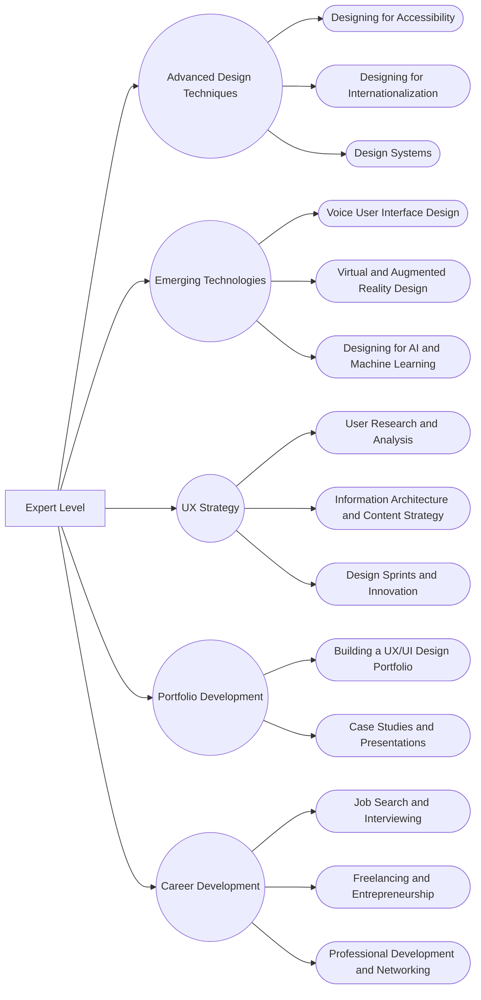

# UI/UX Design Learning Guide

> Roadmap to becoming a UI/UX Designer

This repository contains a curated list of resources to help you learn about User Interface and User Experience design. The learning guide is divided into three levels: Beginner, Intermediate, and Expert, and includes a wide range of resources such as articles, tutorials, videos, and courses. Whether you're just starting or looking to expand your knowledge, this guide has something for everyone. So, come explore and enhance your skills in UI/UX design! 🎨

&nbsp;&nbsp;&nbsp;

 <h3>Overview</h3>

 
  
 📚 A comprehensive user interface and user experience learning resource for beginners, intermediates and experts. 

         
  

&nbsp;&nbsp;&nbsp;

# Table of Contents
- **[Beginner Level](#beginner-level)**
    * [Introduction to User Experience Design](#introduction-to-user-experience-design)
      * [What is UX Design?](#what-is-ux-design)
      * [The Importance of UX Design](#the-importance-of-ux-design)
      * [User-Centered Design](#user-centered-design)
    * [Fundamentals of User Interface Design](#fundamentals-of-user-interface-design)
      * [What is UI Design?](#what-is-ui-design)
      * [UI Design Best Practices](#ui-design-best-practices)
      * [Designing for Mobile](#designing-for-mobile)
    * [Introduction to Design Tools](#introduction-to-design-tools)
      * [Introduction to Design Tools](#introduction-to-design-tools-1)
      * [Getting Started with Figma, Sketch or XD](#getting-started-with-figma-sketch-or-xd)
    * [Visual Design Fundamentals](#visual-design-fundamentals)
      * [Typography](#typography)
      * [Color Theory](#color-theory)
      * [Layout and Composition](#layout-and-composition)
- **[Intermediate Level](#intermediate-level)**
    * [User Research](#user-research)
      * [Introduction to User Research](#introduction-to-user-research)
      * [Creating User Personas](#creating-user-personas)
      * [User Journey Mapping](#user-journey-mapping)
      * [User Testing and Heuristics Evaluation](#user-testing-and-heuristics-evaluation)
    * [Information Architecture and Interaction Design](#information-architecture-and-interaction-design)
      * [Information Architecture](#information-architecture)
      * [Interaction Design](#interaction-design)
      * [Microinteractions](#microinteractions)
    * [Prototyping](#prototyping)
      * [Introduction to Prototyping](#introduction-to-prototyping)
      * [Wireframing and Low-Fidelity Prototyping](#wireframing-and-low-fidelity-prototyping)
      * [High-Fidelity Prototyping](#high-fidelity-prototyping)
    * [Design Thinking](#design-thinking)
      * [Design Thinking Process](#design-thinking-process)
      * [Design Critique](#design-critique)
- **[Expert Level](#expert-level)**
    * [Advanced Design Techniques](#advanced-design-techniques)
      * [Designing for Accessibility](#designing-for-accessibility)
      * [Designing for Internationalization](#designing-for-internationalization)
      * [Design Systems](#design-systems)
    * [Emerging Technologies](#emerging-technologies)
      * [Voice User Interface Design](#voice-user-interface-design)
      * [Virtual and Augmented Reality Design](#virtual-and-augmented-reality-design)
      * [Designing for AI and Machine Learning](#designing-for-ai-and-machine-learning)
    * [UX Strategy](#ux-strategy)
      * [User Research and Analysis](#user-research-and-analysis)
      * [Information Architecture and Content Strategy](#information-architecture-and-content-strategy)
      * [Design Sprints](#design-sprints)
    * [Portfolio Development](#portfolio-development)
      * [Building Projects for your UX/UI Design Portfolio](#building-projects-for-your-uxui-design-portfolio)
      * [Case Studies and Presentations](#case-studies-and-presentations)
    * [Career Development](#career-development)
      * [Job Search and Interviewing](#job-search-and-interviewing)
      * [Freelancing and Entrepreneurship](#freelancing-and-entrepreneurship)
      * [Professional Development and Networking](#professional-development-and-networking)

&nbsp;&nbsp;&nbsp;

## Beginner Level
> The Beginner Level is designed for those who are just starting out in the field of User Experience and User Interface design. The resources in this section will help you get a basic understanding of the field and provide you with the necessary skills to get started.

 <h4> Beginner Level - Curriculum</h4> 

**
<a href="#table-of-contents"> ⬆️ Back to Top</a>
**

&nbsp;&nbsp;&nbsp;

### Introduction to User Experience Design
> User Experience Design is the process of creating products that provide meaningful and relevant experiences to users. This section will help you learn about the fundamentals of UX design and the importance of user-centered design.

#### What is UX Design?
> “A person's perceptions and responses that result from the use or anticipated use of a product, system or service.” — ISO 9241-210, Ergonomics of human-system interaction—Part 210: Human-centered design for interactive systems
##### Goals
| Goal | Description |
| --- | --- |
| **Understand** | Learn about the field of UX design and the role of a UX designer. |
| **Learn** | Learn about the importance of user experience design in the digital world. |
| **Differentiate** | Learn to differentiate between "Good" and "Bad" UX design. |

**
<a href="#table-of-contents"> ⬆️ Back to Top</a>
**

##### Books
| Title | Author | Description | Download Link |
| --- | --- | --- | --- |
| **UX For Dummies** | Chesnut, Donald, Nichols, Kevin P | Get up to speed quickly on the latest in user experience strategy and design UX For Dummies is a hands-on guide to developing and implementing user experience strategy. | [Download](https://mega.nz/file/CPgXSDgJ#_tKsldw8mU7lRJnZfOXGryC1s641dTdvvE3TIrkVo48) |
| **UX Fundamentals for Non-UX Professionals: User Experience Principles for Managers, Writers.** | Edward Stull | This book enables you to participate fully in discussions about UX, as you discover the fundamentals of user experience design and research. | [Download](https://www.pdfdrive.com/ux-fundamentals-for-non-ux-professionals-user-experience-principles-for-managers-writers-designers-and-developers-e195284370.html) |
| **Smashing UX Design: Foundations for Designing Online User Experiences** | Jesmond Allen &  James Chudley | Smashing UX Design is a practical guide to the fundamentals of UX design. | [Download](https://www.pdfdrive.com/smashing-ux-design-foundations-for-designing-online-user-experiences-e178098950.html) |
| **UX Design Principle Fundamentals for Non-Designers.** | Billy Edwards | UX Fundamentals for Non-UX Professionals serves the needs of project managers, graphic designers, copyeditors, marketers, and others who wish to understand UX Design. | [Download](https://www.pdfdrive.com/ux-design-principle-fundamentals-for-non-designers-e17862156.html) |

**
<a href="#table-of-contents"> ⬆️ Back to Top</a>
**

##### Articles
| Title | Author | Description | Link |
| --- | --- | --- | --- |
| **What is UX Design?** | UX Planet | UX Design primarily focuses on understanding and improving the interaction users have with a tool or product. | [Read](https://uxplanet.org/what-is-ux-design-bb02fc45aba5) |
| **What is user experience (UX) design?** | UsabilityHub | Learn all about UX design, and the skills you need to become a UX designer, in this comprehensive guide. | [Read](https://usabilityhub.com/blog/what-is-user-experience-design) |
| **What is User Experience (UX) Design?** | Interaction Design Foundation| User experience (UX) design is the process design teams use to create products that provide meaningful and relevant experiences to users. | [Read](https://www.interaction-design.org/literature/topics/ux-design) |
| **An Introduction to User Experience Design** | Ben Ralph | The deceptively tricky challenge of designing for user behavior | [Read](https://medium.com/beakerandflint/an-introduction-user-experience-design-2a7f8167bf03)
| **Laws of UX** | Laws of UX | Laws of UX is a collection of 100+ UX laws, principles, and patterns for designing better digital products. | [Read](https://lawsofux.com/) |
| **UI, UX: Who Does What? A Designer’s Guide To The Tech Industry.** | Lo Min Ming | This article will help you understand the difference between UI and UX design, and how they work together to create a great user experience. | [Read](https://www.fastcompany.com/3032719/ui-ux-who-does-what-a-designers-guide-to-the-tech-industry) |
| **An Introduction to User Experience Design.**  | HackDesign Authors |You'll get an idea of how designers think, and how diverse the design disciplines are.  | [Reading List](https://hackdesign.org/lessons#user-experience) |

**
<a href="#table-of-contents"> ⬆️ Back to Top</a>
**

##### Videos
| Title | Author | Description | Link |
| --- | --- | --- | --- |
| **UX Crash Course - Getting Started in User Experience Design** | Jesse Showalter | User experience design (UX, UXD) is the process of enhancing user satisfaction with a product by improving the usability, accessibility, and pleasure provided in the interaction with the product. | [Watch](https://www.youtube.com/watch?v=_lyzy-vChh4) |
| **What Is UX Design? - An Introduction (Full Guide For 2023)** | CareerFoundry | In this video, we give you a quick overview of the term UX Design, share some of the key concepts and ideas involved. | [Watch](https://www.youtube.com/watch?v=ziQEqGZB8GE) |
| **The Laws of UX - 19 Psychological Design Principles** | Joseph | The Laws of UX is a collection of 100+ UX laws, principles, and patterns for designing better digital products. | [Watch](https://www.youtube.com/watch?v=fYs2Mdyasuc) |
| **UX Design vs UI Design - What's The Difference? (2023)** | CareerFoundry | What’s the difference between UX and UI design? What will you be doing as a user experience designer, or a user interface designer? In this video, we delve into these two in-demand design roles, sharing key definitions, responsibilities, similarities and differences. | [Watch](https://www.youtube.com/watch?v=5CxXhyhT6Fc) |

**
<a href="#table-of-contents"> ⬆️ Back to Top</a>
**

#### The Importance of UX Design
> To put it simply, UX is important because it tries to fulfill the user's needs. It aims to provide positive experiences that keep users loyal to the product or brand. Additionally, a meaningful user experience allows you to define customer journeys on your website that are most conducive to business success.

##### Goals
| Goal | Description |
| --- | --- |
| **Understand** | Understand how to provide a positive experience for the user. |
| **Learn** | Learn to understand the user's needs and goals. |
| **Write** | Write a plan on how to improve the user experience of a product. |
| **Discuss** | Discuss the importance of UX design. |

**
<a href="#table-of-contents"> ⬆️ Back to Top</a>
**

##### Books 
| Title | Author | Description | Link |
| --- | --- | --- | --- |
| **The UX Book: Process and Guidelines for Ensuring a Quality User Experience** | Rex Hartson & Pardha Pyla | The UX Book: Process and Guidelines for Ensuring a Quality User Experience aims to help readers learn how to create and refine interaction designs that ensure a quality user experience (UX).  | [Download](https://www.pdfdrive.com/the-ux-book-process-and-guidelines-for-ensuring-a-quality-user-experience-e165941504.html) |
| **The Basics of User Experience Design** | Interaction Design Foundation | The Basics of User Experience Design is a practical guide to the fundamentals of UX design. | [Download](https://mega.nz/file/3DBlXL4I#lKiMEnpmPWMJbng3r1xQ_S1ShCkAACHFjUaNpofk4J0) |

**
<a href="#table-of-contents"> ⬆️ Back to Top</a>
**

##### Articles
| Title | Author | Description | Link |
| --- | --- | --- | --- |
| **What is UX Design? 15 user experience design to weigh in** | UserTesting | User Experience Design (UXD or UED) is a design process whose sole objective is to design a system that offers a great experience to its users. | [Read](https://www.usertesting.com/blog/what-is-ux-design-15-user-experience-experts-weigh-in) |
| **The Importance of UX Design** | Rocket55 | In today’s industry of rapidly growing interfaces, UX design has become increasingly important. The UX team at Rocket55 are here to explain what “User Experience” is all about. | [Read](https://www.rocket55.com/lab-note/the-importance-of-user-experience) |
| **The Importance of User Experience Design** | UX Planet | User experience design is a process that aims to improve the quality of interaction between the user and the product. | [Read](https://uxplanet.org/the-importance-of-user-experience-design-988faf6ddca2) |
| **What is UX (User Experience) and why is it important?** | Workshopper | UX Design focuses heavily on having a deep understanding of users, what they need, what they value, their abilities, and their limitations. | [Read](https://www.workshopper.com/post/what-is-ux-and-why-is-it-important) |
| **Why Is UX Design Important - 5 Important Arguments** | Resolute Software | Learn why UX design is important and how it can help you build a better product. | [Read](https://www.resolutesoftware.com/news/why-is-ux-design-important/) |
| **Why UX is IMPORTANT!** | Anisha Swain | For a designer, User experience(UX) design is the process to create products which provide meaningful, relevant and flexible experiences to users. | [Read](https://medium.com/the-ui-girl/why-ux-is-important-a6d9b9abb378) |

**
<a href="#table-of-contents"> ⬆️ Back to Top</a>
**

##### Videos
| Title | Author | Description | Link |
| --- | --- | --- | --- |
| **Why UX Design is Important** | Interaction Design Foundation | User experience design is a process that aims to improve the quality of interaction between the user and the product. | [Watch](https://www.youtube.com/watch?v=-XvfcBpwVGY)|
| **Humans, not Users: Why UX is a Problem** | Johannes Ippen | UX is a problem. It is time for UX design to step up and evolve. | [Watch](https://www.youtube.com/watch?v=dpXBV3COwJM) |
| **The Importance of UX Design** | SheStarts | Watch this interview with UX design guru Jonathan Steingiesser, Lead UX Researcher at MYOB | [Watch](https://www.youtube.com/watch?v=mhYkfcEhHVA) |

**
<a href="#table-of-contents"> ⬆️ Back to Top</a>
**

#### User-Centered Design
> User-centered design (UCD) is a design approach that focuses on the needs, wants, and limitations of the people who use a product. It is a process that involves the user at every step of the design process.

##### Goals
| Goal | Description |
| --- | --- |
| **Understand** | Understand how to provide a positive experience for the user. |
| **Learn** | Learn how to design products that are centered around the user by empathizing with them. |
| **Plan** | Plan a user-centered design process. |

**
<a href="#table-of-contents"> ⬆️ Back to Top</a>
**

##### Books
| Title | Author | Description | Link |
| --- | --- | --- | --- |
| **Fundamentals of User-Centered Design** | Brian Still, Kate Crane | This book explains in-depth on what that UCD to usability and User Experience (UX) principles and best practices | [Download](https://mega.nz/file/jOIWiKRY#YmyW6DYhcwHlloq4TwaU1dklU32kU7chokgKowhY-Hg) |
| **User-centered design: A developer's guide to building user-friendly applications** | Travis Lowdermilk | You’ll learn valuable strategies for conducting each stage of the design process, from interviewing likely users and discovering your application’s purpose to creating a rich user experience with sound design principles. | [Download](https://www.pdfdrive.com/user-centered-design-a-developers-guide-to-building-user-friendly-applications-e157676576.html) |
| **User-Centered Design Stories: Real-World UCD Case Studies** | Carol Righi, Janice James | In this book, the reader is asked to perform analysis of dozens of UCD work situations and propose solutions for the problem set.. | [Download](https://mega.nz/file/6fgD0JaC#9B8G_5943J1wvvUjCtZaZBvzjPGfEp-W5x9YspCjVD8) |

**
<a href="#table-of-contents"> ⬆️ Back to Top</a>
**

##### Articles
| Title | Author | Description | Link |
| --- | --- | --- | --- |
| **User Centered Design** | Wikipedia| (User) Human-centered design is an approach to interactive system development that focuses specifically on making systems usable. | [Read](https://en.wikipedia.org/wiki/User-centered_design) |
| **What is User Centered Design?n** | Interaction Design Foundation | User-centered design (UCD) is an iterative design process in which designers focus on the users and their needs in each phase of the design process. | [Read](https://www.interaction-design.org/literature/topics/user-centered-design) |
| **User-Centered Design Basics?** | Usability | The User-centered design (UCD) process outlines the phases throughout a design and development life-cycle all while focusing on gaining a deep understanding of the user. | [Read](https://uxplanet.org/what-is-user-centered-design-1b0e1e5e2e2) |
| **User Centered Design Principles & Methods** | Adobe | User-centered design (UCD) is a collection of processes that focus on putting users at the center of product design and development. | [Read](https://xd.adobe.com/ideas/principles/human-computer-interaction/user-centered-design/) |
| **What Is User-Centered Design? [Beginner's Guide]?** | CareerFoundry | User-centered design is an approach to design that puts users' needs front and center and follows an iterative design process that focuses on user feedback. | [Read](https://careerfoundry.com/en/blog/ux-design/user-centered-design/) |
| **How to Conduct User-Centered Design [Step-by-Step Guide]** | CareerFoundry | User-centered design is an approach to design that puts users' needs front and center and follows an iterative design process that focuses on user feedback. | [Read](https://careerfoundry.com/en/blog/ux-design/user-centered-design-how-to-guide/) |

**
<a href="#table-of-contents"> ⬆️ Back to Top</a>
**

##### Videos
| Title | Author | Description | Link |
| --- | --- | --- | --- |
| **What is User Centred Design** | Robert Elding | What is UCD, and what is the difference between UX, CX and UI design. How do they influence the design and development of your digital product or service and ultimately impact your sales funnel.  | [Watch](https://www.youtube.com/watch?v=BTVLmf0Z6EY) |
| **What is Human-Centered Design?** | Interaction Design Foundation | What is human-centered design, and why is the "human" aspect so crucial to the design process? Learn how to run and promote a truly human-centered design process. | [Watch Playlist](https://www.youtube.com/playlist?list=PLlgPXNRcnX3EwTKcoml8ybuu3RqQIXoiN) |

**
<a href="#table-of-contents"> ⬆️ Back to Top</a>
**

### Fundamentals of User Interface Design
> User interface design (UI) is the process of designing interfaces in software or computerized devices with the focus on looks or style. The goal of this design is to maximize the ease of use for the people using the product.

#### What is UI Design?
> User interface (UI) design is the process designers use to build interfaces in software or computerized devices, focusing on looks or style.

##### Goals
| Goal | Description |
| --- | --- |
| **Understand** | Understand the fundamentals of UI design. |
| **Learn** | Learn how to design a user interface. |
| **Plan** | Plan a UI design process. |

**
<a href="#table-of-contents"> ⬆️ Back to Top</a>
**

##### Books
| Title | Author | Description | Link |
| --- | --- | --- | --- |
| **Designing Interfaces** | Jenifer Tidwell | Learn how to design interfaces that are usable, useful, and desirable. | [Download](https://www.pdfdrive.com/designing-interfaces-e34330053.html) |
| **Don't Make Me Think: A Common Sense Approach to Web Usability** | Steve Krug | Understand the principles of approaching web design from a user's perspective. |[Download](https://www.pdfdrive.com/dont-make-me-think-revisited-e33494890.html) |
| **Designing with the Mind in Mind: Simple Guide to Understanding User Interface Design Rules** | Jeff Johnson | Designing with the Mind in Mind is a book about user interface design. |  [Download](https://www.pdfdrive.com/designing-with-the-mind-in-mind-a-simple-guide-to-understanding-user-interface-design-rules-e158581207.html) |
| **Fundamentals of Good UI Design** | Uday Gajendar | Understand the fundamentals of UI design. | [Download](http://udanium.com/misc/svcc11_UIfundamentals_v3.pdf) |

**
<a href="#table-of-contents"> ⬆️ Back to Top</a>
**

##### Articles
| Title | Author | Description | Link |
| --- | --- | --- | --- |
| **What is UI Design?** | Wikipedia | User interface design (UI) is the process of designing interfaces in software or computerized devices with the focus on looks or style. The goal of this design is to maximize the ease of use for the people using the product. | [Read](https://en.wikipedia.org/wiki/User_interface_design) |
| **User Interface (UI) Design** | Interaction Design Foundation | User interface (UI) design is the process designers use to build interfaces in software or computerized devices, focusing on looks or style. Designers aim to create interfaces which users find easy to use and pleasurable.| [Read](https://www.interaction-design.org/literature/topics/ui-design) |
| **What is UI Design?** | UX Design Institute | What is user interface (UI) design, and how is it different from UX? What is the UI design process? Learn everything you need to know about UI design here. | [Read](https://www.uxdesigninstitute.com/blog/what-is-ui-design/) |
| **What Is UI Design? Definition, Tips, Best Practices** | Coursera | UI stands for user interface. It is the point of contact between humans and computers. Any technology you interact with as a user is part of the user interface. | [Read](https://www.coursera.org/articles/ui-design) |
| **What is UI Design?** | CareerFoundry | User interface (UI) design is an incredibly broad, multidisciplinary, and creative field. Good UI design is increasingly recognized as an essential tool to increase user engagement and create products that are both useful and visually pleasing.| [Read](https://careerfoundry.com/en/blog/ux-design/what-is-ui-design/) |
| **What is Design Thinking?** | Ideou | How design thinking can help you transform the way you develop products, services, processes, and organizations. | [Read](https://www.ideou.com/blogs/inspiration/what-is-design-thinking) |
| **What Is Design Thinking? A Comprehensive Beginner's Guide** | CareerFoundry | Design thinking is both an ideology and a process, concerned with solving complex problems in a highly user-centric way. | [Read](https://careerfoundry.com/en/blog/ux-design/what-is-design-thinking-everything-you-need-to-know-to-get-started/) |

**
<a href="#table-of-contents"> ⬆️ Back to Top</a>
**

##### Videos
| Title | Author | Description | Link |
| --- | --- | --- | --- |
| **What Is User Interface (UI)?** | Codecademy | User interfaces (UIs) are what allow us to interact with and navigate through our favorite programs and devices. Every time you click a button on a website or swipe to a different screen, you're engaging with UI. | [Watch](https://www.youtube.com/watch?v=Z-BO6IYTgJg) |
| **User Interface (UI) Design Principles Series Introduction** | Brendan Colarusso | In this video, I explain how I came to my list of 12 UI Principles that we will be going over in depth in this series over the next few weeks. Check out the resources below to start learning about these principles.  | [Watch](https://www.youtube.com/watch?v=FmSjtWTIx1o) |
| **The 2019 UI Design Crash Course for Beginners** | DesignCourse | What is user interface (UI) design, and how is it different from UX? What is the UI design process? Learn everything you need to know about UI design here. | [Watch](https://www.youtube.com/watch?v=_Hp_dI0DzY4) |
| **UI Design Tutorial For Beginners** | Antony Conboy | Take your first steps in the world of User Interface (UI) design with this beginner-friendly tutorial. From understanding the basics of UI design to creating wireframes, prototypes, and high-fidelity mockups, we'll guide you through the process.| [Watch](https://www.youtube.com/watch?v=_K06Dni-RE4) |
| **Design Thinking Full Course, Design Thinking Process, Design Thinking For Beginners** | Simplilearn | Design thinking is a human-centered approach to problem solving that helps you understand the needs of people and develop innovative solutions. | [Watch](https://www.youtube.com/watch?v=Q5YjZzqLc-4) |In this design thinking tutorial, we will be looking at what is design thinking, why design thing is important,  steps of design thinking, empathy mapping, five phases and four pillars of design thinking and agile methodology with design thinking. | [Watch](https://www.youtube.com/watch?v=4nTh3AP6knM) |

**
<a href="#table-of-contents"> ⬆️ Back to Top</a>
**

#### UI Design Best Practices
> UI Design Best Practices are the guidelines that help you create a user interface that is easy to use, intuitive, and visually appealing. These best practices are based on the principles of user-centered design and usability. Use design thinking to understand the user's needs and goals, and then use these best practices to create a user interface that meets those needs.

##### Goals
| Goal | Description |
| --- | --- |
| **Learn** | Learn the best practices of UI design. |
| **Understand** | Understand how they impact the user experience. |
| **Practice** | Practice the best practices of UI design in your projects. |

**
<a href="#table-of-contents"> ⬆️ Back to Top</a>
**

##### Books
| Title | Author | Description | Link |
| --- | --- | --- | --- |
| **The Essential Guide to User Interface Design** | Wilbert O. Galitz | This book explains in-depth on what that UI design is and how to design a user interface. | [Download](https://www.pdfdrive.com/the-essential-guide-to-user-interface-design-e25513495.html) |
| **Web UI Design Best Practices** | Chris Bank & Jerry Cao| This book is a collection of the best practices of web UI design. | [Download](https://www.pdfdrive.com/web-ui-design-best-practices-e20455471.html) |

**
<a href="#table-of-contents"> ⬆️ Back to Top</a>
**

##### Articles
| Title | Author | Description | Link |
| --- | --- | --- | --- |
| **User Interface Design Basics** | Usability| User Interface (UI) Design focuses on anticipating what users might need to do and ensuring that the interface has elements that are easy to access, understand, and use to facilitate those actions. | [Read](https://www.usability.gov/what-and-why/user-interface-design.html) |
| **The 4 Golden Rules of UI Design** | Adobe | The user interface (UI) is a critical part of any software product. When it’s done well, users don’t even notice it. | [Read](https://uxplanet.org/ui-design-best-practices-1d10d73d2d9b) |
| **10 Fundamental UI Design Principles You Need to Know** | Renee Fleck | Most users only notice the UI design of an app or software when something goes wrong. For this reason, we can say that good UI design is almost invisible, leaving the user free to get down to work without interruption. | [Read](https://dribbble.com/resources/ui-design-principles) |
| **27 UI/UX Design Principles and Best Practices 2021** | 729solutions | Great design goes a long way. The experience visitors have with your website sets the stage for their relationship with your product, your company, and your brand.| [Read](https://729solutions.com/ux-ui-best-practices/) |
| **UI Design Best Practices and Common Mistakes** | UX Planet | The most progressive and interesting designers steer clear of visually stale design solutions and ditch restrictive rules by learning UI design best practices and avoiding common design mistakes. 🔊 | [Read](https://www.toptal.com/designers/ui/most-common-ui-design-mistakes) |

**
<a href="#table-of-contents"> ⬆️ Back to Top</a>
**

##### Videos
| Title | Author | Description | Link |
| --- | --- | --- | --- |
| **4 Foundational UI Design Principles - C.R.A.P.** | Jesse Showalter | In this video, I'll be going over the 4 foundational UI design principles that I use to help me design better interfaces. | [Watch](https://www.youtube.com/watch?v=uwNClNmekGU) |
| **9 Tips for Becoming a GREAT UI Designer** | DesignCourse | In this video, I'll be sharing 9 tips that I've learned over the years that have helped me become a better UI designer. | [Watch](https://www.youtube.com/watch?v=_J1Le-4aXhE) |
| **UI Design Principles - Everything You Need To Know** | DesignWithArash | In this video, I'll be going over the 12 UI design principles that I use to help me design better interfaces. | [Watch](https://www.youtube.com/watch?v=NTmh8l-Xl4c)|
| **UX/UI BEST PRACTICES FOR WEB DESIGN: Free Web Design Course** | Flux Academy | This is what you need to know about UX UI design to quickly improve as a beginner. The best tip I can give you is to not make people think. Don't be original, be obvious. Don't be witty, be crystal clear.  | [Watch](https://www.youtube.com/watch?v=Cn2KgB_01mE) |

**
<a href="#table-of-contents"> ⬆️ Back to Top</a>
**

#### Designing for Mobile
> Design for Mobile is the process of designing a user interface for mobile devices. Mobile devices are handheld devices that are small and portable. They include smartphones, tablets, and smartwatches. Mobile devices are used for communication, entertainment, and productivity.

##### Goals
| Goal | Description |
| --- | --- |
| **Learn** | Learn how to design for mobile devices. |
| **Understand** | Understand how design for mobile devices impacts the user experience. |

**
<a href="#table-of-contents"> ⬆️ Back to Top</a>
**

##### Books
| Title | Author | Description | Link |
| --- | --- | --- | --- |
| **Mobile Design Pattern Gallery: UI Patterns for Smartphone App** | Theresa Neil | When you’re under pressure to produce a well-designed, easy-to-navigate mobile app, there’s no time to reinvent the wheel—and no need to. | [Download](https://www.pdfdrive.com/mobile-design-pattern-gallery-ui-patterns-for-smartphone-apps-e168465172.html) |
| **Usability Matters: Mobile-first UX for developers and other accidental designers** | Matt Lacey | Usability Matters: Mobile-first UX for developers and other accidental designers gives you practical advice and guidance on how to create attractive, elegant, and useful user interfaces for native and web-based mobile apps.. | [Download](https://www.pdfdrive.com/usability-matters-mobile-first-ux-for-developers-and-other-accidental-designers-e187434346.html) |

**
<a href="#table-of-contents"> ⬆️ Back to Top</a>
**

##### Articles
| Title | Author | Description | Link |
| --- | --- | --- | --- |
| **How to Design a Mobile App User Interface Like a Pro** | CareerFoundry |If you want to design a great, functional mobile app interface, you’re in the right place. In this guide, I’ll walk you through the key principles of mobile app design. | [Read](https://careerfoundry.com/en/blog/ui-design/how-to-design-a-mobile-app-using-user-interface-design-principles/) |
| **A Comprehensive Guide To Mobile App Design** | Nick Babich | Here are many things to consider when designing for mobile. We’re sure that this detailed guide will help you get rid of that headache when building apps. | [Read](https://www.smashingmagazine.com/2018/02/comprehensive-guide-to-mobile-app-design/) |
| **8 rules of mobile design** | UX Collective | Mobile user experience (UX) design refers to the design of positive experiences during the use of mobile devices and wearables, and applications or services running on such devices. — Interaction Design Foundation | [Read](https://uxdesign.cc/8-rules-of-mobile-design-1b8d9936c241) |
| **10 Do’s and Dont’s of Mobile App Design** | Nick Babic | Mobile design can be a tricky subject, with many things to consider when creating a mobile app. To simplify the task, I’ve prepared some highly practical tips on what you should and what you shouldn’t do when designing mobile apps.  | [Read](https://xd.adobe.com/ideas/principles/app-design/10-dos-donts-mobile-app-design/) |

**
<a href="#table-of-contents"> ⬆️ Back to Top</a>
**

##### Videos
| Title | Author | Description | Link |
| --- | --- | --- | --- |
| **How to design a mobile app tutorial - a step by step guide** | Malewicz | Here's another part of our design super-basics free course. Today I'll show you a step by step guide on how to start your first mobile app project. This is perfect for beginners and junior designers who want to have a good template to begin their projects with.  | [Watch](https://www.youtube.com/watch?v=0ul5UATkUiA) |
| **Revamping 3 Mobile Designs - Rapid ReDesigns** | DesignCourse | We're here with another edition of the UI/UX Workshop where I revamp 3 user-submitted designs. For this edition, I've chosen 3 mobile UI's just to show that the process is all the same regardless of design dimensions | [Watch](https://www.youtube.com/watch?v=k44OFRWvul8) |

**
<a href="#table-of-contents"> ⬆️ Back to Top</a>
**

### Introduction to Design Tools
> Design Tools are software applications that help you create a design. These tools help you create wireframes, mockups, prototypes, and other design deliverables. They also help you collaborate with your team and clients.

#### Introduction to Design Tools
> Design Tools are software applications that help you create a user interface. These tools help you create wireframes, mockups, prototypes, and other UI design deliverables. They also help you collaborate with your team and clients.

##### Goals
| Goal | Description |
| --- | --- |
| **Learn** | Learn the best UI design tools. |
| **Understand** | Understand how to use them. |
| **Practice** | Practice using the UI design tools to build your projects. |

**
<a href="#table-of-contents"> ⬆️ Back to Top</a>
**

##### Softwares
| Title | Description | Link | Free |
| --- | --- | --- | --- |
| **Figma** | Figma is a vector graphics editor and prototyping tool which is primarily web-based. | [Visit](https://www.figma.com/) | ✅ |
| **Adobe XD** | Adobe XD is a vector-based user experience design tool for web apps and mobile apps, developed and published by Adobe Inc. | [Visit](https://helpx.adobe.com/xd/get-started.html) | ✅ |
| **Sketch** | Sketch is a vector graphics editor and prototyping tool which is primarily web-based. | [Visit](https://www.sketch.com/) | ❌ |
| **InVision** | InVision is a digital product design platform used for creating prototypes, managing user feedback, and designing and building user interfaces. | [Visit](https://www.invisionapp.com/) | ✅ |
| **ProtoPie** | ProtoPie is a prototyping tool for mobile apps. | [Visit](https://www.protopie.io/) | ✅ |
| **Marvel** | Marvel is a prototyping tool for mobile apps. | [Visit](https://marvelapp.com/) | ✅ |
| **Principle** | Principle is a prototyping tool for mobile apps. | [Visit](https://principleformac.com/) | ✅ |
| **Framer** | Framer is a prototyping tool for mobile apps. | [Visit](https://framer.com/) | ✅ |
| **Adobe Photoshop** | Adobe Photoshop is a raster graphics editor developed and published by Adobe Inc. for macOS and Windows. | [Visit](https://www.adobe.com/products/photoshop.html) | ❌ |

**
<a href="#table-of-contents"> ⬆️ Back to Top</a>
**

#### Getting Started with Figma, Sketch or XD

##### Articles
| Title | Author | Description | Link |
| --- | --- | --- | --- |
| **The Figma Design Tool Handbook** | DesignCode | A comprehensive guide to the best tips and tricks in Figma | [Reading List](https://designcode.io/figma-handbook) |
| **The Figma Learning Guide** | Figma | Kick start your design education with these 12 lessons | [Reading List](https://www.figma.com/resources/learn-design/lessons/) |
| **Get Started with Adobe XD: Design.** | Adobe XD | Get started using Adobe XD, the powerful platform for creating user experiences — all at the speed of thought.| [Reading List](https://www.adobe.com/products/xd/learn/get-started-xd-design.html) |

**
<a href="#table-of-contents"> ⬆️ Back to Top</a>
**

##### Videos
| Title | Author | Description | Link |
| --- | --- | --- | --- |
| **New to Figma? Get started with "Figma for beginners" tutorials** | Figma | f you’re brand new to Figma or design tools, check out this playlist for a quick tour of key features as we take you through a rough approximation of the design process, and design a mobile app together. | [Watch Playlist](https://www.youtube.com/playlist?list=PLXDU_eVOJTx7QHLShNqIXL1Cgbxj7HlN4) |
| **Figma UI Design Tutorial: Get Started in Just 24 Minutes!** | AJ&Smart | Do you want to learn Figma but don’t know where to start? Well, if you follow this step-by-step tutorial, it will only take you 24 minutes to learn all the basics you need to know to start designing apps and websites in Figma. | [Watch](https://www.youtube.com/watch?v=8gmdqejK0HI) |
| **Figma Tutorial for Beginners** | DesignCourse | In this video, I'll be going over the basics of Figma and how to use it to create a simple website design. | [Watch](https://www.youtube.com/watch?v=3q3FV65ZrUs) |
| **Figma tutorial for Beginners: Complete Website from Start to Finish** | Flux Academy | Learn how to use Figma to design a website from start to finish. | [Watch](https://www.youtube.com/watch?v=HZuk6Wkx_Eg) |
| **UI Design Live: UI Patterns, Visual Hierarchy and Iterations** | DesignCourse | How we can take one UI and make multiple iterations of it by looking at different UI patterns and visual hierarchy. | [Watch](https://www.youtube.com/watch?v=D1pO4AQTfes&t=68s) |
| **Intro to Sketch for Beginners - Sketch Tutorial (2020)** | Joseph | In this video, I'll be going over the basics of Sketch and how to use it to create a simple website design. | [Watch](https://www.youtube.com/watch?v=3q3FV65ZrUs) |
| **Learn Adobe XD in 2021 by Example (Crash Course)** | DesignCourse | Today, we're going to step back into the world of UI/UX design and cover one of the most popular UI/UX design and prototyping tools: Adobe Experience Design (Adobe XD). You're going to learn all major features of this powerful app in crash course format, all while doing so by creating a UI for a fictional business. | [Watch](https://www.youtube.com/watch?v=3rQ-eTmWah0) |
| **Adobe XD Tutorials** | Dansky | Learn how to use Adobe XD to design and prototype websites and mobile apps. | [Watch Playlist](https://www.youtube.com/playlist?list=PLkiM1tZke4mivrZRPcqp_8oHFxlD8-IP5) |
| **Free Adobe XD Tutorial: User Experience Design Course with Adobe XD Course** | Bring Your Own Laptop | Free Adobe XD Tutorial Course from the full course: User Experience Design Essentials - Adobe XD UI UX Design. | [Watch](https://www.youtube.com/watch?v=68w2VwalD5w) |

**
<a href="#table-of-contents"> ⬆️ Back to Top</a>
**

##### Courses
| Title | Author | Description | Link |
| --- | --- | --- | --- |
| **Figma Course** | DesignCourse | Learn how to use Figma to design websites and mobile apps. | [Enroll](https://learnux.io/course/figma) |
| **Figma for Beginners** | Coursera | Learn to build pages and frames, add text and images, and use the Figma interface. | [Enroll](https://www.coursera.org/projects/get-started-figma) |
| **XD for Beginners** | Udemy | Learn how to use Adobe XD to design and prototype websites and mobile apps. | [Download](https://drive.google.com/uc?export=download&id=1a8cdPXu95U6cONltDqcTM8oVztaqFuPZ) | 
| **Figma Mastery** | Udemy | Master Figma and learn how to design websites and mobile apps. | [Download](https://drive.google.com/uc?export=download&id=1B-sZhBPvgaxlOInLFSUZM9M4rvYG88n0) |
| **Learn Figma for UI UX Design (with a Design Project)** | Udemy | Learn the Figma's Essentials for UI/UX Design from a Sr. Designer with 8+ Years of Experience | [Download](https://www.udemy.com/course/learn-figma-ui-ux-design-project/) |
| **9 Best FREE Figma Courses (2023)** | UntitledUI | Getting started in Figma and design? We've scoured the internet for the best free Figma courses to kickstart your 2023 design career. | [Resource List](https://www.untitledui.com/blog/best-free-figma-courses) |
| **Free Adobe XD Courses** | ClassCentral | Learn Adobe XD, earn certificates with paid and free online courses from Coursera, Treehouse, YouTube and other top learning platforms around the world. Read reviews to decide if a class is right for you. | [Resource List](https://www.udemy.com/course/figma-for-beginners/) |
| **Sketch App Course** | LearnUX | Sketch is an application which has already won the hearts of UI and UX designers around the world, even though just about anybody can learn how to use it. | [Enroll](https://learnux.io/course/sketch) |
| **9 Best Sketch Courses to Take in 2023** | ClassCentral | The best courses (including free ones) to create digital products and collaborate with Sketch, the design tool for designers and developers. | [Resource List](https://www.classcentral.com/report/best-sketch-courses/) |

**
<a href="#table-of-contents"> ⬆️ Back to Top</a>
**

### Visual Design Fundamentals
> The elements, or principles, of visual design include Contrast, Balance, Emphasis, Movement, White Space, Proportion, Hierarchy, Repetition, Rhythm, Pattern, Unity, and Variety. These principles of design work together to create something that is aesthetically pleasing and optimizes the user experience.

#### Typography
> Typography is the art and technique of arranging type to make written language legible, readable, and appealing when displayed. The arrangement of type involves selecting typefaces, point sizes, line lengths, line-spacing (leading), and letter-spacing (tracking), and adjusting the space between pairs of letters (kerning).

##### Goals
| Goal | Description |
| --- | --- |
| **Learn** | Learn the fundamentals of typography. |
| **Understand** | Understand the importance of typography and how it improves legibility, readability, and aesthetics. |
| **Practice** | Practice typography by creating a sense of hierarchy, emphasis, and consistency. |

**
<a href="#table-of-contents"> ⬆️ Back to Top</a>
**

##### Books
| Title | Author | Description | Link |
| --- | --- | --- | --- |
| **The New Web Typography: Create a Visual Hierarchy with Responsive Web Design** | Stephen Boss & Jason Cranford Teague| The New Web Typography: Create a Visual Hierarchy with Responsive Web Design shows you how to implement web-safe fonts to create visually appealing and multi-browser-friendly websites while encouraging you to develop designs that express your own unique typographic voice.| [Download](https://www.pdfdrive.com/the-new-web-typography-create-a-visual-hierarchy-with-responsive-web-design-e187576474.html) |
| **Thinking with Type: A Critical Guide for Designers, Writers, Editors, & Students** | Ellen Lupton | A classic introduction to type design and typography, Thinking with Type is a must-have for anyone who works with words. | [Download](https://www.pdfdrive.com/thinking-with-type-a-critical-guide-for-designers-writers-editors-students-e188496995.html) |
| **The Anatomy of Type: A Graphic Guide to 100 Typefaces** | Stephen Cole | The Anatomy of Type explores one hundred traditional and modern typefaces in loving detail, with a full spread devoted to each entry. | [Download](https://www.pdfdrive.com/the-anatomy-of-type-a-graphic-guide-to-100-typefaces-e194173120.html) |
| **Why Fonts Matter** | Sarah Hyndman | Discover the incredible power of fonts - how they influence your decisions, alter your perceptions, stir your emotions and change how you understand the world around you. | [Download](https://www.pdfdrive.com/why-fonts-matter-e158152177.html) |
| **Designing with Type: The Essential Guide to Typography** | James Craig | The classic Designing with Type has been completely redesigned, with an updated format and full color throughout. New information and new images make this perennial best-seller an even more valuable tool for anyone interested in learning about typography.  | [Download](https://www.pdfdrive.com/designing-with-type-the-essential-guide-to-typography-e196263733.html) |

**
<a href="#table-of-contents"> ⬆️ Back to Top</a>
**

##### Articles
| Title | Author | Description | Link |
| --- | --- | --- | --- |
| **What Is Typography, and Why Is It Important? [2023 Guide]** | CareerFoundry | Typography is the art and technique of arranging type to make written language legible, readable, and appealing when displayed. | [Read](https://careerfoundry.com/en/blog/ui-design/beginners-guide-to-typography/) |
| **The Principles of Design and Their Importance** | Toptal | The principles of design work together to create something that is aesthetically pleasing and optimizes the user experience. | [Read](https://www.toptal.com/designers/ui/principles-of-design) |
| **Breaking Down the Principles of Design (with Infographic)** | Toptal | Understanding the principles of design and how they interact is vital for both new and expert designers. Implementing them purposefully is key to creating visually appealing, functional designs. | [Read](https://www.toptal.com/designers/gui/principles-of-design-infographic) |
| **Typography for Developers** | CSS-Tricks | Typography is a huge topic, and it's easy to get lost in the weeds. This article is meant to be a high-level overview of the basics of typography. | [Read](https://css-tricks.com/typography-for-developers/) |
| **Understanding typography** | Material Design | Typography is critical in establishing hierarchy and expressing brand presence that supports an effective digital experience.. | [Read](https://m2.material.io/design/typography/understanding-typography.html) |
| **Typography design 101: a guide to rules and terms** | 99designs | What is typography design? In short, typography design is the art of arranging a message in a readable and aesthetically pleasing composition. | [Read](https://99designs.com/blog/tips/typography-design/) |

**
<a href="#table-of-contents"> ⬆️ Back to Top</a>
**

##### Videos
| Title | Author | Description | Link |
| --- | --- | --- | --- |
| **The Ultimate Guide to Typography - FREE COURSE** | Envato Tuts+ | Good typography is one of the cornerstones of good design. In The Ultimate Guide to Typography, you'll learn everything from the most basic elements of typography and common mistakes through to more complex topics like combining and choosing fonts for your projects. | [Watch](https://www.skillshare.com/classes/Typography-for-Beginners/1031507771) |
| **Typography for Developers Tutorial - Full Course** | freeCodeCamp | In this course, you'll learn all you need to know about creating good typography as a UX Designer: how to choose a typeface; what to look for when laying out type, how to create typographic hierarchy, laying out type, and creating responsive typography. | [Watch](https://www.youtube.com/watch?v=agbh1wbfJt8) |
| **Understanding Visual Hierarchy in UI Design - Live Project Follow-Along** | DesignCourse | Learn to understand visual hierarchy in UI design. | [Watch](https://www.youtube.com/watch?v=ZYs0_t_Gdhk) |

**
<a href="#table-of-contents"> ⬆️ Back to Top</a>
**

#### Color Theory
> Color theory is the practice of mixing colors to create new colors. It is also the study of how colors interact with each other and with light. Color theory is a useful tool for designers, as it helps them to create a color scheme that is visually appealing and effective.

##### Goals
| Goal | Description |
| --- | --- |
| **Learn** | Learn how to create a harmonious color scheme. |
| **Understand** | Learn how to understand the importance of color theory. |
| **Apply** | Learn how to apply color theory to your designs. |
| **Create** | Learn how to create a color scheme that is visually appealing. |
| **Experiment** | Learn how to experiment with different color schemes. |
| **Inspire** | Learn how to inspire your audience with your color scheme. |

**
<a href="#table-of-contents"> ⬆️ Back to Top</a>
**

##### Books
| Title | Author | Description | Link |
| --- | --- | --- | --- |
| **The Elements of Color** | Johannes Itten | The Elements of Color is a classic book on color theory. It is a must-have for anyone interested in learning about color theory. | [Download](https://mega.nz/file/LOJ1DJDb#5Vkv8rv9n3og2o5ikQy9AAvPoPqttabMEiTxujCrYbg) |
| **Color: A Natural History of the Palette** | Victoria, Finlay | In this vivid and captivating journey through the colors of an artist’s palette, Victoria Finlay explores the history of color, from the first cave paintings to the latest scientific research. | [Download](https://www.pdfdrive.com/color-a-natural-history-of-the-palette-e199636011.html) |
| **The Secret Lives of Color** | Kassia St. Clair | You’ll find this book to be an interesting read. A fascinating book for UI and UX designers who are interested in the history of colors from an unusual perspective. | [Download](https://www.pdfdrive.com/the-secret-lives-of-color-e60436378.html) |
| **Color: A Course in Mastering the Art of Mixing Colors** | Betty Edwards | Mastering the art of mixing colors is a skill that every artist should have. This book will help you to learn how to mix colors and create beautiful color schemes. | [Download](https://mega.nz/file/3bQSmTRY#hcmsjjr99BfdwAudP_ljgpWCjQPXgghkePkMyOr8Qqs) |
| **Interaction of Color** | Josef Albers| Conceived as a handbook and teaching aid for artists, instructors, and students, this influential book presents Albers’s singular explanation of complex color theory principles. | [Download](https://mega.nz/file/KX5E0CCR#LY6Egn8MkzUons8BvESEn4ym-jL8-2d55KaoXJGEDsc) |
| **Best Practices for Graphic Designers, Color Works: Right Ways of Applying Color in Branding** | Eddie Opara & John Cantwell | This is the go-to guide for designers as it outlines and details the essential color design skills needed to create successful, meaningful and memorable brand | [Download](https://www.pdfdrive.com/best-practices-for-graphic-designers-color-works-right-ways-of-applying-color-in-branding-wayfinding-information-design-digital-environments-and-pretty-much-everywhere-else-e185222150.html)|

**
<a href="#table-of-contents"> ⬆️ Back to Top</a>
**

##### Articles
| Title | Author | Description | Link |
| --- | --- | --- | --- |
| **What is Color Theory?** | Interaction Design Foundation | Color theory is the collection of rules and guidelines which designers use to communicate with users through appealing color schemes in visual interfaces.| [Read](https://www.interaction-design.org/literature/topics/color-theory) |
| **The Science Behind Design Color Theory** | Design Shack | Color Theory has been a subject of interest for years in the art community. The rules and guidelines hold true when working on digital projects just as much as physical items. | [Read](https://designshack.net/articles/graphics/the-science-behind-design-color-theory/) |
| **An Introduction to Color Theory and Color Palettes** | CareerFoundry | Have you ever seen a color that has immediately reminded you of a particular brand? Maybe you’ve struggled to feel relaxed in a room that has a clashing color scheme, or returned an item of clothing you got as a gift because the color wasn’t quite right.| [Read](https://careerfoundry.com/en/blog/ui-design/introduction-to-color-theory-and-color-palettes/) |
| **Color Theory for Designers – A Crash Course (with Infographic)** | Toptal | Color: It’s stunningly beautiful and maddeningly deceptive. Use this color theory field guide (with an infographic) to make lightning-quick color choices with unwavering confidence. | [Read](https://www.toptal.com/designers/visual/color-theory-for-designers) |
| **Color Theory for Designers, Part 1: The Meaning of Color** | Cameron Chapman | Let’s dive into color theory. We’ll discuss the meanings behind the different color families, and give some examples of how these colors are used. | [Read](https://www.smashingmagazine.com/2010/01/color-theory-for-designers-part-1-the-meaning-of-color/) |
| **The Ultimate UX Guide to Color Design** | Justin Baker | The Ultimate UX Guide to Color Design. How to use color in your designs to create a better user experience. [Read](https://medium.muz.li/the-ultimate-ux-guide-to-color-design-4d0a18a706ed) |
| **Color Theory: Brief Guide For Designers** | TubikStudio | The article focused on the basics of color theory and color combinations in design: learn more about color wheel, RGB, CMYK and models of color harmony. | [Read](https://blog.tubikstudio.com/color-theory-brief-guide-for-designers/) |

**
<a href="#table-of-contents"> ⬆️ Back to Top</a>
**

##### Videos
| Title | Author | Description | Link |
| --- | --- | --- | --- |
| **Color Theory for UI Design** | GCFLearnFree | In this video, you’ll learn the basics of using color in graphic design | [Watch](https://www.youtube.com/watch?v=_2LLXnUdUIc) |
| **How To Use Color — Color Basics** | The Futur Academy | What is color theory? Why do your colors look awful? How do you use color? And why is it so difficult? In this episode, Greg Gunn will teach you the basics of how color works and provide some easy tips and tricks for using it. | [Watch](https://www.youtube.com/watch?v=QkCVrNoqcBU) |
| **How to Choose Colors (Easy 3-Step Process)** | FluxAcademy | In this video, I will go over the basics of color theory and how to choose colors for your designs. | [Watch](https://www.youtube.com/watch?v=KMS3VwGh3HY) |
| **ADVANCED Colour Theory Makes Designs SUPERIOR! (With Real Examples)** | Satori Graphics | In this video, I will be going over the basics of colour theory and how to use it to make your designs look better. | [Watch](https://www.youtube.com/watch?v=XNkV6m4fosw) |
| **Super Practical Guide to Color Theory, Color Models and Perfect Color Palettes - UI Design** | DesignerUp | Maybe you’ve followed all the color harmony and color theory tutorials to a tee and generated a complementary color palette, but you notice that the colors don’t seem to match very well, perhaps they look harsh or a bit muddy and unprofessional and you don’t really know why. | [Watch](https://www.youtube.com/watch?v=GyVMoejbGFg) |
| **How to Apply a Color Palette to Your Design – Tutorial** | The Futur Academy | In this video, you’ll learn the basics of using color in graphic design. | [Watch](https://www.youtube.com/watch?v=eXcKOqviLE0) |
| **Bad at Picking COLORS? Let's fix that - RAPID Color Scheming** | DesignCourse | In this video, I will be going over the basics of color theory and how to use it to make your designs look better. | [Watch](https://www.youtube.com/watch?v=s9p3nF4rFaU) |
| **60-30-10 Color Rule** | Jesse Showalter | How do you apply color in mobile UI design projects? Here's a little tip, the 60-30-10 color rule(it's more like a guideline) will help you to get a good start to applying color in a mature and seamless way.| [Watch](https://www.youtube.com/watch?v=UWwNIMHFdW4) |

**
<a href="#table-of-contents"> ⬆️ Back to Top</a>
**

#### Layout and Composition
> Layout and composition in UI design is the arrangement of visual elements on a page. It is the art of organizing the elements of a design to create a pleasing and effective visual. The arrangement of theses elements is called composition and is the most important part of any design.

##### Goals
| Goal | Description |
| --- | --- |
| **Learn** | Learn about layout and composition in UI design. |
| **Understand** | Understand the importance of layout and composition in UI design. |
| **Apply** | Apply layout and composition in UI design. |
| **Practice** | Practice layout and composition in UI design, work with auto-layout and constraints. |

**
<a href="#table-of-contents"> ⬆️ Back to Top</a>
**

##### Books
| Title | Author | Description | Link |
| --- | --- | --- | --- |
| **Design School: Layout: A Practical Guide for Students and Designers** | Richard Poulin | It provides a comprehensive introduction to creating and changing layouts: a crucially important skill that underpins practically every aspect of graphic design. | [Download](https://www.pdfdrive.com/design-school-layout-a-practical-guide-for-students-and-designers-e195284860.html) |
| **Web Design Style Guide** | Carleton University | This guide is intended to help you create a consistent layout and feel for your web site. It is based on the principles of good design and usability. | [Download](https://apps.carleton.edu/campus/web-group/assets/Web_Design_Style_Guide_1.0.pdf) |
| **Best Practices for Graphic Designers, Grids and Page Layouts: An Essential Guide for Understanding and Applying Page Design Principles** | Amy Graver & Ben Jura | This unique, go-to guide for designers fully details the essential layout and design skills needed to succeed in this competitive industry. | [Download](https://www.pdfdrive.com/best-practices-for-graphic-designers-grids-and-page-layouts-an-essential-guide-for-understanding-and-applying-page-design-principles-e175264020.html) |
| **Modular Design Frameworks : A Projects-based Guide for UI/UX Designers** | Cabrera & James | Learn the basic principles of modular design, and then put them into action to create sites that are easy to use, look great, and can be adapted within the context of your business needs. |[Download](https://www.pdfdrive.com/modular-design-frameworks-a-projects-based-guide-for-uiux-designers-e158241077.html)|

**
<a href="#table-of-contents"> ⬆️ Back to Top</a>
**

##### Articles
| Title | Author | Description | Link |
| --- | --- | --- | --- |
| **Fundamentals of layout in user interface design (UI)** | Leonardo Moreno | Composition, balance, and how to manage a good structure. | [Read](https://uxdesign.cc/fundamentals-of-layout-in-interface-design-ui-3a9dba31f1) |
| **9 Rules of Composition For UX/UI Designers** | Inkbot Design | The rules of composition allow you to place the content in the most logical and appealing form. If you think that composition is something from the art world that has nothing to do with UX/UI, you’re terribly wrong. | [Read](https://inkbotdesign.com/rules-of-composition/) |
| **Beginning Graphic Design: Layout and Composition** | GCFGlobal | In many ways, layout and composition are the building blocks of design. They give your work structure and make it easier to navigate, from the margins on the sides to the content in between. | [Read](https://designmodo.com/layout-design/) |
| **The 5 rules of design composition and layout** | 99Designs | Design composition is how you place elements on a page. Learn how to layout a design to creating meaning and be more aesthetically pleasing. | [Read](https://99designs.com/blog/tips/design-composition-and-layout/) |
| **Composition and its rules in the design of interfaces** | UX Planet | Composition — is interaction of interface elements with a goal to convey the meaning of this very interface. To give user an opportunity to easily understand the interface, it is necessary to use the rules of composition. | [Read](https://uxplanet.org/composition-and-its-rules-in-the-design-of-interfaces-65a86e4d09a7) |
| **Key Principles for Better Design Composition** | Caleb Kingston | Designs often have many combined elements from type and imagery to graphics and colors.  | [Read](https://xd.adobe.com/ideas/process/ui-design/design-composition-key-principles/) |
| **Create scalable web page layouts in Figma** | UX Design | Learn how to create a responsive web page layout in Figma. | [Read](https://uxdesign.cc/create-scalable-web-page-layouts-in-figma-e7e6e580dd67) |
| **Layout Grid & Auto Layout in Figma** | DesignCode | Learn how to use layout grids and auto layout in Figma. | [Read One](https://designcode.io/figma-handbook-auto-layout) [Read Two](https://designcode.io/figma-handbook-layout-grid) |

**
<a href="#table-of-contents"> ⬆️ Back to Top</a>
**

##### Videos
| Title | Author | Description | Link |
| --- | --- | --- | --- |
| **Beginning Graphic Design: Layout & Composition** | GCFLearnFree | In this video, you’ll learn the basics of layout and composition in graphic design | [Watch](https://www.youtube.com/watch?v=a5KYlHNKQB8) |
| **5 laws of design layout & composition *golden rules*** | Positive Space | Learn about the 5 laws of design layout & composition. | [Watch](https://www.youtube.com/watch?v=eEWRbpDu6CU) |
| **Master LAYOUT & COMPOSITION Design - Why Layout Is SO IMPORTANT** | Satori Graphics | Do you want to learn how to master layout and composition design, improving your graphic design workflow and designs? In todays composition and layout design tutorial, learn why layout is so important, and why you need to focus on it regarding your graphic designs. | [Watch](https://www.youtube.com/watch?v=N8TQfE1qKeE)
| **Figma Tutorial: Setup a Responsive Grid Layout for UI & Web Design (IN 11 MINUTES)** | Mizko  | Learn how to setup a responsive grid layout in Figma. | [Watch](https://www.youtube.com/watch?v=_w-iYiEXrl0) |
| **Figma in 5: Auto Layout** | Figma | Learn how to use auto layout in Figma. | [Watch](https://www.youtube.com/watch?v=TyaGpGDFczw) |
| **Figma Tutorial: Layout Grids** | Figma | Learn how to use layout grid in Figma. | [Watch](https://www.youtube.com/watch?v=zd8wrAdURN0) |

**
<a href="#table-of-contents"> ⬆️ Back to Top</a>
**

##### Project Tasks #1
- Project: Redesign the following dribbble shots using the concepts you learned in this section `Beginner Level`
    * [#Exploration - Fashion Website](https://dribbble.com/shots/14836845--Exploration-Fashion-Website)
    * [#Exploration - E-commerce Website](https://dribbble.com/shots/14865120--Exploration-More-Screens-Fashion-Mobile-App)
- Create an auto layout, style guide, typography, and color palette for a design you created above. 

**
<a href="#table-of-contents"> ⬆️ Back to Top</a>
**

&nbsp;&nbsp;&nbsp;

## Intermediate Level
> Intermediate level is for those who have a basic understanding of the concepts in this section and want to take their skills to the next level. We will look into user research, information architecture, and prototyping. 

 <h4> Intermediate Level - Curriculum</h4> 

**
<a href="#table-of-contents"> ⬆️ Back to Top</a>
**

&nbsp;&nbsp;&nbsp;

### User Research
> User research is the process of gathering information about your users. It is a critical step in the design process. It helps you understand your users, their needs, and how to solve their problems.

#### Introduction to User Research
> We will look into the importance of user research, the different types of user research, and how to conduct user research.

##### Goals
| Goal | Description |
| --- | --- |
| **Learn** | Learn the importance of user research, the different types of user research, and how to conduct user research. |
| **Understand** | Understand how user research helps you understand your users, their needs, and how to solve their problems. |
| **Apply** | Apply the concepts you learnt in this section to your design process. |
| **Practice** | Practice conducting user research by conducting user research on a product you use. |
| **Reflect** | Reflect on the user research you conducted and how you can use the information you gathered to improve the product. |

**
<a href="#table-of-contents"> ⬆️ Back to Top</a>
**

##### Books
| Title | Author | Description | Link |
| --- | --- | --- | --- |
| **Think Like a UX Researcher: How to Observe Users, Influence Design, and Shape Business Strategy** | David Travis & Philip Hodgson | Think Like a UX Researcher will challenge your preconceptions about user experience (UX) research and encourage you to think beyond the obvious. You’ll discover how to plan and conduct UX research, analyze data, persuade teams to take action on the results and build a career in UX. | [Download](https://www.pdfdrive.com/think-like-a-ux-researcher-how-to-observe-users-influence-design-and-shape-business-strategy-e192305226.html) |
| **Researching UX: User Research** |James Lang & Emma Howell | How well do you really know your users? With properly conducted user research, you can discover what really makes your audience tick. | [Download](https://www.pdfdrive.com/researching-ux-user-research-e196802418.html) |
| **Quantifying the User Experience. Practical Statistics for User Research** | Jeff Sauro & James R Lewis | The book presents a practical guide on how to use statistics to solve common quantitative problems that arise in user research. It addresses questions such as: How do I know if my results are statistically significant? How do I know if my results are reliable? How do I know if my results are valid? | [Download](https://www.pdfdrive.com/quantifying-the-user-experience-practical-statistics-for-user-research-e185366686.html) |
| **Observing the User Experience, Second Edition: A Practitioner's Guide to User Research** | Elizabeth Goodman & Mike Kuniavsky & Andrea Moed | Observing the User Experience is a practical guide to conducting user research in the field. It provides a step-by-step approach to planning and conducting user research, and includes a wealth of examples and case studies. | [Download](https://www.pdfdrive.com/observing-the-user-experience-second-edition-a-practitioners-guide-to-user-research-e159311671.html) |
| **Starter questions for User research interviews** | Sarah Doody | This book is a collection of starter questions for user research interviews. | [Download](https://projects.iq.harvard.edu/files/harvarduxgroup/files/ux-research-guide-sample-questions-for-user-interviews.pdf) |

**
<a href="#table-of-contents"> ⬆️ Back to Top</a>
**

##### Articles
| Title | Author | Description | Link |
| --- | --- | --- | --- |
| **Introduction To UX Research ( User Research)** | UX Planet | User Research focuses on understanding user behaviors, needs, and motivations through interviews, surveys, usability evaluations and other feedback methods. | [Read](https://uxplanet.org/introduction-to-ux-research-user-research-a2f27a6413ff) |
| **The UX Research Methods You Need To Know** | CareerFoundry | As we know, UX research is all about gathering insights that can be used to inform the design process. Different research methods will uncover different insights. | [Read](https://careerfoundry.com/en/tutorials/ux-research-for-beginners/an-introduction-to-ux-research-methods/) |
| **Complete Beginner's Guide to UX Research** | UX Booth | In an industry devoted to the people who use our products, services, and applications, research is paramount. We ask questions. We take notes. We learn everything we can about the target audience, and then iteratively test our work throughout the design process. | [Read](https://www.uxbooth.com/articles/complete-beginners-guide-to-design-research/) |
| **Intro to UX research** | Optimal Workshop | User research is a critical part of the design process. It helps you understand your users, their needs, and how to solve their problems. | [Read](https://blog.optimalworkshop.com/intro-to-ux-research/) |
| **What is User Research?** | Interaction Design Foundation | User research is the methodic study of target users—including their needs and pain points—so designers have the sharpest possible insights to work with to create a product or service that meets those needs. | [Read](https://www.interaction-design.org/literature/topics/user-research) |
| **User Research Introduction** | Brad Dalrymple | Research can be intimidating, especially if you’re new to it. Here are a few things to help you understand the basics! | [Reading List](https://medium.com/user-research/user-research-introduction-126ce1e4e546) |

**
<a href="#table-of-contents"> ⬆️ Back to Top</a>
**

##### Videos
| Title | Author | Description | Link |
| --- | --- | --- | --- |
| **What is UX Research?** | Google | The goal of UX research is to prioritize the user and help bridge the gap between what a business thinks the user needs and what the user actually needs, before an expensive and time-consuming product is made.| [Watch](https://www.youtube.com/watch?v=kQ_6faxhyIw) |
| **UX Research - Get Started With Qualitative User Research (2023)** | CareerFoundry | User research is a vital part of the UX design process. It influences design solutions and the entire product development process! In this video we’ll give you an intro to user research and show you how to conduct amazing user interviews! | [Watch](https://www.youtube.com/watch?v=bAARmsv1tms) |
| **Great Design With User Research - Design a Mobile App Using Figma** | freeCodeCamp | In this video, we will be designing a mobile app using Figma. We will be using user research to inform our design decisions. | [Watch](https://www.youtube.com/watch?v=YD0egXpd-Y0) |

**
<a href="#table-of-contents"> ⬆️ Back to Top</a>
**

##### Tools
| Title | Description | Link | Free/Paid |
| --- | --- | --- | --- |
| **UXtweaks** | The only UX research platform you need. Conduct UX research where users complete specific tasks directly on your web.  | [Visit](https://www.uxtweak.com/) | Free |
| **Hotjar** | "Hotjar is a critical tool for us to understand our users and identify any pain points where they might be getting stuck. | [Visit](https://www.hotjar.com/) | Free |
| **UserTesting** | UserTesting is a platform for conducting user research. It helps you find the right users, conduct interviews, and analyze the results. | [Visit](https://www.usertesting.com/) | Paid |
| **Userbrain** | Userbrain shows you what's working for your product — and what's not. A simple tool that lets you create a user test in minutes and get results in just a few hours. | [Visit](https://userbrain.com/) | Paid |
| **UserZoom** | UserZoom is a platform for conducting user research. It helps you find the right users, conduct interviews, and analyze the results. | [Visit](https://www.userzoom.com/) | Free |
| **UsabilityHub** | UsabilityHub is a remote user research platform that takes the guesswork out of design decisions by validating them with real users. | [Visit](https://usabilityhub.com/) | Free |

**
<a href="#table-of-contents"> ⬆️ Back to Top</a>
**

#### Creating User Personas
> User personas are fictional characters that represent your target users. They are based on real data and are used to help you design better products and services.

##### Goals
| Goal | Description |
| --- | --- |
| **Learn** | Learn what user personas are and why they are important. |
| **Understand** | You need to understand your users and their needs. |
| **Design** | You need to design a product or service that meets your users' needs. |

**
<a href="#table-of-contents"> ⬆️ Back to Top</a>
**
##### Books
| Title | Author | Description | Link |
| --- | --- | --- | --- |
| **Personas - User Focused Design** | Lene Nielsen |Personas, a user centered design methodology covers topics from interaction design within IT, through to issues surrounding product design, communication, and marketing. |[Download](https://www.pdfdrive.com/personas-user-focused-design-e189850627.html/) |
| **Modeling Users: Personas and Goals** | Alan Cooper | Cooper's book is a must-read for anyone who wants to understand the importance of personas and how to create them. | [Download](http://www.cs.cmu.edu/~jhm/Readings/cooper_personas.pdf) |

**
<a href="#table-of-contents"> ⬆️ Back to Top</a>
**

##### Articles
| Title | Author | Description | Link |
| --- | --- | --- | --- |
| **Personas – A Simple Introduction** | Interaction Design Foundation | Personas are fictional characters that represent your target users. They are based on real data and are used to help you design better products and services. | [Read](https://www.interaction-design.org/literature/article/personas-why-and-how-you-should-use-them) |
| **What Are User Personas and Why Are They Important?** | Adobe | User personas are archetypical users whose goals and characteristics represent the needs of a larger group of users. Usually, a persona is a composite of several real users. | [Read](https://xd.adobe.com/ideas/process/user-research/putting-personas-to-work-in-ux-design/) |
| **How to Define a User Persona** | CareerFoundry | As you break into a career in UX, user personas are one tool you’ll certainly want to have available as you gather user research and find design solutions to solve problems and create more human-friendly products and experiences. | [Read](https://careerfoundry.com/en/blog/ux-design/how-to-define-a-user-persona/) |
| **Introduction to Developing User Personas** |  Judit Kertesz | You can create the best service with the most modern technology, but if you do not understand the user’s preferences and desires, our efforts towards creating the best service are easily lost. | [Read](https://miro.com/blog/introduction-user-personas/) |
| **What Are User Personas? How to Create Personas in 4 Steps** | Louis Grenier | Developing an accurate picture of your customers doesn’t need to cost you large amounts of money and effort. | [Read](https://uxplanet.org/how-to-create-user-personas-2f9d5e3a0e2b) |
| **An Overview of User Personas** | UX Planet |  Personas help product teams with exactly that: to understand, empathize with, and design for their target users, thereby putting faces to people they are designing for. | [Read](https://uxplanet.org/an-overview-of-user-personas-b26e9c543be5) |

**
<a href="#table-of-contents"> ⬆️ Back to Top</a>
**

##### Videos
| Title | Author | Description | Link |
| --- | --- | --- | --- |
| **Intro to Personas in UX Design** | Jamal Nichols | In this video, we’ll cover what personas are, why they’re important, and how to create them. | [Watch](https://www.youtube.com/watch?v=An2qbKbyY6g) |
| **What are Personas?** | CareerFoundry | What are personas and why are they so crucial to the design process? Explore the different types of personas, as well as how to create and make use of them, in this topic definition video from UX expert William Hudson. | [Watch](https://www.youtube.com/watch?v=XnG4c4gXaQY) |
| **How To Create A User Persona (Video Guide)** | CareerFoundry | In this video, we’ll walk you through the process of creating a user persona. | [Watch](https://www.youtube.com/watch?v=DvV7ZcRVQ4g) |
| **Creating Personas for User Experience Research** | PlaybookUX | We’ll cover the basics of personas, how to create them, and how to use them in your research. | [Watch](https://www.youtube.com/watch?v=u44pBnAn7cM) |

**
<a href="#table-of-contents"> ⬆️ Back to Top</a>
**

##### Tools
| Title | Description | Link | Free/Paid |
| --- | --- | --- | --- |
| **User Forge** |  User Forge provides a lot of freedom to add your own criteria than other persona generators in the market. It is a collaborative tool with an excellent UI which makes the process of generating personas much easier. | [Visit](https://userforge.com/) | Free |
| **Xtensio** | User Personas represent real, living and breathing people who will engage with your product. While individuals featured on a persona are technically hypothetical, the information on the document should not be hypothetical. | [Visit](https://xtensio.com/how-to-create-a-persona/) | Free |

**
<a href="#table-of-contents"> ⬆️ Back to Top</a>
**

#### User Journey Mapping
> User journey mapping is a process of mapping out the steps a user takes to complete a task or achieve a goal. It is a visual representation of the user’s experience with a product or service. It

##### Goals
| Goal | Description |
| --- | --- |
| **Learn** | Learn what user journey mapping is and why it is important. |
| **Understand** | You need to understand concepts like site mapping, user flow, and user journey |
| **Implement** | You need to implement journey mapping in your project. |

**
<a href="#table-of-contents"> ⬆️ Back to Top</a>
**

##### Books
| Title | Author | Description | Link |
| --- | --- | --- | --- |
| **Mapping Experiences: A Complete Guide to Creating Value through Journeys, Blueprints, and Diagrams** | James Kalbach | Customers who have inconsistent, broken experiences with products and services are understandably frustrated. | [Download](https://www.pdfdrive.com/mapping-experiences-a-complete-guide-to-creating-value-through-journeys-blueprints-and-diagrams-e188172335.html) |
| **User Journey Mapping** | Stephanie Walter | User journey map is a powerful asset that's used to understand how people use our products. It is an essential tool for building websites, applications, and services. | [Download](https://mega.nz/file/TW5T2ISS#ztPo-kUXlmNUDMolW8sq4ROnONGWN4HOx1rpsscg8a8) |

**
<a href="#table-of-contents"> ⬆️ Back to Top</a>
**

##### Articles
| Title | Author | Description | Link |
| --- | --- | --- | --- |
| **User journey map** | Optimizely | A user journey map (also known as a customer journey map) is a diagram that visually illustrates the user flow through your site, starting with initial contact or discovery, and continuing through the process of engagement into long-term loyalty and advocacy. | [Read](https://www.optimizely.com/optimization-glossary/user-journey-map/) |
| **Journey Mapping 101** | Nielsen Norman Group | Journey mapping is a process that provides a holistic view of the customer experience by uncovering moments of both frustration and delight along the way. | [Read](https://www.nngroup.com/articles/journey-mapping-101/) |
| **A Beginner's Guide To User Journey Mapping** | Nick Babich | ‘How do people actually use our product?’ is a fundamental question that every product creator must answer. In order to answer this question, product designers need to understand the essence of the whole experience from the user’s perspective. | [Read](https://marvelapp.com/blog/beginners-guide-user-journey-mapping/) |
| **What are User Flows in User Experience (UX) Design?** | Camren Browne | The concept of flow in UX design was first coined by the psychologist Mihaly Csikszentmihalyi. He deemed it a highly focused mental state where the user is fully immersed in what they are doing and the task they aim to accomplish. | [Read](https://careerfoundry.com/en/blog/ux-design/what-are-user-flows/) |
| **How to create a UX Sitemap: a simple guideline** | Jennifer Jhang | Sometimes UX design requires the perspective of a kid, full of curiosity, to find new heights. By creating a UX sitemap, you’ll be able to take an early glance at your website or application from the tree tops. Let’s look at the what, when, how, and why of UX sitemaps. | [Read](https://uxdesign.cc/how-to-create-a-ux-sitemap-a-simple-guideline-8786c16f85c1) | 

**
<a href="#table-of-contents"> ⬆️ Back to Top</a>
**

##### Videos
| Title | Author | Description | Link |
| --- | --- | --- | --- |
| **Customer Journey Mapping 101** | NNgroup | The 5 components of a journey map and the benefits of using this qualitative method as part of a UX design process to discover, document, and share the bigger picture of what users want. | [Watch](https://www.youtube.com/watch?v=2W13ext26kQ) |
| **How to make a User Journey Map** | Mallory Dean | Hey guys! I hope you enjoy today's video about how to make a user journey map. This is one of my favorite tools to utilize at the beginning stages of a project. Journey mapping is all about visualizing a narrative for a selective actor or user group in your product. | [Watch](https://www.youtube.com/watch?v=3Tge09u8RQ8) |
| **Customer Journey Map Workshop** | PlaybookUX | In this video, we’ll walk you through the process of creating a user journey map. | [Watch](https://www.youtube.com/watch?v=X7iXcP-wIkk) |
| **Customer Journey Mapping Tutorial** | Jesper Lowgren | In this video, I teach you the basics of customer journey mapping, followed by a tutorial. This is one of the most powerful techniques you can use to dramatically improve the customer experience and the performance of your business. | [Watch](https://www.youtube.com/watch?v=3iwL2OEeWiw) |
| **How to do User Story Mapping** | UXClub | A practical guide of how to do user story mapping. In this lesson we'll be covering how you can get the stories from your product backlog ready for software development. | [Watch](https://www.youtube.com/watch?v=k_4SchJgAI4) |
| UX Design - Why you NEED to know User Flows! | DesignCourse | Today, we're stepping into the world of UX design and we're going to tackle a common task: creating a user flow diagram. In this video, I'll address the what, why and how of ux design flows. I will also create my own user flow for the upcoming relaunch of DesignCourse.com so that you can see a user flow constructed in a real-world context. | [Watch](https://www.youtube.com/watch?v=4uHxJMCzeGg) | 
| **Create User Flow Diagrams From Customer Journey Maps** | Headway | Learn how to create user flow diagrams from customer journey maps in the UX design process with Billy, Head of Design at Headway. | [Watch](https://www.youtube.com/watch?v=pcCUP23X9g8) |

**
<a href="#table-of-contents"> ⬆️ Back to Top</a>
**

##### Tools
| Title | Description | Link | Free
| --- | --- | --- | --- |
| **Whimsical** | Whimsical is a collaborative whiteboard tool that helps teams visualize and plan projects. | [Visit](https://whimsical.com/) | ✅ |
| **Miro** | Miro is a collaborative whiteboard platform that enables teams to work together visually. | [Visit](https://miro.com/) | ✅ |
| **Figjam** | Figjam is a collaborative design tool that helps teams create, test, and iterate on ideas together. | [Visit](https://www.figma.com/figjam/) | ✅ |
| **Lucidchart** | Lucidchart is a visual workspace that combines diagramming, data visualization, and collaboration. | [Visit](https://www.lucidchart.com/) | ✅ |
| **Cacoo** | Cacoo is a collaborative diagramming tool that helps teams work together visually. | [Visit](https://cacoo.com/) | ✅ |
| **Drawio** | Draw.io is free online diagram software for making flowcharts, process diagrams, org charts, UML, ER and network diagrams. | [Visit](https://app.diagrams.net/) | ✅ |

**
<a href="#table-of-contents"> ⬆️ Back to Top</a>
**

#### User Testing and Heuristics Evaluation
> User testing is a method of evaluating a product by testing it on users. It is a common practice designed to find usability problems early in the development cycle. Heuristic evaluation is a usability inspection method for finding problems in a design.

##### Goals
| Goal | Description |
| --- | --- |
| **Learn** | Learn how to conduct user testing and heuristic evaluation. |
| **Understand** | Understand the difference between user testing and heuristic evaluation and its benefits. |
| **Practice** | Practice conducting user testing and heuristic evaluation. |
| **Apply** | Apply heuristics evaluation to test products. |

**
<a href="#table-of-contents"> ⬆️ Back to Top</a>
**

##### Books
| Title | Author | Description | Link |
| --- | --- | --- | --- |
| **Handbook of Usability Testing: Howto Plan, Design, and Conduct Effective Tests** | Jeffrey Rubin & Dana Chisnell & Jared Spool | This book is a comprehensive guide to usability testing, from planning and designing tests to analyzing and reporting results. It provides a thorough overview of the field, including the latest research and best practices. | [Download](https://www.pdfdrive.com/handbook-of-usability-testing-howto-plan-design-and-conduct-effective-tests-e162411229.html) |
| **Usability Inspection Methods** | Jakob Nielsen, Robert L. Mack |Step-by-step guidance on all important methods now in use, including the heuristic evaluation method, the pluralistic walkthrough method, the cognitive walkthrough method, and more. The first comprehensive, book-length work in the field of usability evaluation. Designed to get you quickly up and running with a full complement of UI strategies, tools, and techniques. | [Download](https://mega.nz/file/qegSGQYJ#hMswRfYLwHDTimkfVkDVwnIlmU9ClCQ3PNDBlHsAZPs) |

**
<a href="#table-of-contents"> ⬆️ Back to Top</a>
**

##### Articles
| Title | Author | Description | Link |
| --- | --- | --- | --- |
| **What is User Testing? - Learn UX - Keep It Usable** | KeepItUsable | User testing, aka usability testing, user research, UX testing… everyone’s talking about it, all the best companies are doing it, but what exactly is user testing? And why are your peers banging on about it so much? | [Read](https://www.keepitusable.com/blog/what-is-user-testing) |
| **6 Simple Steps to Conduct User Testing Successfully** | Adam Fard | User testing, or usability testing, is a key component in designing, finalizing and launching a great digital product. It’s about detecting usability issues at any stage of the product development cycle with the aim of improving the overall user experience. | [Read](https://adamfard.com/blog/conduct-user-testing) |
| **How to Conduct a Heuristic Evaluation** | Hsin-Jou Lin | Heuristic evaluation is a usability inspection method for finding problems in a design. It is a method of usability inspection that helps to find usability problems in a design. | [Read](https://uxplanet.org/how-to-conduct-heuristic-evaluation-85548a355dca) |
| **Usability Testing 101** | Nielsen Norman Group | Usability testing is a method of evaluating a product by testing it on users. It is a common practice designed to find usability problems early in the development cycle. | [Read](https://www.nngroup.com/articles/usability-testing-101/) |
| **8 Usability Testing Methods That Work** | HotJar | Usability testing is a powerful tool for evaluating a website's functionality and making sure people can navigate it efficiently. In this section, we explore different usability testing methods, when you should use them, and why. | [Read](https://www.hotjar.com/usability-testing/methods/) |
| **Conducting an Heuristic Evaluation** | Olympia U. | Heuristic evaluation is a process where experts use rules of thumb to measure the usability of user interfaces in independent walkthroughs and report issues. | [Read](https://www.uxmatters.com/mt/archives/2009/03/conducting-an-heuristic-evaluation.php) |
| **The A to Z of UX — H is for Heuristics: 9 steps to carry out a heuristic evaluation** | Darren Wilson | Heuristics are a well established and accepted list of UX principles used to assess how well a user interface has been designed for its intended purpose. | [Read](https://uxdesign.cc/the-a-to-z-of-ux-h-is-for-heuristics-9-steps-to-carry-out-a-heuristic-evaluation-a1f5225c4e83) |
| **User & Usability Testing - Methods & Tips**| Adobe | What is user testing? User testing is a technique used in user-centered design to evaluate a proposed solution or product by testing it with real or potential users.  | [Read](https://xd.adobe.com/ideas/process/user-testing/) |
| **Heuristic Evaluation: GoodReads, LibraryThing, Litsy** | Nóra Sárga | Heuristic evaluation is a great way to test and discover usability issues of your product and competitors’ as well. | [Read](https://uxplanet.org/heuristic-evaluation-goodreads-librarything-litsy-a3a4d8373255) |

**
<a href="#table-of-contents"> ⬆️ Back to Top</a>
**

##### Videos
| Title | Author | Description | Link |
| --- | --- | --- | --- |
| **Uncovering Secrets of User Testing in 5 Minutes!** | Antony Conboy |In this video, you'll learn how to uncover secrets of user testing in just 5 minutes! User testing is an essential part of the user experience design process, and this video will teach you how to use it to your advantage. | [Watch](https://www.youtube.com/watch?v=CU_tfEGwit8) |
| **You need to know Usability Testing (with Maze)** | DesignCourse | In this video, you'll learn how to conduct usability testing with Maze. Usability testing is a method of evaluating a product by testing it on users. It is a common practice designed to find usability problems early in the development cycle. | [Watch](https://www.youtube.com/watch?v=ID0fwi2q028) |
| **Intro to Usability Testing and Heuristic Evaluations** | Yves Rannou | Learn about Intro to Usability Testing and Heuristic Evaluations. Yves Rannou, Professor @ Humber College. | [Watch](https://www.youtube.com/watch?v=-PxgUK9u3Rk) |
| **Usability Testing Tips & Tools: Powerful UX Research Method** |ProjectUX | ProjectUX creator and UX Researcher Rob Andrews breaks down the process of usability testing with some specific tips and tools to help you with this powerful UX method of user research. | [Watch](https://www.youtube.com/watch?v=RyGFEmimwoM) |
| **The 10 Usability Heuristics** | NNgroup | The 10 basic principles for designing a good user experience:  these have remained true for decades, since they were introduced for heuristic evaluation of user interfaces. | [Watch Playlist](https://www.youtube.com/playlist?list=PLJOFJ3Ok_idtb2YeifXlG1-TYoMBLoG6I) |

**
<a href="#table-of-contents"> ⬆️ Back to Top</a>
**

##### Tools
| Title | Author | Description | Link | Free/Paid |
| --- | --- | --- | --- | --- |
| **Maze** | Maze | Maze is a usability testing platform that helps you get the most out of your user testing. | [Visit](https://maze.design/) | Free |
| **UserTesting** | UserTesting | UserTesting is the world’s leading on-demand human insight platform. | [Visit](https://www.usertesting.com/) | Paid |
| **UserZoom** | UserZoom | UserZoom is the leading provider of on-demand user experience research. | [Visit](https://www.userzoom.com/) | Free |
| **Userlytics** | Userlytics | Userlytics is a user testing platform that helps you get the most out of your user testing. | [Visit](https://userlytics.com/) | Paid |
| **Userfeel** | Userfeel | Userfeel is a user testing platform that helps you get the most out of your user testing. | [Visit](https://userfeel.com/) | Paid |

**
<a href="#table-of-contents"> ⬆️ Back to Top</a>
**

### Information Architecture and Interaction Design
> Information architecture (IA) is the practice of planning and structuring information in a way that makes it easy to find, use, and manage. Interaction design is the practice of designing interactive digital products, environments, systems, and services. Interaction design focuses on creating meaningful and relevant experiences between users and their products.

#### Information Architecture
> An information architecture is a document that provides an operational map to how a product acts and functions work for users. It's akin to a blueprint for digital products, and it displays pages, content, interactions, and behaviors for the entire product.

##### Goals
| Goal | Description |
| --- | --- |
| **Learn** | Learn about how information architecture works. |
| **Understand** | Understand the importance of information architecture. |
| **Apply** | Apply information architecture to your own projects. |

**
<a href="#table-of-contents"> ⬆️ Back to Top</a>
**

##### Books
| Title | Author | Description | Link |
| --- | --- | --- | --- |
| **Information Architecture: The Design and Integration of Information Spaces** | Wei Ding & Xia Lin | Information Architecture is about organizing and simplifying information, designing and integrating information spaces/systems, and creating ways for people to find and interact with information content. | [Download](https://www.pdfdrive.com/information-architecture-the-design-and-integration-of-information-spaces-synthesis-lectures-on-information-concepts-retrieval-and-services-e160952086.html) | 
| **Information Architecture: For the Web and Beyond** | Louis Rosenfeld & Peter Morville & Jorge Arango | Information Architecture for the Web and Beyond is the first book to provide a comprehensive, practical, and accessible introduction to the field of information architecture. | [Download](https://www.pdfdrive.com/information-architecture-for-the-web-and-beyond-e158738770.html) |
| **Information Architecture for the World Wide Web** | Peter Morville  | Information architecture (IA) is far more challenging—and necessary—than ever. With the glut of information available today, anything your organization wants to share should be easy to find, navigate, and understand | [Download](https://www.pdfdrive.com/information-architecture-for-the-world-wide-web-e8209687.html) |

**
<a href="#table-of-contents"> ⬆️ Back to Top</a>
**

##### Articles
| Title | Author | Description | Link |
| --- | --- | --- | --- |
| **A Beginner's Guide To Information Architecture in UX [2023]** |  Pia Kluncar | If you’ve heard about UX design, you’ve probably come across information architecture, or as it’s often written for short ‘IA’. | [Read](https://careerfoundry.com/en/blog/ux-design/a-beginners-guide-to-information-architecture/) |
| **Information Architecture Guide for UX Architects & Designers** | Nick Babich | If you want to build a great house, the person to call is an architect. We all know this, but architecture applies not only to traditional buildings but also to the information space. | [Read](https://xd.adobe.com/ideas/process/information-architecture/information-ux-architect/) |
| **The UX Process for Information Architecture** | James Pikover |  Learn about information architecture—how designers and product managers build an IA using design principles, as well as IA tools and best practices. | [Read](https://www.toptal.com/designers/ia/guide-to-information-architecture) |
| **Information Architecture. Basics for Designers.** | Tubik | The World Wide Web contains a tremendous amount of information which is hard to imagine unstructured because a human brain wouldn’t be able to perceive any single thing. | [Read](https://uxplanet.org/information-architecture-basics-for-designers-b5d43df62e20) |
| **Information Architecture Design: A Step-By-Step Guide** | Nick Babich | Information architecture is a discipline that focuses on organizing information within digital products clearly and logically. It helps users answer the question, “Where can I find the information I’m looking for?” | [Read](https://uxplanet.org/information-architecture-design-a-step-by-step-guide-41dcd4405ee3) |

**
<a href="#table-of-contents"> ⬆️ Back to Top</a>
**

##### Videos
| Title | Author | Description | Link |
| --- | --- | --- | --- |
| **A Beginner’s Guide To Information Architecture** | Toptal | In this video, you'll find a comprehensive introduction to information architecture. Learn exactly what information architecture is and why it's so important, and discover an easy-to-follow process for defining the information architecture of your website. | [Watch](https://www.youtube.com/watch?v=Ij4WquJaRTc) |
| **What Is Information Architecture? (UX Design Guide)** | CareerFoundry | In this video, Maureen will give you an introduction to information architecture, as well as detailing the three key components to good information architecture: the user, the content, and the context. | [Watch](https://www.youtube.com/watch?v=OJLfjgVlwDo) |
|  **Information Architecture (IA)** | NNgroup | In this video, you'll learn about information architecture (IA), a discipline that focuses on organizing information within digital products clearly and logically. | [Watch Playlist](https://www.youtube.com/playlist?list=PLJOFJ3Ok_idv3UGVmUktgRrVbl0X45RTY) |
| **Information Architecture & Sketching for UI/UX Projects** | Maddy Beard | I go through my process for determining important touch-points, putting together the information architecture for the app, and starting to sketch the important flows. | [Watch](https://www.youtube.com/watch?v=CkQ3q0gewrQ) |

**
<a href="#table-of-contents"> ⬆️ Back to Top</a>
**

#### Interaction Design
> Interaction Design (IxD) is the design of interactive products and services in which a designer's focus goes beyond the item in development to include the way users will interact with it. Thus, close scrutiny of users' needs, limitations and contexts, etc. empowers designers to customize output to suit precise demands.

##### Goals
| Goal | Description |
| --- | --- |
| **Learn** | Learn about how interaction design works. |
| **Understand** | Understand the importance of interaction design. |
| **Apply** | Apply interaction design to your own projects. |

**
<a href="#table-of-contents"> ⬆️ Back to Top</a>
**

##### Books
| Title | Author | Description | Link |
| --- | --- | --- | --- |
| **About Face: The Essentials of Interaction Design** | Alan Cooper | The essential interaction design guide, fully revised and updated for the mobile age About Face: The Essentials of Interaction Design, Fourth Edition is the latest update to the book that shaped and evolved the landscape of interaction design. | [Download](https://www.pdfdrive.com/wiley-about-face-the-essentials-of-interaction-design-4th-e31675467.html) |
| **Seductive Interaction Design: Creating Playful, Fun, and Effective User Experiences (Voices That Matter)** | Stephen P. Anderson | What happens when you’ve built a great website or app, but no one seems to care? How do you get people to stick around long enough to see how your service might be of value? | [Download](https://mega.nz/file/vL4ixCyQ#_EYcTAMS2Q6X51bWs2Ec0rCfXgqMTrJaM-UmR3smtP8) |
| **Interaction Design: Beyond Human-Computer Interaction** | Helen Sharp & Jenny Preece & Yvonne Rogers | Interaction Design: Beyond Human-Computer Interaction is a comprehensive introduction to the field of interaction design. | [Download](https://www.pdfdrive.com/interaction-design-beyond-human-computer-interaction-e190044261.html) |

**
<a href="#table-of-contents"> ⬆️ Back to Top</a>
**

##### Articles
| Title | Author | Description | Link |
| --- | --- | --- | --- |
| **What is Interaction Design?** | Interaction Design Foundation | Interaction design is an important component within the giant umbrella of user experience (UX) design. In this article, we’ll explain what interaction design is, some useful models of interaction design, as well as briefly describe what an interaction designer usually does. | [Read](https://www.interaction-design.org/literature/article/what-is-interaction-design) |
| **Complete Beginner’s Guide to Interaction Design** | UX Booth | Interaction design has its origins in web and graphic design, but has grown into a realm of its own. Far from merely working with text and pictures, interaction designers are now responsible for creating every element on the screen that a user might swipe, click, tap, or type: in short, the interactions of an experience. | [Read](https://www.uxbooth.com/articles/complete-beginners-guide-to-interaction-design/?ref=hackdesign) |
| **What is Interaction Design?** | UX Pin | Interaction design is a specialized discipline within UX design. Where UX looks at the entire user experience and how everything ties together to create a cohesive experience, interaction design focuses on the interactions between the user and the product. | [Read](https://www.uxpin.com/studio/blog/interaction-design-its-origin-and-principles/) |
| **What Is Interaction Design in UX Development?** | Indeed  | Interaction design (IxD) is a connection between a product and the user. The role of interaction design is to give users information concisely and efficiently to help them accomplish their goals.  | [Read](https://www.indeed.com/career-advice/career-development/what-is-interaction-design) |

**
<a href="#table-of-contents"> ⬆️ Back to Top</a>
**

##### Videos
| Title | Author | Description | Link |
| --- | --- | --- | --- |
| **Basics of Interaction Design** | CareerFoundry | In this video, you'll learn about the basics of interaction design. You'll learn about the different types of interaction design, the different types of interaction design roles, and the different types of interaction design tools. | [Watch](https://www.youtube.com/watch?v=U7rS_2ch_Ps) |
| **What is Interaction Design** | Jamal | In this video, I give a very basic overview of what Interaction Design is in a UX context. | [Watch](https://www.youtube.com/watch?v=KWtWqbJSP5E) |
| **User Experience Design vs Interaction Design** | Club UX | There’s a lot of common area between the two fields, and both of the design disciplines strives to improve overall User Experience with a product/service.  | [Watch](https://www.youtube.com/watch?v=UsV_UBkiKSk)|
| **What is Interaction Design? Learn Interaction Design in Product Design like a Pro!** | Design Pilot | In this tutorial, we will learn about Interaction Design for Mobile Apps and get into the core basics and depth of what Interaction Design is. | [Watch](https://www.youtube.com/watch?v=DlQ75eTM_AM) |
| **Interaction Design and Tasks** | Udacity | In this video, you'll learn about the basics of interaction design. You'll learn about the different types of interaction design, and how to design for tasks. | [Watch](https://www.youtube.com/watch?v=_vsbkvm1w4w) |

**
<a href="#table-of-contents"> ⬆️ Back to Top</a>
**

#### Microinteractions
> Microinteractions are the building blocks of a user’s experience. They are the small, discrete interactions that occur within a larger system. 

##### Goals
| Goal | Description |
| --- | --- |
| **Learn** | Learn about how microinteractions work. |
| **Understand** | Understand the importance of microinteractions. |
| **Apply** | Apply microinteractions to your own projects. |

**
<a href="#table-of-contents"> ⬆️ Back to Top</a>
**

##### Books
| Title | Author | Description | Link |
| --- | --- | --- | --- |
| **Microinteractions: Full Color Edition: Designing with Details** | Dan Saffer | Microinteractions is a book about the details of interaction design. It’s about the small, seemingly insignificant moments that make up the experience of using a product. | [Download](https://www.pdfdrive.com/microinteractions-full-color-edition-designing-with-details-e167843495.html) |
| **Designing Interface Animation: Improving the User Experience** | Val Head | Designing Interface Animation is a practical guide to creating animation for user interfaces. It covers the entire process of creating animation, from the initial concept to the final implementation. | [Download](https://mega.nz/file/jG4EABSI#sBydsO2slZp-bxsp7vgZMm7FNdE2vSj9c1zyj0NaSl8) |

**
<a href="#table-of-contents"> ⬆️ Back to Top</a>
**

##### Articles
| Title | Author | Description | Link |
| --- | --- | --- | --- |
| **Better UX Through Microinteractions** | Ondřej | Microinteractions are single interactive moments in a product that enhance the workflow and make a product more enjoyable. This article highlights key parts of microinteractions and patterns. | [Read](https://www.toptal.com/designers/product-design/microinteractions-better-ux) |
| **10 Micro-interactions Examples and How They Boost UX** | Jeff Cardello | Micro-interactions let visitors take action and guide them through the things you want them to accomplish. | [Read](https://www.vev.design/blog/micro-interaction-examples/) |
| **Microinteractions in User Experience** | Alita Joyce | Microinteractions convey system status, support error prevention, and communicate brand. They are initiated by a trigger, are single-purpose, and can make the experience engaging. | [Read](https://www.nngroup.com/articles/microinteractions/) |
| **The power of microinteractions in UX design** | ShapingDesign | Microinteractions can help craft a more engaging experience, while providing users with feedback and a sense of satisfaction. | [Read](https://www.editorx.com/shaping-design/article/microinteractions-ux-design) |
| **How Micro Interactions have become an essential part of great products.** | Prayag Gangadharan | The world of User Experience design is growing fast, everyone wants their user to have the best experience. There are many ways to improve the user experience, including defining personas, well-structured information architecture and thoughtful written content. | [Read](https://uxplanet.org/how-micro-interactions-have-become-an-essential-part-of-great-products-2ac8e02b5f2) |
| **Micro-interactions: why, when and how to use them to improve the user experience** | Vamsi Batchu | Micro-interactions are events which have one main task — a single purpose — and they’re found all over your device and within apps. Their purpose is to delight the user; to create a moment that is engaging, welcoming and, dare we say it — human. | [Read](https://uxdesign.cc/micro-interactions-why-when-and-how-to-use-them-to-boost-the-ux-17094b3baaa0) |
| **Creating meaningful micro-interactions** | Denislav Jeliazkov | While design solves universal problems, micro-interactions are the delightful moments your users have while using the product. | [Read](https://uxplanet.org/creating-meaningful-micro-interactions-99cbde1fbee7) |

**
<a href="#table-of-contents"> ⬆️ Back to Top</a>
**

##### Videos
| Title | Author | Description | Link |
| --- | --- | --- | --- |
| **Micro-interactions in Figma under 9 mins-UI Animation Series - 09** | Design with Aashish | In this video of the UI Animation series, we'll create 2 micro-interactions inside Figma. | [Watch](https://www.youtube.com/watch?v=l0EkLsZiWUg) |
| **Awesome Micro Animations With Figma Tutorial** | developedbyed | In this video, I will show you how to create awesome micro animations with Figma. | [Watch](https://www.youtube.com/watch?v=0YIovQXnwBY) |
| **How to create complex micro interactions in Figma!** | Kimo | In one of my previous videos, I showed some examples of micro-interactions with smooth and complex animations. in this video, I will remake one of them to show how you can do it in Figma. | [Watch](https://www.youtube.com/watch?v=moLF7t3HwYk) |
| **UI Animation Series in Figma** | Design with Aashish | In this video, you'll learn about the basics of interaction design. You'll learn about the different types of interaction design, and how to design for tasks. | [Watch Playlist](https://www.youtube.com/playlist?list=PLtU8M9giqjPuObPhJrS6z54hMEZRZfws3) |

**
<a href="#table-of-contents"> ⬆️ Back to Top</a>
**

### Prototyping
> It is used to test or validate design assumptions that were made to construct the prototype quickly and in a less expensive way than developing a full-fledged product or service. 

#### Introduction to Prototyping
> Prototyping is a process of creating a model or a sample of a product or a service. It is a crucial part of the design process, during the this phase, we start to make our potential solutions real so that we can get feedback from our stakeholders.

##### Goals
| Goal | Description |
| --- | --- |
| **Learn** | Learn about how prototyping works in low-fidelity and high-fidelity designs. |
| **Understand** | Understand the importance of prototyping. |
| **Apply** | Apply prototyping to your own projects both in low-fidelity and high-fidelity designs. |

**
<a href="#table-of-contents"> ⬆️ Back to Top</a>
**

##### Books
| Title | Author | Description | Link |
| --- | --- | --- | --- |
| **Designing UX: Prototyping: Because Modern Design is Never Static** | Ben Coleman, Dan Goodwin | It's well known that identifying and fixing problems in design is easier and cheaper if it can be done earlier in the process of design and build. That's because as the fidelity of the project we're working on increases, the effort involved in making changes increases. | [Download](https://www.pdfdrive.com/designing-ux-prototyping-because-modern-design-is-never-static-e184651741.html) |
| **How to Prototype: The Rapid Prototyping Process** | UXPin | In this book, you will learn how to prototype, how to prototype quickly, and how to prototype efficiently. | [Download](https://www.pdfdrive.com/how-to-prototype-e34906914.html) |

**
<a href="#table-of-contents"> ⬆️ Back to Top</a>
**

##### Articles
| Title | Author | Description | Link |
| --- | --- | --- | --- |
| **An Introduction to Prototyping in UX Design** | DesignGuru | Prototyping is an essential part of any UX design process. It allows designers to quickly and easily create a working model of their design that can be tested and iterated upon. | [Read](https://bootcamp.uxdesign.cc/an-introduction-to-prototyping-in-ux-design-e19455eccb5e) |
| **4 Steps to Build Your Product's First Prototype** | Cherie Nelson | Here are four steps to get your first prototype built so you can turn your idea into a patented, profitable product. | [Read](https://athgo.org/4-steps-build-products-first-prototype/) |
| **Guide to prototyping in Figma** | Figma | We will cover the basics of prototyping in Figma, including how to create a prototype, how to add interactions, and how to share your prototype. | [Read](https://help.figma.com/hc/en-us/articles/360040314193-Guide-to-prototyping-in-Figma) |
| **5 Common Low-Fidelity Prototypes and Their Best Practices** |  Rikke Friis Dam & Teo Yu Siang  | Low-fidelity prototypes allow us to quickly and inexpensively test ideas, so we can validate our hypotheses and improve our solutions. | [Read](https://www.interaction-design.org/literature/article/prototyping-learn-eight-common-methods-and-best-practices) |
| **Perfect Your UX Design Process: A Guide to Prototype Design** |  Judit Casacuberta | The process of prototyping—from creating simple wireframes to testing fully functional mockups—is one of the most potent and powerful set of skills any designer can master. It’s also fraught with peril in workplaces where the process is skipped in lieu of just “designing a prototype” as a simple deliverable to give to the next department to build.  | [Read](https://www.toptal.com/designers/prototyping/guide-to-prototype-design) |

**
<a href="#table-of-contents"> ⬆️ Back to Top</a>
**

##### Videos
| Title | Author | Description | Link |
| --- | --- | --- | --- |
| **Figma Tutorial - Prototyping in Figma** | Butter Academy | In this video, we will cover the basics of prototyping in Figma, including how to create a prototype, how to add interactions, and how to share your prototype. | [Watch](https://www.youtube.com/watch?v=iBkXf6u8htI) |
| **What is prototyping?** | Nesta | Prototyping is a low-cost, low-risk way of developing, testing, and improving ideas at an early stage. | [Watch](https://www.youtube.com/watch?v=_1bOaNSy5XY) |
| **Figma Tutorial: Prototyping & Transitions** | Figma | In this video we'll show you how to add simple transitions to your prototypes. | [Watch](https://www.youtube.com/watch?v=-d6zNGeF59M) |
| **Learn Figma Prototyping** | DesignCode | Master interaction design with Figma Prototyping. Create an animated app experience using after delay, scrolling content, video prototype.  | [Watch](https://www.youtube.com/watch?v=_1bOaNSy5XY) |

**
<a href="#table-of-contents"> ⬆️ Back to Top</a>
**

#### Wireframing and Low-Fidelity Prototyping
> Wireframing is a process of creating a skeleton of a product or a service. A wireframe is low-fidelity that takes less time to create, and it is used to test or validate design assumptions that were made to construct the prototype quickly and in a less expensive way than developing a full-fledged product or service.

##### Goals
| Goal | Description |
| --- | --- |
| **Learn** | Learn about how wireframing and low-fidelity prototyping works. |
| **Understand** | Understand why wireframing and low-fidelity prototyping is important. |
| **Apply** | Apply wireframing and low-fidelity prototyping to your own projects. |

**
<a href="#table-of-contents"> ⬆️ Back to Top</a>
**

##### Books
| Title | Author | Description | Link |
| --- | --- | --- | --- |
| **Wireframing essentials : An Introduction to User Experience Design** | Hamm & Matthew J | Whether you are looking to become a professional UX Designer, or just need to get the job done, the principles and processes discussed in this book will help you understand how to craft reliably effective and successful design solutions. | [Download](https://www.pdfdrive.com/wireframing-essentials-an-introduction-to-user-experience-design-e158514021.html) |

**
<a href="#table-of-contents"> ⬆️ Back to Top</a>
**

##### Articles
| Title | Author | Description | Link |
| --- | --- | --- | --- |
| **What Is A Wireframe? Your Best Guide** | CareerFoundry | A wireframe is a low-fidelity prototype that is used to test and validate design assumptions. | [Read](https://careerfoundry.com/en/blog/ux-design/what-is-a-wireframe-guide/) |
| **What is wireframing** | Experience UX | Wireframing is a way to design a website service at the structural level. A wireframe is commonly used to layout content and functionality on a page which takes into account user needs and user journeys. | [Read](https://www.experienceux.co.uk/faqs/what-is-wireframing/) |
| **What Are Wireframes?** | Balsamiq Wireframing Academy |A wireframe is a schematic or blueprint that is useful for helping you, your programmers and designers think and communicate about the structure of the software or website you're building. | [Read](https://balsamiq.com/learn/articles/what-are-wireframes/) |
| **Low-Fidelity Prototypes** |  TillerDigital | Low-fidelity prototyping is a fundamental phase in the web design process. Ideas and concepts are presented using simple lines and shapes (e.g. boxes for content blocks, circles for photos, etc.), without concern for aesthetics or detailed content. | [Read](https://tillerdigital.com/glossary/low-fidelity/) |
| **Prototyping vs Wireframing: What's The Difference?** |  The Product Manager | A wireframe is low-fidelity that takes less time to create, while a prototype is high-fidelity that is more time consuming. | [Read](https://tillerdigital.com/glossary/wireframing/) |

**
<a href="#table-of-contents"> ⬆️ Back to Top</a>
**

##### Videos
| Title | Author | Description | Link |
| --- | --- | --- | --- |
| **Wireframing – Low Fidelity vs. High Fidelity** | Relab Studios | In this video Alvin talks about the difference between Lo-fi vs. High-fi wireframes, when to best use them respectively and also some examples of what they might look like. | [Watch](https://www.youtube.com/watch?v=J3FXDVe-6ws) |
| **Build Wireframes and Low-Fidelity Prototypes** | My Lesson | In this video, we will cover the basics of prototyping in Figma, including how to create a prototype, how to add interactions, and how to share your prototype. | [Watch](https://www.youtube.com/watch?v=wJ3vof9Er5c) |
| **Free Figma Tutorial: Designing Wireframes with Figma** | Butter Academy | In this video, I'll be going over how to use Figma to design wireframes. | [Watch](https://www.youtube.com/watch?v=6t_dYhXyYjI) |

**
<a href="#table-of-contents"> ⬆️ Back to Top</a>
**

##### Courses
| Title | Author | Description | Link |
| --- | --- | --- | --- |
| **Build Wireframes and Low-Fidelity Prototypes** | Coursera | Build Wireframes and Low-Fidelity Prototypes is the third course in a certificate program that will equip you with the skills you need to apply to entry-level jobs in user experience (UX) design. In this course, you’ll continue to design a mobile app for your professional UX portfolio. | [Enroll](https://www.coursera.org/learn/wireframes-low-fidelity-prototypes) |

**
<a href="#table-of-contents"> ⬆️ Back to Top</a>
**

#### High-Fidelity Prototyping
> High-fidelity prototypes are computer-based, and usually allow realistic (mouse-keyboard) user interactions. High-fidelity prototypes take you as close as possible to a true representation of the user interface.

##### Goals
| Goal | Description |
| --- | --- |
| **Learn** | Learn about how high-fidelity prototyping works. |
| **Understand** | Understand why high-fidelity prototyping is important. |
| **Apply** | Apply high-fidelity prototyping to your own projects. |

**
<a href="#table-of-contents"> ⬆️ Back to Top</a>
**

##### Books
| Title | Author | Description | Link |
| --- | --- | --- | --- |
| **Prototyping for Designers: Developing the Best Digital and Physical Products** | Kathryn McElroy | Prototyping and user testing is the best way to create successful products, but many designers skip this important step and use gut instinct instead. | [Download](https://www.pdfdrive.com/high-fidelity-prototyping-e158514021.html) |

**
<a href="#table-of-contents"> ⬆️ Back to Top</a>
**

##### Articles
| Title | Author | Description | Link |
| --- | --- | --- | --- |
| **High-fidelity prototyping: What, When, Why and How?** | Eleonora Ibragimova | As part of the user experience design series at MOBGEN, we have recently covered the benefits of low-fidelity prototyping within design process of digital products. | [Read](https://blog.prototypr.io/high-fidelity-prototyping-what-when-why-and-how-f5bbde6a7fd4) |
| **What is a high-fidelity prototype?** |  Zarmeen Zehra | A prototype is the work product of the prototyping phase of the interface design process. Since it is a simulation of the end product, it is used for user testing to identify pain points and improvements earlier in the design process. | [Read](https://www.educative.io/answers/what-is-a-high-fidelity-prototype) |
| **High-Fidelity Prototype: Why & When to Create Them** | Anurag | In this blog, we dig into high-fidelity prototypes and understand their benefits as well as explore a better solution at the end. | [Read](https://www.locofy.ai/blog/high-fidelity-prototype) |
| **Low-fidelity vs. High-fidelity Design Prototypes (and when to use which)** | Ravneet Singh | User Experience (UX) is an essential element of software design, and it’s something software companies work to understand before spending precious resources writing code. Prototyping makes this possible. | [Read](https://www.netsolutions.com/insights/low-fidelity-vs-high-fidelity-prototypes/) |

**
<a href="#table-of-contents"> ⬆️ Back to Top</a>
**

##### Videos
| Title | Author | Description | Link |
| --- | --- | --- | --- |
| **What are High Fidelity Prototypes?Types and Examples.** | Club UX | Often mistaken as the Final Product, High Fidelity Prototypes are closer to the finished product. They are highly functional and engaging but takes longer to be built and Costly. | [Watch](https://www.youtube.com/watch?v=O3FyvQq068U) |
| **High-Fidelity Prototyping Demand is GROWING! (Don’t Miss Out)** | Mizko | ProtoPie is the easiest prototyping tool for all digital products. Turn your interaction design ideas into high-fidelity prototypes for mobile, desktop, web, all the way to IoT. Import your designs from Figma and create dynamic prototypes beyond what Figma can do.  | [Watch](https://www.youtube.com/watch?v=cbhxy4OOReU) | 
| **Food App Design - UX/UI ( Wireframe, Prototype, Export)** | DesignSesne | Today we will learn to design a food app in Adobe XD. We will start with the wireframe and then move on to the prototype. | [Watch](https://www.youtube.com/watch?v=195RY7jCuZg) |
| **Figma Mobile App Design Tutorial** | Building Amazing Things | In this Figma Mobile App Design Tutorial, you are going to learn how to design a Modern Mobile App in Figma. Figma is a free UI Design tool used creating Mobile App UI and UX.  | [Watch](https://www.youtube.com/watch?v=PeGfX7W1mJk) |

**
<a href="#table-of-contents"> ⬆️ Back to Top</a>
**

### Design Thinking
> Design thinking is a non-linear, iterative process that teams use to understand users, challenge assumptions, redefine problems and create innovative solutions to prototype and test. Involving five phases—Empathize, Define, Ideate, Prototype and Test—it is most useful to tackle problems that are ill-defined or unknown. Although we have talked about some of these phases in the previous sections, we will now go into more detail on how it all fits together.

#### Design Thinking Process
> The design thinking process is a five-step process that helps you to solve problems and create innovative solutions. It is a human-centered approach to problem solving that draws from the designer’s toolkit to integrate the needs of people, the possibilities of technology, and the requirements for business success.

##### Goals
| Goal | Description |
| --- | --- |
| **Learn** | Learn about how design thinking works and how it integrates with the other phases. |
| **Understand** | Understand why design thinking is important. |
| **Apply** | Apply design thinking to your own projects. |

**
<a href="#table-of-contents"> ⬆️ Back to Top</a>
**

##### Books
| Title | Author | Description | Link |
| --- | --- | --- | --- |
| **Basics Design: Design Thinking** | Gavin Ambrose, Paul Harris | Design Thinking is a human-centered approach to innovation that draws from the designer’s toolkit to integrate the needs of people, the possibilities of technology, and the requirements for business success. | [Download](https://www.pdfdrive.com/basics-design-design-thinking-e12052373.html) |
| **Design Thinking: New Product Development Essentials from the PDMA** | Michael G. Luchs & Scott Swan & Abbie Griffin | Design Thinking is the Product Development and Management Association's (PDMA) guide to better problem solving and decision-making in product development and beyond. | [Download](https://www.pdfdrive.com/design-thinking-new-product-development-essentials-from-the-pdma-e176078498.html) |

**
<a href="#table-of-contents"> ⬆️ Back to Top</a>
**

##### Articles
| Title | Author | Description | Link |
| --- | --- | --- | --- |
| **What is Design Thinking?** | Interaction Design Foundation | Design thinking is a non-linear, iterative process that teams use to understand users, challenge assumptions, redefine problems and create innovative solutions to prototype and test. | [Read](https://www.interaction-design.org/literature/topics/design-thinking) |
| **The 5 Phases of Design Thinking** | AMA |The short form of the design thinking process can be articulated in five steps or phases: empathize, define, ideate, prototype and test. | [Read](https://www.ama.org/marketing-news/the-5-phases-of-design-thinking/) |
| **The 5 Stages in the Design Thinking Process** | Interaction Design Foundation | The design thinking process is a five-step process that helps you to solve problems and create innovative solutions. It is a human-centered approach to problem solving that draws from the designer’s toolkit to integrate the needs of people, the possibilities of technology, and the requirements for business success. | [Read](https://www.interaction-design.org/literature/article/5-stages-in-the-design-thinking-process) |
| **A Complete Guide to the Design Thinking Process in 5 Steps**| CareerFoundry | The Design Thinking process can be divided into five key steps: Empathize, Define, Ideate, Prototype, and Test. The 5 steps in the Design Thinking process are: **Empathize** **Define** **Ideate** **Prototype** **Test** | [Read](https://careerfoundry.com/en/blog/ux-design/design-thinking-process/) |

**
<a href="#table-of-contents"> ⬆️ Back to Top</a>
**

##### Videos
| Title | Author | Description | Link |
| --- | --- | --- | --- |
| **5 Stages of the Design Thinking Process** | InVision | In life we’re always bumping into new problems, and while we have the desire to solve them, it’s often hard to find the right solution or even know where to start. That’s where “design thinking” comes in. | [Watch](https://www.youtube.com/watch?v=-ySx-S5FcCI) |
| **Design Thinking Full Course - Design Thinking Process** | Simplilearn | In this design thinking tutorial, we will be looking at what is design thinking, why design thing is important,  steps of design thinking, empathy mapping, five phases and four pillars of design thinking and agile methodology with design thinking. It is extremely helpful in solving problems that are ill-defined or unknown. Design Thinking is an iterative method that helps resolve user issues or redefines problems in alternative strategies and solutions. | [Watch](https://www.youtube.com/watch?v=4nTh3AP6knM) |
| **ADVANCED DESIGN PROCESS: MUST KNOW!!** | Satori Graphics | In this video, I will be going over the advanced design process. This is a process that I have developed over the years and it has helped me to create some of my best work. | [Watch](https://www.youtube.com/watch?v=YzSooKa1PwM) |
| **UX Design Process: Empathize, Define, and Ideate** | My Lesson | We will be going over the UX design process in this video. We will be going over the first three steps of the UX design process: Empathize, Define, and Ideate. | [Watch](https://www.youtube.com/watch?v=7V8k4uwAll8) |
| **The Design Thinking Process (Explained By An Expert)** | CareerFoundry | In this video, we explore the wonderful world of Design Thinking. Design Thinking is both an ideology and a process; it's all about solving complex problems in a user-centric way. Design Thinking was created as a way of taking the processes and approaches that designers use and applying them to problems that designers don't typically approach — for example: organizational design, business or marketing issues within a company. | [Watch](https://www.youtube.com/watch?v=FrsQSplB_Cg) |

**
<a href="#table-of-contents"> ⬆️ Back to Top</a>
**

#### Design Critique
> Design critique is a process of giving and receiving feedback on a design. It is a way to improve the design by identifying problems and opportunities. It is a way to learn from others and to teach others. It is a way to build a community of designers.

##### Goals
| Goal | Description |
| --- | --- |
| **Learn** | Learn about how design critique is performed |
| **Understand** | Understand why design critique is important |
| **Recieve** | Recieve feedback with an open mind (no ego 😁) |
| **Apply** | Make changes to your own designs based on feedback |

**
<a href="#table-of-contents"> ⬆️ Back to Top</a>
**

##### Books
| Title | Author | Description | Link |
| --- | --- | --- | --- |
| **Discussing Design: Improving Communication and Collaboration through Critique** | Adam Connor, Aaron Irizarry | Real critique has become a lost skill among collaborative teams today. Critique is intended to help teams strengthen their designs, products, and services, rather than be used to assert authority or push agendas under the guise of "feedback." | [Download](https://mega.nz/file/7HISQIaT#1D3RTbUJWC--aFCuVKgCIng2ZpI0kdfXUqTiL5IT1o8) |

**
<a href="#table-of-contents"> ⬆️ Back to Top</a>
**

##### Articles
| Title | Author | Description | Link |
| --- | --- | --- | --- |
| **Productive design critique guide** | Alexandre Brito | A design critique is performed in order to evaluate a design and provide feedback on whether or not it meets business objectives and user needs. | [Read](https://www.toptal.com/designers/product-design/productive-design-critique-guide) |
| **Design Critiques: Encourage a Positive Culture to Improve Products** |  Sarah Gibbons | Open feedback is essential for a collaborative UX process. However, sharing unfinished work is naturally uncomfortable and often generates tension. The right facilitation process can foster an efficient, honest feedback loop. | [Read](https://www.nngroup.com/articles/design-critiques/) |
| **What is a Design Critique and How Can it Improve Your Designs?** | UXPin | Collecting feedback is an integral part of a product designer’s work – one which allows them to make sure that the product they’re designing is both intuitive and adds value to users’ lives. | [Read](https://www.uxpin.com/studio/blog/what-is-design-critique/) |
| **5 Powerful Do’s & Don’ts of Design Critique** | Justin Morales | When you’re working on a team, there are a lot of opportunities for collaboration. But this also means there are opportunities for mixed messages, differing opinions, and multiple rounds of edits along the way. | [Read](https://xd.adobe.com/ideas/process/ui-design/design-critique-tips/) |
| **Design critiques at Figma** | Noah Levin | Design critiques are a key part of just about every design culture, and one of the few consistent rituals design teams share. | [Read](https://www.figma.com/blog/design-critiques-at-figma/) |
| **A practical guide for design critiques** | Monica Galvan | If you have ever taken a design or art class, you may already be familiar with design critiques. But as you grow as a designer, how do you know what to look out for when giving and receiving a design critique? In this article, we’ll share our tips. | [Read](https://uxplanet.org/a-practical-guide-for-design-critiques-ea72028de8bb) |

**
<a href="#table-of-contents"> ⬆️ Back to Top</a>
**

##### Videos
| Title | Author | Description | Link |
| --- | --- | --- | --- |
| **Design Feedback in Action** | Google | Get a detailed look at giving and receiving feedback as you learn about design critique sessions. Watch part of a mock design critique session in action and see how you can turn feedback into concrete actions.  | [Watch](https://www.youtube.com/watch?v=VLwZc0JNAT8) |
| **Websites Design Critique: Student Work** | Flux Academy | In this video, we will be going over the websites design critique. We will be going over the websites design critique of a student. | [Watch](https://www.youtube.com/watch?v=E84GpsDuaS0) |
| **Product Design Critique Sessions for Beginners** | Sera Tajima | In this video, I talk about product design critique sessions. This is a broad overview of what critiques are, why designers have critiques, who is involved, and tips for an effective critique. The video is geared towards beginners, design students, and junior designers. | [Watch](https://www.youtube.com/watch?v=Ti5AATPgjMk) |
| **Critique an app with me! + tips for ux interviews (Product design 2019)** | Shae Illustrates | I'm here to talk tips from what I've learned over the past 4 years in hopes to help others out. Today, I walk through an app (SoundCloud - one of my favorites) and do a mini critique. Hope this helps! | [Watch](https://www.youtube.com/watch?v=eNooH3W9Qgo) |

**
<a href="#table-of-contents"> ⬆️ Back to Top</a>
**

##### Project Tasks #2
- **Project One: Building a Recipe App [Use this as Inspiration](https://www.behance.net/gallery/153624479/Fridge-Recipes-App-UX-UI-Case-Study)**
    * Task One: Conduct a user research session with a friend or family member
    * Task Two: Using the information you gathered from your user research session, create a user persona and apply Design Thinking to solve a problem for your user
    * Task Three: Create an information architecture diagram, journey map, and user flow diagram
    * Task Four: Create a low-fidelity prototype using Figma/Adobe XD
    * Task Five: Conduct a design critique session with a friend or family member
    * Task Six: Make changes to your prototype based on the feedback you received during your design critique session
    * Task Seven: Create a high-fidelity prototype using Figma/Adobe XD

##### Project Tasks #3

- **Project Two: Redesign [Fitness Mobile App](https://www.behance.net/gallery/120589209/Fitness-Mobile-App)**
    * Task One: Identify the user experience problems with the current design
    * Task Two: Analyze these problems and identify the root causes
    * Task Three: Perform a competitive analysis to identify the strengths and weaknesses of the current design
    * Task Four: Create a user journey map to identify the user's pain points and opportunities for improvement
    * Task Five: Develop an information architecture that organizes the app's content in a logical and user-friendly way, and apply the principles of interaction design to create intuitive and engaging user interactions, such as animations and feedback
    * Task Six: Create a low-fidelity prototype using Figma/Adobe XD
    * Task Seven: Identify opportunities for micro-interactions that enhance the user experience, such as providing feedback on completed workouts or congratulating the user on reaching their goals
    * Task Eight: Conduct a design critique session with a friend or family member
    * Task Nine: Iterate on the design based on user feedback and refine the create the high-fidelity prototype using Figma/Adobe XD
    * Task Ten: Create a presentation that explains the design process and the design decisions you made

**
<a href="#table-of-contents"> ⬆️ Back to Top</a>
**

## Expert Level
> In this section, we will be covering advanced design topics such as design systems, design thinking, virtual reality/augmented reality, and more. At the end of this section, you will be confident in your design skills and ready to apply for your dream design job 🎉💲.
> **Note:** This section is for those who are looking to take their design skills to the next level. If you are just starting out, I recommend you start with the Beginner and Intermediate sections.

 <h4> Expert Level - Curriculum</h4> 

**
<a href="#table-of-contents"> ⬆️ Back to Top</a>
**

### Advanced Design Techniques
> In this section, we will be covering advanced design techniques such as designing for accessibility, designing for internationalization, and designing for design systems.

#### Designing for Accessibility
> In this section, we will be covering the basics of designing for accessibility. This means to be inclusive to the needs of your users. This includes your target users, users outside of your target demographic, users with disabilities, etc.

##### Goals
| Goal | Description |
| --- | --- |
| **Learn** | Learn the basics of designing for accessibility |
| **Understand** | Understand the importance of designing for accessibility and how it can benefit your users |
| **Apply** | Apply the knowledge you learned to your own design projects |

**
<a href="#table-of-contents"> ⬆️ Back to Top</a>
**

##### Books
| Title | Author | Description | Link |
| --- | --- | --- | --- |
| **Practical Approaches For Designing Accessible Websites** | Smashing Magazine | We design with viewports in mind, keep track of loading times, and hunt down even the smallest browser bugs — all to create the best possible user experience. But despite all these efforts to constantly improve our products, there’s still one aspect that, unfortunately, comes up short quite often: accessibility. | [Download](https://mega.nz/file/WKIDHIII#B15n-imzSxODzT3s7X-b_sU2eMmMSrDyJFZ-s5-z-Ok) |
| **Designing for Accessibility: A Business Guide to Countering Design Exclusion** | Simeon Keates | A step by step guide, this book covers how to design products that offer the right combination of functionality, usability, and accessibility for all consumers | [Download](https://mega.nz/file/LKxBlJSI#4Gj31DcdkTjqTc1LjKC9-cXI6tUMu7RJjYWgStFMm1U) |
| **Inclusive Design for a Digital World: Designing with Accessibility in Mind** | Regine M. Gilbert | What is inclusive design? It is simple. It means that your product has been created with the intention of being accessible to as many different users as possible. For a long time, the concept of accessibility has been limited in terms of only defining physical spaces | [Download](https://mega.nz/file/SHAh1YxL#5b4SfkiuLQEQ1koUsODzKEvVxoQbpOUjSCY_FoXmKqA) |
| **A web for everyone: designing accessible user experiences** | Horton, Sarah, Quesenbery, Whitney | If you are in charge of the user experience, development, or strategy for a web site, A Web for Everyone will help you make your site accessible without sacrificing design or innovation. Rooted in universal design principles, this book provides solutions: practical advice and examples of how to create sites that everyone can use. | [Download](https://mega.nz/file/eKIgETzT#rZm6ZW7lfrBEmTkahMvfojC554iuQggKzHRNL1WmOlk) |
| **Design for Inclusivity: A Practical Guide to Accessible, Innovative and User-centred Design (Design for Social Responsibility)** | Roger Coleman, John Clarkson, Hua Dong, Julia Cassim | Inclusive design not only ensures that products, services, interfaces and environments are easier to use for those with special needs or limitations, but in doing so also makes them better for everyone. | [Download](https://mega.nz/file/2TwV2IbK#oNAMYS-YlBz6TnB30sECvZrRD_ihPXpO6adFyQ3H_9k) |
| **Refactoring UI** | Steve Schoger, Adam Wathan | Refactoring UI is a book about designing better user interfaces. Learn how to design awesome UIs by yourself using specific tactics explained from a developer's point-of-view. | [Download](https://mega.nz/file/6X42QAyB#QrA7ll_EyMjCXGTBGQZ2NSmVPydGqiBFHx3dZKqmx_M) |

**
<a href="#table-of-contents"> ⬆️ Back to Top</a>
**

##### Articles
| Title | Author | Description | Link |
| --- | --- | --- | --- |
| **What is Accessible Design?** |  Vincent Brathwaite | “Imagine if 90% of the websites or mobile apps you use today locked you out. Everyone else continues to experience the convenience of mobile banking, the connectedness of social media, and the freedom of online shopping, but, for you, they’re inaccessible. For the 57 million people with disabilities in the United States, this is their everyday experience.” | [Read](https://xd.adobe.com/ideas/principles/web-design/what-is-accessible-design/) |
| **How to build an accessible design system** | Eric Chung | People come with all different types of abilities and disabilities. By designing with accessibility in mind, you can open up a world of opportunities for users of all abilities to engage with your work. | [Read](https://blog.logrocket.com/ux-design/how-to-build-accessible-design-system/) |
| **What is Accessibility?** | CareerFoundry | Accessibility is the practice of designing and developing products that are usable by people with disabilities. | [Read](https://www.interaction-design.org/literature/topics/accessibility) |
| **Accessibility guidelines for UX Designers** | Avinash Kaur | As a UX designer, it is important to build empathy and celebrate accessibility requirements as a set of design constraints to build a better product. | [Read](https://uxdesign.cc/accessibility-guidelines-for-a-ux-designer-c3ba775539be) |
| **Accessibility for user experience (UX) designers** | Accessibility US Gov| Accessibility is a set of design principles that help people with disabilities use websites, mobile apps, and other digital products. | [Reading List](https://accessibility.digital.gov/ux/getting-started/) | 
| **Accessibility in UX: The case for radical empathy** | Kriti Krishan | Imagine you were left-handed (and if you are, reflect on your left-handedness). You are part of a 10% minority in the world. Adjusting to certain tasks takes longer — but help in the form of left-handed stationery, sports equipment, etc. is available easily. | [Read](https://uxmag.com/articles/accessibility-in-ux-the-case-for-radical-empathy) |
| **Accessibility in UX Design: Guidelines and Key Principles** |Ramotion | Learn about the importance of accessibility in UX design. Understand the key principles involved in making designs more accessible to the target audience. | [Read](https://www.ramotion.com/blog/accessibility-in-ux-design/) |
| **7 Things Every Designer Needs to Know about Accessibility** | Jesse Hausler | Accessibility enables people with disabilities to perceive, understand, navigate, interact with, and contribute to the web. Imagine a world where developers know everything there is to know about accessibility. | [Read](https://medium.com/salesforce-ux/7-things-every-designer-needs-to-know-about-accessibility-64f105f0881b) |

**
<a href="#table-of-contents"> ⬆️ Back to Top</a>
**

##### Videos
| Title | Author | Description | Link |
| --- | --- | --- | --- |
| **Designing for Accessibility: Top 3 Strategies for UX Designers** | Liz Brown UX | Learn the top 3 strategies that every UX designer needs to know when it comes to designing for accessibility. | [Watch](https://www.youtube.com/watch?v=hAoZI-yT4aU) |
|  **Accessible Web Design: What Is It & How To Do It** | Flux Academy | In this video, we will be talking about what is accessible web design and how to do it. | [Watch](https://www.youtube.com/watch?v=-ao_Kc_8rpE) |
| **Designing for Accessibility: Overview** | Trillium Creative Solutions | Designing for accessibility is important! Learn the ways you can help people with disabilities access your content online. We're here to help. | [Watch](https://www.youtube.com/watch?v=dJfhi2P60Xo) |
| **Design for Accessibility** | Canva | Join Nissa in this webinar to learn how easy it is to implement simple strategies to ensure that your designs reach every person in your audience. Understand how people with different disabilities engage with your work. Learn how easy it is to make sure that everybody is included. Once you know it's not so hard to implement. | [Watch](https://www.youtube.com/watch?v=GGR8UDCdi14) |
| **Design for Accessibility** | UX Loop | In this video, we will be talking about how to design for accessibility. We will be talking about the color contrast accessibility, clickable area accessibility and common content accessibility | [Watch](https://www.youtube.com/watch?v=4OuI6Qsh1D0) |
| **Designing for Accessibility** | UA Technology Accessibility | This recorded webinar provides a brief introduction to designing for accessibility: the importance of accessible design and high-impact practices digital content creators can apply to create accessible documents, images, audio, video, and web content. | [Watch](https://www.youtube.com/watch?v=Ww2wddAZUdU) |

**
<a href="#table-of-contents"> ⬆️ Back to Top</a>
**

#### Designing for Internationalization
> Internationalization (i18n) is the process of designing a product, application or document content that enables easy localization for target audiences that vary in culture, region, or language. Internationalization is a key aspect of globalization and enables products and services to be available and relevant to a worldwide audience. Internationalization is also known as globalization, localization, or adaptation. 

##### Goals
| Goal | Description |
| --- | --- |
| **Learn** | Learn about the importance of internationalization in UX design. |
| **Understand** | Understand the key principles involved in making designs more internationalized to the target audience. |
| **Apply** | Apply the knowledge gained to your own projects. |

**
<a href="#table-of-contents"> ⬆️ Back to Top</a>
**

##### Books
| Title | Author | Description | Link |
| --- | --- | --- | --- |
| **Usability and Internationalization of Information Technology** | Nuray Aykin | Contributors from the US, Europe, and Asia provide a theoretical foundation and practical examples and guidelines for designing information technology for different cultures, languages, and economic standings, describing methods that can be used to ensure their usability across cultural boundaries. | [Download](https://mega.nz/file/TepxnSJJ#dGeyZlMgXP64bGDI38A34___Eu-aVDUBizsvFqmxYjQ) |
| **Intercultural User Interface Design** | Rüdiger Heimgärtner | The path for developing an internationally usable product with a human-machine interface is described in this textbook, from theory to conception and from design to practical implementation. |  [Download](https://mega.nz/file/uXgmXYLQ#Ydj5pQwxMSoxyIfL3UZ6QCWEp9Ux4iwXr-vgR1MTKOw) |

**
<a href="#table-of-contents"> ⬆️ Back to Top</a>
**

##### Articles
| Title | Author | Description | Link |
| --- | --- | --- | --- |
| **Design for internationalization** | John Saito | In this article, we will be talking about how to design for internationalization. We will be talking about the color contrast internationalization, clickable area internationalization and common content internationalization. | [Read](https://medium.com/dropbox-design/design-for-internationalization-24c12ea6b38f) |
| **Internationalization & Localization** | Krisztina Szerovay | So let’s say it turns out that you’ll need to localize the product / service you’re working on to certain countries. What are the main design aspects? This sketch summarizes some of the main things you need to pay attention to. | [Read](https://uxknowledgebase.com/internationalization-localization-d84795b7962c) |
| **UX Localization: How to Adapt User Experience for International Users** | Phrase | That a visually stunning app won't be a hit if it can’t provide a stellar user experience (UX) is old news. It’s the whole reason UX design appeared on the tech map in the first place. What’s relatively new, though, is UX localization—the art of catering UX across borders. | [Read](https://phrase.com/blog/posts/app-localization-developers-guide-to-user-experience/) |
| **Internationalization and Localization – Key Differences in App Design** | UXPin | Internationalization is crucial for startups and companies with global aspirations. If organizations want to succeed in an international market and compete locally, they must create relatable, locally relevant product experiences. | [Read](https://www.uxpin.com/studio/blog/internationalization-vs-localization-in-app-design/) |
| **Localization in UX: way beyond text translation** | Tania Conte | UX design helps companies to deliver the best solutions for their business while being respectful of users, not only with regards to their needs but also to their mindset and culture. | [Read](https://uxdesign.cc/beyond-text-translation-ux-design-and-localization-77b337b1f686) |

**
<a href="#table-of-contents"> ⬆️ Back to Top</a>
**

##### Videos
| Title | Author | Description | Link |
| --- | --- | --- | --- |
| **What Is Internationalization (I18N) - Localization Basics** | Localization Academy | Are you new to the localization industry? Learn the localization basics in these short whiteboard sessions. In this video, find out what is Internationalization (I18N). | [Watch](https://www.youtube.com/watch?v=CIwNjfTlmgA) |
| **How to make design really inclusive** | Florence Okoye | Florence Okoye tells us why empathy is good, but not enough, in the world of design. In an era of deep minds and deep learning, Florence believes it's time we start to design deeper and empower each other in the process. | [Watch](https://www.youtube.com/watch?v=7M-VSI9RuPU) |
| **51. Design - Designing for Internationalization - User Interface Design** | Frederic Desbiens| This episode: With Frederic Desbiens in this week's episode of the ADF Architecture TV series you will learn about the issues you need to take into account when designing user interfaces for internationalization. | [Watch](https://www.youtube.com/watch?v=ARx0hRNGfcU) |
| **50. Design - Designing for Internationalization - Understanding Internationalization** | Frederic Desbiens| This episode: In this week's episode of the ADF Architecture TV series Frederic Desbiens explores the basic concepts of internationalization (i18n) and explains why it involves much more than simply translating the user interface. | [Watch](https://www.youtube.com/watch?v=wxwKxZW2edQ) |

**
<a href="#table-of-contents"> ⬆️ Back to Top</a>
**

#### Design Systems
> A design system is a collection of reusable components, guided by clear standards, that can be assembled together to build any number of applications. It’s a visual language that synthesizes UI patterns, interactions, motion, and scale into a unified experience.

##### Goals
| Goal | Description |
| --- | --- |
| **Learn** | Learn about the importance of design systems in UX design. |
| **Understand** | Understand the key principles involved in making designs more design systems to the target audience. |
| **Create** | Create your own design system. |

**
<a href="#table-of-contents"> ⬆️ Back to Top</a>
**

##### Books
| Title | Author | Description | Link |
| --- | --- | --- | --- |
| **Practical UI Patterns for Design Systems** | Diana MacDonald | Understanding UI patterns is invaluable to anyone creating websites for the first time. It helps you make connections between which tools are right for which jobs, understand the processes, and think deeply about the context of a problem. | [Download](https://mega.nz/file/7X5iTRKY#vrTlELzLAoIE-lHyO0PboTuxa-9DAyVkOfrUWrIlOl0) |
| **Laying the Foundations** | Andrew Couldwell | Laying the Foundations is a comprehensive guide to creating, documenting, and maintaining design systems, and how to design websites and products systematically. It's an ideal book for web designers and product designers (of all levels) and especially design teams. | [Download](https://mega.nz/file/2GIk0JiJ#tfpPKJfgAaAgO3YKQgI7w-nwKtXA6eVjr5-fz4rSk-U) |
| **Modular Web Design: Creating Reusable Components for User Experience Design and Documentation** | Nathan A. Curtis | User experience design teams often suffer from a decentralized, blank canvas approach to creating and documenting a design solution for each new project. As teams repeatedly reinvent screen designs, inconsistency results, and IT teams scramble to pick up the pieces. | [Download](https://mega.nz/file/PCAQ0CCT#EjsEpjNyBjyuN7QqxHOv-bm5LwDN4oPz63_mFHRmY4s) |

**
<a href="#table-of-contents"> ⬆️ Back to Top</a>
**

##### Articles
| Title | Author | Description | Link |
| --- | --- | --- | --- |
| **Everything you need to know about Design Systems** | Audrey Hacq | Design Systems have become a key part of my everyday work… And from discussions around me, it seems that it is now the case for a lot of people | [Read](https://uxdesign.cc/everything-you-need-to-know-about-design-systems-54b109851969) |
| **A comprehensive guide to design systems** | Will Fanguy | Companies like Airbnb, Uber, and IBM have changed the ways they design digital products by incorporating their own unique design systems.  | [Read](https://www.invisionapp.com/inside-design/guide-to-design-systems/) |
| **Design Systems 101** | Therese Fessenden  | A design system is a set of standards to manage design at scale by reducing redundancy while creating a shared language and visual consistency across different pages and channels. | [Read](https://www.nngroup.com/articles/design-systems-101/) |
| **Design Systems** | Interaction Design Foundation | A design system is a library of reusable components and guidelines that people within a company can combine into interfaces and interactions. What goes into a design system and how it is implemented can vary quite a bit from company to company, depending on the size and maturity of the design practice and the needs of the product team. | [Read](https://www.interaction-design.org/literature/topics/design-systems) |

**
<a href="#table-of-contents"> ⬆️ Back to Top</a>
**

##### Videos
| Title | Author | Description | Link |
| --- | --- | --- | --- |
| **What is a Design System? Design Systems 101 for Designers** | DesignCourse | Today, we'll take a deep dive into the world of design systems and figure out exactly what they are. We'll take a look at a few definitions and several examples of actual design systems in the real world. By the end, you should have a solid understanding of what a design system actually is, and then (shortly) I will show you how to create one. | [Watch](https://www.youtube.com/watch?v=wc5krC28ynQ) |
| **Create a Design System with Figma - Full Course** | freeCodeCamp | Learn how to build a design system in Figma. By the end of this course you will become a master of building design systems in Figma and understanding master components.| [Watch](https://www.youtube.com/watch?v=RYDiDpW2VkM) |
| **Build it in Figma: Create a Design System** | Figma | Create your style guide, type scale, and brand color scheme and turn them into shared styles, grids, and typography to kick off designing a design system from scratch. | [Watch](https://www.youtube.com/watch?v=EK-pHkc5EL4) |
| **Design Systems, Pattern Libraries & Style Guides... Oh My!** | Jesse Showalter | Style Guides, Pattern Libraries, and Design systems are all anyone is talking about lately, and for good reason. They all share a similar goal of creating a more consistent design process that increases productivity and also effectiveness. Some people don’t know the difference, so let's break them all down. | [Watch](https://www.youtube.com/watch?v=rO5dBA-avfw) |
| **5 Best Design Systems and How to Learn (and Steal) From Them** | DesignerUp | Design systems (like Material Design, and Lightning Design) are all the rage and while most articles talk about what a design system is and best practices for creating them, at DesignerUp we've been framing them as a teaching tool and design tutorial with our product design students to help them better understand, explore and learn the philosophies, best practices and principles of UI design, UX and Product Design. | [Watch](https://www.youtube.com/watch?v=BISC15OPeGA) |
| **Design System Series** | Mizko | In this video series, I'll be talking about design systems, how to build them, and how to use them. | [Watch Playlist](https://www.youtube.com/playlist?list=PLvnhVb8yYRQ1rvEFiPEyNbVPiJxvuCbgL) |

**
<a href="#table-of-contents"> ⬆️ Back to Top</a>
**

  

  
 Checklists for your design system 

 **Design System Checklist** - A checklist for your design system. [Visit](https://www.designsystemchecklist.com/)

  

##### Inspiration
| Design Systems | Description | Link |
| --- | --- | --- |
| **Airbnb Design System** | Airbnb's design system is a collection of reusable components, guided by clear standards, that can be assembled together to build any number of applications. | [Visit](https://airbnb.design/building-a-visual-language/) |
| **Atlassian Design System** | The Atlassian Design System is a collection of reusable UI components, guidelines and resources for product designers and developers to create exceptional experiences. | [Visit](https://atlassian.design/) |
| **IBM Design Language** | The IBM Design Language is a living, breathing expression of IBM. It is a toolkit of principles, guidance, and code that serves as the foundation for IBM’s digital user experiences. | [Visit](https://www.ibm.com/design/language/) |
| **Material Design** | Material Design is a design system – backed by open-source code – that helps teams build high-quality digital experiences. | [Visit](https://material.io/) |
| **Microsoft Fluent Design System** | The Fluent Design System is a collection of design principles, tools, and resources that help teams create high-quality, engaging experiences for Windows, Windows Phone, and the web. | [Visit](https://www.microsoft.com/design/fluent/) |
| **Polaris** | Polaris is Shopify’s design system. It’s a collection of reusable components, guidelines, and resources that help teams build exceptional online stores. | [Visit](https://polaris.shopify.com/) |
| **Primer** | Primer is GitHub’s design system. It’s a collection of design guidelines, resources, and tools that make it easy to design with GitHub. | [Visit](https://primer.style/) |
| **Salesforce Lightning Design System** | Lightning Design System is the design system for Salesforce Lightning Experience. It is a collection of reusable components, guided by clear standards, that can be assembled together to build any number of applications. | [Visit](https://www.lightningdesignsystem.com/) |
| **Ant Design** | Ant Design is a design system with values of Nature and Determinacy for better user experience of enterprise applications. | [Visit](https://ant.design/) |
| **Apple Design Resources** | Apple Design Resources for iOS include Sketch, Photoshop, and Adobe XD templates, along with comprehensive UI resources that depict the full range of controls, views, and glyphs available to developers using the iOS SDK. | [Visit](https://developer.apple.com/design/resources/) |
| **Alta UI** | Alta UI is a design system for building beautiful, usable, and accessible web applications. | [Visit](https://www.oracle.com/webfolder/ux/middleware/alta/index.html) |
| **AtlasKit** | AtlasKit is a React-based UI toolkit for Atlassian products. | [Visit](https://atlaskit.atlassian.com/) |
| **Carbon Design Systems** | Carbon is IBM’s open-source design system for products and experiences. With the IBM Design Language as its foundation, the system consists of working code, design tools and resources, human interface guidelines, and a vibrant community of contributors. | [Visit](https://www.carbondesignsystem.com/) |
| **Atomize** | Atomize is a design system for building beautiful, usable, and accessible web applications. | [Visit](https://atomizecode.com/) |

**
<a href="#table-of-contents"> ⬆️ Back to Top</a>
**

### Emerging Technologies
> In this section, you will find the latest emerging technologies that are making an impact in the design world. We will look into Voice User Interface, Augmented Reality, Virtual Reality, Artificial Intelligence, Machine Learning, and more.

#### Voice User Interface Design
> Voice User Interface Design is the design of the interaction between a user and a voice-controlled device. It is a new way of interacting with technology, and it is becoming more and more popular. 

##### Goals
| Goal | Description |
| --- | --- |
| **Learn** | Learn how to design for voice user interfaces. |
| **Understand** | Understand the basics of voice user interface design. |
| **Practice** | Practice voice user interface design. |

**
<a href="#table-of-contents"> ⬆️ Back to Top</a>
**

##### Books
| Title | Author | Description | Link |
| --- | --- | --- | --- |
| **Designing Voice User Interfaces: Principles of Conversational Experiences** | Cathy Pearl | Voice user interfaces (VUIs) are becoming all the rage today. But how do you build one that people can actually converse with? Whether you’re designing a mobile app, a toy, or a device such as a home assistant, this practical book guides you through basic VUI design principles, helps you choose the right speech recognition engine, and shows you how to measure your VUI’s performance and improve upon it. | [Download](https://www.pdfdrive.com/designing-voice-user-interfaces-principles-of-conversational-experiences-e158140592.html) |
| **Voice User Interface Design: Moving from GUI to Mixed Modal Interaction** | Ritwik Dasgupta | Design and implement voice user interfaces. This guide to VUI helps you make decisions as you deal with the challenges of moving from a GUI world to mixed-modal interactions with GUI and VUI. | [Download](https://www.pdfdrive.com/voice-user-interface-design-moving-from-gui-to-mixed-modal-interaction-e184731898.html) |
| **Studies in Conversational UX Design** | Robert J. Moore & Margaret H. Szymanski & Raphael Arar & Guang-Jie Ren (eds.) | As voice interfaces and virtual assistants have moved out of the industry research labs and into the pockets, desktops and living rooms of the general public, a demand for a new kind of user experience (UX) design is emerging. | [Download](https://www.pdfdrive.com/studies-in-conversational-ux-design-e176549332.html) |

**
<a href="#table-of-contents"> ⬆️ Back to Top</a>
**

##### Articles
| Title | Author | Description | Link |
| --- | --- | --- | --- |
| **A Definitive Guide to Voice User Interface Design** | Mert Aktas | When we stop for a moment and think about how popular voice-controlled devices and virtual assistants have become, it is only necessary to look deeper into the VUI design and learn more. | [Read](https://userguiding.com/blog/voice-user-interface/) |
| **What are Voice User Interfaces?** | Interaction Design Foundation | Voice user interfaces (VUIs) allow the user to interact with a system through voice or speech commands. Virtual assistants, such as Siri, Google Assistant, and Alexa, are examples of VUIs. | [Read](https://www.interaction-design.org/literature/topics/voice-user-interfaces) |
| **Everything You Want To Know About Creating Voice User Interfaces** | Nick Babich & Gleb Kuznetsov | reating voice user interfaces requires a lot of design expertise in various areas such as conversation design, interaction design, visual and motion design. This article covers the most critical aspects of designing for voice user interfaces — designing the conversation and designing visual interfaces. | [Read](https://www.smashingmagazine.com/2022/02/voice-user-interfaces-guide/) |
| **Voice User Interface Design, Examples & Advantages of VUI** | Paweł Kański | Voice user interface (VUI) has been a regular feature of trending technology lists in the last few years. | [Read](https://www.boldare.com/blog/what-is-voice-user-interface/) |
| **VUI: Designing for Voice UI** | UXPin | Just about every product features a voice user interface (VUI), from phones, wearables, and speakers to your car and even the fridge. According to Statista, the number of voice assistant devices will exceed 8.4 billion units by 2024-more than the world’s population. | [Read](https://www.uxpin.com/studio/blog/voice-user-interface/) |
| **Designing a VUI – Voice User Interface** | Frederik Goossens | Discover why conversational UIs and voice apps are surging in popularity and learn how to design voice user interfaces (VUIs) for both mobile and smart home speakers. | [Read](https://www.toptal.com/designers/ui/designing-a-vui) | 
| **Designing Voice Experience** | Arun George | As a voice user experience designer, I’ve worked with Fortune 500 companies to help improve their speech applications. In this article, I want to share my experience on what are some of the things you should think about when designing for voice. | [Read](https://uxdesign.cc/voice-user-experience-design-and-prototyping-for-mere-mortals-ef080c843640) |

**
<a href="#table-of-contents"> ⬆️ Back to Top</a>
**

##### Videos
| Title | Author | Description | Link |
| --- | --- | --- | --- |
| **The Voice Design Process For Voice User Interfaces (VUIs)** | CareerFoundry | If you’ve found yourself wondering where to begin the Voice Design Process, you’ve come to the right place! Since voice interface design is so rapidly evolving, there aren’t many resources out there for a clear process or path to designing voice interactions.  | [Watch](https://www.youtube.com/watch?v=8OXN0ZDpwrM) |
| **How to Improve Voice User Interface Design** | SoundHound | Houndify combines the smartest voice AI with engineering expertise to help brands build conversational voice assistants. From proprietary components to a customizable and scalable voice AI platform, we have the tools to build a highly accurate and responsive voice user interface. | [Watch](https://www.youtube.com/watch?v=vKM4OMz8qmQ) |
| **Designing Voice User Interfaces"** | Cathy Pearl | Curious about the future of conversational interfaces? Join Cathy Pearl, Head of Conversation Design Outreach at Google and author of Designing Voice User Interfaces, as she demystifies this rapidly-growing field and provides best practices for building engaging and effective conversational systems. | [Watch](https://www.youtube.com/watch?v=RdCmMMwaFRs) |

**
<a href="#table-of-contents"> ⬆️ Back to Top</a>
**

#### Virtual and Augmented Reality Design
> Virtual reality (VR) and augmented reality (AR) are computer-generated simulations of real-world environments and objects. VR is a fully immersive experience that replaces the real world with a simulated one. AR is a more limited experience that overlays digital objects on top of the real world. Both VR and AR are used in a variety of industries, including gaming, education, and healthcare. In this section, we will cover the basics of VR and AR design, as well as some of the best resources for learning more.

##### Goals
| Goal | Description |
| --- | --- |
| **Learn** | Learn the basics of VR and AR design. |
| **Understand** | Understand the differences between VR and AR design. |
| **Practice** | Practice VR and AR design with tutorials and exercises. |
| **Apply** | Apply VR and AR design to your own projects. |

**
<a href="#table-of-contents"> ⬆️ Back to Top</a>
**

##### Books
| Title | Author | Description | Link |
| --- | --- | --- | --- |
| **3D User Interfaces: Theory and Practice** | Doug A. Bowman, Ernst Kruijff, Ivan Poupyrev Joseph J. LaViola | Many people already have seen 3D UIs in computer-aided design, radiation therapy, surgical simulation, data visualization, and virtual-reality entertainment. The next generation of computer games, mobile devices, and desktop applications also will feature 3D interaction. | [Download](https://mega.nz/file/rDBjkDRR#rVxAFHY_JT8DLYqpvHPXEIRHzXIvuTIQ2SY-24OPMLA) |
| **Virtual & Augmented Reality for Dummies** | Paul Mealy | Virtual and augmented reality are the next big thing in computing. They’re the next step in the evolution of the computer, and they’re going to change the way we interact with computers and the world around us. | [Download](https://www.pdfdrive.com/virtual-augmented-reality-for-dummies-e176320670.html) |
| **Learning Virtual Reality: Developing Immersive Experiences and Applications for Desktop, Web, and Mobile** | Tony Parisi | Get an introduction to the technologies, tools, and techniques for programming virtual reality on the latest generation of desktop and mobile VR hardware. With this hands-on guide, you’ll learn essential development and production concepts, including UI design, stereo rendering, 3D input, and programming VR applications for native desktop, mobile and the web. | [Download](https://mega.nz/file/2HgkyRaL#ZLaBvWTZVhBGpj4Df0cSvbkQnzhyVav_NHmI9TzpqJc) |
| **Oculus Rift in Action** | Bradley Austin Davis & Karen Bryla & Phillips Alexander Benton | SummaryOculus Rift in Action introduces the powerful Oculus Rift headset and teaches you how to integrate its many features into 3D games and other virtual reality experiences. | [Download](https://www.pdfdrive.com/oculus-rift-in-action-e158612938.html) | 
| **A Design Model and Methodology for Developing Virtual Reality Interfaces** | Vildan Tanriverdi and Robert J.K. Jacob | Compared to conventional interfaces, Virtual reality (VR) interfaces contain a richer variety and more complex types of objects, behaviors, interactions and communications. | [Download](http://www.cs.tufts.edu/~jacob/papers/vrst01.tanriverdi.pdf) |

**
<a href="#table-of-contents"> ⬆️ Back to Top</a>
**

##### Articles
| Title | Author | Description | Link |
| --- | --- | --- | --- |
| **Leap Into VR/AR Design** | Ted Evans | Virtual reality is no longer in the realm of science fiction. Immersive technology desperately needs skilled designers to jump in, get involved, take risks, and create something new. Leap into VR/AR! | [Read](https://www.toptal.com/designers/ui/vr-ar-design-guide) |
| **Introduction - The Design of Virtual and Augmented Reality** | Aliheston | Good virtual and augmented reality adapts to the diversity of humans as multifaceted, intersectional, and complex beings. We as designers have the opportunity (and responsibility) to create experiences that are inclusive, accessible, and equitable. | [Reading List](hhttps://aliheston.gitbook.io/the-design-of-virtual-and-augmented-reality/) |
| **UI/UX: Designing for AR & VR** | Nick Lawrence | Understanding augmented reality, virtual reality, and designing for AR/VR experiences. | [Read](https://uxplanet.org/ui-ux-designing-for-ar-vr-8c695caccc5e) |
| **The hierarchy of needs in virtual reality development** | Beau Cronin | There’s a certain anxiety in the VR community that surfaces in many conference panels and interviews with industry leaders: plenty of veterans are worried that this latest flowering of the technology will end with the same commercial disappointment that we saw in previous decades. | [Read](https://medium.com/@beaucronin/the-hierarchy-of-needs-in-virtual-reality-development-4333a4833acc) |
| **Speculations on neuro-motivated design for VR** | Beau Cronin | Humans are really good at understanding, moving around, and solving problems in three-dimensional environments. | [Read](https://medium.com/@beaucronin/speculations-on-neuro-motivated-design-for-vr-3f26685c5c40) | 
| **From Product Design to Virtual Reality** | Jean-Marc Denis | I am a product designer at Google, and I joined the company through Sparrow, a French startup that got acquired on July 20, 2012. Since then, I worked with the Gmail team to build from scratch a flagship product that became Inbox by Gmail. It shipped on October 22, 2014. | [Read](https://medium.com/google-design/from-product-design-to-virtual-reality-be46fa793e9b) |
| **Immersive Design** | Matt Sundstrom | The Nintendo “Virtual Boy” was released in the United States in 1995 and discontinued in 1996 — making it the white whale of gaming tech in our little home town. My youngest brother spotted one at a garage sale and traded the sweat of his summer labor for a glimpse into the future. | [Read](https://medium.com/backchannel/immersive-design-76499204d5f6#.rw8u2q3gp) |
| **5 Lessons I Learned From Designing the VRUI of Beloola** | Vincient Munoz | The future of social media is in Virtual Reality, no doubt about that. But we’re not there yet. It will take a couple of months or even years for the masses to be able to get their first VR HMDs, which makes enough time for us to switch from 3D Web to Web VR — and actually we are already doing pretty good stuff in VR. | [Read](https://medium.com/beloola-all-our-news-updates/5-lessons-i-learned-from-designing-the-vrui-of-beloola-754f16062c0b#.evgt1cepa) |
| **The UX of VR** | Creative Bloq | The rise of a new medium: virtual reality (VR). And with this comes a new set of challenges that give UX designers the opportunity to build a new grammar and symbology. | [Read](https://www.creativebloq.com/ux/the-user-experience-of-virtual-reality-31619635) |
| **Designing VR UI in Figma and testing it with no code** | Albertmauri | UI has been in constant evolution since 1973 when Xerox Palo Alto Research Center created the first UI as we know it nowadays. Read more about the evolution of UI in this article “UI Evolution: From Computers To Virtual Reality Headsets”. | [Read](https://uxdesign.cc/lets-design-xr-ui-in-figma-and-bring-it-to-xr-with-no-code-a123b9b647ab)|

**
<a href="#table-of-contents"> ⬆️ Back to Top</a>
**

##### Videos
| Title | Author | Description | Link |
| --- | --- | --- | --- |
| **VR Interface Design Pre-Visualisation Methods** | Mike Alger | Virtual reality provides new opportunities for user interactions with computer applications. The process of designing a comprehensive interaction paradigm will require a significant amount of consideration and development. | [Watch](https://www.youtube.com/watch?v=id86HeV-Vb8) |
| **UI/UX design for WebVR** | Josh Carpenter | Josh Carpenter (@joshcarpenter) is a UX Designer with Mozilla, currently focusing on virtual reality and the open web. He has worked previously in architectural visualization, building automation, motion graphics and digital services, the common thread always being a fascination with the intersection of digital design and the built environment. | [Watch](https://www.youtube.com/watch?v=ZOaOYTOpwyM) |
| **Google I/O 2015 - Designing for virtual reality** | Google | Designing great user experiences in virtual reality is considerably different than designing for the more traditional 2D form factors that you may be familiar with. Virtual reality introduces a new set of physiological and ergonomic considerations to your design work. | [Watch](https://www.youtube.com/watch?v=Qwh1LBzz3AU&t=488s) |
| **Oculus Connect 2: Navigating New Worlds: Designing UI and UX in VR** | Meta Quest | Oculus Connect 2 is our second annual developer conference where engineers, designers, and creatives from around the world come together to learn about the future of the Oculus platform and push virtual reality forward. | [Watch](https://www.youtube.com/watch?v=braV_c4M8oI) |
| **How to Prototype AR and VR UI/UX with FIGMA and UNITY! (Tutorial)** | Daniel Marqusee | In this tutorial, we will go over the fundamental skills and tricks you need to create UI for Augmented Reality (AR) and Virtual Reality(VR). From understanding field of vision and comfort, to exporting and building your designs in Unity, it's one hell of a ride! | [Watch](https://www.youtube.com/watch?v=mW8tRQRQD74) |
| **Designing for AR - UX/UI Case Study** | Ales Nesetril | UX/UI design case study about my first hands-on work experience with AR (augmented reality). I have created my own design concept for skateboarding and explored the design process behind creating a simple AR view screen. | [Watch](https://www.youtube.com/watch?v=v0c5P3prpMM) |
| **Building a VR app in Figma** | Akash Yadav | In this video, I will be showing you how to build a VR app in Figma. | [Watch](https://www.youtube.com/watch?v=nmlWiK9AokE) |
| **Designing UI/UX for VR - How to Quickly Prototype with Figma and Unity 3D** | Eva Kuttichova | In this tutorial, we will go over the fundamental skills and tricks you need to create UI for Augmented Reality (AR) and Virtual Reality(VR). From understanding field of vision and comfort, to exporting and building your designs in Unity, it's one hell of a ride! | [Watch](https://www.youtube.com/watch?v=EhUv8CuHb-E) |

**
<a href="#table-of-contents"> ⬆️ Back to Top</a>
**

##### Tools
| Tool | Description | Link |
| --- | --- | --- |
| **Unity** | Unity is a cross-platform game engine developed by Unity Technologies, first announced and released in June 2005 at Apple Inc.'s Worldwide Developers Conference as a Mac OS X-exclusive game engine. | [Visit](https://unity3d.com/) |

**
<a href="#table-of-contents"> ⬆️ Back to Top</a>
**

#### Designing for AI and Machine Learning
> Designing for AI means designing for a human-machine relationship that is in flux. This is in contrast to non-AI design where the relationship is static. This is a collection of articles, videos, and tools that will help you get started with designing for AI and Machine Learning.

##### Goals
| Goal | Description |
| --- | --- |
| **Learn** | Learn about the basics of designing for AI and Machine Learning. |
| **Understand** | Understand the importance of designing for AI and Machine Learning. |
| **Inspire** | Get inspired by using AI tools to automate your design process. |

**
<a href="#table-of-contents"> ⬆️ Back to Top</a>
**

##### Books
| Title | Author | Description | Link |
| --- | --- | --- | --- |
| **Machine Learning Design Patterns** | O'Reilly Media | The design patterns in this book capture best practices and solutions to recurring problems in machine learning. The authors, three Google engineers, catalog proven methods to help data scientists tackle common problems throughout the ML process.  | [Download](https://mega.nz/file/rLJmRJQT#h8pro5vU62YFKkoKNqKBFNejtEB1Rr0cxTxVAZwo8_8) |
| **Designing Human-Centric AI Experiences: Applied UX Design for Artificial Intelligence (Design Thinking)** | Akshay Kore | User experience (UX) design practices have seen a fundamental shift as more and more software products incorporate machine learning (ML) components and artificial intelligence (AI) algorithms at their core. This book will probe into UX design’s role in making technologies inclusive and enabling user collaboration with AI. | [Download](https://mega.nz/file/mCpGlAiB#wSIvIXKm31Yr0CYc4yH_bYWd1_U4ovUFxoWN8s-8f9k) |

**
<a href="#table-of-contents"> ⬆️ Back to Top</a>
**

#### Articles
| Title | Author | Description | Link |
| --- | --- | --- | --- |
|**Design for AI: What should people who design AI know?** | Hal Wuertz | It’s 2023 and we are in the early days of artificial intelligence design. We’re certainly not “there” yet (i.e., you’re not running into Commander Data at the bar) but we do have a substantial cadre of narrow AI capabilities sprinkled throughout our daily lives. | [Read](https://uxdesign.cc/design-for-ai-what-should-people-who-design-ai-know-761e78fdabb)
|  **ML+DESIGN** | ML+Design | A collection of resources for intersection of design, user experience, machine learning and artificial intelligence | [Reading List](https://machinelearning.design/) |
| **The Present and Future of AI in Design (with Infographic)** |  Miklos Philips | AI has become an over-hyped buzzword and the design world is no exception. Instead of resisting it, designers will soon be co-creating with AI. It will make them smarter. (Includes infographic) | [Read](https://www.toptal.com/designers/product-design/infographic-ai-in-design) |
| **7 Ways to Get Started Designing for AI/ML Products** | Lola Salehu | What you need to know when designing products using AI and Machine Learning | [Read](https://uxplanet.org/7-ways-to-get-started-designing-for-ai-ml-products-bef764ca1b27) |
| **Introduction to Machine Learning as a Designer** |  Aijay Odiaka | Why should I be involved in machine learning as a designer? What do algorithms and prediction have to do with UX design? Every day, the reason becomes clearer. | [Read](https://sweetcode.io/introduction-to-machine-learning-as-a-designer/) |
| **Design for Machine Learning** | George Wang | Picture this. It’s Wednesday afternoon, and we’re ideating new product offerings to solve customer problems we uncovered. | [Read](https://uxdesign.cc/becoming-a-machine-learning-designer-42920afeeb28) |

**
<a href="#table-of-contents"> ⬆️ Back to Top</a>
**

##### Videos
| Video | Author | Description | Link |
| --- | --- | --- | --- |
| **AI & Machine Learning Will Change UX Research & Design** | NNgroup | At the virtual UX Conference, Jakob Nielsen was asked "How will #AI and Machine Learning affect #UX Research & Design?" | [Watch](https://www.youtube.com/watch?v=mBu_LmD69tc) |
| **Designing AI Experiences** | Adrian Zumbrunnen | Mouse to Keyboard to A.I. — A designers journey. Adrian Zumbrunnen is an independent UX Designer and writer, currently design tinkering at Google where he’s worked on products like Google AdWords, Google Maps and most recently Google Assistant and Allo.  | [Watch](https://www.youtube.com/watch?v=AAJ2vQXm5HQ) |
| **Amazing New UX/UI Design Tools + AI Tools - August 2022** | Punit Chawla | These amazing UX/UI design tools that I discovered will help you improve your design process. We are going through some AI design tools like midjourney. | [Watch](https://www.youtube.com/watch?v=0uvu3TCyZN4) |

**
<a href="#table-of-contents"> ⬆️ Back to Top</a>
**

##### ChatGPT Prompts for UI/UX Design
| Prompt | Description |
| --- | --- |
| **Generate copy for a website or section** | This is a prompt to generate copy for a website or section, this can be used for a landing page, about page, or any other section of a website. It can be a replacement for lorem ipsum text. |
| **Suggest wireframe layout for a {industry} problem** | This is a prompt to generate a wireframe layout for a {industry} problem. |
| **Suggest methods to perform usability testing on {app type} mobile app** | This is a prompt to generate methods to perform usability testing on {app type} mobile app. This can be used optimize the user experience of a mobile/web app. |
| **Write a user story for a {app type} mobile app** | This is a prompt to generate a user story for a {app type} mobile app.|
| **Write a user persona for a {app type} mobile app** | This is a prompt to generate a user persona for a {app type} mobile app. |
| **Draw out a information architecture for a {app type} mobile app using flowcharts** | This is a prompt to generate a information architecture for a {app type} mobile app using flowcharts. |
| **Suggest a color palette for a {app type} mobile app** | This is a prompt to generate a color palette for a {app type} mobile app. |
| **Brainstorm a list of topics to add to my design handoff document** | This is a prompt to generate a list of topics to add to my design handoff document. |
| **Suggest a design presentation format for a {app type} mobile app** | This is a prompt to generate a design presentation format for a {app type} mobile app. |
| **Note: Add User Research Data Above : Draw out a user flow using the user research I did for a {app type} mobile app above** | This is a prompt to generate a user flow using the user research I did for a {app type} mobile app. |
| **Write out ideas to improve the user experience of a {app type} mobile/web app** | This is a prompt to generate ideas to improve the user experience of a {app type} mobile/web app. |
| **Write a copy for an error message for a {error type} on a {app type} mobile/web app** | This is a prompt to generate a copy for an error message for a {error type} on a {app type} mobile/web app. |
| **Write a product brief for a {app type} mobile/web app** | This is a prompt to generate a product brief for a {app type} mobile/web app. |
| **Write a dribbble/behance post hook for a {app type} mobile/web app** | This is a prompt to generate a dribbble/behance post hook for a {app type} mobile/web app. |
| **Write me a demographic data of my target audience for a {app type} mobile/web app in this {location} using tables** | This is a prompt to generate a demographic data of my target audience for a {app type} mobile/web app in this {location} using tables. |
| **Write a concise design system documentation for the primary button component. Documentation has to include following points: {.....}** | This is a prompt to generate a concise design system documentation for the primary button component. You can add your own points to the prompt, and how you want the documentation should be displayed (e.g. using tables, lists, etc). |

**
<a href="#table-of-contents"> ⬆️ Back to Top</a>
**

### UX Strategy
> A UX strategy is a plan of actions designed to reach an improved future state of the organization's user experience over an established period of time.

#### User Research and Analysis
> User research analysis is a vital part of any research process because it is the very act of making sense of what was learned so that informed recommendations can be made on behalf of customers or users. Although the process of user research analysis is often overlooked, it is a critical step in the research process that can make or break the success of a project.

##### Goals
| Goal | Description |
| --- | --- |
| **Understand** | Userstand what UX Strategy is and how a product can be improved using user research and analysis. |
| **Learn** | Learn how to conduct user research and analysis. |
| **Practice** | Practice conducting user research and analysis. |

**
<a href="#table-of-contents"> ⬆️ Back to Top</a>
**

##### Books
| Title | Author | Description | Link |
| --- | --- | --- | --- |
| **Starter Questions for User Research** | Sarah Doody | User research is a critical part of the design process. It helps us understand our users, their needs, and how we can best meet those needs. | [Download](https://projects.iq.harvard.edu/files/harvarduxgroup/files/ux-research-guide-sample-questions-for-user-interviews.pdf) |
| **UX Strategy: How to Devise Innovative Digital Products that People Want** | Jaime Levy | Define and validate your target users through provisional personas and customer discovery techniques. | [Download](https://www.pdfdrive.com/ux-strategy-how-to-devise-innovative-digital-products-that-people-want-e158608997.html) |
| **Designing Search: UX Strategies for eCommerce Success** | Greg Nudelman & Pabini Gabriel-Petit | Best practices, practical advice, and design ideas for successful ecommerce search A glaring gap has existed in the market for a resource that offers a comprehensive, actionable design patterns and design strategies for ecommerce search that can be applied to any ecommerce site. | [Download](https://www.pdfdrive.com/designing-search-ux-strategies-for-ecommerce-success-e157641730.html) |
| **UX for Lean Startups: Faster, Smarter User Experience Research and Design** | Jeff Gothelf & Josh Seiden | The Lean UX approach to interaction design is tailor-made for today’s web-driven reality. In this insightful book, leading advocate Jeff Gothelf teaches you valuable Lean UX principles, tactics, and techniques from the ground up—how to rapidly experiment with design ideas, validate them with real users, and continually adjust your design based on what you learn. | [Download](https://www.pdfdrive.com/lean-ux-applying-lean-principles-to-improve-user-experience-e163056559.html) |

**
<a href="#table-of-contents"> ⬆️ Back to Top</a>
**

##### Articles
| Title | Author | Description | Link |
| --- | --- | --- | --- |
| **How to nail your UX research strategy** | Maze | The old anecdote goes that ‘anything worth doing at all is worth doing well’, and UX research is no different. If you’re investing time and resources into UX research, it deserves to be conducted properly. | [Read](https://maze.co/guides/ux-research/ux-research-strategy/) |
| **How to Conduct User Experience Research Like a Professional** | CareerFoundry | User experience research is a crucial part of the design process. It helps us understand our users, their needs, and how we can best meet those needs. | [Read](https://careerfoundry.com/en/blog/ux-design/how-to-conduct-user-experience-research-like-a-professional/) |
| **The Ultimate Guide to UX Research Strategy** | Carrie Boyd | User-centric designers, PMs, and researchers often repeat this phrase, like a prayer, as they try to convince internal stakeholders that user need is not the same as stakeholder want. | [Read](https://www.userinterviews.com/blog/the-ultimate-guide-to-ux-research-strategy) |
| **How To Do A UX Competitor Analysis: A Step By Step Guide** | Steven Douglas | Getting to grips with the ins and outs of a UX competitor analysis can help you know your market, product and goals better. | [Read](https://usabilitygeek.com/how-to-do-ux-competitor-analysis/) |
| **UX analysis: best methods and key tools** | Hotjar | User experience (UX) analysis helps you understand how users experience your website and product, so you can prioritize decisions about how to improve it for them and ensure the user experience is as frictionless and intuitive as possible. | [Read](https://www.hotjar.com/ux-design/analysis/) |

**
<a href="#table-of-contents"> ⬆️ Back to Top</a>
**

##### Videos
| Video | Author | Description | Link |
| --- | --- | --- | --- |
| **Strategic & Reactionary User Research** | NNgroup | User research is often initiated during a sprint, after a design is implemented, or is part of the MVP. But, mindfully planning research reaps far better results. | [Watch](https://www.youtube.com/watch?v=Kj16KEqHsy4) |
| **What's UX Strategy? And Why You Should Have It In Place?**| Koru UX Design | A UX strategy is preparing a roadmap before you start creating something or attempting to solve the problem to achieve business goals. | [Watch](https://www.youtube.com/watch?v=iTYulrROJP8) |
| **How to create a UX Research Report – free template included!** | femke.design |Once you've gone out in the field and gathered your initial research insights, how do you relay this back to your team? In this video I walk you through how to create a foundational research report packed with insights that will help designers, product managers and content strategists on your team make product decisions. | [Watch](https://www.youtube.com/watch?v=esg5iUALAJM) |

**
<a href="#table-of-contents"> ⬆️ Back to Top</a>
**

#### Information Architecture and Content Strategy
> Information architecture (IA) is the practice of organizing information in a way that makes it easy to find and use. Content strategy is the practice of planning and managing the creation, delivery, and governance of content. Together, they help you create a great user experience.

##### Goals
| Goal | Description |
| --- | --- |
| **Understand** | Userstand what Information Architecture and Content Strategy is and how a product can be improved using IA and CS. |
| **Learn** | Learn how to conduct Information Architecture and Content Strategy. |
| **Practice** | Practice conducting Information Architecture and Content Strategy. |

**
<a href="#table-of-contents"> ⬆️ Back to Top</a>
**

##### Books
| Title | Author | Description | Link |
| --- | --- | --- | --- |
| **Content Strategy for the Web** | Kristina Halvorson, Melissa Rach | Your content is a mess: the website redesigns didn’t help, and the new CMS just made things worse. Or, maybe your content is full of potential: you know new revenue and cost-savings opportunities exist, but you’re not sure where to start. How can you realize the value of content while planning for its long-term success? | [Download](https://mega.nz/file/SX403KTQ#wR4a6l55r37KoZBwUxQM_03R3xNBEOh9OwfnQQsYU2A) | 
| **Content Strategy at Work. Real-world Stories to Strengthen Every Interactive Project** | Margot Bloomstein (Auth.) | 'Bloomstein is at her most thought provoking when she shines the light on complex projects that present a host of strategic, editorial, design, organizational and technical challenges. | [Download](https://mega.nz/file/uTIjzDrR#MGuf9yQq1VS1HTK-U_9teMOFcYbvMA74mWHJjOClt8I) |

**
<a href="#table-of-contents"> ⬆️ Back to Top</a>
**

##### Articles
| Title | Author | Description | Link |
| --- | --- | --- | --- |
| **Content 101: Information Architecture** | Theresa Putkey | Information architecture is a process is often carried out by a team of UX designers, developers, content strategists, and other professionals. | [Read](https://gathercontent.com/blog/content-101-information-architecture) |
| **What is Content Strategy in UX?** | Josh Fechter |Content strategy is part of the overall strategy of a business. Its purpose is to achieve business goals. | [Read](https://technicalwriterhq.com/content/content-strategy/content-strategy-in-ux/) |
| **Complete Beginner’s Guide to Content Strategy** | UX Booth | “Content” is everywhere. It’s ads and longform copy, images and videos, stories and metadata. But what’s the point of it all? That depends on the content strategy. Content strategy plans for valuable, findable, meaningful content. | [Read](https://www.uxbooth.com/articles/complete-beginners-guide-to-content-strategy/) |
| **The Comprehensive Guide to Information Architecture** | James Pikover | As a standard part of the UX process, designers create information architecture when building products. Learn about information architecture—how designers and product managers build an IA using design principles, as well as IA tools and best practices. | [Read](https://www.toptal.com/designers/ia/guide-to-information-architecture) |

**
<a href="#table-of-contents"> ⬆️ Back to Top</a>
**

##### Videos
| Title | Author | Description | Link |
| --- | --- | --- | --- |
| **Full Workshop: Content Strategy & Information Architecture** | Flux Academy | Content strategy and information architecture are two of the most important parts of the UX process. | [Watch](https://www.youtube.com/watch?v=j0y8YBhDjIA) |
| **Plan Before You Build: Information Architecture & Content Strategy** | Jim True | If you’ve been doing websites for clients for a while, you know the hardest thing to get out of them is their CONTENT. What if you could create an information model for their business, how pertinent information can be re-used, modeled and promoted to develop a Content strategy for your clients? | [Watch](https://www.youtube.com/watch?v=OPHfDVWyuZU) |
| **Case Study: The Role of Information Architecture in Adaptive Content Strategy** | Eli Lilly | The authors at Eli Lilly’s Global Medical Information team have transformed from traditional authoring to authoring adaptive components of content. The transformation was approached in a pragmatic way starting from changing writing behaviors, streamlining processes, and implementing a new component authoring technology. | [Watch](https://www.youtube.com/watch?v=6yVDY3bGxz8) |

**
<a href="#table-of-contents"> ⬆️ Back to Top</a>
**

#### Design Sprints
> A design sprint is a five-day process for answering critical business questions through design, prototyping, and testing ideas with customers. It’s a lot like an agile sprint, but with a design focus. The sprint is a process, not a deliverable. It’s a way of working, not a checklist of deliverables.

##### Goals
| Goal | Description |
| --- | --- |
| **Understand** | Userstand what Design Sprints are and how they can be used to solve problems. |
| **Learn** | Learn how to conduct Design Sprints. |
| **Practice** | Practice conducting Design Sprints. |

**
<a href="#table-of-contents"> ⬆️ Back to Top</a>
**

##### Books
| Title | Author | Description | Link |
| --- | --- | --- | --- |
| **Design Sprint: A Practical Guidebook for Creating Great Digital Products** |  Richard Banfield & C. Todd Lombardo & Trace Wax | Design Sprints is a practical, action-oriented guide to solving tough problems and testing new ideas in just five days. | [Download](https://www.pdfdrive.com/design-sprint-a-practical-guidebook-for-creating-great-digital-products-e157808141.html) |
| **Design Sprint** | Richard Banfield, C.Todd Lombardo, Trace Wax | With more than 500 new apps entering the market every day, what does it take to build a successful digital product? You can greatly reduce your risk of failure with design sprints, a process that enables your team to prototype and test a digital product idea within a week. | [Download](https://www.pdfdrive.com/design-sprint-e51019435.html) |
| **Sprint: How to Solve Big Problems and Test New Ideas in Just Five Days** | Jake Knapp, John Zeratsky, Braden Kowitz |This is awesome book and every UX designer should read this, it's a great book for anyone who wants to learn how to solve big problems and test new ideas in just five days. | [Download](https://mega.nz/file/yaYwHSrB#IeNzXzffLuF4wb2uDiorNbGXJ0oX9GqDarn_FkUkhRg) |
| UX for Lean Startups: Faster, Smarter User Experience Research and Design |  Laura Klein | Great user experiences (UX) are essential for products today, but designing one can be a lengthy and expensive process. With this practical, hands-on book, you’ll learn how to do it faster and smarter using Lean UX techniques.  | [Download](https://www.pdfdrive.com/ux-for-lean-startups-faster-smarter-user-experience-research-and-design-e165771691.html) |

**
<a href="#table-of-contents"> ⬆️ Back to Top</a>
**

##### Articles
| Title | Author | Description | Link |
| --- | --- | --- | --- |
| **What's a Design Sprint and why is it important?** | Gloria Lo | I recently had the opportunity to participate in a masterclass called “Dive into Design Sprints” organised by More Space For Light. | [Read](https://uxplanet.org/whats-a-design-sprint-and-why-is-it-important-f7b826651e09) |
| **Design Sprints** | Interaction Design Foundation | Design Sprints are a five-day process for answering critical business questions through design, prototyping, and testing ideas with customers. | [Read](https://www.interaction-design.org/literature/topics/design-sprints) |
| **What Are Design Sprints?** | John Cheung | If you’re involved in any aspect of product design, UX design, or marketing, you’ve likely heard the term “design sprints”. | [Read](https://careerfoundry.com/en/blog/ux-design/what-are-design-sprints/) |
| **I ran a one-person Design Sprint to create my UX/UI design portfolio** | Laura Eiche | Design Sprint is a method to solve big problems and test new ideas in just five days. Originally it’s made for teams, to build better products faster. | [Read](https://sprintstories.com/i-ran-a-one-person-google-design-sprint-to-create-my-ux-ui-design-portfolio-4661c3e97858) |
| **How to Conduct an Effective Design Sprint** | Ondřej Dostál | A design sprint is a methodology used to validate ideas through design, prototyping, user testing, and collaboration in only five days, offering a more structured, effective approach to creative thinking. | [Read](https://www.toptal.com/designers/product-design/effective-design-sprint) |
| **The UX Sprint** | Johannes Holl &  Thorsten Moser | A repeatable two-week process for shipping high-quality tested UX and UI design rapidly. | [Read](https://boanastudio.com/blog/ux-design-sprint-digital-products) |

**
<a href="#table-of-contents"> ⬆️ Back to Top</a>
**

##### Videos
| Title | Author | Description | Link |
| --- | --- | --- | --- |
| **UX vs Design Thinking vs Design Sprint** | vaexperience | As a UX designer who employs design sprints, design thinking and deep UX research and design methods, it's mind-boggling why the industry is becoming so fragmented. | [Watch](https://www.youtube.com/watch?v=Kma42sfOZds) |
| **An Introduction To Design Thinking & Design Sprints** | Rob Hamblem | If you’re getting started in the world of UX design, you’ll have likely heard of the terms “design thinking” and “design sprints.” But what do these two terms mean, how are they related, and how will having a better understanding of their relevance, and application, help you as a designer? | [Watch](https://www.youtube.com/watch?v=9lljOVfOi6o)|
| **What is a Design Sprint?** | Google | Take a look around the room you’re in right now. Notice the ergonomics of your chair? What about the device you’re using to play this video on right now? Almost everything around you started off as a design problem or design challenge. | [Watch](https://www.youtube.com/watch?v=xVvVaIWTuck) |
| **Design Sprint 2.0: Every Excercise** | AJ&Smart | Introducing the Design Sprint 2.0! This is the 2019 version of the ever efficient Design Sprint. With new updates, improvements and hacks to make it even BETTER! | [Watch](https://www.youtube.com/playlist?list=PLxk9zj3EDi0X5CgoFckoheIFAx-uT2i7j) |

**
<a href="#table-of-contents"> ⬆️ Back to Top</a>
**

### Portfolio Development
> A portfolio is a collection of work that demonstrates your abilities. It is a tool that can help you find a job or build your client base. In this section, you will learn how to create a portfolio that will help you showcase your skills and talents to potential employers, clients, or collaborators.

#### Building Projects for your UX/UI Design Portfolio
> In this section, you will learn how to build projects for your UX/UI Design Portfolio. Building projects for your portfolio is a great way to showcase your skills and talents to potential employers, clients, or collaborators.

##### Goals
| Goal | Description |
| --- | --- |
| **Understand** | Userstand what a portfolio is and how it can be used to showcase your skills. |
| **Learn** | Learn how to create a portfolio. |
| **Practice** | Practice creating a portfolio. |

**
<a href="#table-of-contents"> ⬆️ Back to Top</a>
**

##### Books
| Title | Author | Description | Link |
| --- | --- | --- | --- |
| **Burn Your Portfolio** | Michael Janda | Burn Your Portfolio is a book for designers who want to build a successful career. It's a book for designers who want to build a successful career. | [Download](https://mega.nz/file/eWIUHYyT#vPs-iFVSySd13LKdfIrE__PglOqpcsWvFTnCxymnyJQ) |
| **Design Matters: Portfolios 01: An Essential Primer for Today's Competitive Market** | Maura Keller | During the past few years, portfolio management and self-promotion have taken on a far greater role within a graphic designer’s business model. The degree to which they can increase their earned revenue through exceptionally defined, marketing-oriented promotions and portfolio management is paramount. | [Download](https://mega.nz/file/aaJnyILb#Z1rEeN3hbbW4s0o0VdAHl1i9pUNYxKY7fEHZMeazU0g) |
| **Stand Out: Design a personal brand. Build a killer portfolio. Find a great design job.** | Denise Anderson | The design marketplace has never been more competitive, or demanded more from emerging talent. To succeed, you must navigate the transition from learner to professional with purpose and precision. In Stand Out: Building Your Design Portfolio, Denise Anderson offers a hands-on, three-step, full-color action plan for establishing your unique brand, crafting a killer portfolio, tailoring and delivering your message, getting your perfect design job, and excelling once you're hired. | [Download](https://mega.nz/file/CSJCAbSC#ScaFocqCBp7OFZKJCpPkBe516axXDzw02St0eoUlpu4) |
| **The Squiggly Career: Ditch the ladder, discover opportunity, design your career: The five skills you need to succeed in work today** | Helen Tupper, Sarah Ellis |  Career ladders and jobs for life are a thing of the past. Today, we're living in a world of squiggly careers, where moving frequently and fluidly between roles, industries, locations, and even careers, is becoming the new normal.  | [Download](https://mega.nz/file/PaI03KQa#2klS4h-k1bGkGbxKotUo_z4gnl2doOiBZ37XV4y2Kx4) |

**
<a href="#table-of-contents"> ⬆️ Back to Top</a>
**

##### Articles
| Title | Author | Description | Link |
| --- | --- | --- | --- |
| **Tips For Your First Great UX Portfolio** | CareerFoundry | Every UX designer has a portfolio, no matter how long they’ve been in the industry or how much experience they have. Whether you’re a brand new designer with just one project under your belt, or a seasoned expert with years in the industry, you must have a polished, up-to-date portfolio. | [Read](https://careerfoundry.com/en/tutorials/ux-design-for-beginners/tips-for-your-first-great-ux-portfolio/) |
| **The Best UX Designer Portfolios – Inspiring Case Studies and Examples** | Miklos Philips | What makes a winning UX portfolio? More than a showcase of skills, a UX designer’s portfolio is an opportunity for them to create an enjoyable user experience as well as demonstrate their UX mastery. | [Read](https://www.toptal.com/designers/ux/ux-designer-portfolios) | 
| **How To Build a UI Portfolio [2023 Career Guide]** | Lizzie Parmenter | To land a job in UI design you’ll need an outstanding portfolio. A UI portfolio is more than a roundup of your best work. It’s an opportunity to showcase your design process and illustrate the tangible ways that you create value. | [Read](https://www.springboard.com/blog/design/ui-portfolio/) |
| **110+ Essential User Experience Portfolios for Inspiration**  | Zacharia Curtis | In this article, we’ll take a look at 110+ of the best UX portfolios from around the web. | [Read](https://uxplanet.org/110-curated-ux-portfolios-for-inspiration-492e6156ed2b) |
| **Expert Tips for Creating a UX/UI Portfolio That Stands Out** | Victoria | A designer's portfolio is their main tool for finding his dream job. It is not enough to prepare a resume in which you write about how of a great specialist you are and what skills you have. | [Read](https://extrahut.com/blog/business/expert-tips-for-creating-a-ux-ui-portfolio-that-stands-out) |
| **How to Create Your UX/UI Portfolio (Without Much Experience)** |Erik D. Kennedy | In some ways, this seems like an insurmountable obstacle. Abandon all hope! The spiral of pessimism will win! You can never transition careers! | [Read](https://www.learnui.design/blog/how-create-ux-ui-portfolio-without-much-experience.html) |

**
<a href="#table-of-contents"> ⬆️ Back to Top</a>
**

##### Videos
| Title | Author | Description | Link |
| --- | --- | --- | --- |
| **My First UX Design Portfolio - Advice for Beginners** | Tanya Niu | Hi! I recently graduated from UX bootcamp and I created my first UX design portfolio. I'm not an expert on the subject, but I do know how overwhelming it can be to create your first UX portfolio from scratch, so I wanted to share some tips and advice for any other UX designers in the same boat. | [Watch](https://www.youtube.com/watch?v=NGiQCBsVayI) |
| **How to prepare your design portfolio / Design Tutorial** | Cuberto Design | Using our example, we show and tell how to design projects in a portfolio so that it looks presentable and tasty, and most importantly - generate new leads. | [Watch](https://www.youtube.com/watch?v=emSv9TTHZVY) |
| **How to Build a UX Design Portfolio Website with Notion for FREE [Step-by-Step Tutorial]** | Aliena Cai | Learn how to create an impressive design portfolio using Notion and Figma! In this tutorial, we'll walk you through the step-by-step process of building a UI/UX or product design website portfolio. | [Watch](https://www.youtube.com/watch?v=t5OYI-IEkgU) |

**
<a href="#table-of-contents"> ⬆️ Back to Top</a>
**

##### Portfolio Building Tools
| Tool | Description | Link |
| --- | --- | --- |
| **Notion** | Notion is a new tool that blends your everyday work apps into one. It's the all-in-one workspace for you and your team | [Visit](https://www.notion.so/) |
| **Dribbble** | Dribbble is the leading destination to find & showcase creative work and home to the world's best design professionals. | [Visit](https://dribbble.com/) |
| **Behance** | Behance is the world's largest creative network for showcasing and discovering creative work. | [Visit](https://www.behance.net/) |
| **Adobe Portfolio** | Adobe Portfolio is a simple way to build and share your own professional website. | [Visit](https://www.adobe.com/products/portfolio.html) |

**
<a href="#table-of-contents"> ⬆️ Back to Top</a>
**

##### Portfolios Inspiration
| Author | Description | Link |
| --- | --- | --- |
| **Rama Krushna** | A digital product designer based in India, who love using cognitive psychology to humanize tech and solve people problems. I am a keen learner, team player, and enjoy taking on new challenges and side projects | [View](https://www.notion.so/Hey-I-m-Rama-Krushna-53ebad1b8bb04bd491108cac9c293be9) |
| **Cofolios - UX portfolios of interns at FAANG** | Cofolios is a collection of UX portfolios of interns at FAANG companies. | [View](https://cofolios.com/) |
| **Lisa Fisher** | Lisa Fischer is a designer focused on building brands and creating digital experiences  — currently working at Google. | [View](http://www.lisasuefischer.com/) |
| **Sasha** | I’m Sascha — I elevate products through human-centered design & storytelling. | [View](https://saschas.ai/) |
| **Gloria Lo** | Gloria Lo is a self-taught product designer based in Sydney, Australia. In her own words, she is passionate about improving the lives of others through design, and is constantly looking to learn new things everyday. | [View](https://www.glorialo.design/) |
| **Moritz Oesterlau** | Moritz Oesterlau is a multi-skilled product/UX designer based in Germany. He also dabbles in interface design and frontend development. | [View](https://www.moritzoesterlau.de/) |
| **Elizabeth Lin** | Elizabeth Lin is a San Francisco-based product designer and self-proclaimed fashion, teaching, and classical saxophone enthusiast. | [View](https://www.elizabethylin.com/) |
| **Olivia Truong** | Olivia Truong is a product designer based in Boston, Massachusetts. In her own words, Olivia likes to go out into the world and capture its beauty and weirdness. | [View](https://www.oliviatruong.design/) |
| **Priyanka Gupta** | Priyanka Gupta is a product designer and tech enthusiast based in San Francisco. Aside from creating awesome user experiences, Priyanka is also [pretty active on Medium](https://medium.com/@priyankagupta.rj). | [View](https://priyanka.io/) |
| **Lola Jiang** | Lola Jiang is a California-based UX designer currently working at Google. Lola’s impressive resume includes having worked at YouTube as an interaction designer. | [View](https://lolajiang.com/index.html) |
| **Druids** | He is a web 3.0 and game designer based in Nigeria. He loves going beyond the limits of what is possible and creating new experiences. | [View](https://dribbble.com/druids01) |
| **Daniel Autry** | Daniel Autry is a designer, developer, and behavioural researcher based in Charlottesville, Virginia. He is fascinated by the social product space and is currently researching the intersection between technology and mental illness. | [View](https://danielautry.com/#portfolio) |
| **Sara Soueidan** | Sara Soueidan is a web developer and designer based in Berlin, Germany. She is the author of the book [SVG Animations](https://svg-animations.surge.sh/). | [View](https://www.sarasoueidan.com/) |
| **Vera Chen** | Vera Chen is a product designer and former Facebook intern. She has a Master’s degree in Human-Centered Design and Engineering, and has also dabbled in singing and acting. | [View](https://www.verachen.me/) |
| **Daniel Abayomi** | Daniel Abayomi is a product designer based in Lagos, Nigeria. He is currently working at Meta. | [View](https://pixeldahn.com/) |
| **Jan Mraz** | Jan Mraz is a product designer who belive in solving complex problems simply. He is based in Prague, Czech Republic. He is currently working at Google. | [View](https://janmraz.com/) |
| **Michael Ajah** | Michael Ajah is a product designer based in Lagos, Nigeria. He has 5+ years of experience in solving usability problems . | [View](https://dribbble.com/naijatechguy) |
| **Zara Drei** | Zara Drei is a London-based UX designer. When she’s not solving problems with beautiful, user-centric web products, you can find her playing around with electronics, making video loops, building ceramic and metal sculptures, or producing electronic music. | [View](http://zaradrei.com/) |

**
<a href="#table-of-contents"> ⬆️ Back to Top</a>
**

#### Case Studies and Presentations
> Case Studies*are a great way to showcase your work and skills. They are also a great way to learn from other designers. In this section, we will take a deep dive into what case studies are, how to write them, and how to present them.

##### Goals
| Goal | Description |
| --- | --- |
| **Learn** | Learn from other designers case studies |
| **Understand** | Understand what a case study is and how to write one |
| **Present** | Present your case study to the world |

**
<a href="#table-of-contents"> ⬆️ Back to Top</a>
**

##### Books
| Title | Author | Description | Link |
| --- | --- | --- | --- |
| **Understanding Your Users, Second Edition: A Practical Guide to User Research Methods** | Kathy Baxter, Catherine Courage, Kelly Caine | You will find brand new case studies from leaders in industry and academia that demonstrate each method in action. | [Download](https://mega.nz/file/GHBXSBTS#Wu7ykk-NNEK7Q9sj3aVxiiBnn6kibw0cdtkzbSzYsIc) |
| **A UI Design Case Study and a Prototype of a Travel Search Engine Project Report** | Serguei A. Mokhov, Mashrur Mia, P. Solodov, Kai Zhao, J. Halimi | We review a case study of a UI design project for a complete travel search engine system prototype for regular and corporate users. We discuss various usage scenarios, guidelines, and so for, and put them into a web-based prototype with screenshots and the like. | [Download](https://www.pdfdrive.com/a-ui-design-case-study-and-a-prototype-of-a-travel-search-engine-project-report-concordia-e35194567.html) |

**
<a href="#table-of-contents"> ⬆️ Back to Top</a>
**

##### Articles
| Title | Author | Description | Link |
| --- | --- | --- | --- |
| **What are UX Case Studies?** | Interaction Design Foundation | UX case studies are examples of design work which designers include in their portfolio.  | [Read](https://www.interaction-design.org/literature/topics/ux-case-studies) |
| **How to write a UX case study** | Ariana Shives | A good case study tells the story behind a design — the research, decisions, and process that went into its creation. | [Read](https://uxdesign.cc/how-to-write-a-case-study-1b1b5f5e3e2c) |
| **How to write a UX case study** | Sarah Doody | Have you ever been told your UX portfolio lacks depth, or what you did is unclear, or that it doesn’t seem like you have enough experience, even though you know you do? | [Read](https://www.invisionapp.com/inside-design/how-to-write-a-ux-case-study/) |
| **8 step guide to write an amazing UX Case study** | Reetika Gupta | See, creating UX case studies for your UX design portfolio is a very strong way that can help you stand out among the crowd. Writing a UX case study is simple. However there are certain things that you need to make sure while you create it. | [Read](https://www.linkedin.com/pulse/8-step-guide-write-amazing-ux-case-study-reetika-gupta-1c/) |
| **UX Portfolio Case Study template (plus examples from successful hires)** | Calvin | Your portfolio is the most critical piece of the puzzle when it comes to selling your design skills to recruiters and clients. It’s the single most vital component of any design career move you will ever make. | [Read](https://uxplanet.org/ux-portfolio-case-study-template-plus-examples-from-successful-hires-86d5b0faa2d6) |
| **How to Craft an Outstanding Case Study for Your UX Portfolio** | Jonny Grass | Writing case studies for your UX portfolio can feel opaque and overwhelming. There are so many examples out there, and often the ones that make the rounds are the stunning portfolios of top visual designers. It can be inspiring to see the most beautiful work, but don’t let that distract you from the straightforward format of a good UX case study. | [Read](https://careerfoundry.com/en/blog/ux-design/ux-case-study/) |
| **How To Write a UX Case Study in 5 Steps** | Cameron Chapman | When you’re starting out as a UX designer, you know that you need case studies for your portfolio. People have different expectations for UX case studies, but we’ll give you the 5 basic elements they should all include. ‍ | [Read](https://uxcel.com/blog/how-to-write-a-ux-case-study-in-5-steps) |
| **How to Write a UX Case Study: Template and Examples** | Justin Morales | Ready to land your dream job? Designing a few UX case studies for your portfolio is a powerful way to help you stand out among the crowd. | [Read](https://xd.adobe.com/ideas/perspectives/leadership-insights/ux-case-study-template/) |
| **How to build your own case study** | Emma Demers | A few weeks ago I sat down to do what I always do after finishing up a DALI Lab project: document it on Medium, complete with section headings, bullet points and lots of wireframe PNGs. | [Read](https://uxdesign.cc/case-study-template-8832941a9d1b) | 

**
<a href="#table-of-contents"> ⬆️ Back to Top</a>
**

##### Videos
| Title | Author | Description | Link |
| --- | --- | --- | --- |
| **How to Present a UX Case Study in a Job Interview** | Mizko | In this video, I’ll show you how to present a UX case study in a job interview. | [Watch](https://www.youtube.com/watch?v=ZVZfWfqmRBY) |
| **How to Write & Structure Your UX Case Study - Website Presentation Design** | Sharon Yeun Kim| This is a walk-through of how to write, present and structure your UX case study material on your portfolio website. | [Watch](https://www.youtube.com/watch?v=hx7XyA8RNIw) | 
| **UX case study that got me hired - A walkthrough** | Anfisa Bogomolova | In this video, I’ll walk you through a UX case study that got me hired. | [Watch](https://www.youtube.com/watch?v=ptnYGRPlzN8) |
| **How to Outline & Write your UX Case Study** | Maddy Beard | Many designers have some self-doubt when it comes to writing, so today I'm going to show you how I outline my UX case study, what I include, and exactly what I've written so that you can learn from a real example. | [Watch](https://www.youtube.com/watch?v=M5HC58tTC2U) |
| **UX Portfolio - How to Create a UX Case Study** | Yobi | In this video, you’ll learn what makes a great UX case study. I shared one of my first case studies (Houzz mobile app),  which turned into an awesome project in my portfolio, and helped me land my first UX job in the Silicon Valley. | [Watch](https://www.youtube.com/watch?v=mWnfc0Lm_F4) |
| **Writing the Perfect UI/UX Case Study!** | Design Pilot | The intent of this ui/ux case study video is not to demean or look down upon the work of another designer. It is just to provide valuable and actionable feedback for the benefit of everyone who is watching this video. | [Watch](https://www.youtube.com/watch?v=d8FtsgQyGXw) |

**
<a href="#table-of-contents"> ⬆️ Back to Top</a>
**

##### Case Study Inspiration
| Case Study | Author | Description | Link |
| --- | --- | --- | --- |
| **Health Wise Case Study** | Mosope Adebowale | In this case study, I will be sharing the process I went through to design the Health Wise app. | [View](https://mosopeadebowale.com/wp-content/uploads/2019/09/Mosope_Adebowale_Healthwise_CaseStudy.pdf) |
| **Google Mentor Case Study** | Surja Sen Das Raj | In this case study, I will be sharing the process I went through to design the Google Mentor app. | [View](https://www.behance.net/gallery/90958309/Google-Mentor-Design-Case-Study) |
| **Money transfer - A Better Way to Handle Your Money** | surja Sen Das Raj | In this case study, I will be sharing the process I went through to design the Money transfer app. | [View](https://www.behance.net/gallery/95491533/Money-transfer-A-Better-Way-to-Handle-Your-Money) |
| **Medico - Case Study** | Surja Sen Das Raj | In this case study, I will be sharing the process I went through to design the Medico app. | [View](https://www.behance.net/gallery/91410737/Medico-Online-Medical-Services-Case-Study) |
| **Case study: Designing an in-app messaging feature** | Miracle Onesimus | In this case study, I will be sharing the process I went through to design the in-app messaging feature. | [View](https://bootcamp.uxdesign.cc/a-ux-case-study-on-carbon-an-in-app-messaging-feature-7b5c819982aa) |
| **Case Studies Curated List** | BestFolios | Featuring the best case studies from top design talents around the world. | [View List](https://www.bestfolios.com/casestudy) |
| **Behance: Case Study List** | Behance | A curated list of case studies from the Behance community. | [View List](https://www.behance.net/search?content=projects&sort=appreciations&time=week&search=case+study) |

**
<a href="#table-of-contents"> ⬆️ Back to Top</a>
**

##### Project Tasks #4
- **Task One:** Using the list of the case study [above](#case-study-inspiration)](#case-study-inspiration) as a source of inspiration, create a case study for a project you have worked on in [Project Tasks #1](#project-tasks-1). You can use this [template](https://www.figma.com/community/file/1067428863353945820) as a guide.
- **Task Two:** Create a case study for a project you have worked on in [Project Tasks #2](#project-tasks-2). You can use this [template](https://www.figma.com/community/file/1015129345947090766/Case-Study-Template) as a guide.
- Task Three: Create a case study for a project you have worked on in [Project Tasks #3](#project-tasks-3). You can use this [template one](https://www.figma.com/community/file/949395060452790372/Case-Study-Template---Creative-Ferry) or [template two](https://www.figma.com/community/file/1079111124242711698/Behance-Presentation-Template-UI%2FUX-Case-study) as a guide.

**
<a href="#table-of-contents"> ⬆️ Back to Top</a>
**

##### Project Tasks #5 (Final Project)
> In this final project, you will be given two problems to solve. You will be required to pick one of the problems to solve. Each of the problems revolves around the curriculum we have covered in this learning path. You will be required to create a case study for the project you have worked on.

- **Problem One:** You are a UI/UX designer at a company that is looking to create a new product that will help people learn new languages. You have been tasked with creating this product and following the design thinking process to create a solution for this problem. The solution you create should be a product that is user-centered and uses voice interface design. Incorporating virtual or augmented reality features to enhance the user experience is **optional**. The application should be designed for mobile devices with a personalized approach to learning, allowing users to set their learning goals and track their progress. Incorporating accessibility features, such as subtitles for videos, and internationalization features, such as translation for multiple languages, is a must. 
  * Design Thinking Process: 
    * Empathize
    * Define
    * Ideate
    * Prototype
    * Test
  * Deliverables: 
    * Design system
      * Typography
      * Color Palette
      * Layouts
      * Components
      * Avatar
      * Others (if any) - Follow the [Design System Checklist](https://www.designsystemchecklist.com/)
    * A case study that includes the following sections: 
      * Problem Statement
      * User Research
      * User Personas
      * User Journey Map
      * User Flows
      * Wireframes
      * Visual Design
      * Usability Testing
      * Reflection
    * Prototype
  
&nbsp;&nbsp;

- **Problem Two:** You are a UI/UX designer at a company that is looking to create a new product that will offer personalized health and wellness recommendations based on user preference, including diet and exercise plans, mindfulness and meditation practices, and sleep tracking. You have been tasked with creating this product and following the design thinking process to create a solution for this problem. The solution you create should be a product that is user-centered and incorporates accessibility features for users with disabilities, such as voice recognition and alternative text for images. Additionally, internationalization features could be implemented to offer the app in multiple languages. **Optionally**, you can incorporate virtual or augmented reality features to provide immersive experiences for users, such as guided meditation. 
  * Design Thinking Process: 
    * Empathize
    * Define
    * Ideate
    * Prototype
    * Test
  * Deliverables: 
    * Design system
      * Typography
      * Color Palette
      * Layouts
      * Components
      * Avatar
      * Others (if any) - Follow the [Design System Checklist](https://www.designsystemchecklist.com/)
    * A case study that includes the following sections: 
      * Problem Statement
      * User Research
      * User Personas
      * User Journey Map
      * User Flows
      * Wireframes
      * Visual Design
      * Usability Testing
      * Reflection
    * Prototype

**
<a href="#table-of-contents"> ⬆️ Back to Top</a>
**

### Career Development
> In this section, you will find resources that will help you with your career development and job search. Landing a job as a UX designer is not easy, but with your current skill set, you are well on your way to landing your dream job.

#### Job Search and Interviewing
> In this section, you will find resources that will help you with your job search and interviewing. Interviewing is a skill that can be learned and improved upon. The more you practice, the better you will become at interviewing.

#####  Goals
| Goal | Description |
| --- | --- |
| **Learn** | Learn how to prepare for a UX design interview. |
| **Understand** | Understand what to expect during a UX design interview. |
| **Practice** | Practice answering common UX design interview questions. |

**
<a href="#table-of-contents"> ⬆️ Back to Top</a>
**

##### Books
| Title | Author | Description | Link |
| --- | --- | --- | --- |
| **Solving Product Design Exercises: Questions & Answers** | Artiom Dashinsky | Practice your product design and UX skills. Prepare for your next job interview. Learn how to solve and present exercises like these, that top startups use to interview designers for product design and UI/UX roles. | [Download](https://mega.nz/file/HS4WHLJD#6YoqtUnGmrtHHIF0eKdKyZIwxTcQ12MXsAVXs0n0o0s) |
| **Get Into UX: A Foolproof Guide to Getting Your First User Experience Job** | Alechnavicius, Vy | Get Into UX book is a career advice book written to help new and experienced designers get unstuck in their pursuits to get UX jobs. | [Download](https://mega.nz/file/KaYHxD4S#Z4DUgx_-08xKfSW4e8ni6-pnYj-T9otXsA82FIhQEMQ) |

**
<a href="#table-of-contents"> ⬆️ Back to Top</a>
**

##### Articles
| Title | Author | Description | Link |
| --- | --- | --- | --- |
| **21 Essential UX Interview Questions & How to Answer Them** | Dribbble | Preparing for your next UX interview? Get answers to the most common UX interview questions to land your next UX design job. | [Read](https://dribbble.com/resources/ux-interview-questions) |
| **The 4 Types of UX Interview Questions to Master** | UX Beginner | Interviewing used to be one of those painful, tedious chores for me. That’s because I didn’t understand the underlying structure of interview questions. | [Read](https://www.uxbeginner.com/the-4-types-of-ux-interview-questions-to-master/) | 
| **46 Interview Questions for User Experience Researchers at Google, Amazon, Microsoft and Facebook** | Eleonora Zucconi | A selection of inspiring and challenging questions (and a bonus presentation to practice them) | [Read](https://medium.com/@eleonorazucconi/46-interview-questions-for-user-experience-researchers-at-google-amazon-microsoft-and-facebook-c582827267b9) |
| **The Big List of 119 UX Interview Questions** | Lewis | In this article, I’ve compiled a list of 119 UX interview questions that you can use to prepare for your next UX interview. | [Read](https://www.impactinterview.com/2017/01/big-list-ux-interview-questions/) |
| **Cracking the UX Design Interview** | Sanny | I remember my first full-time design job — it was a whirlwind 5 months of applications and interviews. I talked to hundreds of people and sat in over 50 rounds of interviews. | [Read](https://medium.com/interactive-mind/cracking-the-ux-design-interview-3ea6407093f5) |
| **11 Common UX Design Interview Questions You'll Be Asked** | Emily Stevens | Wouldn’t it be great if you could go into your next UX design interview knowing exactly what questions you were going to be asked? And, even better, knowing just how to answer them? | [Read](https://careerfoundry.com/en/blog/ux-design/make-sure-you-can-answer-these-11-ux-design-interview-questions/) |
| **12 UX Designer Interview Questions and Answers** | Coursera | Interviews can be intimidating. Spend some time preparing ahead of your next user experience (UX) designer interview, and you can walk in (or sign on) with more confidence. A big part of preparing for an interview is going over some common interview questions and thinking through how you’ll answer them. | [Read](https://www.coursera.org/articles/ux-designer-interview-questions-and-answers) |
| **UX Design Job Interview Tips for Global Candidates: Landing Your Dream Role in the US** | Elena Bukhonok | Searching for a design job is never easy—and it’s even more challenging if you’re new to the country and culture you want to work in. Here are steps one designer took to build a successful design career in America. | [Read](https://www.toptal.com/designers/ux/ux-design-job-interview-tips) |

**
<a href="#table-of-contents"> ⬆️ Back to Top</a>
**

##### Videos
| Title | Author | Description | Link |
| --- | --- | --- | --- |
| **The Essential UX Interview Questions (And How To Answer Them!)** | Dee Scarano | Interviewing for UX design roles? Well you’ve come to the right place. In this video, we’ll share the 4 most commonly asked UX interview questions, and share tangible solutions on how to best answer them! | [Watch](https://www.youtube.com/watch?v=vu3xcQm7cEo) |
| **UX Design: How to ACE Your Next UX Job Interview** | AJ&Smart | In this video, AJ&Smart’s UX Designers share how to best prepare for your next UX interview, which rookie mistakes to avoid, and how to set yourself apart from the crowd. | [Watch](https://www.youtube.com/watch?v=I00LwSMABtk) |
| **10 CRUCIAL Questions You MUST Ask Your Interviewer (as a UX/UI Designer)** | Mizko | In this video, I share 10 crucial questions you must ask your interviewer as a UX/UI designer. | [Watch](https://www.youtube.com/watch?v=ygMvS7RLUGs) |
| **UI/UX Design Job Interview Questions and Answers - Ace Your Next UX Design Interview!** | Sharon Onyinye | In today's video, I am going over some questions that you will most likely be asked in a UX design interview as well as going over tips on how best to answer them. I also talk about the best interview practices and tips that you can use in your next UI/UX design interview.  | [Watch](https://www.youtube.com/watch?v=2OzTi0iUMlE) |
| **Microsoft Interview Questions and Process - UIUX Design - TIPS to crack Microsoft Interview rounds** | Raghu Nathan | Watch this video to know about the interview process in Microsoft and how to crack it - User Experience Design Tips and the exceptions from the HR has been clearly shared in this video. | [Watch](https://www.youtube.com/watch?v=feP6wiDor5U) |

**
<a href="#table-of-contents"> ⬆️ Back to Top</a>
**

  

  
 UI/UX Resume/CV Examples 

 **Bestfolios** - Featuring the best resumes from UI/UX and graphic design communities around the world. [Visit](https://www.bestfolios.com/resumes)

  

&nbsp;

  

  
 UI/UX Cover Letter Template 

 **Cover Letter** - This contains a cover letter for a UI/UX designer  [Visit](hhttps://mega.nz/folder/jXRAiJDZ#toNam7dxPoZifiaCenUrwg)

  

##### Job Search Websites
| Website | Description | Link |
| --- | --- | --- |
| **UX Jobs** | UX Jobs is a job board for UX designers, researchers, and product managers. | [Visit](https://uxjobsboard.com/) |
| **Dribbble Jobs** | Dribbble is the leading destination to find & showcase creative work and home to the world's best design professionals. | [Visit](https://dribbble.com/jobs) |
| **Behance Jobs** | Behance is the world's largest creative network for showcasing and discovering creative work. | [Visit](https://www.behance.net/jobs) |
| **LinkedIn Jobs** | LinkedIn is the world's largest professional network with more than 675 million members worldwide. | [Visit](https://www.linkedin.com/jobs/) |
| **AngelList Jobs** | AngelList is where the world meets startups. | [Visit](https://angel.co/jobs) |
| **Glassdoor Jobs** | Glassdoor is the world's largest job and recruiting site. | [Visit](https://www.glassdoor.com/index.htm) |
| **Indeed Jobs** | Indeed is the #1 job site worldwide, with over 250 million unique visitors every month. | [Visit](https://www.indeed.com/) |
| **YC Jobs** | Y Combinator is a startup accelerator. | [Visit](https://www.ycombinator.com/jobs/) |
| **Remotive Jobs** | Remotive is a job board for remote jobs. | [Visit](https://remotive.io/) |
| **Remote Jobs** | Remote Jobs is a job board for remote jobs. | [Visit](https://remote.co/remote-jobs/) |
| **Facebook Jobs** | Facebook is an online social media and social networking service company. | [Visit](https://www.facebook.com/careers/) |
| **Google Jobs** | Google is an American multinational technology company specializing in Internet-related services and products. | [Visit](https://careers.google.com/) |
| **Twitter Jobs** | Twitter is an American microblogging and social networking service on which users post and interact with messages known as "tweets". | [Visit](https://careers.twitter.com/) |
| **Microsoft Jobs** | Microsoft is an American multinational technology company with headquarters in Redmond, Washington. | [Visit](https://careers.microsoft.com/us/en) |

**
<a href="#table-of-contents"> ⬆️ Back to Top</a>
**

#### Freelancing and Entrepreneurship
> Freelancing and Entrepreneurship is a great way to make money and build your portfolio. It's also a great way to learn and grow as a designer. Here are some resources to help you get started.

##### Goals
| Goal | Description |
| --- | --- |
| **Learn** | Learn how to start freelancing and build a successful business. |
| **Understand** | Understand the pros and cons of freelancing and entrepreneurship. |
| **Prepare** | Prepare yourself for the challenges of freelancing and entrepreneurship. |
| **Grow** | Grow your business and make more money. |

**
<a href="#table-of-contents"> ⬆️ Back to Top</a>
**

##### UI/UX Design Freelancing Sites
| Website | Description | Link |
| --- | --- | --- |
| **Upwork** | Upwork is the leading online workplace, home to thousands of top-rated freelancers. | [Visit](https://www.upwork.com/) |
| **Fiverr** | Fiverr is the world's largest freelance services marketplace for lean entrepreneurs to focus on growth & create a successful business at affordable costs. | [Visit](https://www.fiverr.com/) |
| **Freelancer** | Freelancer is the largest marketplace for jobs in the world. | [Visit](https://www.freelancer.com/) |
| **99Designs** | 99designs is the world's largest marketplace of graphic design. | [Visit](https://99designs.com/) |
| **DesignCrowd** | DesignCrowd is the world's largest crowdsourcing design platform. | [Visit](https://www.designcrowd.com/) |
| **CrowdSpring** | CrowdSpring is the world's largest crowdsourcing platform for graphic design. | [Visit](https://www.crowdspring.com/) |
| **Designhill** | Designhill is the world's largest crowdsourcing platform for graphic design. | [Visit](https://www.designhill.com/) |
| **DesignContest** | DesignContest is the world's largest crowdsourcing platform for graphic design. | [Visit](https://www.designcontest.com/) |
| **PeoplePerHour** | PeoplePerHour is the world's largest marketplace for digital services. | [Visit](https://www.peopleperhour.com/) |
| **Toptal** | Toptal is a marketplace for top UI/UX designers, developers, finance experts, product managers, and project managers. | [Visit](https://www.toptal.com/) |

#### Professional Development and Networking
> Professional development and networking is a great way to learn and grow as a designer. Here are some resources to help you get started.

##### Goals
| Goal | Description |
| --- | --- |
| **Learn** | Learn how to network and build your professional network. |
| **Prepare** | Prepare yourself for the challenges of networking. |
| **Grow** | Grow your network and make more money. |

**
<a href="#table-of-contents"> ⬆️ Back to Top</a>
**

##### UI/UX Design Communities
| Community | Description | Link |
| --- | --- | --- |
| **Jupiter Design Community** | Jupiter is a community of designers and developers. | [Visit](https://chat.whatsapp.com/Ku4SUjSmc4zIAg5XzffEcs) |
| **UX Design Hangout** | UX Design Hangout is a community of UX designers. | [Visit](https://designerhangout.co/?mwr=3a1f1519/) |
| **Figma Africa** | Figma Africa is a community of designers and developers. | [Visit](https://foflagos.slack.com/) |
| **UX Guide** | UX Guide is a community of UX designers. | [Visit](https://ux.guide/) |
| **UX Her** | UX Her is a community of UX designers. | [Visit](https://uxher.com/) |
| **Designer Slack Communities** | Designer Slack Communities is list of designer communities. | [Visit](https://www.designerslack.community/) |

**
<a href="#table-of-contents"> ⬆️ Back to Top</a>
**

##### UI/UX Designers to Follow
| Designer | Description | Link |
| --- | --- | --- |
| **Zander Whitehurst** | Zander Whitehurst is a designer, founder & CEO of Memorisely. | [Follow](https://twitter.com/zander_supafast) | 
| **Grace Ling** | Grace Ling is a UX designer at Google. | [Follow](https://twitter.com/graceleaf_) |
| **Timothy Achumba** | Timothy Achumba is a product designer at Microsoft. | [Follow](https://twitter.com/timothyachumba) |
| **Jared Spool** | Jared Spool is the founder of User Interface Engineering. | [Follow](https://twitter.com/jmspool) |
| **Chris Do** | Chris Do is the founder of The Futur. | [Follow](https://twitter.com/thechrisdo) |
| **Luke Wroblewski** | Luke Wroblewski is the founder of MobileMoxie. | [Follow](https://twitter.com/lukew) |
| **Oyindamola Ajibike** | Oyindamola Ajibike is a designer creating global-aware products and simplifying user experiences. | [Follow](https://twitter.com/MystiqueDammy) |
| **Josiah Endurance** | Josiah Endurance is a product designer and developer, who loves to create beautiful and functional products. | [Follow](https://twitter.com/hendurhance) |
| **Daniel Abayomi** | Daniel Abayomi is a product designer who currently works at Meta. | [Follow](https://twitter.com/pixelDahn) |
| **UX Collective** | UX Collective is a community of UX designers. | [Follow](https://twitter.com/uxdesigncc) |
| **Akin Boluwatife** | Akin Boluwatife is a product designer who believes in the power of design to solve problems. | [Follow](https://twitter.com/akinboulex) |
| **Druids** | Druids is a product design who focuses on creating experience for games and VR. | [Follow](https://twitter.com/druids01) |
| **UX Planet** | UX Planet is a community of UX designers. | [Follow](https://twitter.com/uxplanet) |
| **Bamigboye** | Bamigboye is a UI/UX designer | [Follow](https://twitter.com/MrBamigboye) |
| **Ozenua** | Ozenua is a product designer who believes in the power of design to solve problems. | [Follow](https://twitter.com/theoneozenua) |
| **Isaac Somto** | Isaac Somto is a product designer who believes in driving change through design. | [Follow](https://twitter.com/iamIsaacsomto) |
| **Hammed Taiwo** | Hammed Taiwo is a product designer who believes in making users happy and companies richer through design | [Follow](https://twitter.com/rapzzyofficial) |
| **Jan Mrazek** | Jan Mrazek is a product designer and also a Cofounder of atherosia | [Follow](https://twitter.com/janm_uiux) |
| **Olamide Towobola** | Olamide Towobola is a product designer who believes in the power of design to solve problems. | [Follow](https://twitter.com/OlamideTowobola) |
| **Victor Onazi** | Victor Onazi is a product designer who currently building products in Fintech to help people save and invest. | [Follow](https://twitter.com/VictorOnazi_) |
| **Tunbosun Tobilola** | Tunbosun Tobilola is a product designer who loves building interactive and engaging products. | [Follow](https://twitter.com/Futureio) |
| **Fiyin** | Fiyin is a product designer who believes in the power of design to solve problems. | [Follow](https://twitter.com/fiyindesign) |
| **Davio White** | Davio White is a product designer who believes in the power of design to solve problems. | [Follow](https://twitter.com/daviowhite) |
| **Michael Ajah** | Oluwaseun Oluwadamilare is a product designer who believes in the power of design to solve problems. | [Follow](https://twitter.com/dnaijatechguy) |

&nbsp;

###### We have come to the end of this resource. If you have any suggestions, please feel free to reach out to me on [Twitter](https://twitter.com/hendurhance), [LinkedIn](https://www.linkedin.com/in/hendurhance/), or [by Email](mailto:hendurhance@outlook.com). I would love to hear from you.
**
<a href="#table-of-contents"> ⬆️ Back to Top</a>
**

# Contributing
I'll be more than pleased if you contribute to this resource.
[Read Contribution Doc](CONTRIBUTING.md)
